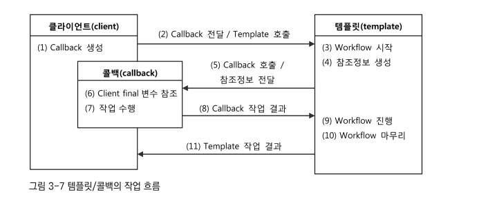
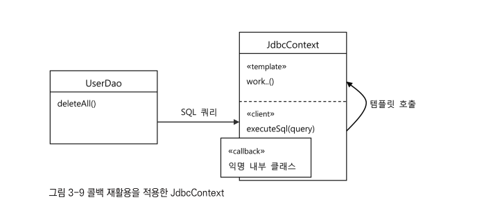

# Chapter3. 템플릿
- 개방 폐쇠 원칙은 확장에는 열려있고 변경에는 굳게 닫혀있는 갹체지향의 핵심 설계 원칙이다.
- 개방 폐쇠 원칙을 적극 도입하면 각각 다른 목적과 다른 이유에 의해 다른 시점에 독립적으로 변경될 수 있는 효율적인 구조를 만들어 준다.
- **템플릿이란** 이렇게 바뀌는 성질이 다른 코드 중 변경이 거의 일어나지 않으며 일정한 패턴으로 유지되는 특성을 가진 부분을 자유롭게 변경되는 성질을 가진 부분으로부터 **독립시켜서** 효과적으로 활용할수 있도록 하는 방법이다.
- 스프링에 적용된 템플릿 기법을 살펴보고, 이를 적용해 완성도 있는 DAO 코드를 만들어보자.

### 3.1 다시보는 초난감 DAO

#### 3.1.1 예외처리 기능을 갖춘 DAO( [step 1](./step1/UserDao.java) )
- JDBC코드에는 반드시 예외처리가 필요하다.
- 중간에 어떤 이유로든 예외가 발생할 경우 리소스를 반드시 반환하도록 하여야하기 때문이다.
- 리소스를 반환하지 않으면 connection이 계속 쌓일 것이고 결국 connection pool이 가득 차 시스템 오류가 발생할 것이다.
- try with resources를 활용하여 간단히 이를 해결할 수 있다.

---

### 3.2 변하는 것과 변하지 않는 것
#### 3.2.1 JDBC try with resources의 문제점
- 예외처리를 통해 완성도 높은 DAO가 되었지만 2~3중으로 try문이 중첩되고 모든 메서드마다 반복된다.
- ResultSet이 있는것과 없는 것 두가지 종류의 메서드만 있으니 이를 하나씩 만들어두고 계쏙 코드를 복사 붙여넣기 하여야 한다.
- 그리고 수많은 복사 붙여넣기 중 리소스 해제를 하나라도 까먹는다면 커넥션 풀은 가득차 오류를 낼것이고 시스템이 방대해졌다면 해당 문제를 찾는것도 매우 시간이 소모될 것이다.
- 그렇다고 테스트를 통해 DAO오바다 리소스를 반납하는지 테스트하기에는 커넥션이나 Statement의 구현 클래스를 구현해 테스트하여야하므로 쉽지 않다.

**이런 코드를 효과적으로 다룰 수 있는 방법은 없을까?**

#### 3.2.2 분리와 재사용을 이용한 디자인 패턴 적용
- 메서드 추출을 할 수 있겠지만 sql 자체를 분리시킬 수 없어 재사용이 불가능해진다.
- 이럴때 템플릿 메서드 패턴을 적용하면 효율적으롭 분리할 수 있다.
- 템플릿 메서드 패턴은 상속을 통해 기능을 확장해서 사용하는 부분이다.
- 변하지 않는 부분은 슈퍼 클래스에두고 변하는 부분은 추상 메서드로 정의하는 것이다.

**[Step 2](./step2)**
- UserDao를 추상 클래스로 만들고 UserDao의 기능을 확장하고 싶을 때마다 상속을 통해 자유롭게 확장할 수 있도록 할 수 있다.
- 이를 통해 deleteAll을 개선해보자.
- 우선 변하지 않는 부분인 Connection를 맺고 해당 리소스를 해제하는 부분을 제외하고 변하는 부분인 query를 날리는 부분을 뽑아내면된다.
- 개방 폐쇠 원칙을 잘 지켜 변화에는 닫혀있고 확장에는 열려있도록하였지만 이 방식은 기능이 추가될 때 마다 클래스를 만들어야 하는 큰 단점이 존재한다.
- 또 확장구조가 클래스를 설계하는 시점에서 고정되어 버리는 단점도 존재한다.
- 변하지 않는 UserDao의 try구분과 변화는 PreparedStatement를 담고 있는 서브 클래스들이 이미 클래스 레벨에서 컴파일 시점에 관계가 결정되어 버린다.
- 이러한 관계는 유연성을 떨어트린다. **상속을 통해 확장을 꾀하는 템플릿 메서드 패턴의 단점이 고스란히 들어난다.**

**전략 패턴의 적용( [Step 3](./step3) )**
- 개방 폐쇄 원칙을 잘 지키는 구조이면서 템플릿 메서드 패턴보다 유연하고 확장성이 뛰어난 것이, 객체를 아예 둘로 분리하고 클래스 레벨에서는 인터페이스를 통해서만 의존하도록하는 **전략 패턴** 이다.

- deleteAll()에서 변하지 않는 부분이 컨텍스트의 contextMethod()가 된다.
- deleteAll의 컨텍스트를 정리해보면 다음과 같다
  - DB커넥션을 가져온다.
  - PreparedStatement를 만들어줄 외부 기능 호출한다.
  - 전달받은 PreparedStatement를 실행한다.
  - 예외가 발생하면 이를 다시 메서드 밖으로 던진다.
  - 모든 경우에 만들어진 PreparedStatement, Connection 리소스를 해제한다.
- 해당 사항에서 두번째를 분리시켜 StatementStrategy로 만들고 이를 통해 PreparedStatement를 가져오게 구현한다.
- 구현후 UserDao의 deleteAll()에 strategy를 적용한 것을 보면 뭔가 좀 이상하다.
- DeleteAllStatement를 직접알고 있다는건 전략 패턴도 OCP도 아니다.

**DI 적용을 위한 클라이언트/컨텍스트 분리 ( [step 4](./step4/UserDao.java) )**
- 이 문제를 해결하기 위해서는 전략 패턴의 실 사용예를 잘 생각해보아야 한다.
- 전략 패턴에 따르면 Context가 어떤 전략을 사용할지는 Context를 사용하는 앞단의 **Client가** 정하는게 일반적이다.
- 클라이언트에서는 DI를 통해 Context에게 사용할 오브젝트를 주입해주게 되는 방식을 사용해야한다.
- deleteAll()에 이를 적용하기 위해서는 StatementStrategy를 생성하는 코드를 클라이언트 코드와 그외의 컨텍스트 코드를 독립시켜야 한다.

> 클라이언트와 컨텍스트 클래스를 분리시키진 않았지만 의존관계 책임으로볼 때 클라이언트 / 컨텍스트 관계를 가지는 DI를 적용한 전략 패턴이 적용된것을 알 수 있다.
> 이렇게 매우 작은 단위로 DI를 적용시키는 것을 보통 수동 DI, 마이크로 DI라고 부른다.

---

### 3.3 JDBC 전략 패턴의 최적화
#### 3.3.1 전략클래스의 추가 정보( [step 5](./step5/UserDao.java) )
- deleteAll() 메서드에 담겨있던 변하지 않는 부분, 자주 변하는 부분을 전략 패턴을 사용해 깔끔하게 분리해냈다.
- 독립된 흐름이담긴 jdbcContextWithStateStrategy() 메서드는 DAO 메서드들이 공통으로 사용할수 있게 되었다.
- 이를 활용하여 **add()를 구현해보자.**
- 우선 add는 Statement에서 user의 정보가 필요하다. 이는 AddStatement에서 User를 멤버로 가지고있으면 해결할 수 있다.

#### 3.3.2 전략과 클라이언트의 동거
- 전략패턴을 활용하여 코드를 재사용성 있고 유연하게 만들었지만 더 개선할 부분을 찾아보자.
- 우선 DAO 메서드마다 새로운 StatementStrategy 구현 클래스를 만들어야한다.
- 이는 기존 UserDao보다 많은 클래스 파일이 필요해짐을 뜻한다.
- 런타임 시에 동적으로 DI 해준다는 점을 제외하고는 그다지 좋은점이 보이지 않는다.
- 그리고 add와 같은 경우 User와 같은 부가적인 정보가 StatementStrategy에 필요해진다.

**로컬 클래스(나는 람다식 적용했다) ( [step 6](./step6/UserDao.java) )**
- 클래스 파일이 많아지는 문제는 로컬 클래스를 만들어 해결할 수 있다.
- 왜냐하면 이 클래스들을 UserDao에만 사용되고 해당 메서드들에게 강하게 결합되어 있기 때문이다.

> **중첩 클래스**
> - 다른 클래스 내부에 정의되는 클래스를 흔히 중첩 클래스(nested class)라고 한다.
> - 중첩 클래스는 독립적으로 오브젝트로 만들어질 수 있는 static class와 자신이 정의된 클래스의 오브젝트안에서만 만들어질 수 있는 inner class가 존재한다.
> - inner class는 scope에 따라 3가지로 구분된다.
> - 멤버 필드처럼 오브젝트 레벨에 정의되는 멤버 내부 클래스
> - 메서드 레벨에 정의되는 로컬 클래스
> - 마지막으로 이름을 갖지 않는 익명 내부 클래스이다.

- 우리가 사용한 방법은 클래스를 로컬 클래스로서 메서드안에 집어넣은 것이다.
- 로컬 클래스는 선언된 메서드 내에서만 사용할 수 있기 때문에 클래스가 사용될 곳이 해당 메서드뿐이라면 로컬 클래스를 쓰는것도 나쁘지않다.
- **하지만 현재는 람다식 지원으로 인해 더 간단하게 구현할 수 있다!!**

---

### 3.4 컨텍스트와 DI
#### 3.4.1 JdbcContext의 분리
- 전략패턴의 구조로 보자면 UserDao의 메소드가 클라이언트이고, 람다식으로 만들어진것이 개별적인 전략이다.
- jdbcContextWithStateStrategy()는 컨텍스트이다.
- 컨텍스트 메서드는 UserDao내의 PreparedStatement를 실행하는 기능을 가진 메서드에서 공유할 수 있다.
- jdbcContextWithStateStrategy는 다른 DAO서도 사용가능하므로 클래스 밖으로 독립시키도록 하자.

**클래스 분리( [step 7](./step7) )**
- JdbcContext를 인터페이스로 만들지 않은 이유는 해당 클래스 그 자체로 독립적인 JDBC 컨텍스트를 제공해주는 서비스 오브젝트로서 의미가 있으며 구현 방법이 바뀔 가능성은 존재하지 않기 때문이다.

#### 3.4.2 JdbcContext의 특별한 DI
- UserDao에서 JdbcContext는 인터페이스를 사용하지 않고 DI를 적용했다.
- 클래스를 통해 DI를 적용하면 의존관계 주입을 해줬지만 의존 오브젝트의 구현 클래스를 변경할수는 없다.

**Spring Bean으로 DI**
- 인터페이스를 사용하지않고 DI를 적용하는것이 문제가될까?
- 문제가 되지않는다. DI의 개념을 충실이 따르면 인터페이스로 구현하고 런타임시점에 동적으로 관계를 주입해주는것이 맞다.
- 따라서 이를 온전한 DI라고 없지만 스프링의 DI는 넓게보면 **객체의 생성과 관계 설정에 대한 제어권한을 오브젝트에서 제거하고 외부로 위임했다는 IoC라는 개념을 포괄한다.**
- 그런 의미에서는 JdbcContext는 DI를 따른다고할 수 있다.
- 그렇다면 구현 클래스는 하나일텐데 왜 DI를 적용한 것일까?
  - JdbcContext를 빈으로 등록하면 싱글톤 레지시트리에서 관리된다. JdbcContext는 싱글톤으로 관리되어도 문제가 되지않는 클래스이므로 싱글톤으로 등록되는 것이 이상적이다.
  - JdbcContext는 DataSource를 의존하고 있기 때문에 빈으로 등록된 DataSource를 주입받기 위해 빈으로 등록되어야 한다.
- 그래서 왜 JdbcContext를 클래스로 사용한 것일까?
  - JdbcContext가 인터페이스가 아니므로 JdbcContext와 UserDao는 강력하게 결합되어 있다.
  - UserDao는 항상 JdbcContext와 함께 사용돼야한다. UserDao가 JDBC대신 JAP, ORM같은 것으로 변경하여야 한다면 JdbcContext도 통째로 바꾸어야 하기 때문에 다른 구현체를 사용할 이유가 없다.

**코드를 이용하는 수동 DI( [step 8](./step8) )**
- JdbcContext를 스프링 빈이아닌 직접 관리하여 DI를 적용할 수 있다.
- 이 방법을 사용하면 외부에 관계를 드러내지 않을 수 있다.
- 우선 이 방법은 스프링의 싱글톤을 포기하고 DAO 클래스마다 JdbcContext를 생성하여야 한다.
- JdbcContext는 내부에 두는 상태정보가 없으므로 큰 문제가 생기지 않을 것이다.
- 그럼 JdbcContext의 DataSource의 주입은 어떻게 해야할까?
- 다양한 디비 구현체를 적용하기 위해서는 JdbcContext는 동적으로 의존관계 주입을 받아야한다.
- 하지만 스프링 빈으로 등록하지 않는다면 빈 설정을 통해 주입을 할 순 없다.
- 이럴때는 빈으로 등록된 UserDao가 대신 주입해줄 수 있다.

> - 이 방법의 장점은 굳이 인터페이스를 두지 않아도될 JdbcContext같은 클래스들은 어색하게 따로 빈으로 분리하지 않고 내부에서 직접 만들어 사용하면서도 다른 오브젝트에 대한 DI를 적용할 수 있다는 점이다.
> - 이렇게 한 수정자에서 다른 오브젝트를 초기하하고 코드를 이용해 DI하는 것은 스프링에서도 종종 사용되는 기법이다.

> 스프링으로 DI를하던 수동으로 DI를 하던 상황에 따라 적절하게 판단하여 사용할 줄 알아야 하며 왜 그렇게 선택했는지에 대한 분명한 이유와 근거가 있어야 한다.

---

### 3.5 템플릿과 콜백
- 이때까지 우리는 전략 패턴을 적용하여 기능들을 구현하였다.
- 복잡하지만 바뀌지 않는 일정한 패턴을 갖는 작업의 흐름이 존재하고 그 중 일부분만 자주 바꿔야하는 경우에 적합한 구조이다.
- 전략 패턴의 기본구조에 익명 내부 클래스를 활용하였는데 이러한 방식을 스프링에서는 템플릿/콜백 패턴이라고 한다.
- 전략 패턴의 컨텍스트를 템플릿, 익명 내부 클래스로 만들어지는 오브젝트를 콜백이라고 한다.
- 템플릿은 고정된 틀 안에 바꿀 수 있는 부분을 넣어서 사용하는 경우를 뜻한다.
- 콜백이란 실행되는 것을 목적으로 다른 오브젝트의 메서드에 전달되는 오브젝트를 말한다.

#### 3.5.1 템플릿 / 콜백의 동작원리
- 템플릿은 고정된 작업 흐름을 가진 코드를 재사용한다는 의미이며 콜백은 템플릿 안에서 호출되는 것을 목적으로 만들어진 오브젝트이다.

**템플릿 / 콜백의 특징**
- 여러개의 메서드를 가진 일반적인 인터페이스를 사용할 수 있는 전략 패턴의 전략과 달리 템플릿 / 콜백 패턴의 콜백은 보통 단일 메서드 인터페이스를 사용한다.
- 템플릿 작업의 흐름 중 특정 기능을 위해 한 번 호출되는 경우가 일반적이기 때문이다.
- 하나의 템플릿에 여러 가지 종류의 전략을 사용해야 한다면 하나 이상의 콜백 오브젝트를 사용할 수도 있다.
- 콜백은 일반적으로 하나의 메서드를 가진 인터페이스를 구현한 익명 내부 클래스 혹은 람다식으로 만들어 진다.

 

**템플릿 / 콜백의 동작흐름**

- 클라이언트인 UserDao에서 Callback을 생성하고 JdbcContext(템플릿) 에게 해당 콜백을 넘기면서 템플릿을 호출한다.
- 템플릿은 일련의 작업동작 후 콜백을 호출하여 작업을 수행하고 해당 결과를 받은 템플릿은 클라이언트에게 작업 결과를 반환해준다.
- 복잡해 보이지만 DI방식의 전략 패턴 구조라고 생각하면 간단하다.
- 보통의 ID는 템플릿에 인스턴스 변수를 만들고 그 인스턴스를 주입해주만 현재는 메서드단위로 DI가 일어난다는 것이 특징이다.
- 콜백은 클라이언트의 익명 내부 클래스 혹은 람다식이 될것이므로 클라이언트와 콜백은 매우 강하게 결합된다는 면에서도 일반 DI와는 차이가 존재한다.

> - 즉 템플릿 / 콜백 방식은 전략 패턴과 DI의 장점을 람다식 사용전략과 결합한 독특한 활용법이라고 할 수 있다.
> - 단순한 전략패턴으로만 보기엔 독특한 특징이 많으므로 고유한 디자인 패턴으로 기억하 는것이 편리하다.
> - 다만 이 패턴에 녹아있는 전략 패턴과 수동 DI를 이해할 수 있어야 한다!

#### 3.5.2 편리한 콜백의 재활용
- 템플릿 / 콜백 방식은 템플릿에 담긴 코드를 여기저기서 반복적으로 사용하는 원시적인 방법에 비해 많은 장점이 있다.
- 직접 구현한 JdbcContext만 봐도 기본 JDBC기반 코드보다 문제점과 불편한점을 해결할 수 있었다.
- 클라이언트인 DAO의 메서드는 간결해지고 최소한의 데이터 엑세스 로직만 갖게 된다.

**콜백 분리와 재활용[( step 9 )](./step9/UserDao.java)**
- PreparedStatement를 만들기만 하는 deleteAll()과 같은 기능은 여러번 수행될 확률이 있다.
- 그렇기 때문에 따로 메서드로 빼서 재활용 할수 있다!.
- 메서드로 완전히 분리하여 거기서 JdbcContext를 호출하는 방법도 있지만 메서드 레퍼런스를 활용하여 재활용할 수도 있다!

**콜백과 템플릿 결합[( step10 )](./step10/UserDao.java)**
- 따로 분리한 excuteSql()은 모든 Dao에서 사용할 수 있는 로직이다.
- 그러므로 이는 템플릿 클래스 안으로 옮겨도 된다.
- 클라이언트 코드는 더욱 깔끔하고 단순해졌다.
- 이로서 클라이언트에서는 sql만 날려주고 템플릿과 콜백이 공존하면서 동작하게되는 구조로 변경되었다.

#### 3.5.3 템플릿 / 콜백 응용
- 템플릿 / 콜백 패턴은 사신 스프링에서만 사용할 수 있다거나 스프링만이 제공해주는 독점적인 기술은 아니다.
- 하지만 스프링 만큼 이 패턴을 활용하는 프레임워크는 없다.(지금은 많을 수도?)
- 스프링 개발자라면 당연히 스프링이 제공하는 템플릿 / 콜백 기능을 잘 사용하고, 동시에 템플릿 / 콜백이 필요한 곳이 있으면 직접 만들 수 있는 능력도 있어야 한다.
- **스프링에 내장된 것을 원리도 알지 못한 채로 기계적으로 사용하는 경우와 적용된 패턴을 이해하고 사용하는 경우는 큰 차이가 있다.**
- 스프링으 기본적으로 OCP를 지키고, 전략 패턴과 DI를 바탕에 깔고 있으니 원한다면 확장해서 편리하게 사용할 수 있다.

> - 고정된 작업 흐름을 가지고 반복되는 코드가 있다면 코드를 분리하는 습관 기르자
> - 필요에 따라 인터페이스를 사이에 두고 분리해서 전략 패턴을 적용하고 DI로 의존관계를 관리하자
> - 바뀌는 부분이 한 애플리케이션 안에도 동시에 여러 종류로 만들어 질 수 있다면 **템플릿 / 콜백 패턴을 고려해보자**

- try-catch-finally 블록을 여러군데서 똑같이 사용하면 이는 템플릿 / 콜백 패턴을 적용하기 적당하다.
- 간단한 예제를 통해 템플릿 / 콜백을 이용해보자

**1) [step 11](./step11)**
- 특정 숫자가 들어있는 파일을 읽어 덧셈을 수행하는 프로그램이다.
- 현재는 따로 예외처리를 하지 않으므로 리로스 해제가 되지않을 수 있다.
- 예외처리를 추가해주자.

**2) [step 12](./step12)**
- 예외처리를 하였으므로 리소스를 안전하게 해제할 것이다.

**3) [step 13](./step13)**
- 이번엔 모든 숫자의 곱을 계산하는 기능을 추가해야 한다고 가정해보자.
- 새로운 메서드를 만들어서 또 try문을 사용해 버퍼리더를 생성해야하는가?
- 한 두번은 몰라도 이런일이 반복되면 개선이 필요하다.
- 여기서 템플릿 / 콜백 패턴을 적용할 수 있다.
- 가장 중요한 것은 템플릿과 콜백의 경계를 정하고 콜백을 인터페이스로 정해야 한다.
- 파일을 읽어들이는 버퍼리더를 생성하는 로직은 모든 기능에서 공통되는 로직이므로 템플릿에 담고 버퍼리더를 넘겨줘 콜백은 그에 알맞는 기능을 수행하도록한다.

**4) [step 14](./step14)**
- 템플릿 / 콜백을 적용하여 버퍼리더를 생성하는 것을 분리했지만 해당 파일을 읽어들이는 콜백에서도 공통점이 발견된다.
- 콜백에서 서로 다른 로직은 처음 선언하는 변수값과 그 변수를 계산하는 것만 다른것을 알 수 있다.
- 즉 버퍼리더를 생성하는 것과 더불어 해당 라인을 읽는것도 공통되는 로직이므로 템플릿으로 분리할 수 있다.
- [UserDao](./step14/UserDao.java)를 확인해보면 각 계산 메서드는 단지 람다식을 정의해서 콜백으로 넘기는 것으로 매우 간단하고 깔끔하게 구현이 가능해졌다!!

**5) [step 15](./step15)**
- 현재는 콜백과 템플릿이 int로 고정되어 있지만 제네릭스를 활용하면 모든 타입에 대해 적용할 수 있다.
- 제네릭스로 템플릿과 콜백을 변경하고 스트링을 처리하는 기능을 추가해보면서 학습해보자!

### 3.6
