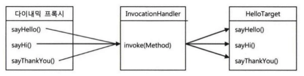
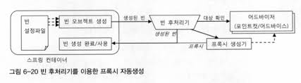
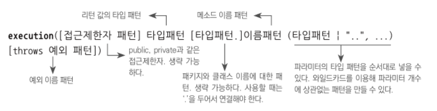
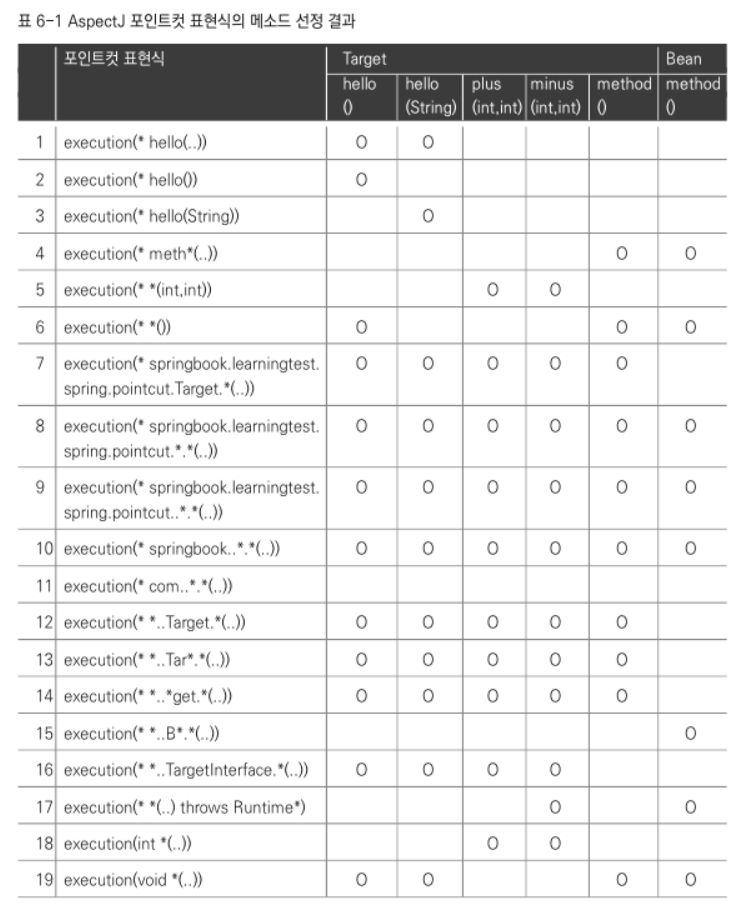

후처리기# Chapter6. AOP
- AOP는 스프링의 3대 기반기술 중 하나이지만 가장 이해하기 힘든 기술이라는 악명이 있다.
- 그렇기 때문에 더더욱 스프링이 왜 이것을 도입했으며 3대 기반기술 중 하나인지, 이를 통해 얻을 수 있는 장점이 무엇인지에 대한 충분한 이해가 필요하다.
- **스프링에 적용된 가장 인기 있는 AOP의 적용 대상은 바로 선언적 트랜잭션 기능이다.**
- 5장에서 추상화를 통해 근본적인 문제들을 해결했던 트랜잭션 경계 설정 기능을 AOP를 통해 더욱 더 깔끔하게 변경시킬 수 있다.

## 6.1 트랜잭션 코드의 분리
- 서비스 추상화를 통해 기술과 환경에 독립적인 UserService를 만들었지만 트랜잭션 경계설정을 위해 넣은 코드때문에 깔끔해지지 않은 것은 어쩔 수 없었다.
### 6.1.1 메서드 분리
```java
public void upgradeLevels() throws SQLException {
    TransactionStatus status = transactionManager.getTransaction(new DefaultTransactionDefinition());
    try {
        // ------------------ 비즈니스 로직 ---------------------- //
        List<User> users = userDao.getAll();
        users.forEach(user -> {
            if (userLevelUpgradePolicy.canUpgradeLevel(user)) {
                userLevelUpgradePolicy.upgradeLevel(user);
                userDao.update(user);
                sendUpgradeEmail(user);
            }
        });
        // --------------------------------------------------- //
        transactionManager.commit(status);
    } catch (Exception e) {
        transactionManager.rollback(status);
        throw e;
    }
}
```
- UserService의 upgradeLevels 메서드를 보면 중간에 존재하는 비즈니스 로직을 제외한 부분들은 트랜잭션 경계설정을 위한 코드인것을 알 수 있다.
- 구조를 보면 비즈니스 로직 사이에 트랜잭션의 경계설정인 시작과 종료를 담당하는 코드가 위치하고 있는 것을 알 수 있다.
- 이 구조의 특징은 반드시 필요한 코드들이지만 비즈니스 로직과 트랜잭션의 경계설정은 서로간의 주고 받는 정보가 없는 독립적인 코드인것을 알 수 있다.
- 그러므로 이는 메서드를 통해 분리할 수 있을 것이다.

<br>

```java
public void upgradeLevels() throws SQLException {
    TransactionStatus status = transactionManager.getTransaction(new DefaultTransactionDefinition());
    try {
        upgradeLevelsInternal();
        transactionManager.commit(status);
    } catch (Exception e) {
        transactionManager.rollback(status);
        throw e;
    }
}

private void upgradeLevelsInternal() {
    userDao.getAll().forEach(user -> {
        if (userLevelUpgradePolicy.canUpgradeLevel(user)) {
            userLevelUpgradePolicy.upgradeLevel(user);
            userDao.update(user);
            sendUpgradeEmail(user);
        }
    });
}
```

- 분리를 하면 이전보다는 깔끔해진것 같지만 트랜잭션이 필요한 모든 메서드들에 이러한 방식을 적용하기에는 무리가 있을 것 같다.

### 6.1.2 DI를 이용한 클래스 분리
- DI를 적용하여 트랜잭션 코드를 클래스 밖으로 뽑아낼 순 없을까?
- 현재 UserService는 UserServiceTest가 클라이언트가 되어서 사용되고 있다.
- 실제 웹서버에서는 다른 클래스나 모듈에서 UserService를 호출하여 사용할 것이다.
- 현재 UserService는 클래스로 구성되어 있으니 직접참조를 하고 있다.
- UserService를 인터페이스로 만들어 관계를 약하게 한 후 클라이언트와 UserService사이에 트랜잭션의 경계설정에 대한 책임을 갖는 클래스를 구현하여 이를 해결할 수 있을 것이다.

#### UserService 인터페이스 도입
```java
public interface UserService {
    void add(User user);
    void upgradeLevels();
}
```
- 먼저 UserService 인터페이스를 통해 핵심 기능들을 정의하자. UserService 인터페이스는 add, upgradeLevels 두가지 기능만 가지고 있다.

<br>

```java
@Setter
public class UserServiceImpl implements UserService {
    private UserDao userDao;
    private UserLevelUpgradePolicy userLevelUpgradePolicy;
    private MailSender mailSender;

    public UserServiceImpl(UserDao userDao, UserLevelUpgradePolicy userLevelUpgradePolicy, MailSender mailSender) {
        this.userDao = userDao;
        this.userLevelUpgradePolicy = userLevelUpgradePolicy;
        this.mailSender = mailSender;
    }

    @Override
    public void upgradeLevels() {
        userDao.getAll().forEach(user -> {
            if (userLevelUpgradePolicy.canUpgradeLevel(user)) {
                userLevelUpgradePolicy.upgradeLevel(user);
                userDao.update(user);
                sendUpgradeEmail(user);
            }
        });
    }

    private void sendUpgradeEmail(User user) {
        SimpleMailMessage mailMessage = new SimpleMailMessage();
        mailMessage.setTo(user.getEmail());
        mailMessage.setFrom("useradmin@gmail.com");
        mailMessage.setSubject("Upgrade 안내");
        mailMessage.setText("사용자 님의 등급이" + user.getLevel().name() + "로 업그레이드 되었습니다.");

        this.mailSender.send(mailMessage);
    }

    @Override
    public void add(User user) {
        if (user.getLevel() == null) user.setLevel(Level.BASIC);
        userDao.add(user);
    }
}
```
- UserService를 실체화하는 UserServiceImpl에는 트랜잭션 경계설정 관련 코드는 모두 삭제하고 실제 비즈니스 로직인 유저들을 업그레이드 시키는 로직만을 담는다.
- 그러므로 transactionManager는 필요 없어지기 때문에 의존성에서 제외시켜주었다.

<br>

```java
public class UserServiceTx implements UserService {
    private UserService userService;
    private PlatformTransactionManager transactionManager;

    public UserServiceTx(UserService userService, PlatformTransactionManager transactionManager) {
        this.userService = userService;
        this.transactionManager = transactionManager;
    }

    @Override
    public void add(User user) {
        userService.add(user);
    }

    @Override
    public void upgradeLevels() {
        TransactionStatus status = transactionManager.getTransaction(new DefaultTransactionDefinition());
        try {
            userService.upgradeLevels();
            transactionManager.commit(status);
        } catch (Exception e) {
            transactionManager.rollback(status);
            throw e;
        }
    }
}
```
- 또 다른 UserService를 실체화하는 UserServiceTx에서는 트랜잭션 경계설정 관련 코드를 작성하고 UserService를 의존하고 있다.
- 여기서는 트랜잭션 경계설정 사이 비즈니스 로직이 들어가는자리에 의존하는 userService에게 요청을 위임하여 전달한다.
- 즉 UserServiceTx의 멤버변수의 UserService에는 UserServiceImpl이 주입될 것이고 UserServiceTx에서는 트랜잰셕 설정 후 UserServiceImpl에게 요청을 넘겨 실제 비즈니스 로직을 처리하게 될 것이다.
- 해당 비즈니스 로직이 처리된 후 다시 UserServiceTx에게 넘어와 트랜잭션 설정이 마무리될 것이다.

<br>

```xml
<bean id="userService" class="ch6.step1.UserServiceTx">
        <constructor-arg ref="userServiceImpl"/>
        <constructor-arg ref="transactionManager"/>
</bean>

<bean id="userServiceImpl" class="ch6.step1.UserServiceImpl">
    <constructor-arg ref="userDao"/>
    <constructor-arg ref="userLevelUpgradePolicy"/>
    <constructor-arg ref="mailSender"/>
</bean>
```
- userService라는 id를 가진 클래스는 이제 UserServiceTx가 된다.
- 그러므로 클라이언트는 userService를 사용할 때 UserServiceTx에게 요청을 보내게 될 것이다.
- userServiceImpl를 따로 빈을 등록시켜주고 UserServiceTx의 생성자에 빈으로 주입시켜준다.

<br>

```java
@ExtendWith(SpringExtension.class)
@DirtiesContext
@ContextConfiguration(locations = "file:src/main/java/ch6/step1/applicationContext.xml")
class UserServiceTest {
    // UserServiceImpl, UserServiceTx 이렇게 UserService의 하위 구현체인 두개가 빈으로 등록되지만 userService와 더 구체적으로 비슷한 UserServiceTx가 사용된다.
    @Autowired
    UserService userService;

    @Autowired
    UserDao userDao;

    // userServiceImpl을 사용하기 때문에 주입받아준다.
    @Autowired
    UserServiceImpl userServiceImpl;

    @Autowired
    PlatformTransactionManager transactionManager;

    @Autowired
    MailSender mailSender;

    List<User> users;


    @Test
    void upgradeLevels() throws Exception {
        users.forEach(userDao::add);

        MockMailSender mockMailSender = new MockMailSender();

        // userService는 인터페이스 타입이므로 스터빙이 불가능하다.
        // 빈으로 등록한 userServiceImpl에 직접 mockMailSender를 설정해준다.
        userServiceImpl.setMailSender(mockMailSender);

        userService.upgradeLevels();
        checkLevel(users.get(0), false);
        checkLevel(users.get(1), true);
        checkLevel(users.get(2), false);
        checkLevel(users.get(3), true);
        checkLevel(users.get(4), false);

        List<String> requests = mockMailSender.getRequests();
        assertThat(requests.size()).isEqualTo(2);
        assertThat(requests.get(0)).isEqualTo(users.get(1).getEmail());
        assertThat(requests.get(1)).isEqualTo(users.get(3).getEmail());
    }

    @Test
    void upgradeAllOrNothing() throws Exception {
        users.forEach(userDao::add);
        String id = users.get(3).getId();

        // UserServiceTx에 UserServiceImpl을 넣어준다.
        UserService userServiceImpl = new UserServiceImpl(this.userDao, new TestUserLevelUpgradePolicy(id), mailSender);
        UserService testUserService = new UserServiceTx(userServiceImpl, transactionManager);

        assertThatThrownBy(() -> testUserService.upgradeLevels())
                .isInstanceOf(UserServiceTest.TestUserServiceException.class);

        checkLevel(users.get(1), false);
        checkLevel(users.get(3), false);
    }
}
```
- UserService를 인터페이스로 변경한 후 약간의 변경이 필요하지만 해당 변경사항만 적용하면 테스트는 그대로 성공하는 것을 알 수 있다.
- 자세한 변경사항은 주석에 표시되어 있다.

#### 트랜잭션 경계설정 코드 분리의 장점
- **첫째, 비즈니스 로직을 담당하고 있는 UserServiceImpl의 코드를 작성할 때는 트랜잭션과 같은 기술적인 내용에는 전혀 신경 쓰지 않아도 된다.**
  - 트랜잭션 같은 기술적인 내용때문에 잘 만들어진 비즈니스 로직 코드가 엉망이 될 불상사가 없을 것이다.
  - 스프링 트랜잭션과 같이 로우레벨에 뛰어난 개발자와, 비즈니스의 흐름을 잘 이해하고 비즈니스 로직을 잘 작성하는 개발자가 있을 때 이를 서로 분리하였다면 훨씬 더 효과적으로 개발이 가능할 것이다.
- **둘째, 비즈니스 로직에 대한 테스트를 손쉽게 만들어 낼 수 있다. 이는 이제부터 알아보도록 하자.**

---
## 6.2 고립된 단위 테스트
- 가장 편하고 좋은 테스트 방법은 가능한 작은 단위로 쪼개서 테스트 하는 것이다.
- 테스트의 단위가 작을 수록 테스트 실패시 원인 파악이 쉬워지고, 만들기가 쉬워질 뿐만아니라 의도나 내용이 명확해진다.
- 처음부터 작은 단위로 테스트를 진행한다면 나중에 덩치가 커지더라도 어렵지 않게 오류를 찾을 수 있을 것이며, 작은 단위의 테스트로 검증한 부분은 제외하고 접근할 수 있을 것이다.
- **하지만 만약 테스트 대상이 다른 오브젝트와 환경에 의존하고 있다면 작은 단위의 테스트가 주는 장점을 얻기가 힘들어진다.**

### 6.2.1 복잡한 의존관계 속의 테스트
- 인터페이스로 분리하기 전의 UserService는 DB와의 데이터 연동을 위해 UserDao를 의존하고, 메일 통신을 위해 MailSender를 의존하고, 트랜잭션 처리를 위해 PlatfromTansactionManager를 의존해야 하고, 업그레이드 정책을 위해 UserLevelUpgradePolicy를 의존해야 한다.
- UserServiceTest가 테스트하고자 하는 대상인 UserService는 사용자 정보를 관리하는 비즈니스 로직의 구현코드이다.
- 따라서 userService의 코드가 바르게 작성되어 있으면 성공하고, 아니라면 실패하면된다. 즉 테스트이 단위는 UserService 클래스여야 한다.
- 하지만 UserService는 위에서 언급한것처럼 4개의 의존관계를 가지고 있다. 이 의존관계들은 테스트가 진행되는 동안 같이 실행될 것이다.
- 게다가 각 의존관계의 구현체들도 또 다른 의존 관계를 가지고 있을 수도 있다.
- 따라서 userService를 테스트하는 것처럼 보이지만 실상은 그 뒤에 존재하는 훨씬 더 많은 객체들과 환경, 서비스, 서버, 네트워크등을 테스트하게 된 셈이다.
- **이 들중 하나라도 제대로 설정되어 있지 않거나, 오류가 발생했다면 그로인해 UserService의 테스트는 실패하고 말 것이다.**
- 따라서 이런 경우의 테스트는 준비가 힘들고, 환경에 매우 의존적이며 그 때문에 수행속도가 느려지게되므로 테스트 작성이 꺼려질 것이다.
- 그러므로 테스트의 대상이 환경이나, 외부 서버, 다른 클래스의 코드에 종속되고 영향을 받지 않도록 고립시킬 필요가 있다.
- 테스트를 의존 대상으로 부터 고립시키는 방법은 테스트를 위한 대역을 사용하거나, 테스트 스텁 혹은 목 객체를 이용하면 된다.

### 6.2.2 테스트 대상 오브젝트 고립시키기
#### 테스트를 위한 UserServiceImpl 고립
- 현재 UserServiceImpl에는 UserDao, UserLevelUpgradePolicy, MailSender를 의존하고 있다.
- 이 중 UserLevelUpgradePolicy는 직접 구현한 것이고 UserDao, MailSender는 외부의 API를 사용하고 있다.
- 그러므로 UserDao와 MailSender는 고립시키는 것이 좋을 것이다.
- 이전의 테스트에서 MailSender는 MockMailSender를 통해 목 객체로 만들어 테스트를 진행하였다.
- MockMailSender가 어떻게 활용되었는지 다시 한 번 확인해보자.

<br>

```java
static class MockMailSender implements MailSender {
    private List<String> requests = new ArrayList<>();

    public List<String> getRequests() {
        return requests;
    }

    @Override
    public void send(SimpleMailMessage simpleMessage) throws MailException {
        requests.add(Objects.requireNonNull(simpleMessage.getTo())[0]);
    }

    @Override
    public void send(SimpleMailMessage... simpleMessages) throws MailException {

    }
}
```
- 테스트 클래스 내부에 static class로 mockMailSender를 구현하였다.
- 내부에는 컬렉션으로 requests를 가지고 이 requests는 send시 수신자의 메일주소를 하나씩 담게된다.
- 이를 통해 메일 발송 요청이 나갔는지 확인할 수 있을 것이다.
- 해당 테스트코드를 확인해보자

<br>

```java
@Test
void upgradeLevels() throws Exception {
    // 1. 테스트를 위한 DB 데이터 준비
    users.forEach(userDao::add);

    // 2. 목 객체 생성 후 주입
    MockMailSender mockMailSender = new MockMailSender();
    userServiceImpl.setMailSender(mockMailSender);

    // 3. 테스트 실행
    userService.upgradeLevels();

    // 4. 테스트 후 DB에 저장된 결과 확인
    checkLevel(users.get(0), false);
    checkLevel(users.get(1), true);
    checkLevel(users.get(2), false);
    checkLevel(users.get(3), true);
    checkLevel(users.get(4), false);

    // 5. 목 객체를 이용한 결과 확인
    List<String> requests = mockMailSender.getRequests();
    assertThat(requests.size()).isEqualTo(2);
    assertThat(requests.get(0)).isEqualTo(users.get(1).getEmail());
    assertThat(requests.get(1)).isEqualTo(users.get(3).getEmail());
}

private void checkLevel(User user, boolean isUpgraded) {
    User updatedUser = userDao.get(user.getId());
    if (isUpgraded) {
        assertThat(updatedUser.getLevel()).isEqualTo(user.getLevel().nextLevel());
    } else {
        assertThat(updatedUser.getLevel()).isEqualTo(user.getLevel());
    }
}
```
- 주석을 보면 확인할 수 있듯이 테스트는 순서대로 진행될 것이다.
- 목 객체를 이용한 MailSender는 목 클래스를 정의할 때 생성한 requests 컬렉션을 통해 메일 전송이 수행되었는지 확인할 수 있다.
- 현재 코드에서 1, 4번은 userDao를 사용하여 실제 DB에 의존하고 있다. 이를 어떻게 목 오브젝트로 만들 수 있을까?

#### UserDao 목 오브젝트
- 목 오브젝트는 기본적으로 스텁과 같은 방식으로 테스트 대상을 통해 사용될 때 필요한 기능을 지원해주어야 한다.
- 이를 위해 upgradeLevels() 메서드가 실행될 때 어떻게 UserDao를 사용하는지 확인할 필요가 있다.

```java
@Override
public void upgradeLevels() {
    // userDao.getAll()을 통해 모든 유저를 가져온다.
    userDao.getAll().forEach(user -> {
        if (userLevelUpgradePolicy.canUpgradeLevel(user)) {
            userLevelUpgradePolicy.upgradeLevel(user);
            // 조건에 충족한다면 유저들을 업데이트 해준다.
            userDao.update(user);
            sendUpgradeEmail(user);
        }
    });
}
```
- upgradeLevels에서는 총 두번 userDao를 사용하는것을 알 수 있다.
- 그러므로 목 오브젝트는 getAll(), update()를 구현해주어야 할 것이다.
- getAll()에 대해서는 스텁으로서, update()에 대해서는 변경 검증을 위한 목 오브젝트로서 동작하는 MockUserDao라는 테스트 대역을 정의해보자.

```java
static class MockUserDao implements UserDao{
    private List<User> users;
    private List<User> updated = new ArrayList<>();

    public MockUserDao(List<User> users) {
        this.users = users;
    }

    @Override
    public void update(User user) {
        updated.add(user);
    }

    @Override
    public List<User> getAll() {
        return this.users;
    }

    public List<User> getUpdated() {
        return updated;
    }

    @Override
    public void add(User user) { throw new UnsupportedOperationException(); }
    @Override
    public User get(String id) { throw new UnsupportedOperationException(); }
    @Override
    public void deleteAll() { throw new UnsupportedOperationException(); }
    @Override
    public long getCount() { throw new UnsupportedOperationException(); }
}
```
- 우선 사용되지 않는 기능들을 사용할 수 없게 예외를 던져준다.
- 그리고 수정전 유저와 수정된 유저를 담을 컬렉션을 두개 만든 후 각 기능에 알맞게 정의해준다.

```java
class UserServiceTest {
    List<User> users;

    @BeforeEach
    public void setUp() {
        users = Arrays.asList(
                new User("user1", "name1", "p1", Level.BASIC, MIN_LONGCOUNT_FOR_SILVER - 1, 0, "test@gmail.com"),
                new User("user2", "name2", "p1", Level.BASIC, MIN_LONGCOUNT_FOR_SILVER, 0, "test@gmail.com"),
                new User("user3", "name3", "p1", Level.SILVER, 69, MIN_RECCOMEND_FOR_GOLD - 1, "test@gmail.com"),
                new User("user4", "name4", "p1", Level.SILVER, 69, MIN_RECCOMEND_FOR_GOLD, "test@gmail.com"),
                new User("user5", "name5", "p1", Level.GOLD, 49, 5000, "test@gmail.com")
        );
        userDao.deleteAll();
    }

    @Test
    void upgradeLevels() throws Exception {

        // 1. 목 오브젝트들을 생성한다.
        MockUserDao mockUserDao = new MockUserDao(users);
        MockMailSender mockMailSender = new MockMailSender();

        // 2. 목 오브젝트의 의존성을 갖는 UserServiceImpl을 생성한다.
        UserServiceImpl userServiceImpl = new UserServiceImpl(mockUserDao, new UserLevelUpgradeDefault(), mockMailSender);

        // 3. 목 오브젝트를 의존성으로 갖는 userServiceImpl로 테스트를 진행한다.
        userServiceImpl.upgradeLevels();

        List<User> updated = mockUserDao.getUpdated();
        assertThat(updated.size()).isEqualTo(2);
        checkLevel(updated.get(0), users.get(1).getId(), Level.SILVER);
        checkLevel(updated.get(1), users.get(3).getId(), Level.GOLD);

        List<String> requests = mockMailSender.getRequests();
        assertThat(requests.size()).isEqualTo(2);
        assertThat(requests.get(0)).isEqualTo(this.users.get(1).getEmail());
        assertThat(requests.get(1)).isEqualTo(this.users.get(3).getEmail());
    }

    private void checkLevel(User user, String id, Level level) {
        assertThat(user.getId()).isEqualTo(id);
        assertThat(user.getLevel()).isEqualTo(level);
    }
}
```
- 이렇게 만든 MockUserDao와 MockMailSender를 통해 UserService를 테스트할 수 있게 되었다.
- 해당 테스트에서는 그 어떤것도 스프링 빈에서 가져오지 않고 고립된 테스트로 동작시킬 수 있게 되었다.
- 이 테스트는 외부 디비에 문제가 생기거나, 메일 서버에 문제가 생겨도 UserService자체의 문제가 아니라면 정상적으로 동작할 것이다.

#### 테스트 수행 성능의 향상
- 간단한 테스트라 테스트 시간은 실감나지 않겠지만 실제 DB와의 연동도 없고 메일 서버와의 연동도 없기 때문에 테스트 시간은 매우 짧아졌을 것이다.
- 고립된 테스트를 하면 테스트가 다른 의존 대상에 영향을 받을 경우를 대비해 복잡하게 준비할 필요가 없을 뿐만아니라, 테스트 수행성능도 크게 향상된다.
- 테스트가 빨리 돌아가면 부담 없이 자주 테스트를 돌려볼 수 있게 될 것이다.
- **고립된 테스트를 만들려면 목 오브젝트 작성과 같은 약간의 수고가 더 필요할지 모르겠지만, 그 보상은 충분히 기대할 만하다.**
- Mokito와 같은 라이브러리를 사용하면 더욱 쉽게 목 오브젝트를 만들 수 있을 것이다.

### 6.2.3 단위 테스트와 통합 테스트
- 단위 테스트의 단위는 정하기 나름이다. 사용자 관리 기능 전체를 하나의 단위로 볼 수도 있고 하나의 클래스나 하나의 메서드를 단위로 볼 수도 있다.
- 중요한 것은 하나의 단위에 초점을 맞춘 테스트라는 것이다.
- **테스트 대상 클래스를 목 오브젝트 등의 테스트 대역을 이용해 의존 오브젝트나 외부 리소스를 사용하지 않도록 고립시켜서 테스트 하는 것을** **단위 테스트라고 할 수 있다.**
- 반면 두개 이상의 성격이나 계층이 다른 오브젝트가 연동하도록 만들어 테스트하거나, 또는 외부의 DB나 파일 서비스등의 리소스가 참여하는 테스트는 **통합 테스트라고** 할 수 있다.

#### 단위 테스트와 통합 테스트 가이드라인
- 항상 단위 테스트를 먼저 고려한다.
  - 하나의 클래스나, 성격과 목적이 같은 긴밀한 클래스 몇개를 모아 외부와의 의존관계를 모두 차단하고 필요에 따라 스텁이나 목 오브젝트 등의 테스트 대역을 이용하도록 테스트를 만든다.
  - 단위 테스트는 테스트 작성도 간단해지며, 속도도 빠르고, 외부의 환경으로부터 테스트 결과에 영향을 받지 않아도 되기 때문에 효율적인 테스트 작성이 가능해진다.
- 외부 리소스를 사용해야만 가능한 테스트는 통합 테스트로 만든다.
  - DAO와 같은 경우 단위 테스트로 만들기 어렵다.
  - 그 자체로 로직을 담기보다는 DB를 통해 로직을 수행하는 매개체(인터페이스)와 같은 역할을 하기 때문이다.
  - 이런 DAO만을 테스트하는 경우 DB라는 외부 리소스를 사용하니 통합 테스트라고 할 수 있지만, 또 하나의 기능 단위를 테스트하는 것이기 때문에 단위 테스트라고도 할 수 있을 것이다.
  - DAO를 테스트를 통해 충분히 검증하였다면 DAO를 이용하는 다른 클래스의 테스트 코드는 목 객체로 DAO를 사용하더라도 DAO의 기능을 믿을 수 있을 것이다.
  - 물론 전체를 테스트하는 통합테스트는 반드시 필요할 것이다.
- 여러 개의 단위가 의존관계를 가지고 동작할 때 통합 테스트는 필요하다. 다만, 단위 테스트를 충분히 거쳤다면 통합 테스트의 부담은 상대적으로 줄어든다.
- 단위 테스트를 만들기가 너무 복잡하다고 판단되는 코드는 처음부터 통합 테스트를 고려해본다. 이때도 통합 테스트에 참여하는 코드 중에서 가능한 한 많은 부분을 미리 단위 테스트 해두는게 유리하다.
- 스프링 테스트 컨텍스트 프레임워크를 이용하는 테스트는 통합 테스트라고할 수 있다.

### 6.2.4 목 프레임워크
- 목 프레임워크는 Mockito가 가장 유명하며 유용한 기능을 많이 가지고 있다.
- Mockito를 사용하여 테스트 코드들을 변경해보자.

```groovy
testImplementation 'org.mockito:mockito-core:3.3.0'
```
- 우선 mockito 의존성을 추가해준다.

```java
// 목 오브젝트로 만들기 (1)
@Mock
UserDao mockUserDao;

@Test
void upgradeLevels() throws Exception {
    // @Mock으로 설정된 목 오브젝트를 사용한다.
    MockitoAnnotations.initMocks(this);

    // 스터빙을 이렇게 수행할 수 있다.
   when(mockUserDao.getAll()).thenReturn(users);

    // 목 오브젝트로 만들기 (2)
    MailSender mockMailSender = mock(MailSender.class);

    UserServiceImpl userServiceImpl = new UserServiceImpl(mockUserDao, userLevelUpgradePolicy, mockMailSender);

    userServiceImpl.upgradeLevels();

    // 업그레이드가 제대로 되었는지 확인해본다.
    assertThat(users.get(1).getLevel()).isEqualTo(Level.SILVER);
    assertThat(users.get(3).getLevel()).isEqualTo(Level.GOLD);

    // 목 오브젝트 Dao에 업그레이드 용청이 총 두번 온것을 확인할 수 있다.
    verify(mockUserDao, times(2)).update(any(User.class));

    // 각 요청들에 넘어오면 파라미터가 무었인지 확인할 수 있다.
    verify(mockUserDao).update(users.get(1));
    verify(mockUserDao).update(users.get(3));

    // Argumentcaptor를 통해 목 오브젝트에 전달받은 파라미터를 가져와서 검증할 수 있다.
    ArgumentCaptor<SimpleMailMessage> mailMessageArg = ArgumentCaptor.forClass(SimpleMailMessage.class);

    // 목 오브젝트인 mailSender의 send는 총 두번 호출되고 각 파라미터를 capture를 통해 가져온다.
    verify(mockMailSender, times(2)).send(mailMessageArg.capture());

    // 파라미터인 SimpleMailMessage에서 값들을 검증하여 제대로 메일이 전송되었는지 확인해본다.
    List<SimpleMailMessage> mailMessages = mailMessageArg.getAllValues();
    assertThat(Objects.requireNonNull(mailMessages.get(0).getTo())[0]).isEqualTo(users.get(1).getEmail());
    assertThat(Objects.requireNonNull(mailMessages.get(1).getTo())[0]).isEqualTo(users.get(3).getEmail());
}
```
- 이전에 직접 클래스를 만들어 구현하였던 Mock 오브젝트들을 애노테이션이나 메서드하나로 매우 간단하게 호출할 수 있다.
- 스터빙과 검증작업은 위의 주석을 확인보면 정말 간단한 것을 알 수 있다.
- mockito와 같은 목 오브젝트 프레임워크는 단위 테스트시 매우 유용한것을 확인할 수있다.

---

## 6.3 다이내믹 프록시와 팩토리 빈
- 단순히 확장성을 고려해서 한 가지 기능을 분리한다면 전형적인 전략 패턴을 사용하면 된다.
- 트랜잭션 기능에는 추상화 작업을 통해 이미 전략 패턴이 적용되어있다.
- 하지만 전략패턴으로는 트랜잭션의 기능의 구현 내용을 분리했을 뿐 트랜잭션을 적용한다는 사실은 코드에 그대로 남아있다.
- 구체적인 구현 코드는 위임을 통해 구현되었지만 핵심 코드와 함께 남아있게 되었다.
- 트랜잭션 기능은 사용자 관리 비즈니스 로직과는 성격이 다르기 때문에 아예 그 사실 자체를 따로 분리한 것이다.
- 이러한 동작원리의 가장 큰 핵심은 핵심 기능을 가진 클래스는 트랜잭션과 같은 부가기능을 가진 클래스에 대해 알지 못하며 오직 부가기능을 가진 클래스가 핵심기능을 가진 객체에게 위임을 통해 동작이 구현된다.
- 만약 클라이언트가 부가기능을 가진 클래스가아닌 핵심 기능을 가진 클래스를 직접사용하게 된다면 부가 기능은 적용되지 않을 것이다.
- **그러므로 부가기능은 마치 자신의 핵심 기능을 가진 클래스인 것처럼 꾸며서, 클라이언트가 자신을 거쳐 핵심기능을 사용하도록 만들어야 한다.**
- 그러기 위해서는 클라이언트는 인터페이스에 의존하게 하고 자신도 똑같은 인터페이스를 구현하여 그 사이에 끼어들어 클라이언트는 핵심 기능을 사용한거 같지만 실질적으로는 부가기능에 의해 사용되는 것으로 만들어야 한다.

> - 이렇게 마치 자신이 클라이언트가 사용하려고 하는 실제 대상인 것처럼 위장해서 클라이언트의 요청을 받아주는 것을 대리인과 같은 역할을 한다고해서 **프록시라고** 부른다.
> - 프록시를 통해 요청을 위임받아 최종 처리를하는 주요기능을 가진 대상들을 타깃(Target), Real Subject라고 부른다.

- **프록시는 사용목적에 따라 두 가지로 구분된다.**
- 첫 째는 클라이언트가 타깃에 접근하는 방법을 제어하기 위해서 이다. (프록시 패턴)
- 둘 째는 타깃에 부가적인 기능을 부여해주기 위해서이다. (데코레이터 패턴)

### 6.3.1 프록시와 데코레이터 패턴, 프록시 패턴
#### 데코레이터 패턴
- 데코레이터 패턴은 타깃에 부가적인 기능을 런타임 시 동적으로 부여해주기 위해 프록시를 사용하는 패턴이다.
- 동적으로 기능을 부가한다는 의미는 컴파일 시점, 즉 코드상에는 어떤 방법과 순서로 프록시와 타깃이 연결되어 사용되는지 정해져 있지 않다는 뜻이다.
- 프록시로서 동작하는 각 데코레이터는 위임하는 대상에도 인터페이스로 접근하기 때문에 자신이 최종 타깃에게 위임하는지 알 수 없다.
- 사실 UserServiceImpl와 UserServiceTx사이에도 데커레이터가 적용된것을 알 수 있다.

```xml
<bean id="userService" class="ch6.step1.UserServiceTx">
    <constructor-arg ref="userServiceImpl"/>
    <constructor-arg ref="transactionManager"/>
</bean>

<bean id="userServiceImpl" class="ch6.step1.UserServiceImpl">
    <constructor-arg ref="userDao"/>
    <constructor-arg ref="userLevelUpgradePolicy"/>
    <constructor-arg ref="mailSender"/>
</bean>
```
- UserServiceTx는 데코레이터이고 UserServiceImpl은 타깃이 된다.
- UserServiceTx는 UserService 타입의 오브젝트를 DI받아 기능을 위임하며 그 과정에서 트랜잭션 경계설정 기능을 부여해준다.
- UserServiceTx의 생성자에 UserServiceImpl이 들어가 동적으로 DI를 통해 주입되어 부가기능이 제공되는 것을 알 수 있다.
- 동적으로 부가기능을 부여하기 때문에 데코레이터 패턴이라고 할 수 있을 것이다.

> 데코레이터 패턴은 타깃의 코드를 손대지 않고, 클라이언트가 호출하는 방법도 변경하지 않은 채로 새로운 기능을 추가할 때 유용한 방법이다.

#### 프록시 패턴
- 일반적으로 사용하는 프록시라는 용어와 프록시 패턴에서 말하는 프록시와는 조금 다른 차이가 존재한다.
- 전자의 경우 클라이언트와 사용 대상사이의 대리자 역할을 하는 프록시 그 자체를 의미한다고 할 수 있을것이다.
- **프록시 패턴은 프록시를 사용하는 방법 중 타깃에 대한 접근 방법을 제어하려는 목적을 가진 경우를 의미한다.**
- 프록시 패턴의 프록시는 타깃의 기능을 확장하거나 추가하지 않고 타깃에 접근하는 방식을 변경해준다.
- 타깃 오브젝트를 생성하기가 복잡하거나 당장 필요하지 않은 경우에는 꼭 필요한 시점까지 오브젝트를 생성하지 않는 것이 좋다.
- 그런데 타깃 오브젝트에 관한 참조가 미리 필요할 때가 존재한다. 이럴 때 프록시 패턴을 활용하면 된다.
- 클라이언트에게 타깃을 넘길 때 프록시를 대신 넘겨주는 것이다.
- 그 후 클라이언트가 메서드를 호출하게 되면 프록시는 위임을 통해 실제 오브젝트에게 전달해주는 것이다.

> 이런식으로 만약 참조는 가지고 있지만 끝가지 사용하지 않거나, 많은 작업이 진행된 후에 사용되는 경우라면, 이런식으로 프록시를 통해 생성을 최대한 늦춤으로서 얻는 장점은 많이 존재한다.

- 원격으로 존재하는 오브젝트를 사용할 때에도 프록시를 사용하면 편리하게 사용할 수 있다.
- 원격 오브젝트에 대한 프록시를 만들어두고, 클라이언트는 마치 로컬에 존재하는 오브젝트를 쓰는 것처럼 프록시를 사용할 수 있게 하고, 실제 요청이 들어오면 네트워크를 통해 원격 오브젝트를 실행하여 결과를 반환해주는 것이다.
- 또 특별한 상황에서는 타깃에 대한 접근 권한을 제어하기 위해 프록시 패턴을 사용할 수 있다.
- Collections의 unmodifiableCollection()과 같은 메서드와 같은 것들은 접근권한 제어용 프록시라고 볼 수 있다.

- **이렇게 프록시 패턴은 타깃의 기능 자체에는 관여하지 않으면서 접근하는 방법을 제어해주는 프록시를 이용하는 것이다.**

### 6.3.2 다이나믹 프록시
- 프록시를 직접 만드는 일은 상당히 번거롭다. 매번 새로운 클래스를 정의해야 하고, 인터페이스를 구현해야 할 메서드가 많으면 모든 메서드를 하나하나 위임해줘야 하기 떄문이다.
- 자바에서는 java.lang.reflect 패키지 안에서 손 쉽게 프록시를 만들 수 있도록 지원해주는 클래스들이 존재한다.
- 기본적인 아이디어는 목 프레임워크가 비슷하며 일일이 프록시 클래스를 정의하지 않고도 몇 가지 API를 이용해 동적으로 프록시 오브젝트를 생성할 수 있다.

#### 프록시가 만들기 번거로운 이유
- 먼저 타깃의 인터페이스를 구현하고 위임하는 코드를 작성하기가 번거롭다. 부가기능이 필요 없는 메서드도 구현해서 타깃으로 하나하나 위임해주어야 한다.
- 그리고 부가기능 코드가 중복될 가능성이 많다. DAO의 경우 트랜잭션을 사용하는 모든 메서드에 추가 기능을 따로 구현해야한다.

#### 리플렉션
- 리플렉션은 객체의 정보를 런타임 시점에 동적을 변경할 수 있는 자바의 API이다.

```java
@Test
void invokeMethod() throws Exception{
    String name = "Toby's Spring";

    assertThat(name.length()).isEqualTo(13);

    Method length = String.class.getMethod("length");
    assertThat((Integer)length.invoke(name)).isEqualTo(13);

    assertThat(name.charAt(0)).isEqualTo('T');

    Method charAtMethod = String.class.getMethod("charAt", int.class);
    assertThat(charAtMethod.invoke(name, 0)).isEqualTo('T');
}
```
- 리플렉션에 대한 학습테스트이다.
- 리플렉션을 사용하면 객체의 메서드를 받아와 해당 메서드를 사용할 수 있으며 그 밖에 다양한 기능들을 사용할 수 있다.

#### 프록시 클래스
- 다이내믹 프록시의 동작원리에 대해알아본 후 구현을 해보자.


- 다이내믹 프록시는 프록시 팩토리에 의해 런타임 시 다이내믹하게 만들어지는 오브젝트이다.
- 다이내믹 프록시 오브젝트는 타깃의 인터페이스와 같은 타입으로 만들어 진다.
- 클라이언트는 다이내믹 프록시 오브젝트를 타깃 인터페이스를 통해 사용할 수 있다.
- 이 덕분에 프록시를 만들 때 인터페이스를 모두 구현하지 않고 프록시 팩토리에게 인터페이스 정보만 제공해주면 그에 맞는 프록시를 만들어 준다.
- 다이내믹 프록시가 인터페이스 구현 클래스의 오브젝트는 만들어주지만, 프록시로서의 부가 기능은 직접 개발자가 작성해야 한다.
- 부가기능은 프록시 오브젝트와 독립적으로 InvocationHandler를 구현한 오브젝트에 담기게 된다.

```java
public Object invoke(Object proxy, Method method, Object[] args)
```
- InvocationHandler는 위와 같은 하나의 메서드만 받는 인터페이스 이다.
- invoke는 리플렉션의 Method 인터페이스를 파라미터로 받고, 메서드를 호출할 때 전달되는 파라미터도 받게된다.
- 다이내믹 프록시 오브젝트는 클라이언트의 모든 요청을 리플렉션 정보로  변환해서 InvocationHandler 구현 오브젝트의 invoke() 메서드로 넘기는 것이다.
- 타깃 인터페이스의 모든 메서드 요청이 하나의 메서드로 집중되기 떄문에 중복되는 기능을 효과적으로 제공할 수 있다.

```java
interface Hello {
    String sayHello(String name);
    String sayHi(String name);
}
```
- 이러한 Hello 인터페이스가 있을 때 프록시 팩토리에게 이 Hello를 제공하면서 다이내믹 프록시를 만들어 달라고 요청하면 Hello 인터페이스의 모든 메서드를 구현한 오브젝트를 생성해준다.
- InvocationHandler 인터페이스를 구현한 오브젝트를 제공해주면 다이내믹 프록시가 받는 모든 요청을 InvocationHandler의 invoke() 메서드로 보내준다.
- 그러므로 Hello 인터페이스가 아무리 많아도 invoke() 메서드 하나로 처리가 가능해질 것이다.


- 이렇게 다이내믹 프록시는 InvocationHandler에게 전달하고 부가 기능 수행 후 InvocationHandler가 실제 타깃에게 전달하게 될 것이다.
- 다이내믹 프록시를 만들어보자.

```java
public class HelloTarget implements Hello{
    @Override
    public String sayHello(String name) {
        return "Hello " + name;
    }

    @Override
    public String sayHi(String name) {
        return "Hi " + name;
    }
}
```
- 우선 Hello의 구현체로 실제 타깃이될 오브젝트를 하나 만들어주자.
- 구현은 매우 간단하게 파라미터의 이름과 각 메서드에 맞는 문장을 반환해준다.

<br>

```java
public class UpperCaseHandler implements InvocationHandler {
    // 최종적으로는 타깃 오브젝트에게 위임해야 하므로 타깃 오브젝트를 주입받아준다.
    Hello target;

    public UpperCaseHandler(Hello target) {
        this.target = target;
    }

    @Override
    public Object invoke(Object proxy, Method method, Object[] args) throws Throwable {
        String ret = (String) method.invoke(target, args);
        return ret.toUpperCase();
    }
}
```
- 이제 다이내믹 프록시에게 넘겨받아 부가기능을 수행할 InvocationHandler를 구현해보자.
- 최종적으로 타깃 오브젝트에게 위임해야 하므로 생성자를 통해 타깃을 주입받는다.
- 그리고 invoke핸들러에 존재하는 method를 통해 타깃의 메서드를 수행 후 해당 결과값을 대문자로 변경해주었다.
- 이제 실제 다이내믹 프록시를 생성한 후 테스트를 진행해보자

<br>

```java
@Test
void invocation() throws Exception {
    Hello proxyHello = (Hello) Proxy.newProxyInstance(
            getClass().getClassLoader(), // 클래스 로더를 제공한다.
            new Class[]{Hello.class}, // 다이내믹 프록시가 구현할 인터페이스를 제공하며 다수를 제공할 수 있다.
            new UpperCaseHandler(new HelloTarget())); // 부가기능과 위임 관련 코드를 담고 있는 InvocationHandler 구현 오브젝트를 제공한다.

    assertThat(proxyHello.sayHello("Dexter")).isEqualTo("HELLO DEXTER");
    assertThat(proxyHello.sayHi("Dexter")).isEqualTo("HI DEXTER");
}
```
- Proxy.newProxyInstance를 통해 프록시를 생성할 수 있다.
- 순서대로 클래스로더, 구현 인터페이스, 부가기능을 담은 InvocationHandler를 파라미터로 넘겨주면 다이내믹 프록시를 생성해준다.
- 이 프록시의 메서드들을 호출하게되면 모든 호출은 InvocationHandler의 invoke에게 넘거갈 것이고 invoke에 의해 결과값들은 대문자로 변환되어 해당 테스트는 통과할 것이다.

> 리플렉션 API를 적용하고 다이내믹 프록시를 생성하였는데 코드의 양이 짧지도 않을 뿐더러 코드의 구조는 더 까다로워 진것을 알 수 있다. 과연 장점이 존재 할까?

#### 다이내믹 프록시의 확장
- 만약 Hello의 메서드가 많아질 수록 일반 프록시 패턴을 이용한 것보다 다이내믹 프록시가 훨씬 효율적일 것이다.
- 메서드가 추가되어도 부가기능 자체가 변경되지 않는 이상 InvocationHandler의 변경은 필요하지 않기 때문에 변경이 적어지게 된다.
- 하지만 현재 InvocationHandler를 보면 method의 결과값 타입은 String으로 한정시켰다. 만약 Hello가 아래와 같이 변경된다면 어떻게 될 까?
```java
interface Hello {
    String sayHello(String name);
    String sayHi(String name);
    void print(String name);
}
```

- 생성된 프록시에서 print()를 호출할 때 NullPointerException이 발생할 것이다. 이렇듯 리플렉션은 매우 유연하고 막강한 기능을 제공하지만 주의 깊게 사용해야할 필요가 있다.
- 아래와 같이 반환 타입이 Stirng일 경우에만 대문자로 수정해준다면 에러는 발생하지 않게 될 것이다.

```java
public class UpperCaseHandler implements InvocationHandler {
    // 여러개의 인터페이스를 구현할 수 있으므로 Object로 수정한다.
    Object target;

    public UpperCaseHandler(Object target) {
        this.target = target;
    }

    @Override
    public Object invoke(Object proxy, Method method, Object[] args) throws Throwable {
        Object invoke = method.invoke(target, args);
        // 반환타입이 String일 경우이고, method명이 say로 시작할 경우에만 대문자로 변환한다.
        if (invoke instanceof String && method.getName().startsWith("say")){
            return ((String) invoke).toUpperCase();
        }
        return invoke;
    }
    }
}
```
- 메서드 반환타입 뿐만아니라, 메서드 명에 맞게 동작시킬 수도 있다.

### 6.3.3 다이내믹 프록시를 이용한 트랜잭션 부가기능
- 이제 UserServiceTx를 다이내믹 프록시 방식으로 변경해보자.
- UserServiceTx는 서비스 인터페이스의 메서드를 모두 구현해야하고 트랜잭션이 필요한 메서드마다 트랜잭션 처리코드가 중복돼서 나타나는 비효율적인 방법으로 만들어져 있다.
- 이를 다이내믹 프록시로 해결할 수 있을 것이다. 실제 스프링에서와 비슷하게 @Transactional 애노테이션을 만든 후 그 애노테이션을 붙인 method에만 트랜잭션을 적용시켜보자.

```java
@Target(ElementType.METHOD)
@Retention(RetentionPolicy.RUNTIME)
public @interface Transactional {

}

public class TransactionHandler implements InvocationHandler {
    private Object target;
    private PlatformTransactionManager transactionManager;
    private List<String> objectMethodNames;

    public TransactionHandler(Object target, PlatformTransactionManager transactionManager) {
        this.target = target;
        this.transactionManager = transactionManager;
        this.objectMethodNames = Arrays.stream(Object.class.getMethods()).map(Method::getName).collect(Collectors.toList());
    }

    @Override
    public Object invoke(Object proxy, Method method, Object[] args) throws Throwable {
        String name = method.getName();

        // object의 method를 수행할 경우 즉시 method.invoke를 호출하도록 한다.
        if (objectMethodNames.stream().anyMatch(methodName -> methodName.equals(name))) {
            return method.invoke(target, args);
        }

        Method targetMethod;
        // 아규먼트가 없다면 바로 targetMethod를 가져온다.
        if (args == null) {
            targetMethod = target.getClass().getMethod(name);
        }
        // 아규먼트가 있다면 해당 타입을 통해 targetMehod를 가져온다.
        else {
            Class[] argsClasses = Arrays.stream(args).map(Object::getClass).toArray(Class[]::new);
            targetMethod = target.getClass().getMethod(name, argsClasses);
        }

        // targetMehod의 Annotation에 Transactional.class가 존재하는지 확인한다.
        boolean hasTransactional = targetMethod.getAnnotation(Transactional.class) != null;

        // Transactional Annotation이 존재한다면 트랜잭션을 수행한다.
        if (hasTransactional) {
            return invokeInTransaction(method, args);
        }

        return method.invoke(target, args);
    }

    private Object invokeInTransaction(Method method, Object[] args) throws Throwable {
        TransactionStatus status = this.transactionManager.getTransaction(new DefaultTransactionDefinition());
        try {
            Object invoke = method.invoke(target, args);
            this.transactionManager.commit(status);
            return invoke;
        } catch (InvocationTargetException e) {
            this.transactionManager.rollback(status);
            throw e.getTargetException();
        }
    }
}
```
- TransactionHandler는 target과 트랜잭션을 위한 PlatfromTansactionManager를 생성자를 통해 주입받는다.
- objectMethodNames는 invoke에서 스프링이 내부적으로 수행하는 Object 메서드들은 invoke에서 제외하기 위해 생성하였다.
- invoke의 파라미터 method는 인터페이스의 메서드이기 때문에 그 정보를 통해 target의 Method를 가져온다.
- 그 method에 @Transactional이 있다면 트랜잭션을 수행하고 그렇지 않다면 해당 메서드를 바로 호출하면 될 것이다.
- 자세한 설명은 주석을 참고하면 될 것이다. 이제 이 핸들러를 통해 테스트를 돌려보자.


```java
@Test
void upgradeAllOrNothingUsingHandler() throws Exception {
    users.forEach(userDao::add);
    String id = users.get(3).getId();
    UserService testUserService = new UserServiceImpl(this.userDao, new TestUserLevelUpgradePolicy(id), mailSender);
    TransactionHandler transactionHandler = new TransactionHandler(testUserService, transactionManager);

    UserService txUserService =
            (UserService) Proxy.newProxyInstance(
                    getClass().getClassLoader(), new Class[]{UserService.class}, transactionHandler);

    assertThatThrownBy(txUserService::upgradeLevels)
            .isInstanceOf(UserServiceTest.TestUserServiceException.class);

    checkLevel(users.get(1), false);
    checkLevel(users.get(3), false);
}
```
- 이전에 수행하였던 테스트에서 UserServiceTx를 빼고 trasactionHandler를 통해 프록시를 생성한 후 해당 프록시로 테스트를 수행하여도 정상 동작하는 것을 알 수 있다.

### 6.3.4 다이내믹 프록시를 위한 팩토리 빈
- 이제 trasactionHandler와 다이내믹 프록시를 스프링의 빈으로 등록시켜 스프링 DI를 통해 활용할 수 있도록 하면 될 것이다.
- 하지만 다애내믹 프록시는 스프링 빈으로 등록할 수 없다. 다이내믹 프록시는 스프링이 리플렉션을 통해 오브젝트를 생성할 수 없다.
- 다이내믹 프로시는 Proxy.newProxyInstance를 통해 만들기 때문에 해당 클래스 자체도 내부적으로 다이내믹하게 정의되기 되어 스프링이 알 수 있는 방법이 없다.

#### 팩토리 빈
- 사실 스프링은 클래스 정보를 가지고 디폴트 생성자를 통해 오브젝트를 만드는 방법외에도 빈을 만들 수 있는 여러 가지 방법을 제공한다.
- 대표적으로 팩토리 빈을이용한 생성 방법이 있다.
- 팩토리 빈이랑 스프링을 대신해서 오브젝트의 생성로직을 담당하도록 만들어진 특별한 빈을 말한다.
- 팩토리 빈을 만드는 가장 간단한 방법은 스프링의 팩토리 빈 인터페이스를 구현하면 된다.
- 팩토리빈 인터페이스를 구현한 클래스를 스프링의 빈으로 등록하면 팩토리 빈으로 동작한다.
- 이에 대한 학습테스트를 작성해보자.

```java
public class Message {
    String text;

    private Message(String text) {
        this.text = text;
    }

    public String getText() {
        return text;
    }

    public static Message newMessage(String text){
        return new Message(text);
    }
}
```
- private 생성자이며 오직 static Method로만 해당 객체를 생성할 수 있는 Message Class가 존재한다.

```xml
<bean id="message" class="ch6.step4.Message">
    <constructor-arg name="text" value="Hello"/>
</bean>
```
- 사실 스프링에서는 리플렉션을 통해 빈 객체를 생서하기 때문에 private 생성자도 생성기 가능하긴 하다.
- 하지만 private라고 명시된 생성자를 이런식으로 사용하는 것은 실제 개발자가 명시한 private를 무시하는 것이므로 위험한 결과를 초래할 수 있다.
- 이럴 때 팩토리빈을 통해 static method를 이용하여 빈 객체를 생성할 수 있다.

<br>

```java
public class MessageFactoryBean implements FactoryBean<Message> {

    String text;

    public MessageFactoryBean(String text) {
        this.text = text;
    }

    @Override
    public Message getObject() throws Exception {
        return Message.newMessage(text);
    }

    @Override
    public Class<?> getObjectType() {
        return Message.class;
    }

    @Override
    public boolean isSingleton() {
        return false;
    }
}
```
- 스프링의 FactoryBean을 구현하였다.
- MessageFactoryBean은 생성 시 text를 주입받고 해당 text를 통해 Message를 statc method로 생성한다.
- getObejct에서 이렇게 생성하는 객체들을 반환해주면 해당 객체들을 사용할 수 있게 된다.
- isSingleton이 false일 경우 getObject()는 매번 다른 오브젝트를 반환하게 된다.
- xml에 등록해준 후 이를 테스트 해보자.

<br>

```xml
<bean id="message" class="ch6.step4.MessageFactoryBean">
    <constructor-arg name="text" value="Factory Bean"/>
</bean>
```
- MessageFactoryBean을 빈으로 등록시켜준다.

```java
@ExtendWith(SpringExtension.class)
@ContextConfiguration(locations = "file:src/main/java/ch6/step4/applicationContext.xml")
class MessageTest {

    @Autowired
    ApplicationContext context;

    @Test
    void factoryBean() throws Exception{
        // &를 붙이면 FactoryBean자체를 반환해준다.
        Object factory = context.getBean("&message");
        assertThat(factory).isInstanceOf(FactoryBean.class);

        // id만 붙인다면 Message 객체를 반환해 줄 것이다.
        Object message1 = context.getBean("message");
        assertThat(message1).isInstanceOf(Message.class);
        assertThat(((Message) message1).getText()).isEqualTo("Factory Bean");

        // getObject는 매번 서로 다른 오브젝트를 반환한다.
        Object message2 = context.getBean("message");
        assertThat(message1).isNotEqualTo(message2);
    }
}
```
- ApplicationContext로 빈으로 등록된 객체들을 가지고 왔다.
- &를 붙이면 FactoryBean자체를 가지고 오고 그렇지 않으면 getObejct에서 생성된 객체를 반환해준다.
- 두번 객체를 가져오면 서로 다른 객체인것을 통해 서로 다른 오브젝트를 반환하는 것을 확인할 수 있다.
- 이런방식으로 다이내믹 프록시를 만들어주는 팩토리 빈을 생성해보자.

#### 트랜잭션 프록시 팩토리 빈
```java
public class TxProxyFactoryBean implements FactoryBean<Object> {

    private Object target;
    private PlatformTransactionManager transactionManager;
    private Class<?> serviceInterface;

    public TxProxyFactoryBean(Object target, PlatformTransactionManager transactionManager, Class<?> serviceInterface) {
        this.target = target;
        this.transactionManager = transactionManager;
        this.serviceInterface = serviceInterface;
    }

    @Override
    public Object getObject() throws Exception {
        TransactionHandler txHandler = new TransactionHandler(target, transactionManager);
        return Proxy.newProxyInstance(getClass().getClassLoader(), new Class[]{serviceInterface}, txHandler);
    }

    @Override
    public Class<?> getObjectType() {
        return serviceInterface;
    }

    // 싱글톤 빈이 아니라는 뜻이 아니고, getObject()가 매번 다른 오브젝트를 반환한다는 뜻이다.
    @Override
    public boolean isSingleton() {
        return false;
    }
}
```
- TxProxyFactoryBean은 targetㅡ transactionManager, serviceInterface를 생성자를 통해 주입받아 해당 프록시를 생성해주는 역할을 한다.
- 팩토리 빈이 만드는 다이내믹 프록시는 Object로 구현되었기 때문에 타깃의 종류에 제한이 없게 된다.
- 뿐만아니라 serviceInterface도 와일드카드로 Class를 받기 때문에 어떤 인터페이스든지 제한이 없다.
- 그러므로 트랜잭션 부가기능이 필요한 오브젝트를 위해 이 프록시를 언제든지 사용할 수 있게 되었다.
- 이제 해당 FactoryBean을 xml에 등록하고 테스트 코드를 작성해보자

<br>

```xml
<bean id="userService" class="ch6.step4.TxProxyFactoryBean">
    <constructor-arg name="target" ref="userServiceImpl"/>
    <constructor-arg name="transactionManager" ref="transactionManager"/>
    <constructor-arg name="serviceInterface" value="ch6.step1.UserService"/>
</bean>

<bean id="userServiceImpl" class="ch6.step1.UserServiceImpl">
    <constructor-arg ref="userDao"/>
    <constructor-arg ref="userLevelUpgradePolicy"/>
    <constructor-arg ref="mailSender"/>
</bean>
```
- 기존에 userService의 class였던 UserServiceTx에서 TxProxyFactoryBean으로 변경해주고 생성자에 적합한 아규먼트들을 등록해준다.
- 이제 @Autowired로 userService를 사용하게 되면 @Transactional 애노테이션이 존재하면 트랜잭션으로 동작할 것이다.

```java
@Test
void upgradeAllOrNothingUsingFactoryBean() throws Exception {
    users.forEach(userDao::add);

    String id = users.get(3).getId();
    UserService testUserService = new UserServiceImpl(this.userDao, new TestUserLevelUpgradePolicy(id), mailSender);

    TxProxyFactoryBean txProxyFactoryBean = context.getBean("&userService", TxProxyFactoryBean.class);
    txProxyFactoryBean.setTarget(testUserService);
    UserService txUserService = (UserService) txProxyFactoryBean.getObject();

    assertThatThrownBy(txUserService::upgradeLevels)
            .isInstanceOf(UserServiceTest.TestUserServiceException.class);

    checkLevel(users.get(1), false);
    checkLevel(users.get(3), false);
}
```
- 다른 모든 테스트는 빈으로 등록된 userService를 사용하므로 별다른 추가 설정이 필요 없다.
- 반면 upgradeAllOrNothing() 테스트는 업그레드 정책을 따로 주입해주기 때문에 빈으로 등록된 userService를 사용할 수 없다.
- applicationContext를 이용하여 빈으로 등록된 TxProxyFactoryBean을 가져와 진정 사용해주면 될 것이다. 그렇게 하기 위해서는 TxProxyFactoryBean에 Setter를 추가해주자.
- 그 후 위와같이 applicationContext에서 FactoryBean을 가져와 직접 프록시를 생성해주고 테스트를 해보면 정상적으로 동작하는 것을 알 수 있다.
- **이제 언제든지 트랜잭션 부가기능이 필요하다면 필요한 빈이 추가될 때마다 위에서 빈으로 등록해준거처럼 등록만 해준다면 TxProxyFactoryBean은 언제든지 재사용할 수 있게 되었다.**

### 6.3.5 프록시 팩토리 빈 방식의 장점과 한계
- 다이내믹 프록시를 생성해주는 팩토리 빈을 사용하는 방법은 여러 장점이 존재한다.
- 한번 부가기능을 가진 프록시를 생성하는 팩토리 빈을 만들어두면 타깃의 타입에 상관없이 언제든지 재사용할 수 있게 된다.

#### 프록시 팩토리 빈의 재사용
- 만약 ItemService에서 트랜잭션 부가기능이 필요해졌다고 생각해보자.
- 그럴경우 아래와 같이 간단히 xml을 추가하기만 한다면 이전에 만들어준 TxProxyFactoryBean을 사용하여 트랜잭션 부가기능을 사용할 수 있을 것이다.

```xml
<bean id="itemService" class="ch6.step4.TxProxyFactoryBean">
    <constructor-arg name="target" ref="itemServiceImpl"/>
    <constructor-arg name="transactionManager" ref="transactionManager"/>
    <constructor-arg name="serviceInterface" value="ch6.step1.ItemService"/>
</bean>

<bean id="itemServiceImpl" class="ch6.step1.ItemServiceImpl">
    <constructor-arg ref="itemDao"/>
</bean>
```
- 이제 @Autowired itemService를 통해 itemService를 사용하게 된다면 이는 @Transactional이 있을경우 트랜잭션을 수행하고 없을 경우 별다른 부가 기능없이 타깃 메서드 기능을 호출할 것이다.
- **실제 클라이언트는 ItemServiceImpl을 바라본다고 생각하지만 사실상 중간에 TxProxyFactoryBean에 의해 트랜잭션 기능이 추가된 것이다.**
- **프록시 팩토리 빈을 이용하면 프록시 기법을 아주 빠르고 효과적으로 적용할 수 있으며, 코드 한 줄 만들지 않고 기존 코드에 부가적인 기능을 추가해줄 수 있다.**

#### 프록시 팩토리 빈 방식의 장점
- 프록시를 직접 구현할 때 발생하는 문제점이 두 가지가 존재했다.
- 프록시를 적용할 대상이 구현하고 있는 기능을 모두 구현해야하는 것과 부가기능들이 동일하더라도 각 메서드에 추가해줘야하는 점이였다.
- 프록시 팩토리 빈은 이 두 문제를 해결해주었다.
- 다이내믹 프록시를 통해 타깃 인터페이스를 구현하는 프록시 클래스를 만들지 않아도 되었다.
- 하나의 핸들러 메서드를 통해 부가 기능을 부여해주어서 부가기능 코드의 중복 문제도 사라지게 되었다.
- 뿐만 아니라 스프링 빈으로 등록하여 스프링의 DI를 활용할 수 있어 DI 설정만으로 어느 타깃 오브젝트에도 적용이 가능해졌다.
- 사실 스프링의 DI가 없었더라면 해당 기능을 쉽게 재사용하기 쉽지 않았을 것이다. 이러한 기능들에서 스프링의 DI가 매우 중요한 역할을 하는 것을 알 수 있다.

#### 프록시 팩토리 빈의 한계
- 현재 상황에서 더 욕심을 내서 중복 없는 최적화된 코드와 설정을 통해 이런 기능을 적용하려고 하면 한계에 부딪히게 된다.
- 프록시를 통해 타깃에 부가기능을 제공하는 것은 메서드 단위로 일어나는 일이다.
- 하나의 클래스에 여러 메서드들을 적용하는 것은 어렵지 않았지만 한 번에 여러 클래스에 공통적으로 적용시킬 수는 없다.
- 그리고 만약 하나의 타깃에 여러개의 부가기능을 적용하고 싶다면 어떻게 될까?
- 보안 기능, 메서드 정보를 저장하는 기능등 다양한 부가기능을 추가하려면 각 기능별로 프록시 팩토리 빈이 필요해질 것이다.
- 이는 시스템이 복잡해질수록 겉잡을 수 없이 커질 것이며 개발자가 손으로 관리할 한계에 벗어나게 될 것이다.
- **텍스트로 된 빈 설정 작성은 실수하기 쉽고 점점 다루기 힘들어진다. 그리고 비슷한 설정이 자꾸만 반복되는 현상이 발생할 것이다.**
- 또 한가지 문제점은 TransactionHandler 오브젝트가 프록시 빈 개수만큼 만들어 진다는 점이다.
- trasactionHandler는 타깃 오브젝트를 프로퍼티로 가지고 있다. 따라서 트랜잭션 부가기능을 제공하는 동일한 코드임에도 타깃 오브젝트가 달라지면 새로운 trasactionHandler 오브젝트를 만들어야 한다.
- 이러한 문제는 타깃 오브젝트는 제각각 달라질 수 있기 때문인데 이러한 타깃 오브젝트를 모든 타깃에 적용 가능한 싱글톤 빈으로 적용할 방법이 없을까?
- 다양한 상황에서 문제의 해결책이 되어준 스프링의 DI의 무한한 가능성을 이용하면 이 한계에도 극복해볼 수 있지 않을까?

---

## 6.4 스프링의 프록시 팩토리 빈
- 언제나 그렇듯 스프링은 매우 세련되고 깔끔한 방식으로 이러한 문제에 대한 해결책을 제공해준다.

### 6.4.1 TxProxyFactoryBean
- 스프링은 트랜잭션 기술과 메일 발송 기술에 제공했던 서비스 추상화기술을 프록시에도 동일하게 제공해주고 있다.
- 자바에서는 다이내믹 프록시 뿐만아니라 프록시를 만들 수 있는 다양한 기술이 존재한다.
- 그러므로 스프링은 일관된 방법으로 프록시를 만들 수 있게 도와주는 추상 레이어를 제공한다.
- **생성된 프록시는 스프링의 빈으로 등록돼야 한다. 스프링은 프록시 오브젝트를 생성해주는 기술을 추상화한 팩토리 빈을 제공해준다.**
- 스프링 ProxyFactoryBean은 프록시를 생성해서 빈 오브젝트로 등록해주는 팩토리 빈이다.
- ProxyFactoryBean이 생성하는 프록시에서 사용할 부가기능은 MethodInterceptor 인터페이스를 구현해서 만든다.
- MethodInterceptor는 InvocationHandler와 비슷하지만 invoke에 비해 **타깃 오브젝트에 대한 정보를 제공해준다.**
- **그 차이 덕분에 MethodInterceptor는 타깃 오브젝트에 상관없이 독립적으로 만들어질 수 있다.**
- 따라서 MethodInterceptor 오브젝트는 타깃이 다른 여러 프록시에서 함께 사용할 수 있고, 싱글톤 빈으로 등록 가능하다.
- ProxyFactoryBean을 이용하여 이전에 만들었던 Hello Proxy를 테스트해보자.

```java
@Test
void proxyFactoryBean() throws Exception{
    ProxyFactoryBean pfBean = new ProxyFactoryBean();
    pfBean.setTarget(new HelloTarget());
    pfBean.addAdvice(new UppercaseAdvice());

    Hello proxyHello = (Hello) pfBean.getObject();
    assertThat(proxyHello.sayHello("Dexter")).isEqualTo("HELLO DEXTER");
    assertThat(proxyHello.sayHi("Dexter")).isEqualTo("HI DEXTER");
    // proxyHello.print("Dexter"); 해당 기능을 호출하면 NPE가 발생할 것이다.
}

static class UppercaseAdvice implements MethodInterceptor {
    @Override
    public Object invoke(MethodInvocation invocation) throws Throwable {
        String ret = (String) invocation.proceed();
        return ret.toUpperCase();
    }
}
```
- ProxyFactoryBean에 타겟과 어드바이스를 추가하면 이전에 만든 다이내믹 프록시와 동일하게 동작한다.
- Target에는 실제 타깃이되는 HelloTarget을 넣었다.
- Advice는 MethodInterceptor를 구현한 오브젝트를 넣으면 된다.
- MethodInterceptor에서 invoke의 파라미터인 MethodInvocation는 타겟정보를 함께 가지고 있으므로 proceed()를 호출하여 해당 메서드를 수행할 수 있다.
- 현재 어느 메서드에 해당 기능들을 적용할지에 대한 검증이 없기때문에 proxyHello.print()는 예외를 발생시키므로 주석처리를 하였다.
- 이는 나중에 해결방법을 알아 볼것이다.

#### 어드바이스: 타깃이 필요 없는 순수한 부가기능
- UppercaseAdvice를 보면 이전에 사용했던 UpperCaseHandler에 비해 타깃이 존재하지 않는것을 알 수 있다.
- 그렇기 때문에 MethodInterceptor는 부가기능을 제공하는데에만 집중할 수 있다.
- MethodInvocation은 일종의 콜백 오브젝트로, proceed() 메서드를 실행하면 타깃 오브젝트의 메서드를 내부적으로 실행해주는 기능이 있다.
- 그렇다면 MethodInvocation 구현 클래스는 일종의 공유 가능한 템플릿처럼 동작하는 것이다.
- **바로 이 점이 JDK의 다이내믹 프록시를 직접 사용하는 코드와 스프링이 제공해주는 프록시 추상화 기능인 ProxyFactoryBean을 사용하는 코드의 가장 큰 차이점이자 ProxyFactoryBean의 장점이다.**
- ProxyFactoryBean은 작은 단위의 템플릿 / 콜백 구조를 응용해서 적용되어 템플릿 역할을 하는 MethodInvocation을 싱글톤으로 두고 공유할 수 있다.
- 마지 SQL 파라미터 정보에 종속되지 않은 JdbcTemplate덕분에 JdbcTemplate를 싱글톤으로 여러 DAO가 공유할 수 있는 것과 동일하다.
- ProxyFactoryBean은 advice를 추가할 때 addAdvice를 호출한다. 즉 여러개의 Advice를 추가할 수 있다는 것이다. 이 또한 이전의 다이내믹 프록시의 단점을 보완해준다.
- 그런데 왜 addMethodInterceptor가 아닌 addAdvice일까?
- MethodInterceptor -> Interceptor -> Advice 순으로 인터페이스들이 추상화되어 있기 때문이다.
- 스프링은 단순히 메서드 실행을 가로채는 방식 외에도 부가기능을 추가하는 여러 가지 다양한 방법을 제공하고 있다.
- **MethodInterceptor처럼 타깃 오브젝트에 적용하는 부가기능을 담은 오브젝트를 스프링에서는 어드바이스라고 부른다.**
- 그리고 다이내믹 프록시에서는 구현할 인터페이스를 제공해주었지만 ProxyFactoryBean에서는 제공할 필요가 없다.
- 따로 지정해줄 수 있지만 굳이 지정하지 않더라도 내부적으로 인터페이스를 자동 검출하여 타깃 오브젝트가 구현하고 있는 인터페이스 정보를 알아낼 수 있게 ProxyFactoryBean은 구현되어 있다.

#### 포인트컷: 부가기능 적용 대상 메서드 선정 방법
- MethodInterceptor는 모든 타깃이 공유하게 되는 싱글톤으로 구현할 수 있다.
- 그렇다면 부가기능을 적용할 대상 메서드를 어떤식으로 선정해야할까?
- 프록시의 핵심 가치는 타깃을 대신해서 클라이언트의 요청을 받아 처리하는 오브젝트의 존재 자체이므로, 메서드를 선별하는 기능은 프록시로부터 다시 분리하는 것이 좋다.
- **메서드를 선정하는 일도 일종의 교환 가능한 알고리즘이므로 전략 패턴을 적용할 수 있기 때문이다.**
- InvocationHandler에서는 부가기능과 메서드선정 알고리즘을 한데모았지만 스프링의 ProxyFactoryBean은 메서드 선정 알고리즘(PointCut)과 부가기능(Advice)를 분리할 수 있는 유연한 구조를 제공한다.
- InvocationHandler와 ProxyFactoryBean의 동작원리를 보면 더 쉽게 이해할 수 있다.


<br>


- 실제 위임 대상인 타깃 오브젝트의 참조를 가지고 있고, 이를 이용해 타깃 메서드를 직접 호출하는 것은 프록시가 메서드 호출에 따라 만드는 Invoctaion 콜백 역할이다.
- 재사용 가능한 기능을 만들어 두고 바뀌는 부분만 외부에서 주입해서 이를 작업 흐름 중에 사용하도록 하는 전형적인 템플릿 / 콜백 구조이다.
- Advice가 일종의 템플릿이 되고, 타깃을 호출하는 기능을 가지고 있는 MethodInvocation 오브젝트가 콜백이 되는 것이다.
- 템플릿은 재사용 될 수 있듯이 Advice는 여러 빈이 공유해서 사용할 수 있어 빈으로 등록하여 싱글톤으로 사용할 수 있다.
- 프록시로부터 어드바이스와 포인트컷을 독립시키고 DI를 사용하게 한 것은 전형젹인 전략 패턴 구조가 된다.
- 그 덕분에 여러 프록시가 공유해서 사용할 수 있고, 또 구체적인 부가기능 방식이나 메서드 선정 알고리즘이 바뀌면 구현 클래스만 바꿔서 설정에 넣어주면 될 것이다.
- **프록시와 ProxyFactoryBean의 변경없이도 기능을 자유롭게 확장할 수 있는 OCP를 충실히 지키는 구조가 되는 것이다.**
- 포인트컷을 적용하는 학습테스트를 구현해보자.

```java
@Test
void pointcutAdvisor() throws Exception{
    ProxyFactoryBean pfBean = new ProxyFactoryBean();
    pfBean.setTarget(new HelloTarget());

    NameMatchMethodPointcut pointcut = new NameMatchMethodPointcut();
    pointcut.setMappedName("sayH*");

    pfBean.addAdvisor(new DefaultPointcutAdvisor(pointcut, new UppercaseAdvice()));

    Hello proxyHello = (Hello) pfBean.getObject();
    assertThat(proxyHello.sayHello("Dexter")).isEqualTo("HELLO DEXTER");
    assertThat(proxyHello.sayHi("Dexter")).isEqualTo("HI DEXTER");
    proxyHello.print("Dexter");
}
```
- PointCut은 직접 구현할 수도 있지만 NameMatchMethodPointcut와 같은 스프링에서 제공하는 PointCut을 사용하면 더욱 편리하게 만들 수 있다.
- NameMatchMethodPointcut뿐만아니라 애노테이션에 대한 PointCut도 제공해준다.
- sayH로 시작하는 메서드만 해당 advice가 적용되므로 proxyHello.print()를 호출하여도 문제가 발생하지 않고 해당 메서드는 advice가 적용되지 않을 것이다.
- 이전과 다르게 addAdvisor를 통해 pointcut과 Advice를 함께 추가해준것을 알 수 있는데 이를 통해 다양한 Advice에 다양한 PointCut을 적용할 수 있다는 것을 알 수 있다.
- **이렇게 어드바이스와 포인트컷을 묶은 오브젝트를 어드바이저라고 부른다.**

### 6.4.2 ProxyFactoryBean 적용
- JDK의 다이내믹 프록시로 구현하였던 TxProxyFactoryBean을 이제 스프링이 제공하는 ProxyFactoryBean을 이용하도록 수정해보자

#### TransactionAdvice
```java
public class TransactionAdvice implements MethodInterceptor {
    private PlatformTransactionManager transactionManager;

    public TransactionAdvice(PlatformTransactionManager transactionManager) {
        this.transactionManager = transactionManager;
    }

    @Override
    public Object invoke(MethodInvocation invocation) throws Throwable {
        TransactionStatus status = transactionManager.getTransaction(new DefaultTransactionDefinition());
        try {
            // 콜백을 호출하여 타깃의 메서드를 실행한다.
            Object ret = invocation.proceed();
            transactionManager.commit(status);
            return ret;
        }
        // 다이내믹 프록시는 예외를 Method에서 따로 변환하여 던져주지만 MethodInvocation은 포장하지 않고 바로 던져주므로 그대로 전달이 가능하다.
        catch (RuntimeException e) {
            transactionManager.rollback(status);
            throw e;
        }
    }
}
```
- TransactionAdvice는 이전의 TransactionHandler보다 훨씬 간결해진것을 알 수 있다.
- 콜백을 호출하므로 타깃정보가 필요없어지며 해당 메서드가 호출된다는 것은 어드바이스를 수행할 메서드로 선정된 것이므로 따로 다른 설정을 할 필요 없이 바로 트랜잭션을 적용하면 된다.
- **다이내믹 프록시는 예외를 따로 변환하여 던져주지만 MethodInvocation은 포장하지 않고 바로 던져주므로 그대로 전달이 가능하다.**

#### 스프링 XML 설정
- 코드는 더 이상 손볼것이 없고 XML 설정만 변경해주면 된다.
- 학습 테스트에서 직접 DI했던 것을 단지 XML 설정으로 바꾸어 주기면 하면 되는 것이다.
- 우선 xml 설정에 대해 알아보자.

```XML
<bean id="transactionAdvice" class="ch6.step5.TransactionAdvice">
    <constructor-arg name="transactionManager" ref="transactionManager"/>
</bean>

<bean id="transactionPointCut" class="org.springframework.aop.support.annotation.AnnotationMatchingPointcut">
    <constructor-arg name="classAnnotationType"><null/></constructor-arg>
    <constructor-arg name="methodAnnotationType" value="ch6.step3.Transactional"/>
</bean>

<bean id="transactionAdvisor" class="org.springframework.aop.support.DefaultPointcutAdvisor">
    <constructor-arg name="advice" ref="transactionAdvice"/>
    <constructor-arg name="pointcut" ref="transactionPointCut"/>
</bean>

<bean id="userService" class="org.springframework.aop.framework.ProxyFactoryBean">
    <property name="target" ref="userServiceImpl"/>
    <property name="interceptorNames">
        <list>
            <value>transactionAdvisor</value>
        </list>
    </property>
</bean>

<bean id="userServiceImpl" class="ch6.step1.UserServiceImpl">
    <constructor-arg ref="userDao"/>
    <constructor-arg ref="userLevelUpgradePolicy"/>
    <constructor-arg ref="mailSender"/>
</bean>
```
- 먼저 위에서 만든 transactionAdvice를 빈을 등록해준다.
- 그 후 transactionPointCut은 AnnotationMatchingPointcut을 이용하여 빈을 등록하는데 classAnnotationType은 필요없으니 null값을 넣고 methodAnnotationType에 이전에 만든 Transactional Annotation을 넣어준다.
- 그 후 transactionAdvice를 만들어 포인트컷과 어드바이스를 넣어주도록 한다.
- 이제 userService는 ProxyFactoryBean으로 빈 등록이 되며 target은 userServiceImpl이 되며 Advice와 Advisor를 동시에 넣기 위해 interceptorNames에 값을 삽입 해준다.

```java
@Test
void upgradeAllOrNothingUsingFactoryBean() throws Exception {
    users.forEach(userDao::add);

    String id = users.get(3).getId();
    UserService testUserService = new UserServiceImpl(this.userDao, new TestUserLevelUpgradePolicy(id), mailSender);

    ProxyFactoryBean proxyFactoryBean = context.getBean("&userService", ProxyFactoryBean.class);
    proxyFactoryBean.setTarget(testUserService);

    UserService txUserService = (UserService) proxyFactoryBean.getObject();
    assertThatThrownBy(txUserService::upgradeLevels)
            .isInstanceOf(UserServiceTest.TestUserServiceException.class);

    checkLevel(users.get(1), false);
    checkLevel(users.get(3), false);
}
```
- 테스트코드드 이전과 크게 다를게 없다.
- TestUserLevelUpgradePolicy를 직접 주입해준 testUserService가 타깃이 되기 때문에 applicationContext에서 ProxyFactoryBean을 가져온 후 타깃을 지정해주기만 하면 된다.
- 그 후 해당 테스트는 정상적으로 동작할 것이다.
- 이전의 TxProxyFactoryBean이였다면 매번 trasactionHandler를 만들어야 했던거에 비해 TransactionAdvice는 싱글톤으로 하나만 만들어져 계속해서 재사용이 가능하며 메서드 선정 방식이 변경되면 해당 포인트컷만 변경하여 새로운 어드바이저로 조합해주면 된다.
- **그러므로 UserService이외의 새로운 비즈니스 로직을 담은 서비스 클래스가 생겨도 해당 transactionAdvice, transactionAdvisor, tran sactionPointCut은 재사용이 가능해졌다.**
- **그리고 부가 기능들이 추가되더라도 새로운 팩토리 빈이아닌 하나의 ProxyFactoryBean의 interceptorNames에 Advice나 Advisor를 추가해주기면 하면 될 것이다.**

---

## 6.5 스프링 AOP
- 지금까지 해왔던 작업의 목표는 비즈니스 로직에 반복적으로 등장해야만 했던 트랜잭션 코드를 깜끔하고 효과적으로 분리해내는 것이다.
- 이렇게 분리해낸 트랜잭션 코드는 투명한 부가기능 형태로 제공돼야 한다.
- 투명하다는 건 부가기능을 적용한 후에도 기존 설계와 코드에는 영향을 주지 않는다는 뜻이다.
- 투명한 유리를 사이에 둔 것처럼 다른 코드에서는 그 존재가 보이지 않지만, 메서드가 호출되는 과정에 다이내믹하게 참여해서 부가적인 기능을 제공해주도록 만드는 것이다.
- 투명하기 때문에 언제든지 자유롭게 추가하거나 제거할 수도 있고, 기존 코드는 항상 원래의 상태를 유지할 수 있다.

### 6.5.1 자동 프록시 생성
- 타깃의 코드는 깔끔한 채로 남아있고, 한 번 만든 부가기능은 재사용이 가능하며, 타깃의 적용 메서드 선정도 독립적으로 구성되어 재사용이 가능해졌다.
- 그리고 부가기능이 타깃 오브젝트마다 새로 만들어지는 문제도 ProxyFactoryBean의 어드바이스를 통해 해결되었다.
- 이제 마지막 한가지 남은 것은 부가기능의 적용이 필요한 타깃 오브젝트마다 거의 비슷한 ProxyFactoryBean이 필요한 것이다.
- 세로운 타깃이 등장하더라도 코드를 손댈 필요는 없어졌지만, ProxyFactoryBean 설정은 매번 추가해주어야 한다.
- 이런 류의 중복은 더 이상 제거할 수는 없을까?

#### 중복 문제의 접근 방법
- 지금까지 다뤘었던 반복적인 코드들의 해결책은 어떻게 있었을까?
- 먼저 JDBC API를 사용하는 DAO 코드가 있었다. 메서드마다 try/catch/finally 블록이 반복해서 나타났다.
- 이는 템블릿과 콜백, 클라이언트로 나누어 깔끔하게 해결할 수 있었다. 전략패턴, DI를 적용한 덕분이었다.
- 그리고 이와는 조금 다른 방식으로 해결했던 프록시 클래스 코드가 있다. 이는 타깃 오브젝트로의 위임 코드와 부가기능 적용을 위한 코드가 프록시가 구현해야 하는 모든 인터페이스 메서드마다 반복적으로 필요했다.
- 이는 단순한 분리와 DI와는 다르게 다이내믹 프록시라는 런타임 자동 생성기법을 이용하여 해결하였다.
- 변하지 않는 타깃으로의 위임과 부가기능 적용 여부 판단이라는 부분은 코드 생성 기법을 이용하는 다이내믹 프록시 기술에 맡기고, 변하는 부가기능 코드는 별도로 만들어서 다이내믹 프록시 생성 팩토리에 DI로 제공하는 방법을 사용한 것이다. 이를 통해 변하는 로직과 변하지 않는 기계적인 코드를 잘 분리해낸 셈이다.
- 의미있는 부가기능 로직인 트랜잭션 경계설정은 코드로 만들게하고, 기계적인 코드인 타깃 인터페이스 구현과 위임, 부가기능 연동은 자동생성되게 한 것이다.

> - 반복적인 프록시의 메서드 구현을 코드 자동생성 기법을 이용해 해결했다면 반복적인 ProxyFactoryBean 설정 문제는 설정 자동등록 기법으로 해결할 수 없을까?
> - 빈 오브젝트가 되는 것은 ProxyFactoryBean을 통해 생성되는 프록시 그 자체이므로 프록시가 자동으로 빈으로 생성되게 할 수는 없을까?
> - 다이내믹 프록시가 인터페이스만 제공하면 모든 메서드에 대한 구현 클래스를 자동으로 만들듯, 일정한 타깃빈의 목록을 제공하면 자동으로 각 타깃 빈에 대한 프록시를 만들어주는 방법이 있다면 ProxyFactoryBean 타입 빈 설정을 매번 추가해서 프록시를 만들어내는 수고를 덜 수 있을 것 같다.

#### 빈 후처리기를 이용한 자동 프록시 생성기
- 스프링은 OCP의 가장 중요한 요소인 유연한 확장이라는 개념을 스프링 컨테이너 자신에게도 다양한 방법으로 적용하고 있다.
- 그래서 스프링은 컨테이너로서 제공하는 기능 중에서 변하지 않는 핵심적인 부분외에는 대부분 확장할 수 있도록 확장 포인트를 제공해준다.
- 그중에서 관심을 가지 말한 확장 포인트는 바로 BeanPostProcessor 인터페이스를 구현해서 만드는 빈 후처리기이다. 이는 Vol.2에서 자세히 다루게 될 것이다.
- 여기서는 빈 후처리기 중 하나인 DefaultAdvisorAutoProxyCreator를 살펴보겠다.
- 이는 이름그대로 Advisor를 이용한 자동 프록시 생성기이다. 빈 후처리기 자체를 빈으로 등록하면 스프링에 적용이 가능하다.
- 스프링은 빈 후처리기가 빈으로 등록되어 있다면 빈 오브젝트가 생성될 때마다 빈 후처리기에 보내서 후처리 작업을 요청한다.
- 빈 후처리기는 빈 오브젝트의 프로퍼티를 강제로 수정할 수도 있고 별도의 초기화 작업을 수행할 수도있다.
- 심지어 만들어진 빈 오브젝트 자체를 바꿔치기할 수도 있다.
- 따라서 스프링이 설정을 참고해서 만든 오브젝트가 아닌 다른 오브젝트를 빈을 등록시키는 것이 가능하다.
- 이를 잘 활용하면 스프링이 생성하는 빈 오브젝트의 일부를 프록시로 포장하고, 프록시를 빈으로 대신 등록할 수 있다.




- 동작원리는 위와같이 빈 오브젝트가 만들어질 때마다 후처리기에게 빈을 보내고 등록된 모든 어드바이저 내의 포인트컷을 통해 해당 빈이 적용대상인지 확인 후 적용대상이라면 프록시를 만들어 연결해준다.
- 만약 프록시가 생성되었다면 원래 빈 오브젝트 대신 프록시를 컨테이너에게 돌려준다.

#### 확장된 포인트 컷
- 포인트컷은 클래스 필터와 메서드 매처가 존재한다.
- 지금까지는 MethodMatcher라는 메서드기능만 사용했지만 사실 클래스도 필터가 가능하다.
- 만약 PointCut 선정 기능을 모두 적용했다면 먼저 프록시를 적용할 클래스인지 확인 후, 적용 대상 클래스에서 적절한 메서드인지 확인하는 순서로 동작한다.
- ProxyFactoryBean은 굳이 클래스 레벨의 필터가 필요없었지만 빈 후처리기인 DefaultAdvisorAutoProxyCreator는 모든 빈에 대해 적용대상을 선별해야 하므로 클래스 수준까지 필터를 하여야 한다.

#### 포인트컷 테스트
- Hello를 클래스 수준까지 필터링해서 포인트컷을 적용하는 테스트를 해보자.

```java
@Test
void classNamePointcutAdvisor() throws Exception{

    NameMatchMethodPointcut classMethodPointCut = new NameMatchMethodPointcut(){
        @Override
        public ClassFilter getClassFilter() {
            return clazz -> clazz.getSimpleName().startsWith("HelloT");
        }
    };
    classMethodPointCut.setMappedName("sayH*");

    checkAdvice(new HelloTarget(), classMethodPointCut, true);

    class HelloTest extends HelloTarget{};
    checkAdvice(new HelloTest(), classMethodPointCut, true);

    class HelloWorld extends HelloTarget{};
    checkAdvice(new HelloWorld(), classMethodPointCut, false);

}

private void checkAdvice(Object target, Pointcut pointcut, boolean adviced){
    ProxyFactoryBean pfBean = new ProxyFactoryBean();
    pfBean.setTarget(target);
    pfBean.addAdvisor(new DefaultPointcutAdvisor(pointcut, new UppercaseAdvice()));
    Hello proxyHello = (Hello) pfBean.getObject();

    if (adviced) {
        assertThat(proxyHello.sayHello("Dexter")).isEqualTo("HELLO DEXTER");
        assertThat(proxyHello.sayHi("Dexter")).isEqualTo("HI DEXTER");
    } else {
        assertThat(proxyHello.sayHello("Dexter")).isEqualTo("Hello Dexter");
        assertThat(proxyHello.sayHi("Dexter")).isEqualTo("Hi Dexter");
    }
}
```
- NameMatchMethodPointcut를 직접 구현하여 classFilter를 HelloT로만 시작하는 것만 적용하겠다고 설정해준다.
- 그리고 메서드 네임은 sayH로 시작하는 것들만 적용하겠다고 설정해준다.
- 그 후 HelloTest, HelloWorld 클래스를 만든 후 테스트를 진행해보면 HelloWorld에는 포인트컷이 적용되지 않는 것을 확인할 수 있다.

### 6.5.2 DefaultAdvisorAutoProxyCreator의 적용
#### 클래스 필터를 적용한 포인트컷 작성
- DefaultPointcutAdvisor는 등록된 빈 중에서 Advisor 인터페이스를 구현한 것을 모두 찾아 그 어드바이저의 포인트컷을 적용해보면서 프록시 적용 대상을 선정한다. 빈 클래스가 프록시 선정 대상이라면 프록시로 바꿔치기하게 된다.

```xml
<bean class="org.springframework.aop.framework.autoproxy.DefaultAdvisorAutoProxyCreator"/>
```
- DefaultAdvisorAutoProxyCreator는 빈으로 등록 시 id가 존재하지 않는다. 따로 참조나 조회될 필요가 없다면 id를 등록하지 않아도 무방하다.

```XML
<bean id="transactionPointCut" class="org.springframework.aop.support.annotation.AnnotationMatchingPointcut">
        <constructor-arg name="classAnnotationType" value="ch6.step6.Service"/>
        <constructor-arg name="methodAnnotationType" value="ch6.step3.Transactional"/>
</bean>

<bean id="userService" class="ch6.step1.UserServiceImpl">
        <constructor-arg ref="userDao"/>
        <constructor-arg ref="userLevelUpgradePolicy"/>
        <constructor-arg ref="mailSender"/>
</bean>
```
- 그리고 PointCut에 classAnnotationType에 Service Annotation을 설정해주고, 이제 ProxyFactoryBean이 필요없으며 UserServiceImpl이 userService가 되도록 빈을 설정한 후 Service Annotation도 하나 만들어 준다.

```java
@Target(ElementType.TYPE)
@Retention(RetentionPolicy.RUNTIME)
public @interface Service {}
```
- 이제 테스트를 통해 정말로 알아서 프록시를 만들어주어서 트랜잭션이 적용되는지 확인해보자.

<br>

```java
@Service
public class UserServiceImpl implements UserService {}
```
- 먼저 UserServiceImpl에 @Service를 붙여준다.
- 그리고 테스트코드를 생각해보면 트랜잭션에 대한 테스트는 TestUserLevelUpgradePolicy때문에 직접 UserService를 만들어주었다.
- 그런데 현재는 ProxyFactoryBean도 없어 어떠한 방식으로든 그에맞는 프록시 객체를 생성해줄 수 없다. 오직 빈 후처리기에 의해 어드바이저에 맞는 포인트컷 대상이 되어야 한다.
- 그러므로 아래와같이 TestUserLevelUpgradePolicy를 빈으로 등록해주고 userServiceImpl의 프로퍼티를 해당 Policy로 수정해준다.

```XML
<bean id="userService" class="ch6.step1.UserServiceImpl">
        <constructor-arg ref="userDao"/>
        <constructor-arg ref="testUserLevelUpgradePolicy"/>
        <constructor-arg ref="mailSender"/>
</bean>
<bean id="userLevelUpgradePolicy" class="ch5.step2.UserLevelUpgradeDefault"/>

<bean id="testUserLevelUpgradePolicy" class="ch6.step6.UserServiceTest$TestUserLevelUpgradePolicy"
      parent="userLevelUpgradePolicy">
</bean>
```
- TestUserLevelUpgradePolicy는 UserLevelUpgradeDefault를 상속받으므로 parent를 이용하여 해당 정보를 그대로 사용하도록 한다.

<br>

```java
@Autowired
UserService userService;

@Test
void upgradeAllOrNothingUsingFactoryBean() throws Exception {
    users.forEach(userDao::add);

    assertThatThrownBy(userService::upgradeLevels)
            .isInstanceOf(UserServiceTest.TestUserServiceException.class);

    checkLevel(users.get(1), false);
    checkLevel(users.get(3), false);
}
```
- 이제 테스트 코드는 @Autowired로 주입받은 userService로 테스트를하면 해당 기능을 테스트할 수 있게 된다.
- 혹시 정말 이 userService가 프록시 객체로 변경되었는지가 궁금하다면 아래와같이 오브젝트를 확인해보면 테스트가 통과될 것이다.

```java
@Test
void realProxy() throws Exception {
    assertThat(this.userService).isInstanceOf(java.lang.reflect.Proxy.class);
}
```

### 6.5.3 포인트컷 표현식을 이용한 포인트컷
- 스프링은 아주 간단하고 효과적인 방법으로 포인트컷의 클래스와 메서드를 선정하는 알고리즘을 작성할 수 있는 방법을 제공한다.
- 정규식이나 JSP, EL과 비슷한 일종의 표현식 언어를 사용해서 포인트컷을 작성할 수 있도록 하는 방법이다.
- 그리고 이것을 **포인트컷 표현식** 이라고 부른다.

#### 포인트컷 표현식
- AspectJExpressionPointcut 클래스를 사용하면 포인트컷 표현식을 사용할 수 있다.
- AspectJExpressionPointcut는 클래스와 메서드의 선정 알고리즘을 포인트컷 표현식을 이용해 한번에 지정할 수 있게 해준다.
- 이 포인트컷 표현식은 AspectJ라는 유명한 프레임워크에서 제공하는 것을 가져와 확장해서 사용하는 것이다.
- 학습테스트를 통해 사용 방법을 알아보도록 하자.

```java
public interface TargetInterface {
    void hello();
    void hello(String a);
    int minus(int a, int b) throws RuntimeException;
    int plus(int a, int b);
}


public class Target implements TargetInterface {
    @Override
    public void hello() { }

    @Override
    public void hello(String a) { }

    @Override
    public int minus(int a, int b) throws RuntimeException { return 0; }

    @Override
    public int plus(int a, int b) { return 0; }

    public void method() { }
}

public class Bean{
  public void method() throws RuntimeException{ }
}
```
- 우선 인터페이스와 그를 구현한 구현체를 정의하였다.
- Target의 5개의 메서드 중 마지막 하나는 구현이 아닌 Target 클래스에서 정의하였다.
- 그리고 연관이 없는 Bean이라는 클래스도 하나 정의한 후 method라는 기능을 추가하였다.
- Target, Bean 2개의 클래스와 총 6개의 메서드를 통해 포인트컷 표현식을 적용해보자

#### 포인트컷 표현식 문법
- AspectJ 포인트컷 표현식은 포인트컷 지시자를 이용해 작성한다.
- 포인트컷 지시자중 가장 대표적으로 사용되는 것은 execution()이다. 계속해서 이를 주로 사용하고 나머지는 14장에서 다룬다.
- execution() 지시자를 사용한 포인트컷 표현식의 문법구조는 기본적으로 다음과 같다.
- [ ]괄호는 옵션 항목이기 때문에 생략 가능하며, |는 OR 조건이다.


- 해당 표현식은 메서드의 풀 시그니처를 문자열로 비교하는 것이라고 생각하면된다.

```java
System.out.println(Target.class.getMethod("minus", int.class, int.class));

// 출력
public int ch6.step7.Target.minus(int,int) throws java.lang.RuntimeException
```
- 해당 출력을 하나씩 살펴보자.
- public
  - 먼저 public은 접근제한자를 뜻한다. 이는 포인트컷 표현식에서는 생략이 가능하다. 생략했다면 이 조건은 부여하지 않을 것이다.
- int
  - int는 리턴 값의 타입을 나타내는 패턴이다. 포인트컷의 표현식에서 리턴 값의 타입 패턴은 필수항목이다. **따라서 반드시 하나의 타입을 지정해야 한다.**
- ch6.step7.Target
  - 패키지와 타입 이름을 포함한 클래스 타입 패턴이다. 생략가능하며 만약 생략시 모든 타입을 다 허용하겠다는 뜻이다.
  - 뒤에서 이어나오는 메서드 이름 패턴과 '.'(점) 으로 연결하므로 잘 구분하여야 한다.
  - 여기까지가 타입 패턴이며 패키지 or 클래스 이름에 \*을 사용할 수 있으며 '..'(점점)를 사용하면 한 번에 여러개의 패키지를 선택할 수 있다.
- minus
  - 메서드 이름 패턴이다. **필수항목이므로 반드시 적어야 한다.** 모든 메서드를 선택하겠다면 \*를 넣으면 된다.
- (int, int)
  - 메서드 파라미터늬 타입 패턴이다. 메서드 파라미터 타입을 ',(쉼표)'로 구분하면서 순서대로 적으면 된다.
  - 파라미터가 없는 메서드를 지정하고 싶다면 빈 괄호 ()로 적는다.
  - 파라미터의 타입과 개수에 상관없이 모두 허용하겠다면 '..(점점)'을 넣으면 된다.
  - **필수 항목이다.**
- throws java.lang.RuntimeException
  - 예외 이름에 대한 타입 패턴으로 생략 가능하다.
- 이렇게 Method 오브젝트를 출력했을 때 나오는 메서드 시그니처와 동일한 구조를 가지고 있다.
- 이제 실제 이 출력을 포인트컷으로 적용해보자.

```groovy
implementation 'org.aspectj:aspectjweaver:1.9.5'
```
- 우선 aspectj 표현식클래스를 사용하기 위해 의존성을 추가해준다.

<br>

```java
@Test
void methodSignaturePointcut() throws Exception{
    AspectJExpressionPointcut pointcut = new AspectJExpressionPointcut();
    pointcut.setExpression("execution(public int ch6.step7.Target.minus(int, int) throws java.lang.RuntimeException)");

    assertThat(
            pointcut.getClassFilter().matches(Target.class) && pointcut.getMethodMatcher()
            .matches(Target.class.getMethod("minus", int.class, int.class), null)
    ).isTrue();

    assertThat(
            pointcut.getClassFilter().matches(Target.class) && pointcut.getMethodMatcher()
                    .matches(Target.class.getMethod("plus", int.class, int.class), null)
    ).isFalse();

    assertThat(
            pointcut.getClassFilter().matches(Bean.class) && pointcut.getMethodMatcher()
                    .matches(Target.class.getMethod("method"), null)
    ).isFalse();
}
```
- 해당 포인트컷에서 classFilter, MethodMatcher들을 가져와 매칭시킬 수 있다.
- 해당 출력과 동일하게 포인트컷을 등록시킨 후 각 메서드들별 확인을 해보면 테스트가 정상적으로 동작한다.

#### 포인트컷 표현식 테스트
- 생략 가능한 것들을 생략해보면서 기능들을 확인해보자.

```java
pointcut.setExpression("execution(int minus(int, int))");
```
- 표현식을 이렇게 변경해도 해당 테스트는 동일하게 동작한다.
- 단 생략한 모든 것은 다 허용되었으므로 어떤 접근제한자이던, 어떤 클래스에 정의되었던, 어떤 예외든 상관없이 리턴타입이 int이고 두개의 int 파라미터를 가지는 minus메서드는 이에 적용된다.

```java
// 리턴 값을 모두 허용하려면 와일드 카드를 사용한다.
pointcut.setExpression("execution(* minus(int, int))");

// 파라미터 개수와 타입을 무시하려면 ..(점점)을 사용한다.
pointcut.setExpression("execution(* minus(..))");

// 메서드까지 와일드카드로 적용한다면 모두 다 허용하는 포인트컷이 된다.
pointcut.setExpression("execution(* *(..))");
```
- 가장 마지막에 있는 표현식으로 정말 기능이 동작하는지 확인해보자.

```java
@Test
void methodSignaturePointcut3() throws Exception{
    AspectJExpressionPointcut pointcut = new AspectJExpressionPointcut();
    pointcut.setExpression("execution(* *(..))");

    assertThat(
            pointcut.getClassFilter().matches(Target.class) && pointcut.getMethodMatcher()
                    .matches(Target.class.getMethod("minus", int.class, int.class), null)
    ).isTrue();

    assertThat(
            pointcut.getClassFilter().matches(Target.class) && pointcut.getMethodMatcher()
                    .matches(Target.class.getMethod("plus", int.class, int.class), null)
    ).isTrue();

    assertThat(
            pointcut.getClassFilter().matches(Bean.class) && pointcut.getMethodMatcher()
                    .matches(Target.class.getMethod("method"), null)
    ).isTrue();
}
```
- 테스트를 확인해보면 모두 True로 통과되는 것으로 알 수 있다.
- 좀더 다양하게 테스트를 할 수 있게 테스트코드를 작성해보자.

```java
@Test
void pointcut() throws Exception{
   targetClassPointcutMatches("execution(* *(..))", true, true, true, true, true, true);
}

public void pointcutMatches(String expression, Boolean expected, Class<?> clazz, String methodName, Class<?>... args) throws Exception {
   AspectJExpressionPointcut pointcut = new AspectJExpressionPointcut();
   pointcut.setExpression(expression);

   assertThat(
           pointcut.getClassFilter().matches(clazz) &&
                   pointcut.getMethodMatcher().matches(clazz.getMethod(methodName, args), null)
   ).isEqualTo(expected);
}

public void targetClassPointcutMatches(String expression, boolean... expected) throws Exception{
   pointcutMatches(expression, expected[0], Target.class, "hello");
   pointcutMatches(expression, expected[1], Target.class, "hello", String.class);
   pointcutMatches(expression, expected[2], Target.class, "plus", int.class, int.class);
   pointcutMatches(expression, expected[3], Target.class, "minus", int.class, int.class);
   pointcutMatches(expression, expected[4], Target.class, "method");
   pointcutMatches(expression, expected[5], Bean.class, "method");
}
```
- 이렇게 테스트 헬퍼들을 작성해놓는다면 표현식 테스트를 하기가 조금 더 수월해질 것이다.

```java
@Test
void pointcut2() throws Exception{
    targetClassPointcutMatches("execution(* *..TargetInterface.*(..))",
            true, true, true, true, false, false);
}
```
- 아래의 테스트는 TargetInterface를 포인트컷으로 적용한 것이다. TargetInterface를 구현한 메서드에만 포인트컷이 적용된다.
- 그러므로 마지막 두개는 Target이 직접 정의한 method, Bean.class의 method이므로 false가 된다.
- 이렇게 포인트컷 표현식은 위의 그림에서 타입 패턴이라고 명시되어 있을경우 인터페이스, 슈퍼클래스의 타입도 인식해준다.


- 해당 결과들을 참조해보자.

#### 포인트컷 표현식을 이용하는 포인트컷 적용
- execution()외에도 몇 가지 표현식 스타일이 존재한다.
- 대표적으로 빈의 이름으로 비교하는 bean()이 존재한다.
- bean(\*Service)라고 쓰면 id가 Service로 끝나는 모든 빈을 선택한다.
- 혹은 특정 애노테이션 타입에 따라 포인트컷도 만들 수 있다. 아래와 같이 쓰면 Transactional 애너테이선이 적용된 메서드를 선정하게 해준다.
- 까다로운 명명규칙을 사용하지 않고도 간편하게 사용할 수 있어 애용되는 방법중 하나이다.

```java
@annotation(org.springframework.transaction.annotation.Transactional)
```

<br>

- 이제 이렇게 배운 표현식을 실제로 적용시켜 보자.
- 사실 현재는 나는 애너테이션 기반으로 하였기때문에 AnnotationMatchingPointcut을 써도 전혀 지장이 없지만 그래도 한번 해보도록 하자.

```xml
<bean id="transactionPointCut" class="org.springframework.aop.aspectj.AspectJExpressionPointcut">
        <property name="expression" value="@annotation(ch6.step3.Transactional)"/>
</bean>
```
- AspectJExpressionPointcut를 빈으로 등록후 expression을 설정해주었다.
- 매우 간편하게 표현식을 지정할 수 있지만 문자열로 되어있기 때문에 실수할 가능성이 높다.
- 하지만 그 만큼 편리하므로 충분히 학습 후 테스트를 미리 만들어 검증한 표현식을 사용하자.
- 포인트컷 표현식을 이용하는 포인트컷이 정확이 원하는 빈만 선정되었는지 확인하는 것은 쉽지 않다.
- 이는 스프링의 지원 툴을 통해 아주 간단히 확인할 수 있다. 이는 Vol.2에서 다룬다.

#### 타입 패턴과 클래스 이름 패턴
- execution 설명 그림에서 타입 패턴이라고 명시되어 있는 것은 해당 클래스의 부모 클래스 혹은 인터페이스까지도 적용이 된다는 뜻을 의미한다.
- 그러므로 자기자신이 표현식에 적용되지 않더라도 자신의 부모 클래스나, 인터페이스가 타입패턴에 적용된다면 해당 클래스는 적용될 수 있다.

### 6.5.4 AOP란 무엇인가?
#### 트랜잭션 서비스 추상화
- 트랜잭션 경계 설정 코드가 비즈니스 로직에 들어가 JDBC나 JTA등 서로 다른 트랜잭션 방식을 쓰는 기술이 변경 될 때 서비스 레이어가 함께 변경되는것을 서비스 추상화 기법을 적용하여 트랜잭션 처리에 대한 구체적인 방법과 서버 환경에 종속되지 않도록 하였다.
- 트랜잭션 추상화란 결국 인터페이스와 DI를 통해 무엇을 하는지 남기고, 그것을 어떻게 하는지 분리한 것이다.
- 어떻게 할 지는 비즈니스 로직코드에는 영향을 주지 않고 독립적으로 변경할 수 있게 됐다.

#### 프록시와 데코레이터 패턴
- 트랜잭션을 어떻게 다룰 것인가는 추상화를 통해 코드에서 제거했지만, 여전히 비즈니스 로직 코드에는 트랜잭션을 적용되고 있었다.
- 이를 해결하기 위해 DI를 이용하여 데코레이터 패턴을 적용하였고 투명한 부가기능 부여를 가능하게 하였다.
- 비즈니스 로직을 담은 클래스의 코드에는 전혀 영향을 주지 않으면서 트랜잭션이라는 부가 기능을 자유롭게 부여할 수 있는 구조를 만들었다.
- 트랜잭션을 처리하는 코드는 일종의 데코레이터에 담겨, 비즈니스 로직이 그 사이에 존재하도록 하였다.
- 결국 비즈니스 로직 코드는 트랜잭션과 같은 성격이 다른 코드로부터 자유로워 졌고 독립적으로 로직을 검증하는 고립된 단위 테스트를 만들 수 있게 되었다.

#### 다이내믹 프록시와 프록시 팩토리 빈
- 프록시를 이용해 비즈니스 로직에서 트랜잭션 코드는 모두 제거할 수 있었다.
- 하지만 프록시를 만들기 위해 일일히 인터페이스를 구현하여 위임을 해주었는다.
- 이를 해결하기 위해 JDK의 다이내믹 프록시 기술을 적용했다.
- 허나 이 또한 동일한 기능이 여러 오브젝트에 적용될 시 중복이 발생하였다.
- 그러하여 다이내믹 프록시와 같은 프록시 기술을 추상화한 스프링 프록시 팩토리 빈을 이용하여 다이내믹 프록시 생성 방법에 DI를 도입했다. 내부적으로 템플릿 / 콜백 패턴을 활용하는 스프링의 프록시 팩토리 빈 덕분에 부가기능을 담은 어드바이스와 포인트컷은 분리될 수 있었고 여러 프록시에서 공유해서 사용할 수 있게 됐다.

#### 자동 프록시 생성 방법과 포인트 컷
- 추상화된 프록시 팩토리 빈을 사용하였지만 각 서비스마다 프록시 팩토리 빈을 만들어줘야하는 부담이 있었다.
- 그러하여 빈 생성 후처리기 기법을 활용하여 컨테이너 초기화 시점에 자동으로 빈들을 검색하여 포인트 컷 조건에부합하면 프록시를 생성하도록 하였다.
- 더불어 포인트컷 표현식을 이용하여 더 간단하게 이를 구현하여 매우 깔끔한 방법으로 적용 대상들을 선택할 수 있었다.

#### 부가기능의 모듈화
- 관심사가 다른 코드를 분리해 한데 모으는 것은 소프트웨어 개발의 가장 기본이 되는 원칙이다.
- 그렇게 관심사가 같은 코드를 객체지향 설계 원칙에 따라 분리하고, 서로 낮은 결합도를 가진 채로 독립적이고 유연하게 확장할 수 있는 모듈로 만드는 것이 초난감 DAO로부터 시작해서 지금까지 해온 작업이다.
- 코드를 분리하고, 한데 모으고, 인터페이스를 도입하고, DI를 통해 런타입 시 의존 관계를 만들어줘 대부분의 문제를 해결하였다.
- 하지만 트랜잭션 적용 코드를 간단하게 분리해서 독립된 모듈로 만들 수가 없었다.
- **왜냐하면 트랜잭션 경계설정 기능은 다른 모듈의 코드에 부가적으로 부여되는 기능이라는 특징이 있기 때문이다.**
- 그래서 트랜잭션 코드는 한데 모을 수 없고, 애플리케이션 전반에 여기저기 흩어져 있다.
- 따라서 이를 독립된 모듈로 만들려면 특별한 기법이 필요하다.
- 클래스를 만들지 않고도 새로운 구현 기능을 가진 오브젝트를 만들어주는 다이내믹 프록시라든가, IoC/DI 컨테이너의 빈 생성 작업을 가로채 빈 오브젝트를 프록시로 바꿔주는 빈 후처리기 기술과 같은 복잡한 기술이 필요하다.
- 트랜잭션은 부가기능이기 때문에 스스로 독립적인 방식으로 존재해서 적용되기 어려우므로 독립된 모듈화가 어렵다.
- 트랜잭션 기능을 추가해줄 다른 대상, **즉 타깃이 필요하기 때문이다.**
- 그래서 많은 개발자들은 핵심기능을 담당하는 코드 여기저기에 흩어져 나타나야 했던 이런 부가기능을 어떻게 독립적인 모듈로 만들 수 있을까라는 고민을 해왔다.
- 지금까지 살펴본 DI, 데코레이터 패턴, 다이내믹 프록시, 오브젝트 생성 후처리, 자동 프록시 생성, 포인트컷과 같은 기법은 이러한 문제를 해결하기 위해 적용된 대표적인 방법이다.
- **덕분에 부가기능인 트랜잭션 경계설정 기능은 TransactionAdvice라는 이름으로 모듈화 될 수 있었다.**
- 결국 지금까지 해온 모든 작업은 핵심기능에 부여되는 부가기능을 효과적으로 모듈화하는 방법을 찾는 것이었고, 어드바이스와 포인트컷을 결합한 어드바이저가 단순하지만 이런 특성을 가진 모듈의 원시적인 형태로 만들어지게 됐다.

#### AOP: 애스팩트 지향 프로그래밍
- 트랜잭션과 같은 부가기능을 어떻게 모듈화할 것인지 연구해온 사람들은, 이 부가기능 모듈화 작업은 기존의 객체지향 설계 패러다임과는 구분되는 새로운 특성이 있다고 생각했다.
- 그래서 이런 부가기능 모듈을 오브젝트와는 다르게 **애스펙트(Aspect)** 라고 불렀다.
- 애스펙트란 그 자체로 애플리케이션의 핵심기능을 담고 있지는 않지만, 애플리케이션을 구성하는 중요한 한 가지 요소이고, 핵심 기능에 부가되어 의미를 갖는 특별한 모듈을 가르킨다.
- 애플리케이션의 핵심적인 기능에서 부가적인 기능을 분리해 애스펙트라는 독특한 모듈로 만들어서 설계하고 개발하는 방법을 **애프펙트 지향 프로그래밍(AOP)** 라고 부른다.
- AOP는 OOP를 돕는 보조적인 기술이지 OOP를 대체하는 새로운 개념이 아니다.
- AOP는 애스펙트를 분리함으로써 핵심기능을 설계하고 구현할 때 객체지향적인 가치를 지킬 수 있도록 도와주는 것이라고 보면된다.

> AOP는 결국 애플리케이션을 다양한 측면에서 독립적으로 모델링하고, 설계하고, 개발할 수 있도록 만들어준다. 트랜잭션 기술에 적용에만 주목하고 싶다면 TransactionAdvice에만 집중하고 그리고 그 대상을 결정해주는 transactionPointCut에 집중하면된다. 이렇게 애플리케이션을 특정한 관점 기준으로 바라볼 수 있게 해준다는 의미에서 AOP를 관점 지향 프로그래밍이라고도 한다.

### 6.5.5 AOP적용기술
#### 프록시를 이용한 AOP
- 스프링은 Ioc/DI 컨테이너와 다이내믹 프록시, 데코레이터 패턴, 프록시 패턴, 자동 프록시 생성 기법, 빈 후처리 조작 기법등의 기술을 조합해 AOP를 지원한다.
- 그 중 가장 핵심은 프록시를 이용했다는 것이다.
- 프록시로 만들어 DI로 연결된 빈 사이에 적용해 타깃의 메서드 호출과정에 참여하여 부가기능을 제공해주도록 만들었다.
- 따라서 스프링 AOP는 자바의 기본 JDK와 스프링 컨테이너 외에는 특별한 기술이나 환경을 요구하지 않는다.
- 그러므로 스프링의 AOP는 프록시 방식의 AOP라고할 수 있다.

#### 바이트코드 생성과 조작을 통한 AOP
- AOP 기술의 원조이자, 가장 강려한 AOP 프레임워크로 꼽히는 AspectJ는 프록시를 사용하지 않는 대표적인 AOP이다.
- AspectJ는 프록시처럼 간접적인 방법이 아닌 타깃 오브젝트를 뜯어고쳐서 부가기능을 직접 넣어주는 방법을 사용한다.
- 컴파일된 타깃의 클래스 파일 자체를 수정하거나, 클래스가 JVM에 로딩되는 시점에 가로채서 바이트코드를 조작하는 복잡한 방법을 사용한다.
- 물론 직접 소스코드를 수정하지 않으므로 개발자는 비즈니스 로직에 충실할 수 있다.
- 왜 AspectJ는 간편한 프록시를 놔두고 복잡한 바이트코드 조작을 이용할 까?
- 첫째는 바이트코드를 조작해서 타깃 오브젝트를 수정하면 스프링과 같은 DI 컨테이턴의 도움을 받지 않아도 된다.
- 둘째는 프록시보다 훨씬 강력하고 유연한 AOP가 가능하다. 프록시를 AOP의 핵심 매커니즘으로 사용하면 부가기능을 부여할 대상은 클라이언트가 호출할 때 사용하는 메서드로 제한된다.
- 하지만 바이트코드를 이용하면 오브젝트 생성, 필드 값의 조회와 조작, 정적 초기화등의 다양한 작업에 부가기능을 부여해줄 수 있다.
- 타깃오브젝트가 생성되는 순간 부가기능을 부여해줄 수도 있다.
- 물론 대부분의 부가기능은 프록시 방식을 사용해 메서드 호출 시점에 부여하는 것으로 충분하다.
- 간혹 프록시 AOP를 넘어서는 부가 기능이 필요하다면 그때 AspectJ를 사용하면 될것이다.

### 6.5.6 AOP의 용어
#### 타깃
- 부가기능을 부여할 대상이다. 핵심기능을 담은 클래스 혹은 부가기능을 제공하는 프록시 오브젝트가 될 수 있다.

#### 어드바이스
- 부가기능을 담고있는 모듈이다. 어드바이스는 오브젝트 혹은 메서드 레벨로 정의될 수 있다.

#### 조인 포인트
- 어드바이스가 적용될 수 있는 위치를 말한다.
- 스프링 프록시 AOP에서는 조인 포인트는 메서드 실행 단계뿐이며 타깃 오브젝트가 구현한 인터페이스의 모든 메서드는 조인 포인트가 된다.

#### 포인트컷
- 어드바이스를 적용한 조인 포인트를 선별하는 작업 또는 그 기능을 정의한 모듈이다.

#### 프록시
- 프록시는 클라이언트와 타깃 사이에 투명하게 존재하면서 부가기능을 제공하는 오브젝트이다.

#### 어드바이저
- 포인트컷과 어드바이스를 하나씩 가지고 있는 오브젝트이다.
- 어드바이저는 어떤 부가기능(어드바이스)를 어디에(포인트컷) 전달할 것인가를 알고 있는 AOP의 가장 기본이 되는 모듈이다.

#### 애스팩트
- OOP의 클래스와 마찬가지로 애스팩트는 AOP의 기본 모듈이다. 한 개 또는 그 이상의 포인트 컷과 어드바이스의 조합으로 만들어지며 보통 싱글톤 형태의 오브젝트로 존재한다.
- 따라서 클래스와 같은 모듈정의와 오브젝트와 같은 실체의 구분이 특별히 없다.
- 두 가지 모두 애스펙트라고 불리우며, 스프링의 어드바이저는 아주 단순한 애스펙트라고 할 수 있다.

### 6.5.7 AOP 네임스페이스
- 스프링 AOP를 적용하기 위해 추가했던 어드바이저, 포인트컷, 자동 프록시 생성기 같은 빈들은 애프리케이션의 로직을 담은 빈과는 성격이 다르다.
- 이런 빈들은 스프링 컨테이너에 의해 자동으로 인식돼서 특별한 작업을 위해 사용한다.
- 스프링의 프록시 방식 AOP를 적용하려면 **자동 프록시 생성기**, **어드바이스**, **포인트컷**, **어드바이저** 가 존재해야 한다.
- 여기서 어드바이스를 제외한 모든 것은 스프링이 제공하는 클래스를 빈으로 등록하여 사용한다.
- 즉 이 세가지 클래스는 AOP를 적용할 때 마다 반복적으로 등장하게 될 것이다.

#### AOP 네임스페이스
- 스프링에서는 이렇게 AOP를 이해 기계적으로 적용하는 빈들을 간편한 방법으로 등록할 수 있다.
- 스프링은 AOP와 관련된 태그를 정의해둔 aop 스키마를 제공한다.

```XML
xmlns:aop="http://www.springframework.org/schema/aop"
```
- beans에 해당 스키마를 등록해준다.

```xml
<aop:config>
    <aop:pointcut id="transactionPointcut" expression="@annotation(ch6.step3.Transactional)"/>
    <aop:advisor advice-ref="transactionAdvice" pointcut-ref="transactionPointcut"/>
</aop:config>

<bean id="transactionAdvice" class="ch6.step5.TransactionAdvice">
    <constructor-arg name="transactionManager" ref="transactionManager"/>
</bean>
```
- 네임스페이스를 이용하면 aop를 매우 간단하게 설정할 수 있다.
- config는 AOP 설정을 담는 부모태그로 필요에 따라 AspectJAdisorAutoProxyCreator를 빈으로 등록해준다.
- 나머지는 태그 그대로 적용되는 것이다.
- 이해하기도 쉬어졌을 뿐더러 이전보다 훨씬 코드가 줄어든것을 알 수 있다.

#### 어드바이저 내장 포인트컷
```xml
<aop:config>
    <aop:advisor advice-ref="transactionAdvice" pointcut="@annotation(ch6.step3.Transactional)"/>
</aop:config>
```
- 만약 해당 포인트컷이 한번만 사용된다면 advisor에 즉시 사용할 수 있다.
- 포인트컷을 내장했을 경우 aop:advisor 태그하나로 두개의 빈이 등록될 것이다.

---

## 6.6 트랜잭션 속성
