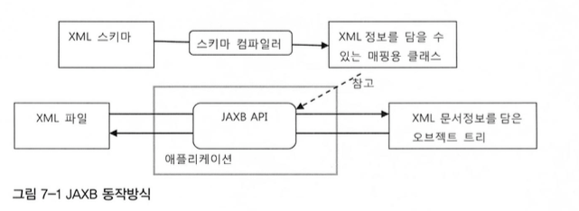
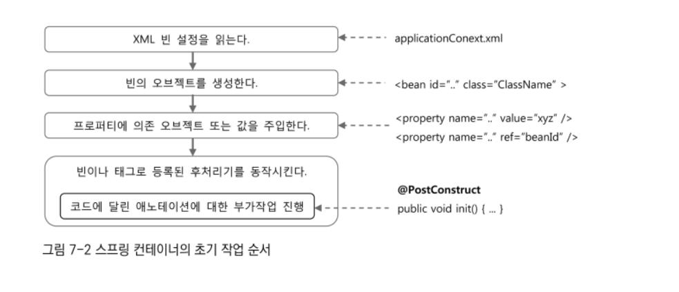

# Chapter7. 스프링 핵심 기술의 응용
- 지금까지 살펴봤던 스프링의 3대 핵심 기술인 IoC/DI, 서비스 추상화, AOP를 활용하여 새로운 기능을 만들어보고 이를 통해 스프의 개발철학과 추구하는 가치, 스프링 사용자에게 요구되는게 무엇인지 살펴본다.

## 7.1 SQL과 DAO의 분리
- 반본적인 JDBC 작업 흐름은 템플릿을 이용해 DAO에서 완벽하게 제거했다.
- 트랜잭션과 예외처리 작업도 서비스 추상화와 AOP등을 이용해 처리하여 DAO와 분리시켰다.
- 이를 통해 DAO에는 깔끔하게 다듬어진 순수한 데이터 액세스 코드만 남게했다.
- 하지만 한 가지 더 분리하고 싶은 SQL 문장이 존재한다.
- 데이터베이스 작업의 인터페이스 역할을 하는 것이 DAO이다.
- JDBC 기술을 바꾸지 않고, 담을 오브젝트가 바뀌지 않으면 DAO코드가 바뀔일 없을거 같지만 사실 DB의 테이블, 필드 이름과 SQL 문장은 변경될 수 있다.
- 어떤 이유에서든지 SQL 변경이 필요한 상황이 발생하면 SQL을 담고 있는 DAO 코드가 수정될 수 밖에 없다.
- 따라서 SQL을 적절히 분리하여 DAO 코드와 다른 파일이나 위치에 두고 관리할 수 있다면 좋을 것이다.

### 7.1.1 XML 설정을 이용한 분리
- 가장 간단한 방법은 XML 설정파일로 빼내는 것이다.

```Java
public class UserDaoJdbc implements UserDao {

    private JdbcTemplate jdbcTemplate;
    private String sqlAdd;
    private String sqlGet;
    private String sqlGetAll;
    private String sqlUpdate;
    private String sqlDelete;
    private String sqlGetCount;
  }
```
- xml에 프로퍼티 값을 넣을 수 있으므로 이를 활용하여 sql을 작성할 수 있다.

```XML
<bean id="userDao" class="ch7.step1.UserDaoJdbc">
    <constructor-arg ref="dataSource"/>
    <property name="sqlAdd" value="insert into users(id, name, password, Level, Login, Recommend, Email) values(?, ?, ?, ?, ?, ?, ?)"/>
    <property name="sqlGet" value="select * from users where id = ?"/>
    <property name="sqlGetAll" value="select * from users order by id"/>
    <property name="sqlUpdate" value="update users set name = ?, password = ?, level = ?, Login = ?, Recommend = ?, Email = ? where id = ?"/>
    <property name="sqlDelete" value="delete from users"/>
    <property name="sqlGetCount" value="select count(*) from users"/>
</bean>
```
- 각 sql들을 xml로 옮긴 후 해당 String을 sql에 넣어주면 테스트 시 동일하게 동작됨을 알 수 있다.
- 이제 데이터베이스의 필드가 변경되더라도 XML을 수정하면 되므로 UserDaoJdbc의 수정이 필요없어 졌다.
- 하지만 이 방법은 매번 새로운 SQL이 필요할 때마다 프로퍼티를 추가하고 DI를 위한 변수와 수정자 메서드도 만들어줘야 한다.

#### SQL 맵 프로퍼티 방식
- SQL이 많아 질 수록 DAO에 DI용 프로퍼티를 추가하는 것은 매우 번거롭다.
- 이번에는 SQL을 하나의 컬렉션으로 담아두는 방법을 시도해보자.
- MAP을 이용하여 이를 구현할 수 있을 것이다.
```Java
public class UserDaoJdbc implements UserDao {

    private JdbcTemplate jdbcTemplate;
    private Map<String, String> sqlMap;
  }
```
- 이전과 다르게 sqlMap하나로 모든 sql을 담을 수 있다.

```XML
<bean id="userDao" class="ch7.step2.UserDaoJdbc">
    <constructor-arg ref="dataSource"/>
    <property name="sqlMap">
        <map>
            <entry key="add" value="insert into users(id, name, password, Level, Login, Recommend, Email) values(?, ?, ?, ?, ?, ?, ?)"/>
            <entry key="get" value="select * from users where id = ?"/>
            <entry key="getAll" value="select * from users order by id"/>
            <entry key="update" value="update users set name = ?, password = ?, level = ?, Login = ?, Recommend = ?, Email = ? where id = ?"/>
            <entry key="delete" value="delete from users"/>
            <entry key="count" value="select count(*) from users"/>
        </map>
    </property>
</bean>
```
- 스프링이 제공해주는 map을 사용하면 xml에 map의 값들을 담을 수 있다.
- 이렇게 변경 후 테스트를 돌려보아도 정상적으로 수행된다.
- 하지만 이 기능은 메서드가 실행되기 전까지 오류를 확인하기 힘들며 오류가 발생할 여지가 많다.
- key값을 잘 못 사용하면 오류가 발생할 것이고, SQL 자체에 대한 오류도 발생할 수 있다.
- 그러므로 이 방법을 사용하기 위해선 포괄적인 테스트를 만들어 확인할 필요가 있다.

### 7.1.2 SQL제공 서비스
- SQL에 xml 설정에 있으니 DI 정보와 섞여 지저분하고 관리도 쉽지 않다.
- SQL을 따뤄 분리해두는게 관리 및 튜닝 측면에서 효율적일 것이다.
- 스프링의 설정파일로부터 생성된 오브젝트와 정보는 애플리케이션을 다시 시작하기전에는 변경이 매우 어렵다는 점도 문제다.
- 주입된 SQL 맵 오브젝트를 직접 변경하더라도 싱글톤인 DAO의 인스턴스 변수에 접근해서 실시간으로 수정하는 것은 쉽지 않으며 동시성 문제도 발생할 수 있다.
- 이런 문제점을 해결하고 요구사항을 모두 충족하려면 DAO가 사용할 SQL을 제공해주는 기능을 독립시킬 필요 가 있다.

#### SQL 서비스 인터페이스
- 가장 먼저 할 일은 SQL 서비스의 인터페이스를 설계하는 것이다.
- SQL 서비스의 기능은 SQL에 대한 키 값을 전달하면 그에 해당하는 SQL을 돌려 주는 것이다.
- DAO는 오직 키만을 제공하면 SQL 서비스가 알아서 적절한 SQL을 찾아 돌려줄 것이다.

```java
public interface SqlService {
    String getSql(String key) throws SqlRetrievalFailureException;
}

public class SqlRetrievalFailureException extends RuntimeException {
    public SqlRetrievalFailureException(String message) {
        super(message);
    }

    // SQL을 가져오는데 실패한 근본 원인을 담을 수 있도록 중첩 예외를 저장할 수 있는 생성자를 만들어준다.
    public SqlRetrievalFailureException(String message, Throwable cause) {
        super(message, cause);
    }
}
```
- 사용할 인터페이스와 필요시 던져줄 예외를 정의하자.
- 예외는 런타임 예외이므로 원한다면 무시가 가능하다.

```Java
public class UserDaoJdbc implements UserDao {

    private JdbcTemplate jdbcTemplate;
    private SqlService sqlService;
  }
```
- 이제 UserDaoJdbc에서는 SqlService로 해당 SQL들을 가져올 것이다.

```Java
@Setter
public class SimpleSqlService implements SqlService {
    private Map<String, String> sqlMap;

    @Override
    public String getSql(String key) throws SqlRetrievalFailureException {
        String sql = sqlMap.get(key);
        if (sql == null){
            throw new SqlRetrievalFailureException(key + "에 대한 SQL을 찾을 수 없습니다.");
        }
        return sql;
    }
}
```
- 이제 SimpleSqlService를 통해 SqlService를 구현한다.
- 이를 빈으로 등록하여 해당 빈 프로퍼티에 이전에 작성하였던 sqlMap 데이터들을 넣어준다.

```XML
<bean id="userDao" class="ch7.step3.UserDaoJdbc">
    <constructor-arg ref="dataSource"/>
    <property name="sqlService" ref="sqlService"/>
</bean>

<bean id="sqlService" class="ch7.step3.SimpleSqlService">
    <property name="sqlMap">
        <map>
            <entry key="add" value="insert into users(id, name, password, Level, Login, Recommend, Email) values(?, ?, ?, ?, ?, ?, ?)"/>
            <entry key="get" value="select * from users where id = ?"/>
            <entry key="getAll" value="select * from users order by id"/>
            <entry key="update" value="update users set name = ?, password = ?, level = ?, Login = ?, Recommend = ?, Email = ? where id = ?"/>
            <entry key="delete" value="delete from users"/>
            <entry key="count" value="select count(*) from users"/>
        </map>
    </property>
</bean>
```
- 테스트는 정상적으로 동작한다. 사실 이전에 UserDao가 SqlMap을 가지고 있는거에 비해 차이는 거의 존재하지 않는다.
- 하지만 이를 통해 DAO는 SQL을 어디에 저장해두고 가져오는지에 대해서 전혀 신경쓰지 않아도 된다.
- 구체적인 구현 방법과 기술에 상관없이 SqlService 인터페이스 타입의  빈을 DI받아서 필요한 SQL을 가져댜 사용하면 되는 것이다.
- 그러므로 앞으로는 언제든지 유연하고 효과적인 방법을 사용해 SQL 서비스를 발전해나갈 수 있다.

---

## 7.2 인터페이스의 분리와 자기참조 빈
### 7.2.1 XML 파일 매핑
- 스프링의 XML 설정파일에서 <bean> 태그 안에 SQL 정보를 넣어놓고 활용하는 건 좋은 방법이 아니다.
- 그보다는 SQL을 저장해두는 전용 포맷을 가진 독립적인 파일을 이용하는 편이 바람직하다.
- 독립적이라고 하여도 포맷은 XML로 할 수 있다.

#### JAXB
- Java Architecture for XML Binding(JAXB)를 이용하면 XML에 담긴 정보를 파일에서 읽어올 수 있다.
- java.xml.bind 패키지에서 이를 제공한다.
- DOM과 같은 전통적인 XML API와 비교하였을 때 JAXB의 장점은 XML 문서정보를 거의 동일한 구조의 오브젝트로 직접 매핑해준다는 것이다.
- JAXB는 XML 문서의 국조를 정의한 스키마를 이용해서 매핑할 오브젝트의 클래스 까지 자동으로 만들어주는 컴파일러도 제공한다.
- 스키마 컴파일러를 통해 자동생성된 오브젝트에는 매핑정보가 애노테이션으로 담겨 있다.
- JAXB API는 애노테이션에 담긴 정보를 이용해서 XML과 매핑된 오브젝트 트리 사이의 자동변환을 수행해준다.



#### SQL 맵을 위한 스키마 작성과 컴파일
- SQL 정보는 키와 SQL의 목록으로 구성된 맵구조로 만들어두면 편리하다.

> 이 부분들은 실제 사용이 필요할 때 까지는 자세히 알 필요 없는 내용들 같으니 읽는 정도로 넘어가자.

#### 언마샬링
- XML 문서를 읽어 자바의 오브젝트로 변환하는 것을 언마샬링(unmarshalling)이라고 하며 반대로 바인딩 오브젝트를 XML 문서로 변환하는 것을 마샬링(marshalling)이라고 한다.

### 7.2.3 빈의 초기화 작업
- xml을 읽어오는 과정을 생성자에서 수행하는 것은 좋지않다.
- 생성자에서 예외가 발생할 수도 있는 복잡한 초기화 작업을 다루는 것은 발생하는 예외 처리 뿐만아니라 상속하기도 불편하고, 보안상도 좋지 않으므로 오브젝트를 초기화하는 정도가 가장 적합하다.
- 우선 xml을 읽어오는 과정을 하나의 메서드를 분리한다. 하지만 스프링이 해당 오브젝트의 생성 및 초기화를 담당하므로 DI작업을 수행해 프로퍼티를 모두 주입해 준 뒤 초기화 하는 메서드를 호출해주어야 할 것이다.
- AOP를 살펴볼 때 스프링의 빈 후처리기에 대해 알아보았다. AOP를 위한 프록시 자동생성기가 대표적인 빈 후처리기였다. 스프링은 이외에도 여러 가지 빈 후처리기가 존재한다. 그중에서 애노테이션을 이용한 빈 후처리기가 존재한다.
- 이 빈 후처리기는 <bean> 태그를 이용해 하나씩 등록할 수 있지만 그보다는 context 스키마의 annotation-config태그를 사용하면 된다.
- context 네임 스페이스를사용해 <context:annotation-config/>태그를 만들어 설정파일에 넣어주면 특별한 애노테이션 기능을 부여해주는 빈 후처리기들이 등록된다.

```XML
<beans xmlns="http://www.springframework.org/schema/beans"
       xmlns:xsi="http://www.w3.org/2001/XMLSchema-instance"
       xmlns:tx="http://www.springframework.org/schema/tx"
       xmlns:context="http://www.springframework.org/schema/context"
       xsi:schemaLocation="http://www.springframework.org/schema/beans
        https://www.springframework.org/schema/beans/spring-beans.xsd
        http://www.springframework.org/schema/tx
        http://www.springframework.org/schema/tx/spring-tx.xsd
        http://www.springframework.org/schema/context
        http://www.springframework.org/schema/context/spring-context.xsd">

    <tx:annotation-driven/>
    <context:annotation-config/>
<beans>
```
- tx:annotation-driven과 비슷하게 자바 표준인 @ProstConstruct 애노테이션을 통해 빈 오브젝트의 초기화 메서드를 지정하는데 사용한다.
- 초기화 작업을 수행할 메서드에 @ProstConstruct를 부여해주면 스프링은 해당 클래스로 등록된 빈의 오브젝트를 생성하고 DI 작업을 마친뒤에 @ProstConstruct가 붙은 메서드를 자동 실행해준다.



- 이러한 순서로 스프링 컨테이너는 초기화가 진행된다.

### 585p(자기참조 빈)
- 이 부분은 상당히 새롭다..
- 한번 더 읽어보도록 하자.

---

## 7.6 스프링 3.1의 DI
- 스프링은 객체지향적인 코드의 장점인 유연성과 확장성을 스프링 스스로가 충실하게 지켜왔기 때문에 버전이 올라가 새로운 기능들이 생기더라도 구 버전 호환성을 유지시켜준다.
- 스프링을 이용해서 만들어지는 애플리케이션 코드가 DI패턴을 이용해서 안전하게 발전하고 확장할 수 있는 것처럼 스프링프레임워크 자체도 DI 원칙을 충실하게 따라서 만들어졌기 때문에 기존 설계와 코드에 영향을 주지 않고도 새로운 기능을 확장해나가는게 가능하다.

#### 자바 언어의 변화와 스프링
**애노테이션의 메타 정보 활용**
- 자바는 소스코드가 컴파일된 후 클래스 파일에 저장됐다가, JVM에 의해 메모리로 로딩되어 실행된다.
- 그런데 때로는 자바 코드가 실행되는 것이 목적아니라 다른 자바 코드에 의해 데이터 처럼 취급되기도 한다.
- 자바 코드의 일부를 리플렉션 API등을 이용해 어떻게 만들었는지 살펴보고 그에 따라 동작하는 기능이 점점 많이 사용되고 있다.
- 리플렉션은 자바 초기버전부터 존재해왔고 자바 코드나 컴포넌트를 작성하는 데 사용되는 툴을 개발할 때 이용하도록 만들어 졌다.
- 언제부턴가 본래 목적보다는 자바 코드의 메타정보를 데이터로 활용하는 스타일의 프로그래밍 방식에 더 많이 활용되고 있다.
- 이런 프로그래밍 방식은 자바 5에서 애노테이션이 등장하면서 절정에 치닫는다.
- 애노테이션은 옵션에 따라 컴파일된 클래스에 존재하거나 애플리케이션이 동작할 때 메모리에 로딩되기도 하지만 자바 코드가 실행되는데 직접적으로 참여하지 못한다.
- 인터페이스처럼 오브젝트에 타입을 부여하거나, 그 자체로 기능을 정의할 수 있는 것도 아니다.
- 동작하는 코드를 넣을수 있는 것도 물론아니고, 코드에서 간단히 참조하거나 활용할 수가 없다.
- 복잡한 리플렉션 API를 이용해 애노테이션의 메타정보를 조회하고 애노테이션 내에 설정된 값을 가져와 참고하는 방법이 전부다.
- 애노테이션 자체가 클래스 타입에 영향을 주지도 못하고 일반 코드에서도 활용되지도 못하기 때문에 일반적인 객체지향 프로그래밍 스타일의 코드나 패턴등에 적용할 수도 없다.
- 그럼에도 애노테이션을 이용한 기술은 빠르게 증가했다.
- 왜 그럴까?
- 애노테이션은 애플리케이션을 핵심 로직을 담은 자바 코드와 이를 지원하는 IoC 방식의 프레임워크, 그리고 프레임워크가 참조하는 메타정보라는 세 가지 구성하는 방식에 잘 어울리기 때문일 것이다.
- 애노테이션은 프레임워크가 참조하는 메타정보로 사용되기에 여러 가지 유리한 점이 많다.
- 애노테이션을 통해 애노테이션을 선언한 메서드, 클래스, 타입등의 패키지, 클래스 이름, 접근 제한자, 상속한 클래스 등 매우 다양한 정보를 리플렉션을 통해 알 수 있다.
- 단순한 애노테이션하나로 애노테이션을 참고하는 코드는 이렇게 다양한 부가 정보를 얻어낼 수 있다.
- 반면에 xml은 모든 내용을 명시적으로 나타내야 한다. 간단히 무엇인지 지정하려고 해도 패키지명까지 작성해주어야 한다.
- 즉 애노테이션에 비해 작성해야할 정보의 양이 많고 텍스트 정보이므로 컴파일 시 에러를 캐치하지 못할 수도 있다.
- 리팩토링에서도 많은 차이점이 들어난다. 만약 리팩토링 중 특정 클래스의 패키지를 변경하거나 이름을 변경해야할 경우가 있을때 애노테이션이라면 바로 패키지명, 이름을 변경하면 된다.
- 하지만 xml의 경우 단순 텍스트 정보이므로 리팩토링 시 추가적인 과정이 필요해진다.
- 물론 애노테이션도 단점이 존재한다. XML은 어느 환경에서나 손쉽게 편집이 가능하고, 내용을 변경하더라도 다시 빌드를 거칠 필요가 없으나 애노테이션은 자바 코드에 존재하므로 변경할 때 마다 매번 클래스를 새로 컴파일 해주어야 한다.
- 스프링 3.1에 이르러서는 핵심 로직을 담은 자바 코드와 DI 프레임워크, 그리고 DI를 위한 메타데이터로서의 자바코드로 재구성되고 있다.

**정책과 관례를 이용한 프로그래밍**
- 애노테이션 같은 메타정보를 활용하는 프로그래밍 방식은 코드를 이용해 명시적으로 동작 내용을 기술하는 대신 코드 없이도 미리 약속한 규칙 또는 관례를 따라서 프로그램이 동작하도록 만드는 프로그래밍 스타일을 적극적으로 포용하게 만들어왔다.
- 이러한 방식은 모든 과정을 직접 표현했을 때에 비해 작성할 내용이 줄어들고, 반복되는 관례를 생략할 수 있다.
- 하지만 프로그래밍 언어나 API 사용법외에 미리 정의된 많은 규칙과 관례를 기억해야 하고, 메타정보를 보고 프로그램이 어떻게 동작할지 이해해야 하는 부담을 주기도 한다.
- 익숙해지면 편하겠지만 그때까지 적지 않은 학습 비용이 들고, 자칫 잘못 이해하고 있을 경우 찾기 힘든 버그를 만들어내기도 한다.
- 이제 이때까지 만들었던 XML기반으로 구성되었던 코드들을 애노테이션 기반으로 변경해보자.
- 스프링 3.1의 DI 스타일로 변경하는 리팩토링은 총 6단계로 진행될 것이며 각 작업의 특징과 장단점을 살펴보면서 진행할 것이다.
- 이때까지 계속해서 테스트를 작성하였기 때문에 리팩토링마다 테스트를 확인하며 리팩토링이 제대로 이루어 졌는지 확인한다.


### 7.6.1 자바코드를 이용한 빈 설정
#### 테스트 컨텍스트의 변경
- XML을 더 이상 사용하지 않는 것이 최종 목적이다. 그렇다고 한번에 XML을 삭제할 필요가 없다.
- 스프링은 애노테이션과 자바 코드로 만들어진 DI 설정과 XML 설정을 동시에 제공해준다.
- 가장 먼저 테스트 코드에서 DI정보가 XML에 담겨 있다고 정의한 부분을 찾아 DI 정보를 담은 자바코드를 사용하도록 변경해보자.

```Java
@Configuration
@ImportResource(locations = "../step3/applicationContext.xml")
public class TestApplicationContext {
}
```
- 테스트용 설정 클래스를 정의하고 해당 클래스에 xml을 임포트 해준다.

```Java
@ExtendWith(SpringExtension.class)
@ContextConfiguration(classes = TestApplicationContext.class)
class UserDaoTest {
}
```
- 테스트 클래스에서는 ContextConfiguration에 TestApplicationContext를 사용한다.
- 테스트는 그대로 잘 동작할 것이다.
- 왜냐하면 현재는 아래와 같이 xml에 모든 설정이 들어있기 때문에 TestApplicationContext의 ImportResource가 이 xml을 읽어들이기 때문이다.

```xml
<?xml version="1.0" encoding="UTF-8" ?>
<beans xmlns="http://www.springframework.org/schema/beans"
       xmlns:xsi="http://www.w3.org/2001/XMLSchema-instance"
       xmlns:tx="http://www.springframework.org/schema/tx"
       xmlns:context="http://www.springframework.org/schema/context"
       xsi:schemaLocation="http://www.springframework.org/schema/beans
        https://www.springframework.org/schema/beans/spring-beans.xsd
        http://www.springframework.org/schema/tx
        http://www.springframework.org/schema/tx/spring-tx.xsd
        http://www.springframework.org/schema/context
        http://www.springframework.org/schema/context/spring-context.xsd">

    <tx:annotation-driven/>
    <context:annotation-config/>

    <bean id="userService" class="ch6.step8.UserServiceImpl">
        <constructor-arg ref="userDao"/>
        <constructor-arg ref="testUserLevelUpgradePolicy"/>
        <constructor-arg ref="mailSender"/>
    </bean>

    <bean id="testUserService" class="ch7.step1.UserServiceTest$TestUserService">
        <constructor-arg ref="userDao"/>
        <constructor-arg ref="testUserLevelUpgradePolicy"/>
        <constructor-arg ref="mailSender"/>
    </bean>

    <bean id="mailSender" class="ch5.step2.DummyMailSender"/>

    <bean id="transactionManager" class="org.springframework.jdbc.datasource.DataSourceTransactionManager">
        <property name="dataSource" ref="dataSource"/>
    </bean>

    <bean id="userLevelUpgradePolicy" class="ch5.step2.UserLevelUpgradeDefault"/>
    <bean id="testUserLevelUpgradePolicy" class="ch7.step1.UserServiceTest$TestUserLevelUpgradePolicy"
          parent="userLevelUpgradePolicy">
    </bean>

    <bean id="userDao" class="ch7.step3.UserDaoJdbc">
        <constructor-arg ref="dataSource"/>
        <property name="sqlService" ref="sqlService"/>
    </bean>
    <bean id="sqlService" class="ch7.step3.SimpleSqlService">
        <property name="sqlMap">
            <map>
                <entry key="add" value="insert into users(id, name, password, Level, Login, Recommend, Email) values(?, ?, ?, ?, ?, ?, ?)"/>
                <entry key="get" value="select * from users where id = ?"/>
                <entry key="getAll" value="select * from users order by id"/>
                <entry key="update" value="update users set name = ?, password = ?, level = ?, Login = ?, Recommend = ?, Email = ? where id = ?"/>
                <entry key="delete" value="delete from users"/>
                <entry key="count" value="select count(*) from users"/>
            </map>
        </property>
    </bean>

    <bean id="dataSource" class="org.springframework.jdbc.datasource.SimpleDriverDataSource">
        <property name="driverClass" value="com.mysql.cj.jdbc.Driver"/>
        <property name="url" value="jdbc:mysql://localhost:3306/springtoby"/>
        <property name="username" value="sunlee"/>
        <property name="password" value="pass"/>
    </bean>
</beans>
```

#### \<context:annotation-config/\> 제거
- @Configuration이 붙은 설정 클래스가 존재하면 <context:annotation-config/>는 필요 없어지므로 지우더라도 정상 동작한다.
- 컨테이너가 직접 @ProstConstruct 애노테이션을 처리하는 빈 후처리기를 등록해주기 때문이다.

#### \<bean>의 전환
- 너무 뻔한거니 생략하자

#### 전용 태그전환(\<tx:annotation-driven/>)
- tx설정은 전용 태그를 통해 간단하게 설정하여 해당 태그하나만으로 @Transacntional을 사용할 수 있었다.
- 만약 이 태그를 주지않는다면 4가지의 클래스를 빈으로 등록한 후 적절하게 프로퍼티 값을 넣어주면된다.
- 하지만 이는 기억하기도 어렵고 설정이 쉽지가 않다.
- 이를 지원하기 위해서 스프링에서는 애노테이션기반으로 **@EnableTransactionManagement** 와 같은 설정을 지원한다.
- 이는 \<tx:annotation-driven/>과 동일한 효능을 가지게 될 것이다.

### 7.6.2 빈 스캐닝 자동와이어링
#### @Autowired를 이용한 자동 와이어링
- 지금까지 @Autowired는 빈으로 등록된 객체들을 가져올 때 사용하였다.
- 하지만 @Autowired를 선언하면 의존성을 주입할 생성자나 수정자에 의존성을 바로 넣어줄 수 있다.

```Java
public class UserDaoJdbc implements UserDao{
  @Autowired
  public void setDataSource(DataSource dataSource){
    this.jdbcTemplate = new JdbcTeplate(dataSource);
  }
}
```
- 이렇게 하더라도 dataSource 빈이 자동으로 주입된다.
- 스프링은 @Autowired가 붙은 수정자 메서드가 있으면 파라미터 타입을 보고 주입 가능한 빈들을 모두 찾는다.
- 빈이 여러개라면 그중에서 프로퍼티와 동일한 이름의 빈을 찾는다.
- 만약 이름가지 비교하였는데도 최종 후보가 발견되지 않으면 에러를 발생시킨다.

---

#### ActiveProfile
- 테스트에서 특정 프로파일을 적용하고 싶을때는 @ActiveProfile을 사용하자

#### Import(SqlServiceContext.class)
- 다른 설정을 추가하고 싶을 때 Import를 사용하자
- 클래스일 경우 Import, xml이라면 ImportResource


#### PropertySource("/database.properties")
- 프로퍼티를 가져오고싶을 때 사용하자
- 얘를 달고 Environemt를 사용하여 env.getProperty("db.driverClass") 이렇게 사용가능
- 이경우 클래스라면 이름값을 가져오므로 Class.forName(evn.getProperty()) 이런식으로 해야 한다.

#### PropertySourcesPlaceholderConfigurer
- @PropertySource로 설정한 값들을 @Value로 가져올 수 있다.
- xml에서 프로퍼티를 value=""로 설정한거와 유사하다.

```Java
@Bean
public static PropertySourcesPlaceholderConfigurer placeholderConfigurer(){
  return new PropertySourcesPlaceholderConfigurer();
}
```
- 빈 등록이 필요하다.
- 빈 팩토리 후처리기로 사용되는 빈으로 정의해야 하므로 static메서드로 선언한다.

### 7.6.6 빈 설정의 재사용과 @Enable*
- 모듈화된 특정 설정 정보들은 Import로 가져오기보다는 Import가 메타 애노테이션인것을 활용하여 명시적인 애노테이션을 만들어 사용하자.

```Java
@Import(value=SqlServiceContext.class)
public @interface EnableSqlService{}
```


#### 스프링 컨테이너에 등록된 빈 정보를 조회하는 방법
- 스프링 컨테이너는 모두 BeanFactory라는 인터페이스를 구현하고 있다.
- BeanFactory의 구현 클래스 중 DefaultListableBeanFactory가 잇는데 거의 대부분의 스프링 컨테이너는 이 클래스를 이용해 빈을 등록하고 관리한다.
- DefaultListableBeanFactory에는 getBeanDefinitionNames()라는 메서드가 있어 컨테이너에 등록된 모든 빈이름을 가져올 수 있고, 빈 이름을 이용해 실제 빈과 빈 클래스 정보를 조회할 수 있다.
