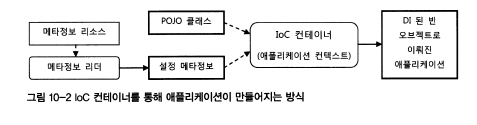
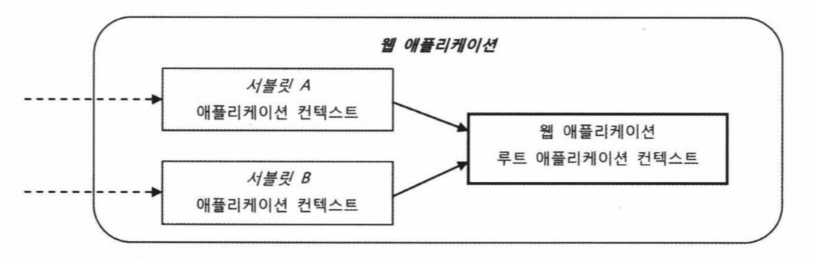

# Chapter1. IoC 컨테이너와 DI
## 1.1 IoC컨테이너: 빈 팩토리와 애플리케이션 컨텍스트
- 스프링 애플리케이션에서는 오브젝트의 생성과 관계설정, 사용, 제거 등의 작업을 애프릴케이션 코드 대신 독립된 컨테이너가 담당한다.
- 이럴 컨테이너가 코드 대신 오브젝트의제어권을 가지고 있다고 해서 IoC라고 부른다. 그러므로 스프링 컨테이너를 IoC 컨테이너라고도 한다.
- 스프링에서는 이를 빈 팩토리 또는 애플리케이션 컨텍스트라고 부른다.
- 오브젝트의 생성과 오브젝트 사이의 런타임 관계를 설정하는 DI 관점으로 볼 때는 컨테이너를 빈 팩토리라고 한다.
- DI이외에 컨테이너는 많은 일을하는데 이러한 여러가지 기능들을 추가한 것을 애플리케이션 컨텍스트라고 한다.

> 스프링 애플리케이션은 최소한 하나 이상의 IoC 컨테이라고 말하는 ApplicationContext 인터페이스를 구현한 오브젝트를 하나이상 가지고 있다.

### 1.1.1 IoC 컨테이너를 이용해 애플리케이션 만들
- 가장 간단하게 IoC 컨테이너를 만드는 것은 ApplicationContext 구현체 인스턴스를 만들면 된다.

```java
StaticApplicationContext ac = new StaticApplicationContext();
```
- StaticApplicationContext를 통해 IoC 컨테이너를 하나 만들었다.
- 하지만 지금은 빈 컨테이너일 뿐 이를 동작시키기 위해서는 POJO클래스와 설정 메타정보가 필요하다

#### POJO 클래스
- 애플리케이션 핵심 코드를 담고 있는 POJO 클래스를 준비해야 한다.
- 지정된 사람에게 인사할 수 있는 Hello 라는 클래스와 메시지를 받아 이를 출력하는 Printer 인터페이스를 만들면서 POJO 클래스들을 만들어보자.
- Hello는 Printer 인터페이스에게만 의존하여 해당 Printer의 구현체를 런타임 시점에 동적으로 변경할 수 있게되여 유연한 변경이 가능해진다.

```java
@Setter
@Getter
public class Hello {
    String name;
    Printer printer;

    public String sayHello() {
        return "Hello " + name;
    }

    public void print(){
        this.printer.print(sayHello());
    }
}

public interface Printer {
    void print(String message);
}

// 내장 버퍼에 print 파라미터 값을 가지고 있다.
public class StringPrinter implements Printer {

    private StringBuffer buffer = new StringBuffer();

    @Override
    public void print(String message) {
        buffer.append(message);
    }

    public String toString(){
        return buffer.toString();
    }
}

// 콘솔창에 message를 출력한다.
public class ConsolePrinter implements Printer {
    @Override
    public void print(String message) {
        System.out.println(message);
    }
}
```
- Hello는 Printer 구현체를 언제든지 수정자를 통해 변경할 수 있다.
- 결합도가 낮고 유연한 관계를 가질 수 있도록 인터페이스를 이용해 연결해주는 것 까지가 IoC 컨테이너가 사용할 POJO를 준비하는 첫단계이다.

#### 설정 메타정보
- POJO 클래스들 중에 애플리케이션에서 사용할 것을 선정하고 이를 IoC컨테이너가 제어할 수 있도록 적절한 메타 정보를 만들어 제공하는 작업을 진행해보자.
- 스프링의 설정 메타정보는 BeanDefinition 인터페이스로 표현되는 순수한 추상 정보이다.
- 그렇기때문에 XML이든 애노테이션이든 BeanDefinition으로 정의도니느 스프링의 설정 메타정보의 내용을 표현한 것이 있다면 무엇이든 사용 가능하다.
- IoC컨테이너가 사용하는 빈 메타정보는 **빈 아이디, 구현 클래스, 스코프, 생성자 파라미터, 프로퍼티, 지연 로딩여부가 있다.**


- 설정 메타정보와 POJO클래스를 참조하여 IoC컨테이너는 빈으로 등록된 인스턴스를 만들고 오브젝트 주입을 진행해준다.
- 학습테스트를 통해 동작을 확인해보자.

```java
@Test
void init() throws Exception{
    StaticApplicationContext ac = new StaticApplicationContext();
    ac.registerSingleton("hello1", Hello.class);

    Hello hello1 = ac.getBean("hello1", Hello.class);
    assertThat(hello1).isNotNull();
}
```
- StaticApplicationContext를 통해 빈으로 등록시킬 수 있고 해당 빈을 꺼내와서 확인이 가능하다.

```java
@Test
void bd() throws Exception{
    StaticApplicationContext ac = new StaticApplicationContext();

    BeanDefinition helloDef = new RootBeanDefinition(Hello.class);
    helloDef.getPropertyValues().addPropertyValue("name", "Spring");

    ac.registerBeanDefinition("hello2", helloDef);
    Hello hello2 = ac.getBean("hello2", Hello.class);

    assertThat(hello2.getName()).isEqualTo("Spring");
}
```
- 빈 설정 메타정보를 담은 BeanDefinition을 이용해 오브젝트를 생성하고 해당 오브젝트의 property에 DI를 해준 후 빈으로 등록이 가능하다.

```java
@Test
void registerBeanWithDependency() throws Exception{
    StaticApplicationContext ac = new StaticApplicationContext();
    ac.registerBeanDefinition("printer", new RootBeanDefinition(StringPrinter.class));

    RootBeanDefinition helloDef = new RootBeanDefinition(Hello.class);

    // helloDef에 DI 작업을 수행해준다.
    helloDef.getPropertyValues().addPropertyValue("name", "Spring");
    helloDef
            .getPropertyValues()
            .addPropertyValue("printer", new RuntimeBeanReference("printer"));

    ac.registerBeanDefinition("hello", helloDef);

    Hello hello = ac.getBean("hello", Hello.class);
    hello.print();

    // printer 빈은 hello.print()에 의해 StringBuffer에 값이 저장되었다.
    assertThat(ac.getBean("printer").toString()).isEqualTo("Hello Spring");
}
```
- 이런식으로 IoC컨테이너가 POJO 클래스와 설정 메타 정보를 통해 애플리케이션 런타임 시점에 오브젝트를 만들어 DI 해준다.
- 이렇게 애플리케이션을 구성하는 빈 오브젝트를 생성하는 것이 IoC 컨테이너이 핵심 기능이다.
- IoC컨테이너는 일단 빈 오브젝트가 생성되고 관계가 만들어지면 그 뒤로는 거의 관여를 하지 않는다.

> 기본적으로 싱글톤 빈은 애플리케이션 컨텍스트 초기화 작업 중에 모두 만들어진다.

### 1.1.2 IoC 컨테이너의 종류와 사용법
- 이미 다용도로 사용가능한 ApplicationContext의 구현체들이 있으니 개발자는 직접 이를 만들 필요가 없다.

#### StaticApplicationContext
- 코드를 통해 빈 메타 정보를 등록하기 위해 사용한다.
- 보통 학습 테스트를 만들 때 사용하고 실제로는 사용되지 않는다.

#### GenericApplicationContext
- GenericApplicationContext는 가장 일반적인 애플리케이션 컨텍스트 구현체이다.
- 실전에서 사용될 수 있는 모든 기능을 갖추고 있는 애플리케이션 컨텍스트이다.
- GenericApplicationContext는 XML 파일과 같은 외부 리소스에 있는 빈 설정 메타정보를 리더를 통해 읽어들여서 메타정보로 전화해서 사용한다.

```XML
<?xml version="1.0" encoding="UTF-8" ?>
<beans xmlns="http://www.springframework.org/schema/beans"
       xmlns:xsi="http://www.w3.org/2001/XMLSchema-instance"
       xsi:schemaLocation="http://www.springframework.org/schema/beans
        https://www.springframework.org/schema/beans/spring-beans.xsd"
        >
    <bean id="hello" class="ch1.step1.Hello">
        <property name="name" value="Spring"/>
        <property name="printer" ref="printer"/>
    </bean>

    <bean id="printer" class="ch1.step1.ConsolePrinter"/>

</beans>
```

```java
@Test
void xml() throws Exception{
    GenericApplicationContext ac = new GenericApplicationContext();

    XmlBeanDefinitionReader reader = new XmlBeanDefinitionReader(ac);
    reader.loadBeanDefinitions("applicationContext.xml");

    // 모든 메터 정보 등록 후 애플리케이션 초기화
    ac.refresh();

    ac.getBean("hello", Hello.class).print();
    assertThat(ac.getBean("printer").toString()).isEqualTo("Hello Spring");
}
```
- GenericApplicationContext를 통해 XmlBeanDefinitionReader를 만들어 메타 정보를 읽어 드린 후 refresh를 통해 초기화하면 빈으로 등록된다.
- 스프링은 대표적으로 XML, 애노테이션, 자바 클래스 세 가지 방식으로 빈 설정 메타정보를 작성할 수 있다.
- 물론 이 세가지로 제한되진 않고 필요하다면 언제든지 확장이 가능하다.
- 스프링을 이용하면서 GenericApplicationContext를 직업 생성하여 초기화할 일을 거의 없다.
- 하지만 GenericApplicationContext는 JUnit 테스트시 애플리케이션 컨텍스트를 만들어준다.
- @ContextConfiguration을 통해 XML을 지정하여 초기화 해줘 테스트내 사용을 가능하도록 한다.

#### GenericXmlApplicationContext
- 코드에서 GenericApplicationContext에서 XmlBeanDefinitionReader를 따로 만들지 않고 GenericXmlApplicationContext를 사용하면 편리하다.
- GenericXmlApplicationContext는 XmlBeanDefinitionReader를 내장하고 있으므로 XML파일을 읽고 refresh()를 통해 초기화하는 것까지 한줄로 끝낼 수 있다.

```java
@Test
void GXAC() throws Exception{
    GenericXmlApplicationContext ac = new GenericXmlApplicationContext("applicationContext.xml");
    ac.getBean("hello", Hello.class).print();
    assertThat(ac.getBean("printer").toString()).isEqualTo("Hello Spring");
}
```

#### WebApplicationContext
- 스프링 애플리케이션에서 가장 많이 사용하는 애플리케이션이 바로 WebApplicationContext이다.
- WebApplicationContext는 ApplicationContext를 확장한 인터페이스로 WebApplicationContext를 구현한 클래스를 사용한다.
- 이름 그대로 웹 환경에서 사용할 때 필요한 기능이 추가된 애플리케이션 컨텍스트이다.
- XmlWebApplicationContext, AnnotationConfigWebApplicationContext등이 있으며 Boot의 경우 웹 환경이라면 AnnotationConfigWebApplicationContext를 사용한다.
- WebApplicationContext의 사용방법을 이해하기 위해서는 IoC 컨테이너를 적용했을 때 애플리케이션을 가동시키는 방법에 대해 살펴볼 필요가 있다.
- 스프링 IoC컨테이너는 빈 설정 메타정보를 이용해 빈 오브젝트를 만들고 DI작업을 수행한다.
- 하지만 그것만으로는 애플리케이션이 동작할 수없다. 자바는 main() 메서드와 같이 어딘가에 특정 빈 오브젝트의 메서드를 호출함으로써 애플리케이션을 동작시켜야 한다.
- 이를 위해 보통 기동 역할을 맡은 빈오브트를 가져와서 실행해야 한다.
- 적어도 한번은 getBean()을 통해 가동 오브젝트를 가져와 메서드를 호출해야하고 그 후로는 빈 오브젝트끼리 DI로 서로 연결되어 의존관계를 타고 가면서 필요한 오브젝트가 호출되고 애플리케이션이 동작될 것이다.
- 하지만 테스트나 독립환경에서와는 달리 웹 에서는 동작하는 방식이 근본적으로 다르다.
- 독립 자바 프로그램은 JVM에게 main()메서드를 가진 클래스를 시작하라고 요청할 수 있지만 웹에서는 main()을 호출할 방법이 없다.
- 그래서 웹 환경에서는 main() 메서드 대신 서블릿을 실행해주는 방식으로 서블릿이 일종의 main() 역할을 한다.
- 먼저 main() 역할을 하는 서블릿을 만들어두고, 미리 ApplicationContext를 생성해둔 다음 요청이 들어올 때 마다 getBean()으로 필요한 빈을 가져와 정해진 메서드를 실행해주면 된다.
- 스프링은 DispatcherServlet이라는 이름의 서블릿을 통해 웹 환경에서 ApplicationContext를 생성하고 설정 정보를 초기화 한 후 클라이언트로 부터 들어오는 요청마다 적절한 빈을 찾아 이를 실행해준다.

### 1.1.3 IoC 컨테이너 계층구조
- 한개 이상의 IoC컨테이너를 만들어두고 사용해야 할 경우가 있다.
- 바로 트리 모양의 계층 구조를 만들때이다.

#### 부모 컨텍스트를 이용한 계층구조 효과
- 모든 ApplicationContext는 부모 ApplicationContext를 가질 수 있다. 이를 이용하여 트리구조로 구성할 수 있다.
- 계층구조 안의 모든 컨텍스트는 각자 독립적인 설정정보를 이용해 빈 오브젝트를 만들고 관리한다.
- 각자 독립적으로 자신이 관리하는 빈을 갖지만 DI를 위해 빈을 찾을때는 부모 ApplicationContext의 빈까지 모두 검색한다.
- **중요한 건 자신의 부모 컨텍스트들에게만 요청하지 자식이나 같은레벨에게는 요청하지 않는다.**
- 검색순서는 자신 -> 직계 부모 -> 그다음 부모순으로 계속해서 타고 올라간다.
- 계층 구조를 이용하는 이유는 여러 애플리케이션 컨텍스트가 공유하는 설정을 만들기 위해서이다.
- 애플리케이션 안에 성격이 다른 설정을 분리해서 두 개 이상의 컨텍스트를 구성하면 각 컨텍스트가 공유하고 싶은게 있을 때 게층구조를 이용할 수 있다.

#### 컨텍스트 계층구조 테스트
- 학습테스트를 통해 컨텍스트 계층구조를 테스트해보자.

```xml
<!--ParentContext-->
<?xml version="1.0" encoding="UTF-8" ?>
<beans xmlns="http://www.springframework.org/schema/beans"
       xmlns:xsi="http://www.w3.org/2001/XMLSchema-instance"
       xsi:schemaLocation="http://www.springframework.org/schema/beans
        https://www.springframework.org/schema/beans/spring-beans.xsd"
        >
    <bean id="hello" class="ch1.step1.Hello">
        <property name="name" value="Parent"/>
        <property name="printer" ref="printer"/>
    </bean>

    <bean id="printer" class="ch1.step1.StringPrinter"/>

</beans>

<!--ChildContext-->
<?xml version="1.0" encoding="UTF-8" ?>
<beans xmlns="http://www.springframework.org/schema/beans"
       xmlns:xsi="http://www.w3.org/2001/XMLSchema-instance"
       xsi:schemaLocation="http://www.springframework.org/schema/beans
        https://www.springframework.org/schema/beans/spring-beans.xsd"
        >
    <bean id="hello" class="ch1.step1.Hello">
        <property name="name" value="Child"/>
        <property name="printer" ref="printer"/>
    </bean>
</beans>
```
- ParentContext, ChildContext를 만든다.
- 둘다 Hello를 빈으로 가지고 있으며 이럴경우 자식 컨텍스트의 빈이 우선시 될것이다.
- 그리고 자식컨텍스트의 printer는 부모 컨텍스트의 빈을 참조하게 될 것이다.

```java
@Test
void layerContext() throws Exception{
    GenericApplicationContext parent = new GenericXmlApplicationContext("parentContext.xml");
    GenericApplicationContext child = new GenericApplicationContext(parent);
    XmlBeanDefinitionReader reader = new XmlBeanDefinitionReader(child);
    reader.loadBeanDefinitions("childContext.xml");

    child.refresh();

    child.getBean("hello", Hello.class).print();
    assertThat(child.getBean("printer", Printer.class).toString()).isEqualTo("Hello Child");
}
```
- 최상위 부모인 루트 컨텍스트는 반드시 스스로 의존관계를 보장해야 하므로 GenericXmlApplicationContext로 생성하고 자식의 경우 GenericApplicationContext로 생성할 때 parentContext를 아규먼트로 넘겨줘 생성한다.
- 프로퍼티 태그를 잘만 조작하면 부모의 빈을 사용하게 할 수도 있다.
- 이 자체가 컨텍스트 계층구조를 엉성하게 만들었다는 증거이다.
- 계층구조는 스프링에서 자주활용하는 방법이지만 남용해서는 안되고 부모 자식간의 중복된 빈을 정의하는 일은 피해야한다.

### 1.1.4 웹 애플리케이션의 IoC 컨테이너 구성
- 서버에서 동작하는 애플리케이션에서 스프링 IoC 컨테이너를 사용하는 방법은 크게 세가지로 구분된다.
- 두 가지 방법은 웹 모듈안에 컨테이너를 두는 것, 나머지는 엔터프라이즈 애플리케이션 레벨에 두는 방법이다.
- 먼저 웹 애플리케이션안에 WebApplicationContext 타입의 IoC 컨테이너를 두는 방법을 아랑보자.
- 자바 서버에는 하나 이상의 웹 모듈을 배치할 수 있다. 하나의 웹은 여러개의 서블릿을 가질 수 있다.
- 보통 스프링 WBC는 프론트 컨트롤러 패턴을 통해 서블릿을 사용하므로 많아봤자 두 세개를 사용한다.
- 웹 애플리케이션에서 동작하는 IoC 컨테이너는 스프링 애플리케이션의 요청을 처리하는 서블릿 안에서 만들어지는 것과 웹 애플리케이션 레벨에서 만들어지는 두 가지 방법이 존재한다.
- 일반적으로는 이 두가지 방식을 모두 사용해 컨테이너를 만든다.

#### 웹 애플리케이션 컨텍스트 구조
- 웹 애플리케이션 레벨에 등록되는 컨테이너는 보통 루트 웹 애플리케이션 컨텍스트라고 부른다.
- 이는 서블렛 레벨에서 등록되는 컨테이너의 부모 컨테이너가 된다.
- 서블릿들은 각각 독립적인 ApplicationContext를 만든다. 이런 경우 서블릿이 공유하게 되는 공통적인 빈들이 존재할 것이고 이런 빈들을 웹 애플리케이션 레벨의 컨텍스트에 등록하면 된다.
- 아래와 같이 말이다.


- 보통은 하나의 서블릿만 사용하지만 현재 설정들을 유지하면서 새로운 기능이나 별도의 웹 기술을 추가하고 싶을 때 사용할 수 있을 것이다.
- 그래서 일반적으로는 서블릿이 하나만 있다고 생각하면 될 것이다.
- 서블릿이 하나라면 왜 이렇게 계층 구조로 만들게 될까?
- 그 이유는 전체 애플리케이션에서 웹 기술에 의존적인 부분과 그렇지 않은 부분을 구분하기 위해서이다.
- 스프링이 이용하는 웹 애플리케이션이라고 해서 반드시 스프링이 제공하는 웹 기술을 사용해야 하는 건 아니다.
- 프레젠테이션 계층을 다른 기술을 사용할 때가 종종있는데 그럴 경우 계층 형태로 컨텍스트를 구분하는 것이 바람직하다.
- 서블릿을 포함한 다른기술들은 루트 애플리케이션 컨텍스트를 공유해서 사용할 수 있게 된다.
- 그렇기 때문에 서블릿이 하나라도 계층 구조로 해놓는다면 웹 기술을 확장하거나, 변경 조합할 수 있는 선택의 폭이 커지게 된다.
- 서블릿 컨텍스트는 루트 컨텍스트빈을 참조할 수 있지만 반대는 안되는 것을 잘 유념하고 빈들을 적용해야 한다.

#### 웹 애플리케이션의 컨텍스트 구성 방법
**1) 서블릿 컨텍스트와 루트 애플리케이션 컨텍스트 계층 구조**
- 가장 많이 사용하는 기본적인 구성방법으로 스프링 웹 외에도 기타 웹 프레임워크나 HTTP 요청을 통해 동작하는 각종 서비스를 함께 사용할 수 있다.

**2) 루트 애플리케이션 컨텍스트 단일구조**
- 스프링 웹 기술을 사용하지 않고 서드파티 웹 프레임워크나 서비스 엔진만을 사용해 프레젠테이션 계층을 만들 때 스프링 서블릿이 필요 없을 경우 사용한다.

**3) 서블릿 컨텍스트 단일구조**
- 스프링외의 프렝미워크나 서비스 엔진에서 스프링의 빈을 사용할 것이 아니라면 루트 애플리케이션을 생략하여 서블릿 컨텍스트 단일 구조로 사용할 수 있다.

#### 루트 애플리케이션 컨텍스트 등록
- 웹 애플리케이션 레벨에 만들어지는 루트 웹 애플리케이션 컨텍스트를 등록하는 가장 간단한 방법은 서블릿 이벤트 리스너를 이용하는 것이다.
- 웹 애플리케이션의 시작과 종료 시 발생하는 이벤트를 처리하는 ServletContextListener를 이용할 수 있다.
- **스프링은 ContextLoaderListner를 통해 자동으로 루트 애플리케이션 컨텍스트를 초기화해준다.**

#### 서블릿 애플리케이션 컨텍스트 등록
- 스프링 웹 기능을 지원하는 프론트 컨트롤러 서블릿은 DispatcherServlet이다.
- DispatcherServlet은 web.xml에 등록해서 사용할 수 있는 평범한 서블릿이다.
- DispatcherServlet은 여러개를 등록할 수 있으며 서블릿이 초기화될 때 자신만의 컨텍스트를 생성하고 초기화한다.
- 동시에 웹 애플리케이션 레벨에 등록된 루트 애플리케이션 컨텍스트를 찾아서 이를 자신의 부모 컨텍스트로 사용한다.


---

## 1.2 IoC/DI를 위한 빈 설정 메타정보 작성
- IoC컨테이너의 가장 기본적인 역할을 코드를 대신해서 애플리케이션을 구성하는 오브젝트를 생성하고 관리하는 것이다.
- 빈을 만들기 위한 설정 메타정보는 파일이나 애노테이션 같은 리소스로부터 전용 리더를 통해 읽혀서 BeanDefinition 타입의 오브젝트로 변환된다.
- 이 BeanDefinition 정보를 IoC컨테이너가 활용하는 것이다.


### 1.2.1 빈 설정 메타정보
- BeanDefinition에는 IoC 컨테이너가 빈을 만들 때 필요한 핵심 정보가 담겨 있다.
- BeanDefinition은 여러 개의 빈을 만드는데 재사용될 수 있다. 설정 메타정보가 같지만 이름이 다른 여러 개의 빈 오브젝트를 만들 수 있기 때문이다.
- 따라서 BeanDefinition에는 빈의 이름이나 아이디를 나타내는 정보는 포함되지 않고 빈으로 등록될 떄 이름이 부여된다.

#### 빈 설정 메타정보 항목은 책을 참고하자(P84)
- 빈 설정 정보는 상당히 많이 존재하는 이는 스프링이 오브젝트를 컨테이너가 생성하고 관리하는 과정에서 필요한 매우 세밀하고 유연한 방법을 제공해준다.
- 빈 설정 메타정보는 가장 중요한것은 클래스 이름이다. 추상빈이아닌 오브젝트를 생성하려면 클래스 이름으 반드시 필요하다.
- 그리고 빈 메타정보가 등록될 때 클래스이름과 함께 빈의 아이디 또는 이름이 필요하다.

### 1.2.2 빈 등록 방법
- 빈 등록은 빈 메타정보를 작성해 컨테이너에게 건네주면 된다.
- 보통 XML, 프로퍼티 파일, 애노테이션등을 통해 메타정보를 작성하고 이를 적절한 리더나 변환기를 통해 애플리케이션 컨텍스트가 사용할 수 있는 정보로 변환해주는 방법을 사용한다.
- xml을 사용하긴 하지만 최근에는 애노테이션을 주로 사용한다.
- AnnotationConfigApplicationContext를 통해 애노테이션으로 등록한 빈들을 가져올 수 있다.

```java
@Component
@Setter
@Getter
public class AnnotationHello {
    private String name;
    private Printer printer;

    public String sayHello() {
        return "Hello " + name;
    }

    public void print(){
        this.printer.print(sayHello());
    }
}


class AnnotationHelloTest {
    @Test
    void annotationBean() throws Exception{
        AnnotationConfigApplicationContext ctx = new AnnotationConfigApplicationContext("ch1.step1");
        AnnotationHello hello = ctx.getBean("annotationHello", AnnotationHello.class);

        assertThat(hello).isNotNull();
    }
}
```
- XML 파일은 필요 없고 오직 애노테이션으로만 빈을 등록할 수 있다.
- 애노테이션은 빈의 이름을 클래스이름에서 앞의 글자를 소문자로 바꾼 이름을 가진다.
- 빈에 특정 이름을 지정하기 위해서는 @Component("name")으로 지정할 수 있다.
- 개발시에는 생산성을 위해 애노테이션 기반으로 진행하고 개발이 완료되면 관리를 편리하게 하기 위해 XML로 변경하는 것도 좋은 방법이다.


#### @Configuration, @Bean
```java
@Configuration
public class HelloConfig {
    @Bean
    public Hello hello(){
        return new Hello();
    }
}


class HelloConfigTest {
    @Test
    void config() throws Exception{
        AnnotationConfigApplicationContext ctx = new AnnotationConfigApplicationContext(HelloConfig.class);
        HelloConfig helloConfig = ctx.getBean("helloConfig", HelloConfig.class);
        Hello hello = ctx.getBean("hello", Hello.class);

        assertThat(hello == helloConfig.hello()).isTrue();
    }
}
```
- ApplicationContext는 디폴트 설정일 경우 해당 빈이 싱글톤임을 보장해준다.
- 그렇기 때문에 HelloConfig의 hello를 계속 호출하더라도 처음 만들어진 오브젝트를 반환하게 한다.
- 자바코드로 빈들을 설정하면 유용하점들이 있다.
  - 컴파일러나 IDE를 통한 타입 검증이 가능해진다.
  - 자동완성과 같은 IDE 지원 기능을 최대한 이용할 수 있게 된다.
  - 이해하기 쉬우며 보갖ㅂ한 빈 설정이나 초기화 작업을 손쉽게 적용할 수 있게 해준다.

### 1.2.3 빈 의존관계 설정 방법
#### XML:\<property>, \<constructor-arg>
- 아니깐 생략

#### XML: 자동와이어링
```xml
<bean id="hello" class="ch1.step1.Hello" autowire="byName">
    <property name="name" value="Spring"/>
</bean>
```
- autowire="byName"을 통해 printer 프로퍼티는 이름이 같은 빈을 찾아 등록해준다.
- byType도 존재하는데 이는 타입을 통해 자동 와이어링을 해준다.
- byType의 경우 같은 타입의 빈이 두개라면 적용이 불가하다.

#### XML: 네임스페이스와 전용태그
- 스키마를 정의해서 사용하는 전용 태그방식이다.
- aop, transacntion등에서 이를 사용할 수 있다.

#### 애노테이션: @Resource
- 빈의 아이디로 지정하는 방식으로 필드, 수정자등에 붙여서 사용할 수 있다.
- 생성자는 불가능하다.

```java
public class Hello {
    private String name;

    @Resource(name = "printer")
    private Printer printer;

    public String sayHello() {
        return "Hello " + name;
    }

    public void print() {
        this.printer.print(sayHello());
    }
}
```
- XML의 property와 @Resource와 대응된다고 볼 수 있다.

```xml
<context:annotation-config/>

<bean id="hello" class="ch1.step2.Hello">
    <property name="name" value="Spring"/>
</bean>

<bean id="printer" class="ch1.step1.StringPrinter"/>
```
- anntation-config 혹은 component-scan을 등록하면 @Resource를 쓸 수 있다.
- 필드 주입을 사용하면 테스트 시 수동 DI가 불편하므로 권장하지 않는다.
- @Resource는 기본적으로 참조할 빈의 이름을 이용해서 찾는데 만약 name 엘리먼트를 지정하지 않고 디폴트 이름으로도 찾지 못할 경우 타입을 이용해 다시 한번 더 찾는다.
- @Resource를 타입으로 빈을 찾게하는 건 컨텍스트가 자신의 대한 레퍼런스를 직접 제공하는 경우에만 적합하다.

#### 애노테이션: @Autowired, @Inject
- 두가지 모두 타입에 의한 자동와이어링 방식으로 동작하며 사용법이 거의 동일하다.
- @Autowired는 스프링 전용 애노테이션이고 @Inject는 JavaEE 6의 표준 스펙익 JSR-330에 정의되어 있는 애노테이션이다.
- 그러므로 스프링으로 개발한 POJO를 다른 환경으로 사용할 가능성이 있다면 @Inject를 사용하는게 좋을 것이다.
- @Autowired는 @Resource와 다르게 생성자에도 와이어링이 가능하다.

#### 생성자 주입과 수정자 주입
- 생성자주입과 수정자주입에는 각각 장단점이 존재한다.
- 생성자 주입을 하면 해당 의존 객체에게 final을 선언할 수 있고 무한 참조를 컴파일시 체킹 가능하며 초기화 시점에 주입을하므로 의존성 주입을 놓친다면 컴파일 시점에 파악이 가능하다.
- 허나 테스트시 커스텀하게 의존성 주입을 하기 번거롭고, 모든 프로퍼티를 DI하지 않고 일부는 디폴트 값을 주는 경우에도 생성자는 한 번에 모든 프로퍼티를 다 넣도록 강제하므로 불가능해진다.
- 그래서 나온 것이 일반 메소드에 DI하는 방법이다.
- 파라미터를 가진 메서드를 만들고 @Autowired를 붙여주면 각 파라티터 타입을 기준으로 와이어링을 해줘 DI가 가능하다.

#### 컬렉션과 배열
- @Autowired를 이용하면 같은 타입의 빈이 여러개일 때 모두 DI를 받을 수도 있다.

```Java
@Autowired
List<Printer> printers;

@Autowired
Printer[] printers;

@Autowired
Map<String, Printer> printetMap;
```

#### @Qualifier
- Qualifier는 타입 외의 정보를 추가해서 자동 와이어링을 세밀하게 제어할 수 있는 보조적인 방법이다.

#### @Bean의 DI
```Java
@Configuration
public class Config {
    @Bean
    public Hello hello() {
        Hello hello = new Hello();
        hello.setPrinter(printer());
        return hello;
    }

    @Bean
    public Printer printer(){
        return new StringPrinter();
    }
}
```
- 보통 같은 Config에 있다면 이런식으로 DI를 해줄 수 있다.

```Java
@Configuration
public class Config {
    @Bean
    public Hello hello(Printer printer) {
        Hello hello = new Hello();
        hello.setPrinter(printer);
        return hello;
    }

    @Bean
    public Printer printer(){
        return new StringPrinter();
    }
}
```
- Bean은 @Autowired가 붙은 메서드 처럼 동작하므로 메서드 파라미터를 통해서도 주입받아 사용할 수 있다.

#### 빈 의존관계 설정 전략
- 빈 의존관계 설정도 XML단독으로 구성하거나, XML과 애노테이션 설정을 혼합해서 사용할 수도 있고, 애노테이션만으로도 사용할 수 있.

### 1.2.4 프로퍼티 값 설정 방법
- DI를 통해 빈에 주입되는 것은 오브젝트 레퍼런스 혹은 단순 값이 될 수 있다.
- xml에서 property안의 value를 통해 설정할 수 있다.
- 혹은 @Value를 통해 외부 프로퍼티 속성값들을 가져와 설정이 가능하다.

#### PropertyEditor와 ConversionService
- XML의 value 애트리뷰트나 @Value의 엘리먼트는 모두 텍스트 문자로 작성된다.
- 그러므로 필요에 따라 타입을 변환해줘야 한다.
- 이를 위해 스프링은 두 가지 종류의 타입 변환 서비스를 제공해준다.
- 디폴트로 사용되는 변환기는 PropertyEditor라는 java.beans의 인터페이스를 구현한 것이다.
- 원래는 GUI 개발환경에서 자바빈 오브젝트의 프로퍼티 값을 넣기 위해 만들었지만 스프링은 프로퍼티 데이터 개념을 XML또는 @Value의 스트링 값에서 빈 오브젝트의 프로퍼티 타입으로 변경하는데 활용한다.

**기본 타입**
- 기본타입일 경우 그 타입에 맞는 값을 value에 설정하기만 하면 알아서 변환해준다.

**배열**
- 배열의 경우 @Value("1, 2, 3, 4") int[] arr; 이런식으로 가능하다.

**기타**
- 이외에도 Charset, Date, Locale, Resource등의 타입변환도 지원해준다.
- 이러한 변환은 \*\*Editor를 통해 이루어지므로 해당 구현체들을 확인해볼 수 있다.

> 스프링이 기본적으로 지원하지 않는 타입의 오브젝트를 직접 값으로 주입하고 싶다면 직접 구현체를 반들어 빈을 등록해주면된다.

- 스프링 3.0부터는 PropertyEditor대신 사용할 수 있는 ConversionService를 지원한다.
- ConversionService는 자바빈에서 차용해온 PropertyEditor와 달리 스프링이 직접 제공하는 타입 변환 API이다.
- PropertyEditor보다 변환기 작성이 간편하며 멀티 스레드 환경에서 공유해서 사용이 가능하다.
- 스프링 빈의 값을 주입하는 작업에는 기본 변환기인 PropertyEditor로 충분할 것이다.

```Java
public class MyTypeConverter implements Converter<String, Integer> {
    @Override
    public Integer convert(String source) {
        return Integer.parseInt(source);
    }
}

<bean id="conversionService" class="org.springframework.context.support.ConversionServiceFactoryBean">
    <property name="converters">
        <list>
            <bean class="ch1.step3.MyTypeConverter"/>
        </list>
    </property>
</bean>
```
- spring Converter를 구현한 후 빈으로 등록해주면된다.

#### 컬렉션
- xml로 List,Set,Map,Properties등과 같은 컬렉션 타입을 주입할 수 있다.

```xml
<property name="names">
    <list>
        <value>Spring1</value>
        <value>Spring2</value>
        <value>Spring3</value>
    </list>
</property>

<property name="ages">
    <map>
        <entry key="Kim" value="30"/>
        <entry key="Lee" value="10"/>
        <entry key="Ahn" value="20"/>
    </map>
</property>

<property name="settings">
    <props>
        <prop key="username">Spring</prop>
        <prop key="password">Book</prop>
    </props>
</property>
```
- 컬렉션에는 value뿐만아니라 ref태그를 통해 빈을 넣을 수도 있다.
- 컬렉션을 프로퍼티의 값으로 선언하는 대신 독립적인 빈으로 만들 수도 있다.
- 이때는 컬렉션 오브젝트 아이디를 가진 빈이 되므로 여러 빈에서 공통 참조가 가능하다.

```xml
<util:list id="names" list-class="java.util.LinkedList">
    <value>Spring1</value>
    <value>Spring2</value>
    <value>Spring3</value>
</util:list>
```
- 이런식으로 가능하다.

#### 프로퍼티 파일을 이용한 값 설정
**수동 변환 PropertyPlcaeHolderConfigurer**
- application.properties에서 값을 설정하고 ${}로 값을 가져올 수있는 것은  PropertyPlcaeHolderConfigurer 덕분이다.
- PropertyPlcaeHolderConfigurer는 프로퍼티 파일의 내용을 읽은 뒤에 빈 메타 정보의 프로퍼티 값정보에서 ${}으로 둘러싸인 치환자를 찾게된다.
- 그리고 빈 메타정보의 프로퍼티 값 자체를 프로퍼티 파일의 내용을 이용해 변경해준다.
- 이 방법은 대체로 위치를 치환자로 지정해두고 별도의 후처리기가 치환자 값을 변경해주기를 기대하는 것이기 때문에 수동적이다.
- 초기 빈 메타정보에는 ${db.username}이라는 문자열이 uesrname 프로퍼티 값으로 등록되어 있다.
- 만약 이를 찾기 못하면 치환자 이름이 username의 프로퍼티 값으로 남게 되기때문에 찾지 못해도 예외가 발생하지 않게 된다.

**능동 변환 SpEL**
- Spring Expression Language를 이용하여 능동적으로 변환할수도 있다.


### 1.2.5 컨테이너가 자동등록하는 빈
- 스프링 컨테이너느 초기화 과정에 몇가지 빈을 기본적으로 등록해준다.

#### ApplicationContext, BeanFactory
#### ResourceLoader, ApplicationEventPublisher
- 스프링 컨테이너는 ResourceLoader이기도 한다.
- 따라서 서버환경에서 다양한 Resource를 로딩할 수 있는 기능을 제공한다.
- ApplicationContext는 ResourceLoader, ApplicationEventPublisher를 상속하고 있기 때문에 ApplicationContext로 해당 기능을 사용할 수 있다.

#### Property, Environment


---

## 1.3 프로토타입과 스코프
 - 빈은 기본적으로 싱글톤으로 구성되지만 싱글톤 방식이 아닌 다른 빈을 사용해야할 떄가 있다.

### 1.3.1 프로토타입 스코프
- 프로토타입 빈은 컨테이너에 빈을 요청할 때마다 새로운 오브젝트를 만든다.
- 보통 빈으로 등록된 객체들은 컨테이너가 생성부터 제거까지의 모든 생명주기를 관리한다.
- 하지만 프로토타입은 독특하게 IoC의 기본 원칙을 따르지 않고 일단 빈을 제공하면 컨테이너는 더 이상 빈 오브젝트를 관리하지 않는다.
- 이때는부터는 DL 혹은 DI로 주입받은 다른 빈이 관리하게 된다.
- 그렇기 때문에 프로토입 빈은 이 빈을 주입받은 오브젝트에게 종속적일 수 밖에없다.
- 그러므로 프로토타입 빈을 주입받은 빈이 싱글톤이면 싱글톤 생명주기를 따라서 컨테이너가 종료될 때 까지 유지될 것이다.

#### 용도
- 프로토타입 빈은 코드에서 new로 오브젝트를 생성하는 것을 대신하기 위해 사용된다.
- 사용자의 요청별로 독립적인 정보나 작업상태를 저장해줄 오브젝트를 만들 필요가 있다.
- 이런경우 보통 new 키워드나 팩토리를 통해 오브젝트를 직접 만들면 되는데 해당 오브젝트에게 DI가 필요할 경우는 프로토타입이 유용하다.
- 오브젝트에 DI를 적용하기 위해서는 컨테이너가 오브젝트를 만들어야 한다.
- 프로토타입 빈은 오브젝트의 생성과 DI작업 까지 마친 후에 컨테이너가 돌려준다.

```Java
public class ServiceRequest{
  String customerNo;
  String productNo;
}
```
- 고객의 A/S 신청을 받아 접수하는 기능을 만들자고 생각해보자.
- ServiceRequest는 매번 신청마다 새로 만들어 져야할 것이다.

```Java
public void serviceReqFormSubmit(HttpServletRequest request){
  ServiceRequest servieRequest = new ServiceRequest();
  serviceRequest.set(...)
}
```
- 컨트롤러에서는 사용자의 요청에 맞게 ServiceRequest를 만들어 서비스단에게 전달해줘야 한다.

```Java
public void addNewServiceRequest(ServiceRequest sr){
  Customer customer = this.customerDao.findCustomerByNo(sr.getCusNo());
  this.servieRequestDao.add(sr, customer);
}
```
- 서비스단에서는 customerDao를 통해 customer를 찾고 servieRequest를 추가해줄 수 있을 것이다.
- 근데 굳이 servieRequest에서 Customer를 알고 있어야 할까?
- 이는 도메인 중심이아닌 데이터중심으로 설계되어 있기 때문에 재사용성이 떨어진다.
- servieRequest에 Customer를 가지고 있어야 할것이다.

```Java
public class ServiceRequest{
  String customerNo;
  String productNo;
  Customer customer;
}
```
- 그럼 customer를 어떻게 넣어주는게 좋을까?

```Java
@Component
@Scope("prototype")
public class ServiceRequest{
  String customerNo;
  String productNo;
  Customer customer;

  @Autowired CustomerDao customerDao;

  public void setCustomerByCusNo(String cusNo){
    this.customer = customerDao.findCusByNo(cusNo);
  }
}
```
- servieRequest에서 customerDao를 주입받고 이를 프로토타입 스코프로 만들어준다면 이는 매번 새로운 객체를 생성할 수 있을것이고 내부적으로 customer를 찾을 수 있을 것이다.

```Java
@Autowired ApplicationContext context;
public void serviceReqFormSubmit(HttpServletRequest request){
  ServiceRequest sr = context.getBean(ServiceRequest.class);
  sr.setCustomerByCusNo(request.getParameter("cusno"));
  ...
}
```
- 이런식으로 servieRequest를 간단하게 생성한 후 cusNo을 넘겨주면 ServiceRequest는 Customer를 찾아 자신의 필드 변수의 참조값으로 설정할 것이다.
- 이렇게 구성한다면 servieRequestService에서는 Customer를 알필요가 없어서 의존성을 감소시킬 수 있다.
- 추가적으로 EmailService도 ServiceRequest에서 DI를 받아 직접 이메일을 전송할수도 있을 것이다.

> 추가적으로 스프링 웹 기술을 잘 이용하면 ServiceRequest가 DAO나 서비스 빈을 DI하지 않아도 cusNo을 Customer로 변환해서 저장해주게 할 수 있다.

#### DI와 DL
```Java
@Autowired ServiceRequest sr;
public void serviceReqFormSubmit(HttpServletRequest request){
  sr.setCustomerByCusNo(request.getParameter("cusno"));
  ...
}
```
- 만약 Controller단에서 Autowired로 ServiceRequest를 받아오면 어떻게 될까?
- Controller는 싱글톤이므로 ServiceRequest가 프로토타입이더라도 하나의 객체만 생성될 것이다.
- 이런경우 때문에 프로토타입 빈은 DI 방식으로 사용되는 경우는 극히 드물다

#### 프로토타입 빈의 DL 전략
- 프로토타입 빈은 DL 방식을 사용해 매번 컨테이너에 빈을요청해서 새로운 오브젝트를 받아 사용해야 한다.
- POJO 방식 개발이 스프링의 장점인데 ApplicationContext가 코드에 등장하는 것은 못마땅할 수 있다.
- 그리고 단위 테스트시 ApplicationContext라는 거대한 목 오브젝트를 만들어야하는 부담도 있다.
- 스프링은 DL방식을 ApplicationContext를 이용하는 것 외에도 다양한 방법으로 제공해준다.

#### ObjectFactory, ObjectFactoryCreatingFactoryBean
- 직접 애플리케이션 컨텍스트를 사용하지 않으려면 중간에 컨텍스트에 getBean()호출해주는 역할을 맡을 오브젝트를 두면 된다.
- 가장 간단한 것은 팩토리이다. 팩토리를 이용하면 오브젝트를 요구할 때 어떻게 생성하는지에 대해 알 필요가 없어진다.

```xml
<bean id="serviceRequestFactory" class="org.springframework.beans.factory.config.ObjectFactoryCreatingFactoryBean">
    <property name="targetBeanName" value="serviceRequest"/>
</bean>
```
- ObjectFactoryCreatingFactoryBean를 빈으로 등록한 후 targetBeanName에 servieRequest를 넣어준다.

```Java
@Resource // ObjectFactory는 타입이 여러개 있을 수 있으므로 이름으로 지정하는게 좋다.
private ObjectFactory<ServiceRequest> srf

public void serviceReqFormSubmit(HttpServletRequest request){
  ServiceRequest sr = srf.getObject();
  sr.setCustomerByCusNo(request.getParameter("cusno"));
  ...
}
````
- ObjectFactory를 통해 ServiceRequest를 가져올 수 있게 된다.

#### ServiceLocatorFactoryBean
- ObjectFactory가 단순하고 깔끔하지만 프레임워크의 인터페이스를 코드에서 사용하는 것이 못마땅하다면 ServiceLocatorFactoryBean을 사용하면된다.
- ServiceLocatorFactoryBean는 ObjectFactory처럼 스프링이 미리 정의해준 인터페이스를 사용하지 않아도된다.

```Java
public interface ServiceRequestFactory {
    ServiceRequest getServiceFactory();
}
```
- 우선 이러한 인터페이스를 정의하고 아래와같이 ServiceLocatorFactoryBean의 프로퍼티에 넣어준다.
- 이제 이 빈을 주입받아 ServiceRequest를 생성할 수 있게 된다.

```xml
<bean class="org.springframework.beans.factory.config.ServiceLocatorFactoryBean">
    <property name="serviceLocatorInterface" value="ch1.step3.ServiceRequestFactory"/>
</bean>
```

#### 메서드 주입
- ServiceLocatorFactoryBean도 코드는 깔금해지지만 빈을 새로추가 해줘야하는 번거로움이 존재한다.
- 이 두가지 단점을 극복할 수 있도록 스프링이 제공해주는 또 다른 DL 전략은 메서드 주입이다.
- 메서드 파라미터에 DI하게 해주는 Autowired의 주입방식과는 다른 것이다.
- **메서드 주입은 일정한 규칙을 따르는 추상 메서드를 작성해두면 ApplicationContext가 getBean() 메서드를 사용해서 새로운 프로토타입 빈을 가져오는 기능을 담당하는 메서드를 런타임 시에 추가해주는 기술이다.**

```xml
<bean id="serviceRequestController" class="ch1.step3.ServiceRequestController">
    <lookup-method name="getServiceRequest" bean="serviceRequest"/>
</bean>
```

```Java
abstract public ServiceRequest getServiceRequest();

public void serviceReqFormSubmit(HttpServletRequest request){
  ServiceRequest sr = this.getServiceRequest();
  sr.setCustomerByCusNo(request.getParameter("cusno"));
  ...
}
```
- 추상메서드를 정의하고 이를 lookup-method로 등록해주면 servieRequest를 가져올 수 있게 된다.
- 스프링 API에 의존적이지도 않고 컨테이너의 도움없이 단위테스트를 할 수도 있지만 조금 불편하게 구성되어있다.
- 가장 큰 단점은 Controller를 추상 클래스로 만들어야 한다.

#### Provider<T>
- Provider는 ObjectFactory와 비슷하게 get()이라는 팩토리 메서드를 가진 인터페이스이다.
- 기본 개념은 ObjectFactory와 유사하지만 ObjectFactoryCreatingFactoryBean을 빈으로 등록하지 않아도 된다.

```Java
@Autowired Provider<ServiceRequest> srp;

public void serviceReqFormSubmit(HttpServletRequest request){
  ServiceRequest sr = srp.get();
  sr.setCustomerByCusNo(request.getParameter("cusno"));
  ...
}
```
- 가장 깔끔하고 간편하게 사용할 수 있다.
- JSR-330을 사용할 수 있다면 Provider가 가장 좋은 방법일 것이다.ㅌ

### 1.3.2 스코프
- 스프링은 싱글톤, 프로토타입외에 요청, 세션, 글로벌세션, 애플리케이션이라는 네 가지 스코프를 기본적으로 제공한다.
- 이 스코프들은 모두 웹 환경에서만 의미있다.

#### 요청 스코프
- 빈이 하나의 웹 요청 안에서 만들어지고 해당 요청이 끝날 때 제거된다.
- 각 요청별로 독립적인 빈이 만들어지므로 빈 오브젝트 내에 상태 값을 저장해둬도 안전하다.
- 하나의 웹 요청을 처리하는 동안에는 동일한 오브젝트를 보장해주며 프로토타입과 같이 DL이 적합하다.
- DTO와 비슷한 특징을 가지기 때문에 사용할 이유는 많지 않다.
- 요청 스코프 빈의 주요 용도는 애플리케이션 코드에서 생성한 정보를 프레임워크 레벨의 서비스나 인터셉터등에서 생성한 정보를 애플리케이션 코드에서 이용할때도 유용하다.
- 예를 들어 보안 프레임워크에서 현재 요청에 관련된 권한 정보를 요청 스코프 빈에 저장해뒀다가 필요한 빈에서 참조하게 할 수 있다.
- 파라미터로 전달할 필요는 없지만 필요한 곳에서 참조해야할 때 유용하다/

#### 세션스코프, 글로벌세션 스코프
- HTTP 세션과 같은 존재 범위를 갖는 빈으로 만들어주는 스코프이다.
- HTTP 세션은 사용자별로 만들어지고 브라우저를 닫거나 세션 타임이 종료될 때 까지 유지되기때문에 로그인 정보나 사용자별 선택옵션 등을 저장해두기에 유용하다.
- 웹 환경 정보에 접근할 수 있는 계층에서만 가능한 작업으로 서비스 계층이나 데이터 액세스 계층에서 HTTP 세션에 접근하려 한다면 문제가 될 수 있다.
- 웹 환경에 종속적인 HttpSession을 다른 계층으로 넘겨서 사용하는 것은 좋지않는 방법이므로 오직 프레젠테이션과 서비스 계층 사이에서 주고 받아야 한다.


#### 애플리케이션 스코프
- 애플리케이션 스코프는 서블릿 컨텍스트에 저장되는 빈 오브젝트이다.
- 서블릿 컨텍스트는 웹 애플리케이션마다 만들어진다.
- 그러므로 싱글톤 스코프와 비슷한 존재 범위를 갖는데 상황에 따라 웹 애프리케이션과 애플리케이션 컨텍스트의 존재 범위가 다른 경우가 있을 때 사용할 수 있다.

#### 스코프 빈의 사용방법
- 위의 세가지의 스코프들은 프로토타입과는 다르게 스프링이 생성, DI, DL 제거까지의 모든 과정을 관리한다.
- 프로토타입과는 다르게 컨테이너가 정확하게 언제 새로운 빈이 만들어지고 사용될지 파악할 수 있기 때문이다.
- 하지만 프로토타입과 마찬가지로 빈마다 하나 이상의 오브젝트가 만들어져야 하므로 싱글톤에 DI 해주는 방법으로는 사용할 수 없다.
- 결국 Provider, ObjectFactory등을 통해 DL방식으로 빈들을 사용해야할 것이다.
- 사실 프록시를 활용하면 DI가 가능해진다. 스코프 빈에 대한 프록시를 DI 해주면 마치 평범한 싱글톤빈을 이용하듯이 스코프 빈을 쓸 수 있다.
- 프록시 패턴을 활용하여 해당 프록시 객체가 실제 객체에게 요청을 위임하여 동작이 이루어진다.
- 프록시 빈이 인터페이스를 구현하고 있다면 INTERFACES로 지정하면되고 그렇지 않다면 TARGET_CLASS로 프록시 모드를 지정하면 된다.

```Java
@Scope(value="session", proxyMode=TARGET_CLASS)
public class LoginUser{}
```
- 프록시로 설정하였다면 LoginUser는 @Autowired를 통해 DI를 하여도 된다.
- 하지만 DI를 할수 있어서 해당 빈의 스코프를 모르면 혼동하기 쉽다.
- 코드가 오해할 걱정이 있다면 DL 방식이 더 좋을 것이다.

#### 커스텀 스코프와 상태를 저장하는 빈 사용
- 자신만의 스코프를 만들어 사용할 수 있다.
- 웹 요청 스코프 처럼 너무 짧지 않고 세션 스코프처럼 너무 길지도 않은 적절한 범위의 스코프가 필요할 때 유용하다.
- Scope 인터페이스를 구현해서 새로운 스코프를 작성할 수 있지만 상당히 복잡해진다.
- 조금더 편리하게 정의하려면 스프링 웹 플로우나 제이보스 썸같은 프레임워크를 이요해보자.

> - 빈에 상태를 저장해두는 방식을 선호하지 않는다면 상태를 갖지 않는 싱글톤 빈을 사용하고 여러 페이지를 거치는 동안 유지해야할 상태정보를 URL 파라미터, 쿠키, 폼 히든 필드와 DB, HTTP 세션에 분산해 저장해두고 코드로 관리해야 한다.
> - 어떤 방식을 사용하든 더 이상 유지할 필요가 없는 상태정보를 가능한한 빠르게 제거되어야 한다.

---

## 1.4 기타 빈 설정 메타정보
### 1.4.1 빈 이름
- 보통 빈을 표현할 때 빈 이름과 빈 아이디라는 표현을 사용하는 두 가지 모두 특정 빈을 구변할기 위한 빈 식별자이다.
- 빈은 하나 또는 그 이상의 식별자를 가질 수 있고 빈 식별자는 정의된 애플리케이션 컨텍스트내에서 고유해야 한다.

#### id
- id는 문서 전체에서 고유해야하며 공백이 불가하고 첫글자는 알파벳이여야 한다.
- id는 생략이 가능하며 생략한다면 스프링 컨테이너가 자동을 ㅗ부여해준다.

#### name
- name 애트리뷰트를 통해 빈의 식별자를 지정할 수도 있다.
- id와 달리 name에는 특별한 제약이 없고 id와 달리 한 번에 여러개의 이름이 지정가능하다.
- 각 name은 콤마, 세미콜론으로 구분된다.

```xml
<bean name="123,/hello;헬로우" class=".."/>
```
- 이렇게 빈의 이름을 여러개 주는 이유가 무엇일까?
- 때로는 같은 빈이지만 다른 이름으로 참조하면 더 명시적일 때가 있다.
- A팀에서는 DataSource를 dataSource라는 아이디를 통해 사용하고 B팀에서는 DataSource를 해당 DataSource를 systemD1이라는 이름으로 사용하고 싶다면 아래와같이 id와 name을 활용하여 B팀에서 이 DataSource를 사용하게 할 수 있다.

```xml
<bean id="dataSource" name="system1DS" class=".."/>
```

#### 애노테이션에서의 빈이름
- 애노테이션에서 빈아이디는 해당 클래스에서 앞글자를 소문자로 바꾼거로 자동으로 부여된다.
- 이름을 부여하고 싶다면 @Component("bean name")을 활용하거나 JSR-330의 @Named("name")을 활용할 수 있다.
- @Bean으로 빈을 등록할때는 name 앨리먼틀르 사용할 수 있다.

### 1.4.2 빈 생명주기 메서드
#### 초기화 메서드
- 초기화메서드는 빈 오브젝트가 생성되고 DI 작업까지 마친 다음에 실행되는 메서드를 말한다.
- 오브젝트의 기본적인 초기화 작업은 생성자에서 진행하면 된다. 하지만 DI를 통해 모든 프로퍼티가 주입된 후에야 가능한 초기화 작업도 있다.
- 이런경우 초기화 메서드를 사용하면 된다. 방법은 총 4가지가 존재한다.

**1) 초기화 콜백 인터페이스**
- InitializingBean 인터페이스를 구현해서 작성하는 방법이 있다.
- InitializingBean의 afterPropertiesSet() 메서드는 이름 그대로 프로퍼티 설정까지 마친 뒤에 호출된다. 하지만 이 방법은 애플리케이션 빈 코드에 스프링 인터페이스를 노출하므로 권장되지 않는다.

**2) init-method**
- XML을 이용해 빈을 등록한다면 init-method를 통해 초기화 작업을 수행할 수 있다.
- DI작업을 마친뒤에 init-method를 통해 초기화를 해준다.
- xml을 통해 설정하므로 코드만으로 이해하기 어렵고 빼먹을 위험이 있어 권장되지 않는다.

**3) PostConstruct**
- 초기화를 담당한 메서드에 @PostConstruct를 부여해주기면 하면 초기화작업을 진행해준다.
- 훨씬 직관적이고 간단하므로 이를 추천한다.

**4) @Bean(init-method)**
- @Bean으로 빈을 정의할때는 엘레먼트를 사용하면된다.

#### 제거 메서드
- 컨테이너가 종료될 때 호출돼서 빈이 사용할 리소스를 반환하거나 종료전에 처리해야할 작업을 수행한다.
- 초기화 메서드와 방식은 비슷하다.
**1) 제거 콜백 인터페이스**
- DisposableBean 인터페이스를 구현하여 destroy를 구현하는 방법이 있으나 스프링 API에 종속된다.

**2) detroy-method**
**3) @PreDestroy**
**4) @Bean*destroyMethod)**

### 1.4.3 팩토리 빈과 팩토리 메서드
- 생성자 대신 오브젝트를 생성해주는 코드의 도움을 받아 빈 오브젝트를 생성하는것을 팩토리 빈이라고 한다.
- 빈 팩토리와 비슷하지만 전혀 다른 것으로 혼동하지 않도록 주의하여야 한다.
- 팩토리빈 자신은 빈 오브젝트로 사용되지 않고 오직 빈 오브젝트를 만들어 줄 뿐이다.

#### FactoryBean 인터페이스
- Vol1에서 사용했던 방법으로 new 키워드나 리플렉션 API를 이용해 생성자를 호출하는 방식으로는 만들 수 없는 JDK 다이내믹 프록시를 빈으로 등록하기 위해 사용할 수 있다.
- 가장 단순하고 자주 사용되는 방법으로 기술서비스 빈이나 기반 서비스 빈을 활용할 때 주로 사용된다.

#### 스태틱 팩토리 메서드
- 클래스의 스태틱 메서드를 호출해서 인스턴스를 생성하는 방식이다.
- JDK를 비롯해 다양한 기술 API에서 주로 사용된다.
- xml의 factory-method 속성을 사용한다

#### 인스턴스 팩토리 메서드
- FactoryBean과 같이 메서드를 통해 인스턴스를 생성할 수있다.
- 하지만 FactoryBean이라는 스프링 인터페이스가 필요 없다.
- xml의 factory-bean 속성을 사용한다.

#### @Bean 메서드
- 자바 코드에 의한 빈 등록 방식에서 사용하는 @Bean 메서드도 일종의 팩토리 메서드이다.
- 스프링 컨테이너가 @Bean 메서드를 실행해 빈 오브젝트를 가져오는 방식이기 때문이다.

---

## 1.5 스프링 3.1의 IoC 컨테이너와 DI
- 3.1에 새롭게 도입된 IoC/DI기술은 강화된 자바 코드 빈 설정과 런타임 환경 추상화이다.
- 자바 코드를 이용한 설정 방식을 빈 설정 메타정보 작성에 본격적으로 사용할 수 있도록 기능을 확장했고 개발과 테스트, 운영 단계시 IoC/DI 구성이 달라질 때 이를 효과적으로 관리할 수 있게 해주는 런타입 환경정보 관리기능을 도입했다.

### 1.5.1 빈의 역할과 구분
#### 애플리케이션 로직 빈
- 스프링 컨테이너에 의해 생성되고 관리되는 오브젝트로 일반적으로 애플리케이션의 로직을 담고 있는 주요 클래스의 오브젝트로 비즈니스 로직, 데이터 로직등을 다루는 빈등을 의미한다.

#### 애플리케이션 인프라 빈
- 그 외에도 빈 컨테이너에 의해 등록되는 오브젝트들이 있는데 DAO가 사용하는 DataSource, DataSourceTransactionManager같이 애플리케이션 로직을 직접 담당하지 않고 대부분 스프링에서 만들어둔 클래스를 사용하는 것들을 의미한다.
- 이는 보통 애플리케이션 로직 빈을 지원하는 특징을 가지고 있다.
- 이런 빈들도 애플리케이션이 동작하는데 직접 참여하므로 애플리케이션 빈의 일종이된다.

#### 컨테이너 인프라 빈
- 위의 두 가지 외에도 스프링 컨테이너에 등록되는 또 다른 빈이 존재한다.
- AOP에서 사용했던 DefaultAdvisorAutoProxyCreator와 같이 애플리케이션 로직을 담고 있지 않으면서 애플리케이션 로직을 담은 빈과의 관계를 맺고 외부 서비스를 사용하는데 도움을 주지도 않는다.
- 대신 스프링 컨테이너의 기능에 관여하여 프록시 생성과 같은 특별한 작업을 지원한다.
- 스프링 컨테이너의 기능을 확장해서 빈의 등록과 생성, 관계설정, 초기화등의 작업에 참여하는 빈을 컨테이너 인프라 빈이라고 할 수 있다.

#### 빈의 역할
- 빈의 역할은 총 3가지로 구성되어 있다.

```Java
int ROLE_APPLICATION = 0;
int ROLE_SUPPORT = 1;
int ROLE_INFRASTRUCTURE = 2;
```
- BeanDefinition를 확인해보면 위와 같이 3개로 구분시켜 놓는다.
- ROLE_APPLICATION은 애플리케이션 로직 빈과 애플리케이션 인프라 빈처럼 애플리케이션이 동작하는 중에 사용되는 빈을 말한다.
- ROLE_SUPPORT는 복합 구조의 빈을 정의할 때 지정하려고 사용하는 것으로 거의 사용되지 않는다.
- ROLE_INFRASTRUCTURE는 \<context:annotation-config>같은 전용 태그에 의해 등록되는 컨테이너 인프라 빈들이 바로 ROLE_INFRASTRUCTURE 값을 갖고 있다.
- 3.1에 생긴 @Role을 통해 개발자들은 직접 빈의 역할들을 나눌 수 있다.

### 1.5.2 컨테이너 인프라 빈을 위한 자바 코드 메타정보
- 왜 빈을 역할을 세 가지로 구분하였을까?
- 세 가지 종류의 빈은 빈 설정 메타정보를 작성하는 방법과 전략을 각각 다르게 가져갈 수 있기 때문이다.
- 스프링 가장 초기에는  애플리케이션 로직 ,인프라 빈과 컨테이너 인프라빈을 모두 xml의 <bean>을 통해 등록하였지만 버전이 진화할 때마다 자바코드, 빈 스캔 등으로 빈을 등록할 수 있게 되었다.

#### @Component-Scan
- 정해진 패키지를 기준으로 해당 패키지 이하의 클래스에서 @Component 애노테이션이 있는 클래스들을 빈으로 등록시켜준다.

```Java
@Configuration
@ComponentScan(basePackageClasses=ServiceMarker.class)
public class AppConfig{}
```
- 이 경우 해당 AppConfig는 @Configuration에 의해 스캔이될 텐데 자기 자신이 스캔대상이 되어 다시 빈으로 등록되면 안된다.

```Java
@Configuration
@ComponentScan(basePackageClasses=ServiceMarker.class,
  excludeFilters=@Filter(type=FilterType.ASSIGNABLE_TYPE, value=AppConfig.class)
)
public class AppConfig{}
```
- 그러므로 위와같이 excludeFilters를 추가해주어야 문제가 발생하지 않을 것이다.

#### @Import
- 다른 @Configuration 클래스를 빈 메타 정보에 추가할 때 사용한다.
- @ResoureceImport는 xml 파일을 가져올 때 사용할 수 있다.

#### @EnableTransactionManagement
- @Enable 애노테이션 역시 @Configuration 클래스에서 사용할 수 있는 애노테이션이다.
- 이런 애노테이션은 xml에서 등록하는 \<tx:annotation-driven> 과 같은 태그와 동일한 기능을 수행해준다.


### 1.5.5 프로퍼티 소스

#### 스프링에서 사용되는 프로퍼티의 종류
- 스프링은 프로퍼티 파일 외에도 프로퍼티 값을 지정하고 가져오는 다양한 방법을 지원한다.

##### 환경변수
- 스프링 애플리케이션은 구동되는 OS의 환경 변수로 키와 값으로 표현되는 대표적인 프로퍼티다.
- 자바에서는 System.getEnb() 메서드로 환경변수를 담은 프로퍼티 맵을 가져올 수 있다.
- 스프릥에서는 systemEnvironment 이름의 빈으로 가져올 수 있다.

##### 시스템 프로퍼티
- 시스템 프로퍼티는 JVM레벨에 정의된 프로퍼티를 말한다. JVM이 시작될 때 시스템관련 정보부터 자바 관련 정보, 기타 JVM 관련 정보 등이 시스템 프로퍼티로 등록된다.
- 시스템 프로퍼티에는 JVM이 시작할 때 -D로 지정한 커맨드라인 옵션도 포함된다.
- Syste.getProperties()로 가져올 수 있으며 타입은 Properties이며 스프링에서 systemEnvironment로도 가져올 수 있다.

##### JNDI
- WAS전체가 아닌 WAS에 존재하는 여러개의 웹 애플리케이션 중 하나의 애플리케이션에만 프로퍼티를 지정하고 싶을 때 사용할 수 있다.

##### 서블릿 컨텍스트 파라미터
- 웹 애플리케이션 레벨의 프로퍼티를 지정하고 싶은데 JDNI 값 설정이 번거로울 때 web.xml에 서블릿 컨텍스트 초기 파라미터를 프로퍼티로 사용할 수 있다.

#### 프로파일의 통합과 추상화
- 이렇게 다양한 프로퍼티 종류와 그에 따라 달라지는 접근 방법을 스프링 3.1에서는 프로퍼티 소스라는 개념으로 추상화하고 일관된 방식으로 가져올 수 있게 Environment타입을 제공한다.
- StandardEnvironment는 시스템 프로퍼티 소스, 환경변수 프로퍼티 소스를 기본적으로 제공한다.

```java
AnnotationConfigApplicationContext ac = new AnnotationConfigApplicationContext();

ac.getEnvironment().getProperty("os.name");
```
- getProperty를 사용하여 해당 프로퍼티 값을 가져올 수 있다.

#### 프로퍼티 소스 사용
- 프로퍼티 소스는 위와같이 getProperty로 가져올 수 있지만 PropertySourceConfigurerPlaceholder를 통해 ${} 치환자를 사용할 수 있다.
- 이는 @Value, XML에 있는 ${} 치환자를 프로퍼티의 값으로 대치해준다.

#### @PropertySource와 프로퍼티 파일
- @PropertySource를 통해 사용할 프로퍼티들을 지정할 수 있다.

#### 웹 환경에서 사용되는 프로퍼티 소스와 프로퍼티 소스 초기화 오브젝트
- 코드를 이용해 프로퍼티 소스를 추가하려면 어떻게 해야할까?
- 애플리케이션 컨텍스트를 코드에서 직접 생성하는 독립형 애플리케이션과 달리 웹 환경에서는 리스너나 서블릿에서 컨택스트가 자동으로 생성된다.
- 스프링 3.1에서는 ApplicationContextInitializer라는 애플리케이션 컨텍스트 초기화 오브젝트를 제공하는데 이를 구현하여 이용하면 된다.

```Java
public class MyContextInitializer implements ApplicationContextInitializer<AnnotationConfigWebApplicationContext> {
    @Override
    public void initialize(AnnotationConfigWebApplicationContext applicationContext) {
        ConfigurableEnvironment environment = applicationContext.getEnvironment();

        Map<String, Object> m = new HashMap<>();
        m.put("db.username", "spring");

        environment.getPropertySources().addFirst(new MapPropertySource("myPs", m));
    }
}
```
- 만약 루트 컨텍스트 설정이였다면 context-param을 이용하여 지정해주면 된다.
- 서블릿 컨텍스트 설정이라면 <init-param>에 정의하면 될 것이다.

---

## 1.6 정리
- 스프링 애플리케이션은 POJO 클래스와 빈 설정 메타정보로 구분된다.
- 빈 설정 메타정보는 특정 포맷의 파일이나 리소스에 종속되지 않으며 필요 시 새로운 설정정보 작성 방법을 얼만든지 만들어 사용가능하다.
- 스프링의 빈 등록과 의존관계 설정 방법은 크게 XML, 빈 자동인식, 자바 코드로 구분된다.
- 프로퍼티 값은 빈에 주입되는 빈 오브젝트가 아닌 정보다.
- 프로퍼티 값 중에서 환경에 따라 자주 바뀌는 것은 프로퍼티 파일과 같은 별도의 리소스 형태로 분리해놓는 것이 좋다.
- 빈의 존재 범위인 스코프는 싱글톤과 프로토타입 그리고 기타 스코프로 구분할 수 있다.
- 스프링 3.1의 프로파일과 프로퍼티 소스로 이뤄진 런타임 환경 추상화 기능을 이용하면 환경에 따라 달라지는 빈 구성과 속성 지정 문제를 손쉽게 다룰 수 있다.
