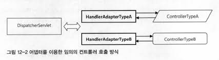

# Chapter 3. 스프링 웹 기술과 스프링 MVC
- 스프링은 기본적으로 기술의 변화가 잦은 웹 계층과 여타 계층을 깔끔하게 분리해서 개발하는 아키텍처 모델을 지지한다.
- 그 덕분에 스프링 애플리케이션이지만 웹 계층은 어떤 기술로 대체하더라도 아무런 문제가 없게 만들 수 있다.

## 3.1 스프링의 웹 프레젠테이션 계층 기술
- 스프링 애플리케이션 입장에서는 스프링 웹 기술을 사용하는 프레젠테이션 계층, 그 외의 기술을 사용하는 프레젠테이션 계층으로 나눌 수 있다.
- 1장에서 스프링은 의도적으로 서블릿 웹 애플리케이션의 컨텍스트를 두 가지로 분리해놓을것을 알게되었다.
- 웹 기술에서 완전히 독립적인 비즈니스 서비스 계층과 액세스 계층을 담은 루트 애플리케이션 컨텍스트와, 스프링 웹 기술을 기반으로 동작하는 웹 관련 빈을 담은 서블릿 애플리케이션 컨텍스트로 분리하였다.
- **이렇게 스프링 컨텍스트를 두가지로 분리한 이유는 스프링 웹 서블릿 컨텍스트를 통째로 다른 기술로 대체할 수 있도록 하기 위해서이다.**

### 3.1.1 스프링에서 사용되는 웹 프레임워크의 종류
#### 스프링 웹 프레임워크
**스프링 서블릿 / 스프링 MVC**
- 스프링이 직접 제공하는 서블릿 기반의 MVC 프레임워크이다.
- 프론트컨트롤러인 DispatcherServlet을 핵심 엔진으로 사용한다.
- 스프링 서블릿의 모든 컴포넌트는 스프링의 서블릿 애플리케이션 컨텍스트의 빈으로 등록되어 동작한다.
- 따라서 간단히 루트 컨텍스트에 존재하는 서비스 계층 빈을 사용할 수 있다.


**스트링 포틀릿**
- 스프링에서 제공하는 포틀릿 MVC 프레임워크이다.
- 포틀릿은 JSR-162, 286 자바 표준 기술로 서블릿과 유사한 컨테이너에서 동작한다.

#### 스프링 포트폴리오 웹 프레임워크
- 스프링 서블릿을 기반으로 하는 고급 웹 프레임워크의 종류에 대해 알아보자.
- 스프링 서블릿은 MVC 아키텍처를 따르는 웹 프레임워크를 구축할 수 있는 유연한 기반을 제공한다.
- 그러므로 @MVC이외에 스프링의 포트폴리오 프로젝트나 서드파티 업체를 통해 개발된 프레임워크도 다양하다.
- **스프링 서블릿의 개념과 확장 방법을 잘 이해하면, 자신의 환경에 맞는 전용 웹 프레임워크를 새롭게 만드는 일도 어렵지 않다.**

**Spring Web Flow**
- SWF라고 불리기도하며 스프링 웹 플로우는 스프링 서블릿을 기반으로 해서 상태 유지스타일의 웹 애플리케이션 작성을 하게 해주는 프레임워크이다.
- 컨트롤러를 직접 코드로 작성하지 않고 DSL을 이용해 웹 페이지의 흐름과 규칙을 지정해 상태 정보를 유지하는 고급 웹 애플리케이션도 손쉽게 개발이 가능하다.
- 주로  무상태 방식으로 개발되는 스프링 @MVC와 더불어 스프링의 웹 프레임워크의 양 축을 이루고 있는 프레임워크라고 볼 수 있다.

**Srping JavaScript**
**Srping Faces**
**Srping Web Service**
**Srping BlazeDs Intergration**


#### 스프링을 기반으로 두지 않는 웹 프레임워크
**JSP/Servlet**
- 기존에 만들어둿떤 모델 1 방식의 JSP나 서블릿을 스프링 애플리케이션의 웹 프레젠테이션 계층으로 사용할 수 있다.

**Struts1, 2**

### 3.1.2 스프링 MVC와 DispatcherServlet 전략
- 스프링을 사용하는 개발자는 스프링이 제공해준 MVC 프레임워크 위에 필요한 전략을 추가해서 사용할 수 있어야 한다.
- 스프링 MVC 프레임워크를 이미 완성된 고정적인 프레임워크로 보지 말고, 진행하려는  프로젝트의 특성에 맞게 빠르고 편리한 개발이 가능하도록 자신만의 웹 프레임워크를 만드는데 쓸 수 있는 도구라고 생각해야 한다.
- 이것이 스프링이 제공하는 가치를 누리며 스프링을 잘 사용할 수 있는 비결이다.

#### DispatcherServlet과 MVC 아키텍처
**(1) DispatcherServlet의 HTTP 요청 접수**
- 요청이 들어오면 프론트 컨트롤러인 DispatcherServlet이 요청을 받는다.
- 그 후 필요한 전처리 과정(Theme 정보, locale 정보)을 수행한다.

**(2) DispatcherServlet에서 컨트롤러로 HTTP 요청 위임**
- DispatcherServlet은 핸들러 매핑 전략을 이용해 핸들러를 탐색한다.
- 핸들러 매핑 전략인 이유는 DI의 가장 대표적인 용도라할 수 있는 전략 패턴이 활용되었기 떄문이다.
- 그러므로 DispatcherServlet의 핸들러 매핑 전략은 DispatcherServlet의 수정없이도 DI를 통해 얼마든지 확장가능하다.
- 그런데 DispatcherServlet이 매핑으로 찾은 컨트롤러를 가져와 실행하려면 컨트롤러 메서드를 어떻게 호출할지 알고 있어야 한다.
- DispatcherServlet에서 호출할 컨트롤러의 특정 인터페이스를 구현하는게 아닌 어댑터를 이용하여 특정 컨트롤러에 호출해야 할 때 해당 컨트롤러 타입을 지원하는 어댑터를 중간에 끼워서 호출하게 된다.
- 그렇기때문에 DispatcherServlet은 항상 일정한 방식으로 컨트롤러를 호출하고 결과를 받을 수 있다.



- DispatcherServlet은 컨트롤러가 어떤 메서드를 가졌고 어떤 인터페이스를 구현했는지 전혀 알지 못한다.
- 대신 컨트롤러 종류에 따라 적절한 어댑터를 사용하여 컨트롤러에 맞는 호출 방법을 이용해 작업을 요청하고 결과를 다시 반환받는 기법을 사용한다.
- DispatcherServlet이 핸들러 어댑터에 웹 요청을 전달할 때는 모든 웹 요청 정보가 담긴 HttpServletRequest 타입의 오브젝트를 전달해준다.
- 이를 어댑터가 적절히 변환해서 컨트롤러의 메서드가 받을 수 있ㅅ는 파라미터로 변환해서 전달해주는 것이다.
- 컨트롤러가 결괏값으로 돌려주는 대신 HttpServletResponse에 담을 수도 있기 떄문에 HttpServletResponse도 함께 전달한다.

**(3) 컨트롤러의 모델 생성과 정보 등록**
- MVC 패턴의 장점은 정보를 담고 있는 모델과 정보를 어떻게 뿌려줄지 알고 있는 뷰가 분리된다는 점이다.
- 같은 모델이지만 다른 뷰에 전달하면 다른 방식으로 정보가 출력될 것이다.
- 테이블 뷰에는 테이블, 그래프 뷰에는 그래프 모양처럼..
- 컨트롤러의 작업은 먼저 사용자의 요청을 해석하고, 그에 따른 실제 비즈니스 로직을 수행하도록 서비스계층에게 작업을 위임하고, 그 결과를 통해 적절하게 반환하는 것이다.
- REST API가 아닌 MVC패턴을 이용한 웹일 경우 DispatcherServlet에게 모델 정보와 뷰를 돌려줘야 한다.

**(4) 컨트롤러의 결과 리턴: 모델과 뷰**
- 모델과 뷰를 ModelAndView에 담아 DispatcherServlet에게 전달해주면 DispatcherServlet의 전략인 뷰 리졸바가 이를 이용해 뷰 오브젝트를 생성해준다.

**(5) DispatcherServlet의 뷰 호출과 (6)모델 참조**
- DispatcherServlet이 컨트롤러로부터 모델과 뷰를 받은 뒤에 진행하는 작업은, 뷰 오브젝트에게 모델을 전달해주고 클라이언트에게 돌려줄 최종 결과물을 생성해달라고 요청하는 것이다.
- 그리고 해당 모델의 정보를 뷰의 적절한 곳에 배치시켜준다.

**(7) HTTP 응답 돌려주기**
- 뷰 생성까지의 모든 작업을 마치면 DispatcherServlet은 등록된 후처리기가 있는지 확인 후 있다면 후처리를 수행하고 뷰가 만들어준 HttpServletResponse에 담긴 최종 결과를 서블릿 컨테이너에게 돌려준다.
- 서블릿 컨테이너는 HttpServletResponse에 담긴 정보를 HTTP 응답으로 만들어 사용자의 브라우저나 클라이언트에게 전송하고 작업을 종료한다.

#### DispatcherServlet의 DI 가능한 전략
- DispatcherServlet에서 요청을 처리하는 과정에는 많은 DI 전략이 적용된다.

**HandlerMapping**
- URL과 요청 정보를 기준으로 어떤 핸들러 오브젝트, 즉 컨트롤러를 사용할 것인지 결정하는 로직을 담당한다.
- DispatcherServlet은 하나이상의 HandlerMapping을 가질 수 있고 HandlerMapping을 구현하여 만들 수 있다.

**HandlerAdapter**
- 핸들러 매핑으로 선택한 핸들러를 DispatcherServlet이 호출할 때 사용하는 어댑터이다.

**HandlerExceptionResolver**
- 예외가 발생했을 때 이를 처리하는 로직을 갖고 있다.
- DispatcherServlet은 등록된 HandlerExceptionResolver 중에서 발생한 예외에 적합한 것을 찾아 예외처리를 위임한다.

**ViewResolver**
- 컨트롤러가 뷰 이름을 참고해서 적절한 뷰 오브젝트를 찾아주는 로직을 가진 전략 오브젝트이다.

**LocaleResolver**
- 지역정보를 결정해주는 전략이다.

**ThemeResolver**
- 테마를 가지고 이를 변경해서 사이트를 구성할 경우 쓸 수 있는 테마 정보를 결정해주는 전략이다.

**RequestToViewNameTranslator**
- 컨트롤러에서 뷰 이름이나 뷰 오브젝트를 제공해주지 않았을 경우 URL과 같은 요청정보를 참고해서 자동으로 뷰 이름을 생성해주는 전략이다.

> - 위의 모든 전략은 확장할 수 있도록 만들어진 확장 포인트이다.
> - DispatcherServlet은 서블릿 컨테이너가 생성하고 관리하는 오브젝트일 분 스프링의 컨텍스트에서 관리하는 빈 오브젝트가 아니다.
> - 따라서 직접 DispatcherServlet에게 DI할 수 없다.

---

## 3.2 스프링 웹 애플리케이션 환경 구성
- 서비스, 데이터 액세스 계층의 코드는 실행환경에서 독립적으로 만들기 쉽다.
- 반면 웹 프레젠테이션 계층은 최소한 서블릿 컨테이너가 제공되는 서버환경이 있어야 한다.

#### 스프링 웹 프로젝트 검증
**핸들러 어댑터: SimpleControllerHandlerAdapter**
- SimpleControllerHandlerAdapter는 Controller 인터페이스를 구현한 핸들러/컨트롤러를 사용한다.

```java
@FunctionalInterface
public interface Controller {

	@Nullable
	ModelAndView handleRequest(HttpServletRequest request, HttpServletResponse response) throws Exception;

}
```
- HttpServletRequest, Response를 전달받아 ModelAndView로 반환해주는 것을 알 수 있다.
- 컨트롤러는 서블릿 애플리케이션 컨텍스트 안에 빈으로 등록되므로 당연히 DI를 이용할 수 있다.

**핸들러 매핑: BeanNameUrlHandlerMapping**
- BeanNameUrlHandlerMapping은 컨트롤러를 빈을 등록할 때 빈의 이름에 매핑할 URL을 넣어준다.
- 컨트롤러를 구현한 컨트롤러를 만들고 서블릿 컨텍스트에 아래와 같이 xml을 설정할 수 있을 것이다.

```xml
<context:anntation-config />
<bean name="/hello" class="ch3.step1.HelloController"/>
```

### 3.2.2 스프링 웹 학습 테스트
- 서버에 배치하지 않은채 스프링 MVC의 기능을 테스트할 수 있는 방법을 알아보자.
- 서블릿이 서버 밖에서 테스트하기가 쉽지 않은 이유는 유사한 환경정보를 담은 오브젝트들을 구성해야하고, 컨테이너가 브라우저에서 받는 사용자의 요청을 해석해서 만들어주는 HttpServletRequest와 결과를 저장할 HttpServletResponse도 필요하기 떄문이다.
- 스프링은 서블릿을 직접 테스트할 때 사용할 수 있는 각종 서블릿 기술 오브젝트들을 제공해준다.

#### 서블릿 테스트용 목 오브젝트
```Java
public class SimpleGetServlet extends HttpServlet {
    @Override
    protected void doGet(HttpServletRequest req, HttpServletResponse resp) throws ServletException, IOException {
        String name = req.getParameter("name");

        resp.getWriter().println("<HTML><BODY>");
        resp.getWriter().println("Hello " + name);
        resp.getWriter().println("</HTML></BODY>");

    }
}
```
- 우선 테스트를 하기 위한 서블릿을 하나 정의한다.

```Java
@Test
void mockServlet() throws Exception{
    MockHttpServletRequest req = new MockHttpServletRequest("GET", "/hello");
    req.addParameter("name", "Spring");

    MockHttpServletResponse res = new MockHttpServletResponse();

    SimpleGetServlet simpleGetServlet = new SimpleGetServlet();
    simpleGetServlet.service(req, res);

    assertThat(res.getContentAsString()).isEqualTo("<HTML><BODY>Hello Spring</BODY></HTML>");
    assertThat(res.getContentAsString().contains("Hello Spring")).isTrue();
}
```
- 이런식으로 목 요청, 응답을 만들어 해당 서블릿을 테스트할 수 있다.
- MockSession, ServletConfig, ServletContext등 다양한 Mock 객체를 스프링이 지원해준다.
- 스프링의 서블릿 테스트용 목 오브젝트에서 아직은 지원되지 않는게 하나 있다.
- 서블릿에서 JSP로 포워딩하는 경우 JSP 지원 서블릿을 호출해 그 결과를 가져오는건 불가능하다.
- JSP 서블릿과 엔진 자체가 복잡하고 다른 서버에 종속적인 라이브버리이기 때문이다.
- 그런데 과연 뷰의 생성 내용, 즉 HTML까지 꼭 검증해야 하는지는 한 번쯤 생각해볼일이다.
- 스프링 MVC의 컨트롤러가 리턴하는 것은 정보가 담긴 모델과 이를 출력해줄 뷰에 관한 정보다.
- 대부분의 경우는 뷰가 모데을 이용해서 생성하는 최종 결과를 확인하는 대신, 컨트롤러가 어떤 모델과 뷰 정보를 리턴했는지 검증하는 것으로 충분하다.

#### 테스트를 위한 DispatcherServlet 확장
- DispatcherServlet을 테스트하려면 DispatcherServlet의 디폴트 설정을 최대한 사용한다고 해도 준비할게 재법 많다.
- DispatcherServlet이 서블릿 애프릴케이션 컨텍스트를 초기화할 수 있도록 WEB=INF 밑에 '서블릿이름-servlet.xml'이라는 이름을 가진 설정파일을 준비해줘야 한다.
- 테스트에서 간단한 방법으로 서블릿 컨텍스트를 설정해줄 수 있도록 DispatcherServlet을 확장해서 사용하면 편리하다.
- DispatcherServlet을 상속해서 컨텍스트 초기화 기능과 편리한 설정 기능을 추가한 테스트용 DispatcherServlet확장 클래스이다.

```Java
public class ConfigurableDispathcerServlet extends DispatcherServlet {

    // 설정 방법을 확장하여 클래스와 XML 파일 두 가지 방법 모두를 지원한다.
    private Class<?>[] classes;
    private String[] locations;

    // 컨트롤러가 DispatcherServlet에게 돌려주는 ModelAndView정보를 저장해서 테스트에서 확인한다.
    private ModelAndView modelAndView;

    public ConfigurableDispathcerServlet(Class<?>[] classes) {
        this.classes = classes;
    }

    public ConfigurableDispathcerServlet(String[] locations) {
        this.locations = locations;
    }

    public void setLocations(String[] locations) {
        this.locations = locations;
    }

    // 주어진 클래스로부터 상대적인 위치의 클래스패스에 있는 설정파일을 지정할 수 있게 해준다.
    public void setRelativeLocations(Class clazz, String... relativeLocations) {
        String[] locations = new String[relativeLocations.length];
        String currentPath = ClassUtils.classPackageAsResourcePath(clazz) + "/";

        for (int i = 0; i < relativeLocations.length; i++) {
            locations[i] = currentPath + relativeLocations[i];
        }
        this.setLocations(locations);
    }

    public void setClasses(Class<?>... classes) {
        this.classes = classes;
    }

    public void service(ServletRequest req, ServletResponse res) throws ServletException, IOException {
        modelAndView = null;
        super.service(req, res);
    }

    // DispatcherServlet의 서블릿 컨텍스트를 생성하는 메서드를 오버라이드하여 테스트용 메타정보를 이용해 서블릿 컨텍스트를 생성
    @Override
    protected WebApplicationContext createWebApplicationContext(ApplicationContext parent) {
        AbstractRefreshableWebApplicationContext wac = new AbstractRefreshableWebApplicationContext() {

            @Override
            protected void loadBeanDefinitions(DefaultListableBeanFactory beanFactory) throws BeansException, IOException {
                if (locations != null) {
                    XmlBeanDefinitionReader xmlReader = new XmlBeanDefinitionReader(beanFactory);
                    xmlReader.loadBeanDefinitions(locations);
                }

                if (classes != null) {
                    AnnotatedBeanDefinitionReader reader = new AnnotatedBeanDefinitionReader(beanFactory);
                    reader.register(classes);
                }
            }
        };
        wac.setServletContext(getServletContext());
        wac.setServletConfig(getServletConfig());
        wac.refresh();

        return wac;
    }

    // 뷰를 실행하는 과정을 가로채서 컨트롤러가 돌려준 ModelAndView 정보를 따로 저장한다.
    // 이를 테스트에서 활용할 수 있다.
    @Override
    protected void render(ModelAndView mv, HttpServletRequest request, HttpServletResponse response) throws Exception {
        this.modelAndView = mv;
        super.render(mv, request, response);
    }

    public ModelAndView getModelAndView() {
        return modelAndView;
    }
}
```
- ConfigurableDispathcerServlet 클래스는 이름 그대로 테스트 환경에서 DispatcherServlet이 만드는 서블릿 컨텍스트를 자유롭게 설정할 수 있게 해준다.
- 그리고 ModelAndView를 가로채서 가지고 있기 때문에 이를 테스트할 수 있게 해준다.

#### ConfigurableDispathcerServlet을 이용한 스프링 MVC 테스트
```Java
@Test
void controller() throws Exception{
    ConfigurableDispatcherServlet servlet = new ConfigurableDispatcherServlet();

    // 서블릿 컨텍스트를 지정하고 클래스들도 직접 지정해준다.
    servlet.setRelativeLocations(getClass(), "spring-servlet.xml");
    servlet.setClasses(HelloSpring.class);

    // mockConfig로 초기화 해준다.
    servlet.init(new MockServletConfig("spring"));

    MockHttpServletRequest req = new MockHttpServletRequest("GET", "/hello");
    req.addParameter("name", "Spring");
    MockHttpServletResponse res = new MockHttpServletResponse();

    // /hello로 요청을 보내면 HelloController가 실행될 것이다.
    servlet.service(req, res);

    // 컨트롤러가 실행될 떄의 ModelAndView이다
    ModelAndView modelAndView = servlet.getModelAndView();
    assertThat((String) modelAndView.getModel().get("message")).isEqualTo("Hello Spring");
}
```
- 이렇게 ConfigurableDispatcherServlet와 같이 DispatcherServlet을 확장한다면 테스트를 위한 DispatcherServlet을 만들 수도 있다.
- ConfigurableDispatcherServlet은 원하는 서블릿 컨텍스트를 지정하여 테스트를 할 수 있다.
- DispatcherServlet 전략과 상관없이 컨트롤러 클래스의 로직을 테스트하는게 목적이라면 컨트롤러에서 바로 요청을 보내 검증할 수도 잇다.

#### 편리한 DispatcherServlet 테스트를 위한 AbstractDispatcherServletTest
- ConfigurableDispatcherServlet을 이용한 테스트를 작성하고 검증하는 일이 간단하진 않다.
- 단순한 기능을 테스트하는 데도 준비할 게 많고 테스트 코드가 길어진다.
- 테스트를 지원하는 클래스인 AbstractDispatcherServletTest를 만들 수 있다.

```Java
public interface AfterRunService {
    String getContentAsString() throws UnsupportedEncodingException;

    WebApplicationContext getContext();

    <T> T getBean(Class<T> beanType);

    ModelAndView getModelAndView();

    AfterRunService assertViewName(String viewName);

    AfterRunService assertModel(String name, Object value);
}
```
- 검증과 검증을 위한 값들을 가져오기 위한 인터페이스를 정의한다.
- DispatcherServlet의 runService가 호출된 난 후 사용될 것들이다.


```Java
public class AbstractDispatcherServletTest implements AfterRunService {
    protected MockHttpServletRequest request;
    protected MockHttpServletResponse response;
    protected MockServletConfig config = new MockServletConfig("Spring");
    protected MockHttpSession session;

    private ConfigurableDispatcherServlet dispatcherServlet;

    // 설정 메타정보는 클래스, 클래스패스, 상대 클래스패스로 지정할 수있다
    private Class<?>[] classes;
    private String[] locations;
    private String[] relativeLocations;

    private String servletPath;

    public AbstractDispatcherServletTest setLocations(String... location){
        this.locations = location;
        return this;
    }

    public AbstractDispatcherServletTest setRelativeLocations(String... relativeLocations){
        this.relativeLocations = relativeLocations;
        return this;
    }

    public AbstractDispatcherServletTest setClasses(Class<?>... classes){
        this.classes = classes;
        return this;
    }

    public AbstractDispatcherServletTest setServletPath(String servletPath){
        if (this.request == null){
            this.servletPath = servletPath;
        }
        else{
            this.request.setServletPath(servletPath);
        }
        return this;
    }

    public AbstractDispatcherServletTest initRequest(String requestUri, String method){
        this.request = new MockHttpServletRequest(method, requestUri);
        this.response = new MockHttpServletResponse();
        if (this.servletPath != null) this.setServletPath(this.servletPath);
        return this;
    }

    public AbstractDispatcherServletTest initRequest(String requestUri, RequestMethod method){
        return this.initRequest(requestUri, method.toString());
    }

    public AbstractDispatcherServletTest initRequest(String requestUri){
        return this.initRequest(requestUri, RequestMethod.GET);
    }

    public AbstractDispatcherServletTest addParameter(String name, String value){
        if (this.request == null){
            throw new IllegalStateException("request가 초기화 되지 않았습니다");
        }
        this.request.addParameter(name, value);
        return this;
    }

    public AbstractDispatcherServletTest buildDispatcherServlet() throws ServletException {
        if (this.classes == null && this.locations == null && this.relativeLocations == null){
            throw new IllegalStateException("classes와 lcoations 중 하나는 설정되어야 합니다");
        }
        this.dispatcherServlet = new ConfigurableDispatcherServlet();
        this.dispatcherServlet.setClasses(this.classes);
        this.dispatcherServlet.setLocations(this.locations);
        if(this.relativeLocations != null){
            this.dispatcherServlet.setRelativeLocations(getClass(), this.relativeLocations);
        }
        this.dispatcherServlet.init(this.config);
        return this;
    }

    public AbstractDispatcherServletTest runService() throws ServletException, IOException{
        if (this.dispatcherServlet == null) buildDispatcherServlet();
        if (this.request == null){
            throw new IllegalStateException("request가 준비되지 않았습니다.");
        }
        this.dispatcherServlet.service(this.request, this.response);
        return this;
    }

    public AbstractDispatcherServletTest runService(String requestUri) throws ServletException, IOException{
        initRequest(requestUri);
        runService();
        return this;
    }

    @Override
    public String getContentAsString() throws UnsupportedEncodingException {
        return this.response.getContentAsString();
    }

    @Override
    public WebApplicationContext getContext() {
        if (this.dispatcherServlet == null)
            throw new IllegalStateException("DispatcherServlet이 준비되지 않았습니다.");
        return this.dispatcherServlet.getWebApplicationContext();
    }

    @Override
    public <T> T getBean(Class<T> beanType) {
        if (this.dispatcherServlet == null)
            throw new IllegalStateException("DispatcherServlet이 준비되지 않았습니다.");
        return getContext().getBean(beanType);
    }

    @Override
    public ModelAndView getModelAndView() {
        return this.dispatcherServlet.getModelAndView();
    }

    @Override
    public AfterRunService assertViewName(String viewName) {
        assertThat(this.getModelAndView().getViewName()).isEqualTo(viewName);
        return this;
    }

    @Override
    public AfterRunService assertModel(String name, Object value) {
        assertThat(this.getModelAndView().getModel().get(name)).isEqualTo(value);
        return this;
    }
}
```
- AfterRunService를 구현하여 테스트용 AbstractDispatcherServletTest를 만들었다.

```Java
public class SimpleControllerTest extends AbstractDispatcherServletTest {
    @Test
    void helloController() throws Exception{
        setRelativeLocations("spring-servlet.xml")
                .setClasses(HelloSpring.class)
                .initRequest("/hello", RequestMethod.GET)
                .addParameter("name", "Spring")
                .runService()
                .assertModel("message", "Hello Spring")
                .assertViewName("/WEB-INF/view/hello.jsp");

        setRelativeLocations("spring-servlet.xml")
                .setClasses(HelloSpring.class)
                .initRequest("/hello") // 디폴트는 GET 메서드이다.
                .addParameter("name", "Spring")
                .runService()
                .assertModel("message", "Hello Spring")
                .assertViewName("/WEB-INF/view/hello.jsp");

        setRelativeLocations("spring-servlet.xml")
                .setClasses(HelloSpring.class)
                .runService("/hello") // 추가할 파라미터가 없다면 runService에 Uri를 설정하여도 무방
                .assertModel("message", "Hello Spring")
                .assertViewName("/WEB-INF/view/hello.jsp");
    }
}
```
- AbstractDispatcherServletTest를 활용하면 매우 깔끔하게 테스를 진행할 수 있다.

---

## 3.3 컨트롤러
- 컨틀롤러는 MVC 패턴에서 가장 큰 책임을 지고있다.
- 서블릿이 넘겨주는 HTTP 요청은 HttpServletRequest 오브젝트에 담겨 있다.
- 컨트롤러가 이를 이용해 사용자의 요청을 파악하려면 클라이언트의 다양한 정보를 참고해야 한다.
- 요청을 추출하고 해당 요청이 올바른지도 검증해야할 것이고, 검증 혹은 서비스에게 위임한 작업의 예외가 발생하면 예러 처리도 해주어야 한다.
- 파일을 전송, 수신할 때에는 파일을 저장해야할 필요도 있다.
- 만약 애플리케이션 성격상 컨트롤러의 역할이 크다면 책임의 성격과 특징, 변경 사유 등을 기준으로 세분화해줄 필요가 있다.
- 스프링 MVC가 컨트롤러 모델을 미리 제한하지 않고 어댑터 패턴을 사용해서라도 컨트롤러의 정류를 필요에 따라 확장할 수 있도록 만든 이유가 바로 이 때문이다.

### 3.3.1 컨트롤러의 종류와 핸들러 어댑터
- 각 컨트롤러를 DispatcherServlet에 연결해주는 핸들러와 핸들러 어댑터의 종류는 네 가지이다.
- SimpleServletHandlerAdapter를 제외한 세 개는 디폴트 전략으로 설정되어 있다.

#### Servlet과 SimpleServletHandlerAdapter
- 첫 번째 컨트롤러 타입은 바로 표준 서블릿이다.
- 표준 서블릿 클래스를 스프링 MVC의 컨트롤러로 사용할 수 있다.
- 장점은 서블릿 클래스 코드를 그대로 유지하면서 스프링 빈으로 등록된다는 것이다.
- 서블릿 코드를 점진적으로 스프링 애플리케이션에 맞게 포팅할 때 유용하다.
- 단 서블릿이 컨트롤러 빈으로 등록된 경우엔 자동으로 init(), destroy()와 같은 생명주기 메서드가 호출되지 않는다.

```Java
@Component("/hello") // 빈은 테스트에서 등록해주지만 name을 통해 url 매핑을 위해 사용
public class HelloServlet extends HttpServlet {
    @Override
    protected void doGet(HttpServletRequest req, HttpServletResponse resp) throws ServletException, IOException {
        String name = req.getParameter("name");
        resp.getWriter().print("Hello " + name);
    }
}
```
- 서블릿을 하나 정의한다.

```Java
class HelloServletTest extends AbstractDispatcherServletTest{
    @Test
    void helloServletController() throws Exception{
        String str = setClasses(SimpleServletHandlerAdapter.class, HelloServlet.class)
                .initRequest("/hello")
                .addParameter("name", "Spring")
                .runService()
                .getContentAsString();
        assertThat(str).isEqualTo("Hello Spring");
    }
}
```
- AbstractDispatcherServletTest를 통해 간단하게 테스트를 진행할 수 있다.
- SimpleServletHandlerAdapter, HttpServlet을 빈으로 등록 후 테스트를 진행하였다.

#### HttpRequestHandler, HttpRequestHandlerAdapter
- 서블릿 스펙을 준수할 필요 없이 HTTP 프로토콜 기반으로 한 전용 서비스를 만들 때 사용할 수 있다.

#### Controller, SimpleControllerHandlerAdapter
- Controller는 위에서 본거처럼 DispatcherServlet이 컨트롤러와 주곱받는 정보 그대로 메서드 파라미터와 리턴값을 가지고 있다.
- 스프링 3.0의 애노테이션과 관례를 이용한 컨트롤러가 등장하기 전까지는 이 Controller를 많이 사용하였다.

#### AnnotationMethodHandlerAdapter
- 현재 대부분 사용하는 애노테이션 기반의 컨트롤러 어댑터이다.
- 해당 컨트롤러는 특정 인터페이스를 구현한 컨트롤러만을 지원하는게 아닌 타입에 재한이 없어 모든 컨트롤러에게 적용이 가능하다.
- 그리고 메서드 단위로 url 매핑이 이우러지는 장점이 존재한다.

#### 기반컨트롤러 만들기
- 기반 컨트롤러를 만들어 모든 컨트롤러가 이 기반 컨트롤러를 상속받아 편리하게 파라미터와 뷰네임을 설정할 수 있도록 해보자.

```Java
@Setter
public abstract class SimpleControllerV1 implements Controller {
    private String[] requiredParams;
    private String viewName;


    @Override
    final public ModelAndView handleRequest(HttpServletRequest request, HttpServletResponse response) throws Exception {
        if(viewName == null) throw new IllegalStateException();

        Map<String, String> params = new HashMap<>();

				// 필요한 파라미터를 가져와 맵에 담는다. 없다면 예외를 던진다.
        for (String param : requiredParams) {
            String value = request.getParameter(param);
            if (value == null) throw new IllegalStateException();
            params.put(param, value);
        }

        Map<String, Object> model = new HashMap<>();

				// 개별 컨트롤러가 구현한 메서드를 호출한다.
        this.control(params, model);

        return new ModelAndView(this.viewName, model);
    }

    public abstract void control(Map<String, String> params, Map<String, Object> model) throws Exception;
}
```
- 개별 컨트롤러에서 세팅하는 뷰네임과 파라미터를 이용하여 ModelAndView를 만들 수 있다.
- 템플릿 메서드 패턴을 통해 params와 model을 넘겨줬을 떄 개별 컨트롤러가 원하는 기능을 구현할 수 있다.

```Java
class HelloControllerV1 extends SimpleControllerV1{

    public HelloControllerV1() {
        this.setRequiredParams(new String[]{"name"});
        this.setViewName("/WEB-INF/view/hellp.jsp");
    }

    @Override
    public void control(Map<String, String> params, Map<String, Object> model) throws Exception {
        model.put("message", "Hello " + params.get("name"));
    }
}
```


## 3.3.2 핸들러 매핑
- 핸들러 매핑은 HTTP 요청정보를 이용ㅎ 이를 처리한 핸들러 오브젝트인 컨트롤러를 찾아주는 기능을 가진 DispatcherServlet의 전략이다.
- 핸들러 매피은 타입과 상관없으며 하나의 매핑전략이 여러 타입의 컨트롤러를 선택할 수 있다.
- 디폴트로는 BeanNameUrlHandlerMapping, DefaultAnnotationHandlerMapping이 존재하고 이외에도 3가지가 추가로 존재한다.

**BeanNameUrlHandlerMapping**
- 빈의 이름에 들어있는 URL을 HTTP 요청의 URL과 비교해서 일치하는 빈을 찾아준다.
- 딜포트 전략이며, 빠르고 쉽게 URL 매핑정보를 지정할 수 있으나 컨트롤러가 많아진다면 URL 정보가 XML 빈 선언이나 크래스의 애노테이션 등에 분산되어 나타나므로 전체적인 매핑구조를 한눈에 파악하고 관리하기 힘들다.

**ControllerBeanNameHandlerMpping**
- 빈의 아이디나 빈의 이름을 이용해 매핑해주는 전략이다.
- 빈 아이디는 규칙상 /기호를 사용할 수 없으나 ControllerBeanNameHandlerMpping이 자동으로 반아이디에 /를 붙여준다.
- 이를 사용하기 위해선은 빈으로 등록해주어야 한다. 그럴경우 디폴트인 두 가지의 매핑전략은 적용되지 않는다.

**ControllerClassNameHandlerMapping**
- 빈 이름 대신 클래스 이름을 URL에 매핑해주는 핸들러 매핑 클래스이다.

**SimpleUrlHandlerMapping**
- BeanNameUrlHandlerMapping은 빈 이름에 매핑정보를 넣기 떄문에 매핑정보를 관리하기 불편하다.
- SimpleUrlHandlerMapping은 URL과 컨트롤러의 매핑정보를 한곳에 모아놓을 수 있는 핸들러 매핑전략이다.
- SimpleUrlHandlerMapping을 빈으로 등록할 때 프로퍼티에 값들을 넣어준다.
- 설정 정보들이 한곳에 모여  있기 때문에 URL을 관리하기 편리하다는 장점이 존재하므로 대규모프로젝트에서는 SimpleUrlHandlerMapping을 선호학도 한다.
- 단점으로는 매핑할 정보를 직접 적어야 하므로 오타등의 위허이 있다.

**DefaultAnnotationHandlerMapping**
- @RequestMapping이라는 애노테이션을 컨트롤러 클래스나 메서드에 직접부여하고 이를 이용해 매핑하는 전략이다.
- @RequestMapping은 메서드 단위로 URL을 매핑해줄 수 있어 컨트롤러의 개수를 획기적으로 줄일 수 있다.


**기타 공통 설정정보**
- order
	- 핸들러 매핑은 한 개 이상을 동시에 이용할 수 있으므로 순서를 정할떄 사용한다.
- defaultHandler
	- 핸들러 매핑 빈의 defaultHandler 프로퍼티를 지정해두면 URL을 매핑할 대상을 찾지 못했을 경우 자동으로 디폴트 핸들러를 선택해준다.
	- 404 에러대신 디폴트 핸들러로 넘겨서 친절한 안내 메시지를 뿌려주는 것이 좋은 방법이다.

**detectHandlerAncestorContexts**
- 핸들러 매핑은 특이하게 서블릿 컨텍스트 안에서만 매핑할 컨트롤러를 찾이 애플리케이션 컨텍스트까지 찾지 않는다.
- detectHandlerAncestorContexts가 false로 선언되어있기 떄문이다.
- 웹 환경에 종속적인 컨트롤러 빈은 서블릿 컨텍스트에만 두는 것이 바람직 하기 때문이다.

### 3.3.3 핸들러 인터셉터
- 핸들러 인터셉터는 DispatcherServlet이 컨트롤러를 호출하기 전, 후에 요청과 응답을 참조하거나 가공할 수 있는 필터이다.
- 핸들러 매핑의 역할은 URL로부터 컨트롤러만 찾아주는 것이 아니다. 핸들러 매핑은 DispatcherServlet으로부터 매핑 작업을 요청받으면 그 결과로 핸들러 실행 체인(HandlerExecutionChain)을 돌려준다.
- 이 핸들러 실행 체인은 하나 이상의 핸들러 인터셉터를 거쳐 컨트롤러가 실행될 수 있도록 구성되어 있다.

**HandlerInterceptor**
- HandlerInterceptor 인터페이스를 구현하여 만들면된다.

```Java
public interface HandlerInterceptor {

	default boolean preHandle(HttpServletRequest request, HttpServletResponse response, Object handler)
			throws Exception {

		return true;
	}

	default void postHandle(HttpServletRequest request, HttpServletResponse response, Object handler,
			@Nullable ModelAndView modelAndView) throws Exception {
	}

	default void afterCompletion(HttpServletRequest request, HttpServletResponse response, Object handler,
			@Nullable Exception ex) throws Exception {
	}
}
```
- preHandle은 말 그대로 컨트롤러가 호출(핸들)되기 전에 실행된다.
	- 파라미터중 handler 파라미터는 핸들러 매핑이 찾아준 컨트롤러 빈 오브젝트가 된다.
	- retrun값이 true라면 핸들러 실행 체인의 다음 단계로 실행되나 false라면 중단한다.
- postHandle은 컨트롤러가 처리되고 난 후에 호출된다.
	- 파라미터 중 하나인 ModelAndView 타입의 정보가 제공되므로 컨트롤러 작업 결과를 참조하거나 조작할 수 있게 된다.
- afterCompletion메서드는 이름 그대로 모든 뷰에서 최종결과를 생성하는 일을 포함한 모든 작업을 완료된 후에 실행된다.

**핸들러 인터셉터 적용**
- 핸들러 인터셉터를 사용하기 위해서는 빈으로 등록후 Config설정을 해주도록 하자.

### 3.3.4 컨트롤러 확장
- 새로운 컨트롤러를 직접 설계할 수도 있다.
- 현재 Controller를 이용해 만든 기반 컨트롤러에는 하나의 단점이 존재한다.
- 그것은 개별 컨트롤러가 특정 클래스를 상속하도록 강제한다는 점이다.
- 거추장스러운 클래스 상속보다는 인터페이스를 구현하는 깔끔한 방법으로 컨트롤러를 만들고 싶을 수 도 있다.
- 이럴경우 핸들러 어댑터를 직접 구현해서 아예 새로운 컨트롤러 타입을 도입하는 방법을 고려해봐야 한다.
- 스프링 MVC의 유연성을 가장 잘 드러내는 부분은 바로 컨트롤러 타입에 제한이 없다는 것이다.


```Java
public interface HandlerAdapter {
	boolean supports(Object handler);

	@Nullable
	ModelAndView handle(HttpServletRequest request, HttpServletResponse response, Object handler) throws Exception;

	long getLastModified(HttpServletRequest request, Object handler);
}
x
```
- HandlerAdapter 인터페이스는 단순하다. supports() 메서드는 특정 타입의 컨트롤러를 지원하는지 확인해준다.
- DispatcherServlet은 이 메서드를 이용해 어떤 핸드러 어댑터에게 어떤 컨트롤러 오브젝트의 실행을 맡길 수 있는지 알아낼 수 있다.
- 실제 호출은 handle() 메서드를 통해 일어난다.
- Object 타입으로 전달받은 컨트롤러 오브젝트를 적절한 컨트롤러 타입으로 캐스팅해서 실행해준다.
- 그 과정에서 HttpServletRequest로부터 필요한 정보를 가져와 컨트롤러에게 전달할 파라미터를 준비하느 것과 컨트롤러가 리턴한 정보를 DispatcherServlet이 인식할 수 있은 ModelAndView로 만들어주는 작업도 수행한다.
- getLastModified는 최정 변경시간을알려준다.

**커스텀 컨트롤러 인터페이스와 핸들러 어댑터 개발**
- 앞서 Controller이넡페이스를 구현 해 만들었던 기반 컨트롤러인 SimpleController를 이번에는 핸들러 어댑터를 이용해 호출 가능한 인터페이스로 정의해서 독자적인 컨트롤러 인터페이스로 만들어보자.
- 기존의 SimpleController는 모든 클래스가 상속할 기반 클래스이므로 viewName, requiredParams 같은 공통 프로퍼티를 정의해놓을 수 있었다.
- 하지만 인터페이스로 정의하는 새로운 컨트롤러 타입에는 그런 방식을 사용할 수 없다.
- 그래서 대신 관례를 만들어 비슷한 설정을 가능하게 해보자.

```Java
public interface SimpleController {
    void control(Map<String, String> params, Map<String, Object> model);
}
```
- SimpleController는 control메서드만 가진다.
- 개별 컨트롤러에서 이 설정 정보를 지정하게 하기위해서는 애노테이션이 적절하게 사용될 수 있다.

```Java
@Retention(RetentionPolicy.RUNTIME)
@Inherited
public @interface ViewName {
    String value();
}

@Retention(RetentionPolicy.RUNTIME)
@Inherited
public @interface RequiredParams {
    String[] value();
}
```
- 우선 사용할 애노테이션들을 정의한다.
- viewName은 String, requiredParams은 String 배열을 값으로 가지고 있다.
- 이제 이 애노테이션이 viewName, RequiredParams의 정보를 가지고 있는 관례를 적용할것이므로 필요한 정보를 구현 컨트롤러에 넣어주기만 하면된다.

```Java
public class HelloController implements SimpleController {
    @ViewName("/WEB-INF/view/hello.jsp")
    @RequiredParams({"name"})
    @Override
    public void control(Map<String, String> params, Map<String, Object> model) {
        model.put("message", "Hello " + params.get("name"));
    }
}
```
- 애노테이션과 SimpleController인터페이스를 이용하여 HelloController를 구현하였따.
- 이전에 SimpleController클래스를 통해 구현한 HelloController보다 훨씬 깔끔한것을 알 수 있다.
- 이제 핸들러 어댑터를 구현해보자.


```Java
public class SimpleHandlerAdapter implements HandlerAdapter {
    @Override
    public boolean supports(Object handler) {
        return (handler instanceof SimpleController);
    }

    @Override
    public ModelAndView handle(HttpServletRequest request, HttpServletResponse response, Object handler) throws Exception {
        Method m = ReflectionUtils.findMethod(handler.getClass(), "control", Map.class, Map.class);

        ViewName viewName = AnnotationUtils.getAnnotation(m, ViewName.class);
        RequiredParams requiredParams = AnnotationUtils.getAnnotation(m, RequiredParams.class);

        Map<String, String> params = new HashMap<>();
        for (String param : requiredParams.value()) {
            String value = request.getParameter(param);
            if (value == null) throw new IllegalStateException();
            params.put(param, value);
        }

        Map<String, Object> model = new HashMap<>();
        ((SimpleController) handler).control(params, model);

        return new ModelAndView(viewName.value(), model);
    }

    @Override
    public long getLastModified(HttpServletRequest request, Object handler) {
        return -1;
    }
}
```
- Reflect을 통해 control 메서드를 가져온 후 해당 애노테이션들을 읽어 애노테이션 값들을 이용해 작업을 수행할 수 있다.
- 이제 이 HandlerAdapter를 빈으로 등록해주면 DispatcherServlet은 핸들러 매핑에서 HelloController를 찾은 후 DispatcherServlet은 혀내 등록된 모든 핸들러 어댑터의 supports()를 호출하여 처리할 수 있는 핸들러인지 확인한 후 이를 처리하게 될 것이다.

```Java
public class HandlerAdapterTest extends AbstractDispatcherServletTest{
	@Test
	void simpleHandlerAdapter() throws ServletException, IOException{
			setClasses(SimpleHandlerAdapter.class, HelloController.calss);
			initRequest("/hello").addParameter("name", "Spring").runService();
			assertViewName("/WEB-INF/view/hello.jsp");
			assertModel("message", "Spring");
		}
}
```
- 테스트는 문제 없이 작동할 것이다.
- 스프링 3.0부터는 애노테이션 방식의 핸들러 어댑터가 있어 매우 유연한 방식으로 컨트롤러를 작성할 수 있다.
- 구조를 살펴보면 복잡하겠지만 기본적인 개념과 구현방법은 SimpleHandlerAdapter와 다를바가 업다.

> - 프레임워크 개발이란 이미 있는 기술을 조햅해서 어떻게 쓸지 결정하고, 툴이나 공통 모듈정도를 만들어 놓는것이 아니다.
> - 프레임워크란 애플리케이션의 코드가 효율적인 방법으로 개발돼서 사용될 수 있도록 새로운 틀(framework)을 만드는 작업이다.

---

## 3.4 뷰
- 뷰는 MVC 아키텍처에서 모델이 가진 정보를 어떻게 표현해야하는지에 대한 로직을 가지고 있는 컴포넌트다.
- 컨트롤러가 작업을 마친 후 뷰 정보를 ModelAndView 타입 오브젝트에 담아 DispatcherServlet에게 돌려주는 방법은 두개이다.
- 첫 째는 Vuew 타입의 오브젝트를, 둘 때는 뷰 이름을 돌려주는 것이다.

### 3.4.1 뷰
- DispatcherServlet이 사용하는 뷰 오브젝트 인터페이스는 아래와 같다.

```Java
public interface View {
	String RESPONSE_STATUS_ATTRIBUTE = View.class.getName() + ".responseStatus";
	String PATH_VARIABLES = View.class.getName() + ".pathVariables";
	String SELECTED_CONTENT_TYPE = View.class.getName() + ".selectedContentType";

	@Nullable
	default String getContentType() {
		return null;
	}

	void render(@Nullable Map<String, ?> model, HttpServletRequest request, HttpServletResponse response)
			throws Exception;

}
```
- 타입정보는 제공해주는 getContentType, 메서드 모델을 전달받아 클라이언트에게 돌려줄 결과물을 만드는 render 메서드로 구성된다.
- 보통 View를 직정 구현해서 만들 필요가 없다. 스프링에서 자주사용되는 뷰를 이미 구현해놓았기 때문이다.
- 뷰를 사용하는 방법은 두 가지가 있다.
- 하나는 스프링이 제공하는 기반 뷰 클래스를 확장해서 코드로 뷰를 만드는 방법이다.
- 엑셀, PDF 같은 뷰는 콘텐트를 생성하는 API를 이용해서 뷰 로직을 작성해야 한다.
- 또 다른 방법은 스프링이 제공하는 뷰를 활용하데 뷰 클래스 자체를 상속하거나 코드를 작성하지 않고 JSP나 프리마커 같은 템플릿 파일을 사용해서 모델을 자동으로 뷰로 전환하는 로직을 적용하는 방법이다.

**InternalResourceView와 JstlView**
- RequestDispatcher의 forward()나 include()를 이용하는 뷰이다.
- forward, include는 다른 서블릿을 실행해서 그 결과를 현재 서블릿의 결과로 사용하거나 추가하는 방식이다.

**RedirectView**
- HttpServletResponse의 sendRedirect를 호출해주는 기능을 가진 뷰이다.
- 따라서 실제 뷰가 생성되는게 아니고 다른페이지로 리다이엑트될 때 생성되는 뷰이다.
- 직접 오브젝트를 만들 수 있지만 redirect:/main와 같이 redirect: 접두어를 활용할 수 있다.

**VelocityView, FreeMarkerView**
- 벨로시티와 프리마커라는 두 개의 대표적인 자바 템플릿 엔진을 뷰로 사용하게 해준다.
- 이 두가지 뷰도 JSP와 같이 컨트롤러에서 직업 뷰 오브젝트를 만드는게 아닌 VelocityViewResolver, FreeMarkerViewResolver를 통해 자동으로 뷰가 만들어져 사용하는 편이 편리하다.
- JSP는서블릿이 구동되어야 동작하므로 단위 테스트가 힘들지만 프리마커, 벨로시티는 독립적인 템플릿 엔진으로 뷰를 생성하므로 뷰 결과를 쉽게 만들 수 있어 단위 테스트하기 유리하다.

**MarshallingView**
- OXM 추상화 기능을 활용해 application/xml타입의 XML 콘텐트를 작성하게 해주는 편리한 뷰이다.
- OXM 기술을 적용해 XML 컨텐르를 만드는 방법은 한 가지 더 존재한다.
- 마샬링 뷰 대신 메시지 컨버터로 XML 결과를 만들 수 있다. 이는 4장에서 알아본다.

**AbstractExcelView, AbstractJExcelView, AbstractPdfView**
- 엑셀과 PDF를 문서를 만들어주는 뷰이다.
- Abstract가 붙어있으니 상속을 해서 코드를 구현해야하는 뷰이기도 하다.

**MappingJacksonJsonView**
- AJAX에서 많이 사용되는 JSON 타입의 콘텐트를 작성해주는 뷰이다.
- Set<String>타입인 renderedAttributes프로퍼티를 지정해서 일부 모델 오브젝트에만 JSON 변환에 사용할 수 있다.
- 이 또한 메시지 컨버터로 사용해서 생성할 수 있는 방법이 존재한다.

### 3.4.2 뷰 리졸버
- 뷰 리졸버는 뷰 이름으로부터 사용할 뷰 오브젝트를 찾아준다.
- 뷰 리졸버는 ViewResolver인터페이스를 구현하여 만들어진다.
- 뷰 리졸버를 빈으로 등록하지 않으면 DispatcherServlet의 디폴트 뷰인 InternalResourceViewResolver가 사용된다.

#### InternalResourceViewResolver
- 주로 JSP를 뷰로 사용하고자 할 때 쓰인다.
- suffix, prefix를 설정할 수있으며 RequestToViewNameTranslator를 활용하면 뷰 이름을 컨트롤러가 넘겨주지 안아도 URL을 통해 만들 수 있게 해준다.

#### VelocityViewResolver, FreeMarkerViewResolver
- 템플릿 엔진 기반의 뷰를 사용하게 해주는 뷰 리졸버이다.

#### ContentNegotiatingViewResolver
- 이 뷰 리졸버는 여타 뷰 리졸버처럼 직접 뷰 이름으로부터 뷰 오브젝트를 찾아주는게 아닌 미디어 타입 정보를 활용해서 다른 뷰 리볼버에게 뷰를 찾도록 위임한 후에 가장 적절한 뷰를 선정해서 돌려준다.
- **뷰 리졸버를 결정해주는 뷰 리졻라고 볼 수 있다.**
- RESTful 스타일의 웹사이트는 같은 리로스에 대해 다양한 타입의 콘텐트를 제공해준다는 특징이 있다.
- ContentNegotiatingViewResolver를 적극 활용한다면 다양한 타입의 콘텐트를 유연하게 대처할 수 있을것이다.
- ContentNegotiatingViewResolver는 적용한 뷰 리졸버를 선정하는 알고리즘이 제법 복잡하므로 사용 방법을 정확히 이해하고 적용해야 한다.

#### ContentNegotiatingViewResolver의 뷰 결정법
**미디어 타입 결정**
- ContentNegotiatingViewResolver는 가장 먼저 사용자의 요청정보로부터 사용자가 요청한 미디어 타입정보를 추출한다.
- 첫번쨰는 URL 확장자(/hello.json)으로 찾은 후 없다면 두 번째로 포맷을 지정하는 파라미터로부터 미디어 타입을 추출하는 방법을 사용한다.
- 세 번째로는 두 가지 방법이 적용되지 않았거나, 원하는 미디어 타입을 찾지 못했을 경우 HTTP의 컨텐트 교섭(content negotiation)에 사용되는 Accept 헤더의 설정을 이용한다.
- 마지막으로는 앞의 모든 방법으로도 찾지못했다면 defaultContentType 프로퍼티에 설정해준 디폴트 미디어 타입을 사용한다.

**뷰 리졸버 위임을 통한 후보 뷰 선정**
- 미디어 타입이 결정됐다면 다음은 적용가능한 뷰 후보를 찾아야 한다.
- 컨트롤러가 돌려준 뷰 이름을 등록된 모든 뷰 리졸버에게 보내서 사용 가능한 뷰를 확인하는 방법을 사용한다.
- 뷰 후보 선정에 사용할 뷰 리졸버는 viewResolvers 프로퍼티를 이용해 지정해줄 수 있다.
- 따로 등록하지 않는다면 서블릿 컨텍스트에 등록된 모든 ViewResolver를 찾아 사용한다.
- 일반적으로 뷰 리졸버가 여러개라면 order 순위에 따라 뷰를 찾을 수 있는지 문의하고 가장 먼저 발견된 뷰를 사용한다.
- **반면에 ContentNegotiatingViewResolver는 여러 개의 뷰 리졸버를 사용하지만 우선순위는 무시한다.**
- 대신 모든 뷰 리졸버에게 뷰 이름을 처리할 수 있는지 문의하고 뷰 리졸버가 돌려주는 뷰가 있다면 이를 모두 최종 뷰 선정을 위한 뷰 후보 목록에 추가한다.
- ContentNegotiatingViewResolver를 사용하면 다른 뷰 리졸버를 독립적으로 사용하지 않으므로 ContentNegotiatingViewResolver의 viewResolvers프로퍼티에 뷰 리졸버를 내부 빈으로 즉시 등록하여도 된다.

**미디어 타입 비교를 통한 최종 뷰 선정**
- 마지막으로 요청정보에서 가져온 미디어 타입과 뷰 리졸버에서 찾은 후보 뷰 목록을 매칭해서 사용할 뷰를 결정한다.
- JSON이나 XML로 변환하는 뷰일 경우 뷰 코드를 작성할 필요없이 해당 모델 오브젝트만 주면 특정 타입의 콘텐트를 만들어준다.
- 이럴경유 따로 뷰 리졸버를 등록하지 않고 디폴트 뷰로 이들을 등록하여 사용하면 된다.

> - 컨트롤러는 뷰의 종류가 여러 가지이더라고 ContentNegotiatingViewResolver를 활용하고 있다면 동일한 핸들러 하나만 만들면 된다.
> - 뷰를 선정하기 위한 조건문도 필요없이 간단하게 만들 수 있다.

---

## 3.5 기타 전략
### 3.5.1 핸들러 예외 리졸버
- HandlerExceptionResolver는 컨트롤러의 작업 중에 발생한 예외를 어떻게 처리할지 결정하는 전략이다.

```Java
public interface HandlerExceptionResolver {
	@Nullable
	ModelAndView resolveException(
			HttpServletRequest request, HttpServletResponse response, @Nullable Object handler, Exception ex);
}
```
- HandlerExceptionResolver의 반환 타입은 ModelAndView이다. 따라서 사용할 뷰와 그안에 들어갈 모델을 돌려줄 수 있다.
- 스프링은 총 네개의 HandlerExceptionResolver 구현 전략을 제공한다.

**AnnotationMethodHandlerExceptionResolver**
- @ExceptionHandler 애노테이션이 붙은 메서드를 찾아 예외 처리를 맡겨주는 핸들러 예외 리졸버이다.

**ResponseStatusExceptionResolver**
- HTTP 응답 상태 코드로 전환해주는 예외 리졸버이다.
- 특정 예외가 발생했을 때 단순한 HTTP 500에러 대신 의미있는 HTTP 응답 상태를 돌려주는 방법이다.
- 예외 클래스에 @ResponseStatus를 붙이고 HttpStatus에 정의되어 있는 HTTP 응답 상태 값을 value 앨리먼트에 저장하고 reason도 넣을 수 있따.


```Java
@ResponseStatus(value = HttpStatus.SERVICE_UNAVAILABLE, reason = "서비스 일시 중지")
public class NotInServiceException extends RuntimeException {
}
```
- ResponseStatusExceptionResolver는 발생한 예외의 클래스에 @ResponseStatus가 있는지 확인하고, 만약 있다면 애노테이션에 지정해둔 HTTP 응답 상태 코드를 클라이언트에게 전달한다.
- 이 방법의 당점은 @ResponseStatus를 붙여줄 수 있는 예외 클래스를 만들어 사용해야 한다는 것이다.
- 따라서 기존에 정의된 예외 클래스에는 바로 적용할 수 없다.
- 그렇게 하기 위해선 @ExcpetionHandler를 통해 리턴타입은 void로한 후 HttpServletResponse를 파라미터로 받아 setStatus를 해주어야 한다.

**DefaulthandlerExcpetionResolver**
- 디폴트로 등록된 것 중에서 위의 구 가지 예외 리졸버에서 처리하지 못한 예외를 다루는 마지막 핸들러 예외 리졸버이다.
- DefaulthandlerExcpetionResolver는 스프링에서 내부적으로 발생하는 주요 에외 처리를 처리해주는 표준 예외처리 로직을담고 있다.
- NoSuchRequestHandlingMethodException이 발생하면 404 - NotFound로 응답해주는 등이 있다.

**SimleMappingExceptionResolver**
- web.xml의 \<error-apge>와 비슷하게 예외를 처리할 뷰를 지정할 수 있게 해준다.

### 3.5.2 LocaleResolver
- LocaleResolver는 애플리케이션에서 사용하는 지역정보를 결정하는 전략이다.
- 디폴트로 사용되는 AcceptHeaderLocalResolver는 HTTP 헤더의 지역정보를 그대로 사용한다.
- 브라우저의 설정이 아닌 사용자가 직접 변경하도록 원한다면 Seesion, CookieLocaleResolver를 사용하는 것이 편리할 것이다.

### 3.5.3 MulipartResolver
- 파일 업로드와 같이 멀티파트 포맷의 요청정보를 처리하는 전략을 설정할 수 있다.
- 멀티파트는 디폴트로 등록되는 것이 없으므로 직접 빈으로 등록해주어야 한다.
- DispatcherServlet은 클라이언트로 부터 멀티파트 요청을 받으면 멀티파트 리졸버에게 요청해서 HttpServletRequest의 확장 타입인 MultipartHttpServletRequest 오브젝트로 전환한다.
- MultipartHttpServletRequest에는 멀티파트를 디코이한 내용과 이를 참조하거나 조작할 수 있는 기능이 추가되어 있다.

---

## 3.6 스프링 3.1의 MVC
### 3.6.1 플래시 맵 매니저 전략
#### 플래시 맵
- 플래시 맵은 플래시 애트리뷰트를 저장하는 맵이다.
- 플래시 애트리뷰트는 하나의 요청에서 생성되어 다음 요청으로 전달되는 정보를 말한다.
- 웹 요청 사이에 전달되는 정보라면 HTTP 세션을 생각할 수 있겠지만 플래시 애트리뷰트는 일반 HTTP 세션에 저장되는 정보처럼 오래 유지되지 않는다.
- 플래시 애트리뷰트는 다음 요청에서 한 번 사용되고 바로 제거된다.
- 보통 Post/Redirect/Get 패턴을 적용할 때 POST 단계의 작업 결과 메세지를 리다렉트된 페이지로 전달할 때 주로 사용된다. 이런 ㅁ네시지는 페이지가 갱신되는 경우 반본적으로 나타나면 안 된다.

- 위와 같은 방식으로 Post/Redirect/Get 패턴에서 플래시맵은 동작한다.
- 그런데 AJAX를 이용한 서버 폴링처럼 사용자의 액션 없이 수시로 서버로 요청을 보내는 기능을 가진 웹 페이지에선 자칫하면 POST와 REDIRECT 사이에 다른 요청이 끼어들 위험이 있다.
- 그럴경우 끼어든 페이지에서 플래시 애트리뷰트를 소모하여 실제 필요한 곳에서는 사용할 수 없는 문제가 발생할 수 있다.
- 이는 URL 경로나 파라미터 같은 URL 조건을 지정하여 해결할 수 있다.
- 그리고 플래시 애트리뷰트가 저장된 뒤에 사용자가 브라우저를 중간에 닫거나 강제로 페이지로 이동해서 서버에 저장된 플래시 애트리뷰트가 사용되고 제거되지 않아 서버의 자원이 낭비되는 문제가있을 수 있으므로 시간제한을 두는 것이 좋다.

```Java
FlashMap fm = new FlashMap();
fm.put("message", "새로운 사용자가 등록됐습니다.");
fm.setTargetRequestPath("/user/list");
fm.startExpirationPeriod(10);
```

#### 플래시 맵 매니저
- 컨트롤러에서 만들어진 플래시 맵 오브젝트는 요청이 끝나기 전에 서버 어딘가에 저장돼야 한다.
- 플래시 맵을 저장, 유지, 조회, 제거 등의 작업을 담당하는 오브젝트를 플래시 맵 매니저라고 하고 FlashMapManger 인터페이스를 구현해서 만든다.
- DispatcherServlet에서 미리 준비해준 것을 사용하면 된다. RequestContextUtils.getFlashMapManger()로 가져올 수 있다.

#### 플래시 맵 매니저 전략
- 가장 간단한 저장 방법은 HTTP 세션을 이용하는 것이다. 서버를 여러 대 사용하는 경우라면 서버 사이에 분산되어 저장되고 조회되는 분산 데이터 그리드를 이용할 수도 있다.
- NoSQL이나 RDB같은 별도의 저종소에 저장하는 것도 가능하다.
- 이렇게 플래시 맵 정보를 저장하고 가져오는 방법이 스프링 3.1에 새로운 DispatcherServlet의 전략으로 추가되었다. 디폴트 전략은 SessionFlashMapManger로 HTTP 세션을 이용한다.

### 3.6.2 WebApplicationInitializer를 이용한 컨텍스트 등록
- 서블릿 3.0은 그동안 웹 애플리케이션 구성에 web.xml 파일만을 단독으로 사용하던 것에 탈피해, 설정 방식을 모듈화해서 관리하는 방법을 도입했다.
- 프레임워크 모듈에서 직접 서블릿 컨텍스트를 초기화할 수 있게 도와주는 ServletContainerInitializer같은 API가 제공된다.
- 서블릿 컨텍스트를 초기화한다는 것은 대표적으로 서블릿 등록과 매핑, 리스너 등록, 필터 등록 같은 작업을 말한다.

#### 루트 웹 컨텍스트 등록
- 루트 웹 컨텍스트는 서블릿의 시작, 종료 리스너를 통해 생성하는 것이 좋다.
- 루트 컨텍스트이 생명주기가 서블릿 컨텍스트와 일치하기 때문에 리스너를 이용하게된다.
- WebApplicationInitializer를 이용할 수도 있겟지만 이럴경우 종료시점을 알 수 없다.
- 만약 하나의 WAS에 여러 웹 애프릴케이션이 함께 동작하는 경우라면 웹 애플리케이션이 종료될 떄 루트 컨텍스트가 사용한 공유 리소스를 제대로 반환해야 한다.
- 그렇지 않으면 리로스 누수가 일어날 수 있다. 그러므로 WebApplicationInitializer를 사용하더라도 루트 컨텍스트는 리스너를 이용해 관리하는 편이 좋다.

#### 서블릿 컨텍스트 등록
- 루트 컨텍스트가 리스너 안에서 초기화되고 관리되듯이 서블릿 컨텍스트는 서블릿 안에서 초기화되고 서블릿이 종료될 때 같이 종료된다.
- 이때 사용하는 서블릿이 DispatcherServlet이다.

---

## 3.7 정리
- 스프링 애플리케이션의 웹 계층에서는 스프링 MVC와 스프링 포트폴리오의 웹 기술 그리고 서드파티 웹 프레임워크를 모두 사용할 수 있다. 이를 위해 웹 계층과 나머지 계층간의 의존관계를 제거하고 독립적으로 개발할 수 있어야 한다.
- 웹 계층의 테스트도 적절한 목 오브젝트를 이용한다면 서버에 배치하지 않고 자동으로 실행 가능한 단위 테스트로 작성할 수 있다. 스프링은 웹 계층의 테스트를 위해 유용하게 쓸 수 있는 다양한 목 오브젝트를 제공한다.
- 스프링 MVC의 핵심 엔진인 DispatcherServlet은 7가지 종류의 전략을 제공한다. 각 전략은 빈으로 등록하고 설정할 수 있으며 직접 등록하지 않는 경우 디폴트 전략 구성을 활용한다.
- 컨트롤러는 여러가지 방식으로 개발할 수 있으며 핸들러 어댑터를 함께 만든다면 새로운 컨트롤러 타입을 추가할 수 있다.
- 핸들러 매핑은 다양한 전략을 통해 요청정보와 이를 처리하는 컨트롤러를 연결해준다.
- 핸들러 인터셉터는 컨트롤러를 실행하기 전후에 적용할 부가기능을 만들 때 사용한다.
- 뷰 리졸버는 컨트롤러가 리턴한 논리적인 뷰 이름을 이용해 뷰 오브젝트를 찾아준다.
- 핸들러 예외 리졸버를 이용하면 애프릴케이션에서 발생한 예외를 처리하는 방법을 지정해줄 수 있다.
- 스프링 3.1에는 플래시 맵 매니저 전략이 추가되었고 WebApplicationInitializer를 이용해 컨텍스트 생성과 등록을 위한 초기화 코드를 작성할 수 있다.
