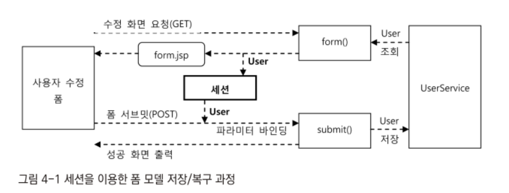
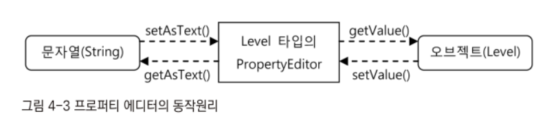

# Chapter 4. 스프링 @MVC
- 애노테이션을 중심으로 한 새로운 MVC의 확장 기능은 @MVC라는 별칭으로도 분불린다.

## 4.1 @RequestMapping 핸들러 매핑
- @MVC의 가장 큰 특징은 핸들러 매핑과 어댑터의 대상이 오브젝트가 아니라 메서드라는 점이다.
- @MVC가 등장하기 전의 컨트롤러 타입을 비교해서 컨트롤러를 선택하고 타입에 정의된 메서드를 통해 실행하는 방법을 사용했다면, @MVC의 컨트롤러는 기존의 인터페이스와 같은 타입을 이용해서 하던 일을 애노테이션으로 대체해버렸다.
- 애노테이션은 부여되는 대상의 타입이나 코드에는 영향을 주지않는 메타정보이므로 훨씬 유연한 방식으로 컨트롤러를 구성할 수 있게 해준다.

### 4.1.1 클래스/메서드 결합 매핑정보
- DefaultAnnotationHandlerMapping의 핵심은 매핑정보로 @RequestMapping 애노테이션을 활용한다는 점이다.

#### @RequestMapping 애노테이션
- @RequestMapping 애노테이션에는 다음과 같은 엘리먼트를 지정할 수 있다.
- 모든 엘리먼트는 생략이 가능하다.

**String[] value(): URL 패턴**
- 디폴트 엘리먼트인 value는 스프링 배열 타입으로 URL 패턴을 저장하도록 되어 있다.
- URL 패턴은 다른 핸들러 매핑에서 사용하는 URL 패턴처럼 ANT 스타일의 와일드카드를 사용할 수 있다.

```java
@RequestMapping("/hello")
@RequestMapping("/main*")
@RequestMapping("/view.*")
@RequestMapping("/admin/**/user")
@RequestMapping({"/hello", "/hi"}) // 여러개도 가능하다.

// 이 세가지는 모두 동일하게 적용된다.
@RequestMapping({"/hello", "/hello/", "/hello.*"})
```

**RequestMethod[] method(): HTTP 요청 메서드**
- RequestMethod는 HTTP 메서드를 정의한 이늄이다.
- GET, HEAD, POST, PUT, PATCH, DELETE, OPTIONS, TRACE 총 7가지의 HTTP 메서드가 정의되어 있다.
- 정의되지 않은 메서드로 요청했을 시 Method Not Allowed 응답을 받게될 것이다.

**String[] params(): 요청 파라미터**
- 요청의 파라미터와 그 값을 비교해서 매핑해주는 것이다.
- 같은 URL을 사용하더라도 HTTP 요청 파라미터에 따라 별도의 작업을 해주고 싶을 때가 있다.
- 이때는 코드에서 파라미터를 검사해 기능을 분리하는 대신에 요청 파라미터를 지정해줄 수 있다.

```java
@RequestMapping(value="/user/edit", params="type=admin")
@RequestMapping(value="/user/edit", params="type=member")

// type 파라미터가 존재하면 안된다는 조건도 지정이 가능하다.
@RequestMapping(value="/user/edit", params="!type")
```
- 해당 파라미터는 URL이 아닌 폼 파라미터 등에서도 비교대상이 된다.

**String[] headers(): HTTP 헤더**
- 파리미터 설정과 비슷하게 헤더에 대한 정보도 RequestMapping에 설정이 가능하다.

#### 타입 레벨 매핑과 메서드 레벨 매핑의 결합
- 타입레벨에 붙은 @RequestMapping은 타입 내의 모든 매핑용 메서드의 공통 조건을 지정할 때 사용된다.
- 그리고 메서드에서 조건을 세분화하는 것이다.
- 즉 메서드 레벨의 매핑은 클래스 레벨의 매핑을 상속받는다고 볼 수 있다.

#### 메서드 레벨 단독 매핑
- 메서드 레벨의 매핑조건에 공통점이 없다면 각 메서드별로 독립적으로 매핑정보를 주면된다.
- 컨트롤러 클래스에 @Controller 애노테이션을 붙여준다면 빈 자동 스캔방식으로 등록되므로 따로 클래스레벨에는 @RequestMapping을 붙여주지 않아도 된다.

#### 타입 레벨 단독 매핑
- 핸들러 매핑은 원래 핸들러 오브젝트를 결정하는 전략인데 애노테이션의 영향으로 메서드로 세분화 된것이므로 타입 레벨 단독 매핑도 가능하다.
- Controller를 구현한 컨트롤러에서는 타입레벨에 @RequestMapping을 통해 매핑을 진행할 수 있다.
- 클래스레벨의 /* 패턴도 메서드 레벨의 URL 패턴으로 메서드 이름이 사용되게할 수 있다.

```java
@RequestMapping("/user/*")
public class UserController{
  @RequestMapping public String add(..){}
  @RequestMapping public String edit(..){}
}
```
- 각각 /user/add, /user/edit으로 매핑될 것이다.

### 4.1.2 타입 상속과 매핑
- 상속과 관련되서는 두 가지만 기억하면 된다.
- @RequestMapping 정보는 상속되지만 서브 클래스에서 @RequestMapping을 재정의하면 슈퍼클래스의 정보는 무시된다.
- 즉 @RequestMapping의 경우 서브클래스에서 재정의하지 않으면 상속을 통해서 유지시킬 수 있다.
- 물론 클래스가 아닌 인터페이스에서도 @RequestMapping이 정의될 수 있다.
- 보통 컨트롤러는 누가 DI를 받지도 않기때문에 인터페이스로 구현될 필요는 없지만 확장성을 고려하고 스프링의 특성에 맞게 구현하려면 인터페이스로 구현도 가능하다.

#### 매핑정보 상속의 종류
- 클래스 상속이나 인터페이스 구현에서 매핑정보가 어떻게 상속되고 적용되는지 몇 가지 대표적인 경우를 살펴보자.

**상위 타입과 메서드의 @RequestMapping 상속**
```java
@RequestMapping("/user")
public class Super {
    @RequestMapping("/list")
    public String list(){
        return "hello";
    }
}

public class Sub extends Super{
  @Override
  public String list() {
      return super.list();
  }
}
```
- 하위 타입에서 오버라이드 하더라도 매핑정보는 유지된다.
- 인터페이스도 이와 동일하게 적용된다.

**상위 타입의 @RequestMapping과 하위 타입 메서드의 @RequestMapping 결합**
```java
@RequestMapping("/user")
public class Super {
}

public class Sub extends Super{
    @RequestMapping("/list")
    public String list() {
        return super.list();
    }
}
```
- 상위 클래스의 매핑정보를 그대로 이어받아 사용하므로 위의 경우  /user/list가 sub클래스의 list메서드로 매핑될 것이다.
- 매핑정보 결합은 URL, HTTP 메서드, 파라미터에도 적용이 된다.
- 역시 인터페이스도 동일하게 적용된다.

**하위타입 메서드의 @RequestMapping 재정의**
- 하위 타입에서 @RequestMapping을 재정의하면 재정의된 RequestMapping을 사용하게 된다.

**제네릭스와 매핑정보 상속을 이용한 컨트롤러 작성**
- @RequestMapping을 상속과 구현에서 잘 활용하면 반복적인 설정을 피하고 간결한 코드를 얻어낼 수 있다.
- 제네릭스를 활용해서 타입에는 타입 파라미터와 메서드레벨의 공통 매핑정보를 지정해놓고, 이를 상속받는 개별 컨트롤러에는 구체적인 타입과 클래스레벨의 기준 매핑정보를 지정해주는 기법을 사용할 수 있다.
- 기본 정보의 입출력을 다루는 컨트롤러에는 도메인 오브젝트별로 CRUD와 검색 기능을 가진 메서드가 중복돼서 등장한다.
- 이는 각 컨트롤러마다 모델의 타입만 달라질 뿐 기본적인 구성과 코드는 동일한 코드가 중복돼서 만들어지기 마련이다.
- CRUD용 컨트롤러라면 모델은 보통 도메인 오브젝트를 사용하기 때문이다.
- 타입만 달라지는 중복되는 코드라면 제네릭스의 타입 파라미터를 가진 슈퍼클래스로 코드를 뽑아내는 것이 좋다.

```java
public abstract class GenericController<T, K, S> {
    private S service;

    @RequestMapping("/add")
    public void add(T entity){}

    @RequestMapping("/update")
    public void update(T entity){}

    @RequestMapping("/view")
    public T view(K id){return null;}

    @RequestMapping("/delete")
    public void delete(K id){};

    @RequestMapping("/list")
    public List<T> list() {return null;}
}

@RequestMapping("/user")
public class UserController extends GenericController<User, Integer, UserService> {
}
```
- 제네릭스 컨트롤러를 지정해주고 CRUD 컨트롤러를 이를 상속받아 적절한 타입 파라미터를 주고 GenericController를 상속하면 된다.
- CRUD외의 추가적인 작업은 UserController에서 따로 구현하면 될 것이다.
- RequestMapping의 상속의 특징을 이용하여 해당 URL 매핑도 GenericController에 정의한 후 UserController의 클래스단에 RequestMapping설정을 통해 url을 앞단에 추가시켜줄 수 있을 것이다.

---

## 4.2 @Controller
- DefaultAnnotationHandlerMapping은 사용자 요청을 @RequestMapping 정보를 활용해서 컨트롤러 빈의 메서드에 매핑해준다.
- 그리고 AnnotationMethodHandlerAdapter는 매핑된 메서드를 실제로 호출하는 역할을 담당한다.
- @MVC는 특정 인터페이스를 구현하지 않기 때문에 어떤 메서드를 호출해야할지 알 수 없다.
- 뿐만아니라 애노테이션 기반으로 사용하면 HttpServletRequest, Response등을 파라미터로 받지 않기 때문에 이를 사용할 수 없게된다.
- @Controller 애노테이션을 사용하면 컨트롤러가 요구하는 유연성과 편의성이라는 두가지를 모두 충족시킬 수 있게된다.
- @Controller에서는 컨트롤러 역할을 담당하는 메서드의 파라미터 개수와 타입, 리턴타입등을 자유롭게 결정할 수 있다.
- 이를 어떻게 구성할 것인지는 전적으로 개발자의 자유이다.
- 필요없는 건 모두 제거하고 꼭 필요한 것만을 넣어서 원하는 스타일로 만들 수 있다.
- 여기에 RequestMapping을 비롯한 다양한 애노테이션을 메서드나 파라미터에 적용해서 컨트롤러 로직에 대한 추가적인 정보를 제공할 수 있다.
- 그러므로 @Controller를 담당하는 어댑터 핸들러는 상당히 복잡하다.
- 사용할 수 있는 파라미터나 리턴타입의 종류도 매우 다양하기 때문에 익숙해지면 최적화된 구조로 컨트롤러를 개발할 수 있다.
- @MVC와 @Controller 개발 방법은 스프링 역사상 가장 획기적인 변신이다. 이전에 사용하던 방식을 버리고 새로운 방식을 사용하도록 강하게 권장한 적은 없었다,.
- 그만큼 @MVC와 @Controller는 편리하고 강력하게 구현할 수 있다.

```java
@RequestMapping("/hello")
public void helli(){ }
```
- 위와 같이 리턴값이 없는 메서드라면 스프링은 비어있는 모델 오브젝트와 뷰 이름을 돌려준다.
- 뷰 이름은 RequestToViewNameTranslator에 의해 URL을 따라 hello라고 자동으로 만들어질 것이다.
- 필요 없는 요청 파라미터와 모델, 뷰 이름까지 제거한채로도 컨트롤러를 간단하게 구현할 수 있다.
- 이번엔 조금 복잡한 컨트롤러를 살펴보자.

```java
@RequestMapping("/complex")
public String complex(@RequestParam("name") String name,
                      @CookieValue("auth") String auth,
                      ModelMap modelMap) {

    modelMap.put("info", name + "/" + auth);
    return "myview";
}
```
- 파라미터 값과 쿠기 값을 가져와 컨트롤러 로직에 사용하며 모델에 넣어 뷰로 전달한다.
- 리턴타입이 스트링이므로 관례에따라 뷰이름으로 사용한다.
- HttpServletRequest를 가져와 직접 파라미터와 쿠키 값을 추출하고, 모델 맵 오브젝트를 생성해서 값을 넣고, 모델과 뷰 이름을 담은 ModelAndView 오브젝트를 생성해서 리턴해야하는게 아닌 매우 깔끔하게 구현이 가능하다.
- 스프링은 메서드의 파라미터와 리턴 값이 어떻게 선언됐는지 살펴보고, 이를 이용해 적절한 파라미터 값을 준비해서 호출해준다.
- AnnotationMethodHandlerAdapter가 허용하는 메서드 파라미터의 종류와 사용방법, 그리고 리턴값의 종류를 알아보자

### 4.2.1 메서드 파라미터의 종류
#### HttpServletRequest, HttpServletResponse
- 보통 좀 더 상세한 정보를 담은 파라미터 타입을 활용하기 때문에 잘 사용하지 않으나 원한다면 파라미터로 사용할 수 있고 ServletRequest, ServletResponse 타입도 가능하다.

#### HttpSession
- HttpSession 오브젝트는 HttpServletRequest를 통해 가져올 수도 있지만 파라미터로 바로 받아오는 것이 좋을 것이다.
- HttpSession은 서버에 따라 멀티스레드 환경에 안정성을 보장하지 않으므로 서버에 상관없이 HttpSession을 사용하려면 핸들러 어댑터의 synchronizeOnSession 프로퍼티를 true로 설정해줘야 한다.

#### WebRequest, NativeWebRequest
- WebRequest는 HttpServletRequest의 요청정보를 대부분 그대로 가지고 있는 서블릿 API에 종속적이지 않은 오브젝트 타입이다.
- 원래 서블릿과 포틀릿 환경 양쪽에 모두 적용가능한 범용적인 핸들러 인터셉터를 만들 때 활용하기 위해 만들어졌다.
- NativeWebRequest에는 WebRequest내부에 감춰진 HttpServletRequest와 같은 환경종속적인 오브젝트를 가져올 수 있다.

#### Locale
- DispathcerServlet의 LocaleResolver가 결정한 Locale 오브젝트를 받을 수 있다.

#### InputStream, Reader
- HttpServletRequest의 getInpuStream()으로 받을 수 있는 콘텐트 스트림또는 Reader 타입 오브젝트를 제공받을 수 있다.

#### OuputStream, Writer
- HttpServletResponse의 getOutputStream()으로 받을 수 있는 콘텐트 스트림또는 Writer 타입 오브젝트를 제공받을 수 있다.

#### @PathVariable
- @RequestMapping의 URL에 들어가는 패스 변수를 받는다.
- 요청파라미터를 URL의 쿼리 스트링(/user/view?id=10)과 같이 하는 대신 URL 패스(/user/view/10)로 사용할 때 매우 깔끔하고 유용하게 사용할 수 있다.
- 타입이 맞지않는 데이터가 들어오면 400 - BadRequest 응답 코드가 전달된다.

#### @RequestParam
- 단일 HTTP 요청 파라미터를 메서드 파라미터에 넣어주는 애노테이션이다.
- 스프링의 내장 변환기가 다룰 수 있는 모든 타입을 지원한다.
- 원한다면 @RequestParam Map<String, String> params를 통해 모든 요청 파라미터를 맵으로도 받을 수 있다.
- 만약 해당 핸들러에서 @RequestParam이 있는데 해당 파라미터가 없는 요청이 들어오면 400 - BadRequest가 발생한다.
- 디폴트 값도 지정할 수 있다.

```java
public void view(@RequestParam(value="id", required=false, defaultValue="-1"))
```

- 핸들러 파라미터의 변수명과 파라미터의 이름이 같다면 생략이 가능하고 String, int 같은 단순타입의 경우 @RequestParam도 생략가능하지만 명시적으로 붙여주는게 좋을 것이다.

#### @CookieValue
- HTTP 요청과 함께 전달된 쿠키 값을 메서드 파라미터에 넣어주도록 @CookieValue를 사용할 수 있다.
- 이또한 @RequestParam과 같이 변수명과 이름이 같다면 생략이 가능하다.

#### @RequestHeader
- 헤더정보를 메서드 파라미터에 넣어주는 애노테이션이다.

#### Map, Model, modelMap
- 다른 애노테이션이 붙어 있지 않다면 모두 모델정보를 담는데 사용할 수 있는 오브젝트가 전달된다.

#### @ModelAttribute
- 메서드 파라미터, 메서드 레벨에 부여할 수 있는 애노테이션이다.
- @ModelAttribute는 이름그대로 모델로 사용되는 오브젝트이다.
- 컨트롤러가 뷰에 전달하는 모델오브젝트는 하나가 아니므로 보통 맵의 형태로 담아 전달하지만 @ModelAttribute는 모델 맵에 담겨서 전달되는 모델 오브젝트의 하나라고 볼 수 있다.
- HTTP 요청정보를 통해서 생성되는 오브젝트의 형태의 정보를 @ModelAttribute를 이용하여 받아올 수 있다.
- 보통 도메인 오브젝트나 DTO의 프로퍼티 요청 파라미터를 바인딩해서 한 번에 받아올 수 있다.
- 하나의 오브젝트에 클라이언트의 요청정보를 담아서 한 번에 전달되는 것이기 때문에 이를 커맨드 패턴에서 말하는 커맨트 오브젝트라고 부르기도 한다.
- 해당 요청정보를 오브젝트에 바인딩하기 위해서는 수정자 메서드가 필요하다.

> - 주로 URL의 쿼리 스트링으로 들어오는, 검색조건과 같은 정보를 @ModelAttribute가 붙은 파라미터 타입의 오브젝트로 모두 담아서 전달해주는 것은 커맨드라고 부른다.
> - 해당 오브젝트에 정보를 활용하는 부가기능까지 넣는다면 커맨트 패턴 오브젝트처럼 사용할 수 있기 때문이다.

- @ModelAttribute는 그이외에 컨트롤러가 리턴하는 모델 파라미터로 오브젝트를 자동으로 추가해줄 수도 있다.

#### Errors, BindingResult
- @ModelAttribute는 단지 오브젝트에 여러개의 요청 파라미터 값을 넣어서 넘겨주는게아닌 검증작업이 추가로 이루어진다.
- @RequestParam은 스프링의 기본 타입 변환 기능을 이용해 요청 파라미터 값을 메서트 파라미터 타입으로 변환한다.
- 요청 파라미턴느 문자열로 오므로 스트릉이 가장 단순하고 숫자 타입일 경우 스트링 타입으로 들어오면 요청 파라미터의 타입 변환을 시도한다.
- 성공한다면 숫자형 파라미터로 전달될 것이고 그렇지 않다면 400 응답이 전달될 것이다.
- 그런데 @ModelAttribute를 사용했을 때는 요청 프로퍼티가 일치하지 않아 예외가 발생하면 400 응답이 전달되는게 아닌 타입 변환이 실패해도 작업은 계속 진행된다.
- 타입 변환중 발생한 예외들은 BindingResult 타입 오브젝트에 담겨서 컨트롤러로 전달될 뿐이다.
- 왜 ModelAttribute는 바로 예외를 처리하지 않을까?
- 그 이유는 @ModelAttribute는 요청 파라미터의 타입이 모델 오브젝트의 프로퍼티 타입과 일치하는지를 포함한 다양한 방식의 검증 기능을 수행하기 때문이다.
- @ModelAttribute 입장에서는 파라미터 타입이 일치하지 않는다는 건 검증 작업의 한 가지 결과일 뿐 예상치 못한 예외가 아니기 때문이다.
- 별도의 검증없이 무조건 프로퍼티 타입으로 변환해서 값을 넣으려는 @RequestParam과는 그런 차이가 있다.
- 사용자의 입력폼에 대한 예외가 발생하면 400 에러 메시지를 나타내는게 아닌 컨트롤러에서 처리하여야 한다.
- 해당 정보를 추출해서 책임을 가진 어댑터 핸들러는 실패한 변환 작업에 대한 정보를 컨트롤러에게 제공해줄 필요가 있고 그 컨트롤러는 그 정보를 통해 적절하게 처리해야한다.
- 검증에 대한 정보는 BindingResult 혹은 Error에 담겨있고 해당 메서드 파라미터로 가져와 사용할 수 있다.
- **반드시 @ModelAttribute 파라미터 뒤에 BindingResult, Errors가 나와야 한다.**
- 이는 자신의 앞에 있는 @ModelAttribute 파라미터의 검증 작업에서 발생한 오류만을 전달해주기 때문이다.

#### SessionStatus
- 컨트롤러의 기능중에는 모델 오브젝트를 세션에 저장한 후 다음 페이지에서 다시 활용하게 해주는 기능이 존재한다.
- 세션의 사용이 불필요해지는 세션의 정보를 지워야 하는데 이 때 SessionStatus 오브젝트를 메서드의 파라미터로 선언하여 간단하게 세션을 다룰 수 있게 해준다.

#### @RequestBody
- 이 애노테이션이 붙은 파라미터에는 HTTP 요청의 본문 부분이 그대로 전달된다.
- 일반적인 GET/POST 요청 파라미터는 @RequestBody를 사용할 일이 없으나 XML, JSON 기반의 메시지를 사용할 경우 매우 유용하다.
- AnnotationMethodHandlerAdapter에는 HttpMessageConverter 타입의 메시지 변환기가 여러 개 등록되어 있다.
- @RequestBody가 붙은 파라미터가 있으면 HTTP 요청의 미디어 타입과 파라미터의 타입을 먼저 확인한다.
- 메시지 변환기 중에서 해당 미디어 타입과 파라미터 타입을 처리할 수 있는 것이 있다면 HTTP 요청의 본문부분을 통째로 변환해서 지정된 메서드 파라미터로 전달해준다.
- StringHttpMessageConverter 타입 변환기는 스트링 타입의 파라미터와 모든 종류의 미디어 타입을 처리해준다.
- XML 본문일 경우 MarshallingHttpMessageConverter를 이용할 것이고 JSON일 경우 MappingJacksonHttpMessageConverter를 사용할 수 있다.

#### @Value
- 빈의 값 주입에서 사용하던 @Value 애노테이션도 컨트롤러 메서드 파라미터에 부여할 수 있다.
- 사용 방법은 DI에서 프로퍼티나 필드, 초기화 메서드 파라미터에 @Value를 사용하는 것과 동일하다.
- 주로 시스템 프로퍼티나 다른 빈의 프로퍼티 값, 또는 좀더 복잡한 SpEL을 통해 클래스 상수를 읽어오거나 특정 메서드를 호출한 결과 값, 조건식등을 넣을 수 있다.

```java
@RequestMapping
public String hello(@Value("#{systemProperties['os.name']}")String osName){}
```
- 이렇게 OS 이름을 가져와 파라미터 메서드에 선언하여 사용할 수 있다.
- 스프링이 컨텍스트에 자동으로 등록해주는 시스템 프로퍼티 빈은 systemProperties를 통해 OS 이름을 가져온 것이다.
- 물론 @Value를 메서드 파라미터 대신 클래스의 멤버로 DI받는 것도 가능하다.

```java
public class HelloController{
  @Value("#{systemProperties['os.name']}") String osName

  @RequestMapping
  public String hello(){}
}
```
- 많은 메서드가 해당 값을 참조하면 DI로 받는게 좋을것이고 특정 메서드만 사용한다면 메서드 파라미터가 좋을 것이다.

#### @Valid
- JSR-303의 빈 검증기를 이용해 모델 오브젝트를 검증하도록 지시하는 지시자이다.
- 보통 @ModelAttribute와 함께 사용한다.

> - AnnotationMethodHandlerAdapter가 호출하는 컨트롤러 메서드의 사용 간으한 파라미터는 이렇게 많이 존재한다.
> - 스프링에서는 컨트롤러 메서드를 매우 자유롭게 작성할 수 있다.
> - **유연성이 보장된다고 방만하게 사용하면 오히려 코드를 관리하기가 매우 힘들어 질 수 있다.**
> - 최종적으로 어떤 파라미터 타입을 어떻게 사용할지는 개발자가 결정해야하며 그 책임도 개발자가 져야 한다.

### 4.2.2 리턴 타입의 종류
- 컨트롤러가 DispathcerServlet에게 돌려줘야 하는 정보는 모델과 뷰이다.
- 핸들러 어댑터를 거쳐 최종적으로 DispathcerServlet에 돌아갈 때는 ModelAndView 타입으로 리턴값이 전달된다.
- 드물지만 ModelAndView는 무시하고 HttpServletResponse에 직접 결과를 리턴하는 경우도 있다.
- @Controller 메서드의 리턴 타입은 기타 정보와 결합해서 결국 ModelAndView로 만들어진다.
- 메서드의 리턴 타입을 결정할 때에는 ModelAndView에 함께 들어갈 정보로 어떤 게 있는지도 함께 고려해봐야 한다.

#### 자동 추가 모델 오브젝트와 자동생성 뷰 이름
- 다임 네 가지 정보는 메서드 리턴 타입에 관계없이 조건만 맞으면 모델에 자동으로 추가된다.

**@ModelAttribute 모델 오브젝트 또는 커맨드 오브젝트**
- @ModelAttribute를 붙인 모델 오브젝트는 컨트롤러가 리턴하는 모델에 추가된다.

```java
public void add(@ModelAttribute("user") User user)
public void add(@ModelAttribute User user)
public void add(User user)
```
- @ModelAttribute 특성에 따라 위 세개 모두 user라는 이름으로 모델에 추가된다.

**Map, Model, ModelMap 파라미터**
- 3개 중 하나의 파라미터를 이용하여 모델 오브젝트를 추가할 수 있다.
- 이런 파라미터에 추가한 오브젝트는 DispathcerServlet를 거쳐 뷰에 전달되는 모델에 자동으로 추가된다.
- 컨트롤러에서 별도로 ModelAndView를 만들어 리턴하는 경우에도 추가된다.

**@ModelAttribute 메서드**
- 컨트롤러 클래스의 일반메서드에도 @ModelAttribute를 붙일 수 있다.
- 뷰에서 참고정보로 사용되는 모델 오브젝트를 생성하는 메서드로 지정하기 위해 사용할 수 있다.
- 컨트롤러의 메서드로 정의되지만 컨트롤러의 기능이아닌 모델 정보를 추가하기 위해 사용한다.

**BidingResult**
- BidingResult 타입의 오브젝트도 모델에 자동으로 추가된다.
- BidingResult가 추가되는 이유는 JSP, 프리마커, 벨로시티등의 뷰에 사용되는 커스텀 태그나 매크로에서 사용되기 때문이다.
- 주로 잘못 입력된 폼의 값을 가져와 오류 메시지를 생성할 떄 사용된다.


> 컨트롤러에서 어떤 식으로든 뷰 정보를 제공해주지 않는 경우 RequuestToViewNameTranslator 전략에 의해 자동으로 뷰 이름이 만들어진다.
> ModelAndView의 오브젝트도 리턴했을 경우 역시 뷰 이름이 설정되어 있지 않다면 뷰 이름 자동생성의 대상이 된다.

#### ModelAndView
- ModelAndView는 컨트롤러가 리턴해야 하는 정보를 담고 있는 가장 대표적인 타입이다.
- 하지만 @Controller에서는 ModelAndView를 이용하는 것보다 편리한 방법이 많아서 자주 사용되지는 않는다.
- 물론 @Controller에서 리턴타입을 ModelAndView로 해도 전혀 문제가 됮 ㅣ않는다.
- ModelAndView를 만들어 리턴하더라도 @ModelAttribute모델과 Map, Model, ModelMap 파라미터 모델 등은 자동으로 추가된다.

#### String
- 리턴 타입이 스트링이라면 이 리턴 값은 뷰 이름으로 사용된다.
- 모델정보는 모델맵 파라미터로 가져와 추가해주는 방법을 사용해야 한다.
```java
@RequestMapping("/hello")
public String hello(@RequestParam String name, Model model){
  model.addAttribute("name", name);
  return "hello";
}
```

#### void
- void로 리턴타입을 설정한다면 RequestToViewNameResolver전략을 통해 자동생성되는 뷰이름이 사용된다.
- URL과 뷰이름을 일관되게 통일할 수 있담ㄴ void 형의 사용도 고려해볼만 하다.

```java
@RequestMapping("/hello")
public void hello(@RequestParam String name, Model model){
  model.addAttribute("name", name);
}
```

#### 모델 오브젝트
- RequestToViewNameResolver로 자동생성하는 것을 사용하고 코드를 이용해 모델에 추가할 오브젝트가 하나라면 Model 파라미터를 받아 저장하는 데신 모델 오브젝트를 바로 리턴하여도 된다.
- 모델이름은 리턴 값의 타입 이름을 따르게 되어있다.

#### Map, Model, ModelMap
- 메서드의 코드에서 Map이나 Model, ModelMap 타입의 오브젝트를 직접 만들어서 리턴해주면 이 오브젝트는 모델로 사용된다.
- 하지만 직접 이를 만들어서 사용할 이유가 없을 것이다.
- 그럼에도 이 리턴 타입의 특징을 분명히 기억해둬야 하는데 단일 모델 오브젝트를 직접 리턴하는 방식을 사용하다가 실수가 일어날 수 있다.

#### View
- 스트링 리턴 타입은 뷰 이름으로 인식한다고 설명했다.
- 그런데 뷰 이름 대신 뷰 오브젝트를 사용하고 싶다면 리턴 타입을 View로 선언하고 뷰 오브젝트를 넘겨준다.

#### @ResponseBody
- @ResponseBody는 @RequestBody와 비슷한 방식으로 동작한다.
- @RequestBody가 메서드 레벨에 부여되면 메서드라 리턴하는 오브젝트는 뷰를 통해 결과를 만들어내는 모델로 사용하는 대신, 메시지 컨버터를 통해 바로 HTTP 응답의 메시지 본문으로 전환된다.

```java
@RequestMapping("/hello")
@ResponseBody
public String hello(){
  return "<html><body>Hello Spring</body></html>";
}
```
- 만약 ResponseBody가 없다면 린턴 값은 뷰이름으로 인식될 것이다. 하지만 ResponseBody가 붙어 있으므로 스트링 타입을 지원하는 ㄴ메시지 컨버터가 이를 변환해서ㅗ HttpServletRequest의 출력 스트림에 넣어준다.

### 4.2.3 @SessionAttributes와 SessionStatus
- HTTP 요청에 의해 동작하는 서블릿은 기본적으로 상태를 유지하지 않는다.
- 따라서 매요청은 독립적으로 처리되고 요청을 처리한 후 모든 리소스는 정리된다.
- 하지만 애플리케이션은 기본적으로 클라이언트 식별, 여러 페이지에 걸친 단계적인 정보 입력을위해 상태를 유지하여야 한다.

#### 도메인 중심 프로그래밍 모델과 상태 유지를 위한 세션 도입의 필요성
- 사용자 정보 수정 시 발생하는 문제를 해결하기 위해 히든 필드(해당 정보를 html로 조회하므로 보안 위험), DB 재조회(리소스 낭비), 계층사이의 강한 결합(객체지향 적이지 않아 재사용, 유연성이 떨어짐)등을 사용하여 해결할 수 있다.
- 하지만 이럴 때 세션을 사용한다면 위의 문제들을 해결할 수 있다. 자세한건 510P를 참고하자.

#### @SessionAttributes
```java
@Controller
@SessionAttributes("user")
public class UserController{
  private final UserService userService;
  @RequestMapping(value="/user/edit", method=GET)
  public String from(@RequestParam int id, Model model){
    model.addAttribute("user", userService.getUser(id));
    return "user/edit";
  }

  @RequestMapping(value="user/edit", method=POST)
  public String submit(@ModelAttribute User user){}
}
```
- @SessionAttributes는 위와같이 클래스단에 붙여준 후 이름을 설정한다면 똑같은 이름을 가진 모델 정보가 존재한다면 이를 세션에 저장해준다.
- 그러므로 from메서드에서 넣어주는 User는 폼을 전달할 때 세션에도 추가된다.
- 그리고 @SessionAttributes가 해주는 일은 @ModelAttribute가 지정된 파라미터가 있을 때 이 파라미터에 전달해줄 오브젝트를 세션에서 가져오게 해준다.
- 원래라면 파라미터에 @ModelAttribute가 있다면 해당 타입의 새 오브젝트를 생성한 후 요청 파라미터 값을 바인딩해준다.
- 만약 @SessionAttributes와 @ModelAttribute에 선언된 이름이 같다면 먼저 세션에 같은 이름의 오브젝트를 가져와 @ModelAttribute 파라미터로 전달해줄 오브젝트로 사용하고 @ModelAttribute는 폼에서 전달된 필드정보를 모델 오브젝트의 프로퍼티에 바인딩한다.
- 그러므로 from에서 전달된 User에서 변경된 내역만 다시 User에 반영되기 때문에 문제가 발생하지 않는다.
- 아래와 같이 동작이 진행될 것이다.


- @SessionAttributes는 이름에서부터 하나 이상의 세션을 저장할 수 있음을 알 수 있다.
- 설정된 세션은 클래스 모든 메서드에 적용될 것이며 Model 파라미터를 이용해 저장된 모델, 단인일 모델 오브젝트의 리턴을 통해 만들어진 모델, @ModelAttribute로 정의된 모델이든 상관없이 @SessionAttributes의 후보가 된다.

> 단 @SessionAttributes의 기본 구현인 HTTP 세션을 이용한 세션 저장소는 모델 이름을 세션에 저장할 애트리뷰트 이름으로 사용한다. 위의 코드에서는 user라는 세션 애트리뷰트에 User오브젝트가 저장된다. 따라서 @SessionAttributes에 사용하는 모델 이름에 충돌이 발생하지 않아야 한다.

#### SessionStatus
- @SessionAttribute를 사용할 때는 더 이상 필요 없는 세션 애트리부트를 코드로 제거해줘야 한다.
- 위의 경우 수정작업이 끝났다면 세션의 user는 오브젝트가 여전히 남아있게 된다.
- 세션은 한번 꺼내온다고 꼭 해당 사용의 필요성을 다 하는 것이 아니기 때문에 스프링에서는 개발자가 해당 세션을 제거하도록 한다.
- 이럴때 핸들러 파라미터의 SessionStatus를 사용하면 세션을 깔끔하게 제거할 수 있게 된다.

```java
@RequestMapping(value="user/edit", method=POST)
public String submit(@ModelAttribute User user, SessionStatus){
  userService.updateUser(user);
  sessionStatus.setComplete(); // 세션 제거
  return "user/editsuccess";
}
```

#### 등록 폼을 위한 @SessionAttributes 사용
- 등록 화면을 위한 컨트롤러에서도 @SessionAttributes가 유용하게 쓰일 수 있다.
- 복잡한 도메인 오브젝트의 경우 미리 초기화를 해둘 수도 있다.
- 가장 중요한 이유는 스프링의 폼 태그를 사용하기 위해서이다.
- 스프링의 폼 태그는 등록과 수정 화면에 상관없이 폼을 출력할 때 폼의 내용을 담은 모델 오브젝트를 필요로 한다.
- 폼의 입력값에 오류가 있다면 다시 폼을 띄울 때는 기존에 입력한 값을 보여줘야 한다.
- 등록을 담당하는 폼에서 초기에 빈 폼을 보여주는 것과 문제가 있을 때 기존 입렵 값을 보여주는 폼 두개는 만드는게 아닌 애초에 빈 모델 오브젝트를 리턴한다면 하나의 폼으로도 사용이 가능하다.
- 이러한 방식을 사용하는것이 전형적인 스프링 MVC의 폼 처리 방식이다.

#### 스프링 목 오브젝트와 AbstractDispatcherServletTest를 이용해 세선 테스트 만들기
- 웹 애플리케이션을 테스트할 때마다 서버를 띄우는 것은 번거로우며 여러 페이지를 걸쳐 세션이 동작하는 것을 테스트하는 것도 매우 번거롭다.
- 하지만 앞에서 만들었던 스프링 MVC를 위한 기반 테스트인 AbstractDispatcherServletTest와 스프링의 서블릿 목 오브젝트를 이용하면 여러번의 요청을 거치면서 세션이 참여하는 작업을 당당하는 기능을 손쉽게 테스트할 수 있다.

```java
public class SessionAttributesTest extends AbstractDispatcherServletTest {
    @Test
    void sessionAttr() throws Exception{
        setClasses(UserController.class);

        // ==================== GET 요청 - form() ====================
        initRequest("/user/edit")
                .addParameter("id", "1")
                .runService();
        HttpSession session = request.getSession();

        assertThat(session.getAttribute("user"))
                .as("세션의 User는 Model의 User와 동일하다.")
                .isEqualTo(getModelAndView().getModel().get("user"));

        // ==================== POST 요청 - submit() ====================
        initRequest("/user/edit", "POST")
                .addParameter("id", "1")
                .addParameter("name", "Spring2");

        // 세션을 유지시키기 위해 직접 세션을 넣어준다
        request.setSession(session);
        runService();

        assertThat(((User)getModelAndView().getModel().get("user")).getEmail())
                .as("email은 수정되지 않았지만 세션에 저장된 user의 이메일이 반영되어있다.")
                .isEqualTo("test@gmail.com");

        assertThat(session.getAttribute("user"))
                .as("SessionStatus를 통해 세션에 저장된 user가 제거된다.")
                .isNull();
    }

    @Controller
    @SessionAttributes("user")
    static class UserController {
        @RequestMapping(value = "/user/edit", method = RequestMethod.GET)
        public User form(@RequestParam int id) {
            return new User(1, "Spring", "test@gmail.com");
        }

        @RequestMapping(value = "/user/edit", method = RequestMethod.POST)
        public void submit(@ModelAttribute User user, SessionStatus sessionStatus){
            sessionStatus.setComplete();
        }
    }

    @AllArgsConstructor
    @Setter
    @Getter
    static class User{
        int id;
        String name;
        String email;
    }
}
```
- 세션을 유지시키기 위해 직접 세션을 넣어 테스트를 진행하였다.
- 테스트는 목 오브젝트로인해 정상적으로 동작된다.

> - @SessionAttributes, @ModelAttribute 등은 애노테이션 선언만으로 백그라운드에서 많은 작업을 처리하게 도와준다.
> - 코드에서는 선언된 애노테이션을 제외하면 어떤일이 일어는지 보여주는게 없으므로 내부 동작방식을 정확히 이해하고 기억해야만 바르게 적용할 수 있다.

---

## 4.3 모델 바인딩과 검증
- @ModelAttribute가 지정된 파라미터를 @Controller메서드에 추가하면 크게 세 가지 작업이 자동으로 진행된다.
- 첫째, 파라미터 타입의 오브젝트를 만든다. 해당 오브젝트의 디폴트 생성자가 반드시 필요하다. @SessionAttributes에 의해 세션에 저장된 모델 오브젝트가 있다면 새로운 오브젝트를 생성하는 대신 세션에 저장되어 있는 오브젝트를 가져온다.
- 둘째, 준비된 모델 오브젝트의 프로퍼티에 웹 파라미터를 바인딩해주는 것이다. HTTP를 통해 전달되는 파라미터는 기본적으로 문자열로 되어있다. 만약 오브젝트의 프로퍼티가 스트링 타입이 아니라면 적절한 변환이 필요할 것이다. 프로퍼티 에디터로 변환을 시도하고 변환이 불가능하다면 BidingResult에 오류가 담기게 된다.
- 셋째, 모델의 값을 검증한다. 바인딩 단계에서 타입에 대한 검증을 끝났지만 그 외 검증할 내용들을 검증한다.
- 스프링에서 바인딩이라고 말할 때는 오브젝트의 프로퍼티에 값을 넣는 것을 말한다. 또는 프로퍼티로부터 값을 읽어오는 경우도 있다.
- 스프링에서 바인딩 과정에서 필요한 변환 작업을 위해 기본적으로 두가지의 API를 제공한다.

### 4.3.1 PropertyEditor
- 스프링이 기본적으로 제공하는 바인딩용 타입 변환 API는 PropertyEditor이다.
- PropertyEditor는 원래 비주얼 환경에서의 프로퍼티 창과 자바빈 컴포넌트를 위해 설계뙤었으므로 인터페이스에는 paintValue()같은 AWT에서 사용하는 메서드가 들어있다.
- XML의 \<property value""> 를 통해 정의된 프로퍼티 값을 실제 프로퍼티에 저장할 때에도 PropertyEditor를 활용해왔다.

#### 디폴트 프로퍼티 에디터
- 프로퍼티 에디터는 XML의 value 애트리뷰트뿐 아니라 @Controller의 파라미터에도 동일하게 적용된다.
- 바인딩 과정에서는 변환할 파라미터 또는 모델 프로퍼티의 타입에 맞는 프로퍼티 에디터가 자동으로 선정돼서 사용된다.
- 만약 스프링이 지원하지 않는 타입을 파라미터로 사용한다면 직접 프로퍼티 에디터를 만들면된다.

#### 커스텀 프로퍼티 에디터
- 스프링이 디폴트로 적용해주는 에디터는 기본적인 타입 20여가지에 불가하다.
- 애플리케이션에서 직접 정의한 타입으로 직접 바인딩을하고 싶다면 직접 프로퍼티 에디터를 작성하면된다.

```java
public enum Level {
    GOLD(3, null), SILVER(2, GOLD), BASIC(1, SILVER);

    private int value;
    private Level nextLevel;

    Level(int value, Level nextLevel) {
        this.value = value;
        this.nextLevel = nextLevel;
    }

    public int intValue(){ return value; }

    public Level nextLevel(){ return nextLevel; }

    public static Level valueOf(int value){
        switch (value){
            case 1: return BASIC;
            case 2: return SILVER;
            case 3: return GOLD;
            default: throw new AssertionError("Unkown value: " + value);
        }
    }
}
```
- Vol.1에서 사용헀던 Level enum이다. 만약 컨트롤러 메서드가 /user/search?level=1에 대해 정상적으로 동작하도록 만들어보자.

```java
public class LevelPropertyEditor extends PropertyEditorSupport {
    public String getAsText(){
        return String.valueOf(((Level)this.getValue()).intValue());
    }

    public void setAsText(String text){
        this.setValue(Level.valueOf(Integer.parseInt(text.trim())));
    }
}
```
- 해당 프로퍼티 에디터는 아래와 같은 방식으로 동작된다.
- 프로퍼티 에디터를 만들 때는 PropertyEditor를 직접 구현하는것보다 미리 구현되어있는 PropertyEditorSupport 클래스를 상속하는 것이 더 편하게 만들 수 있다.



```java
class LevelPropertyEditorTest {
    @Test
    void property() throws Exception{
        LevelPropertyEditor levelEditor = new LevelPropertyEditor();
        levelEditor.setAsText("3");
        assertThat((Level) levelEditor.getValue()).isEqualTo(Level.GOLD);

        levelEditor.setValue(Level.SILVER);
        assertThat(levelEditor.getAsText()).isEqualTo("2");
    }
}
```
- 테스트를 동해 동작을 확인할 수 있다.

#### @InitBinder
- @MVC에는 스프링 컨테이너에 정의된 디폴트 프로퍼티 에디터로만 등록되어 있다. 여기에 LevelPropertyEditor를 추가하여 level 타입의 변환이 필요할 때 사용되도록 만들어야 한다.
- @Controller 메서드를 호출해줄 책임이 있는 AnnotationMethodHandlerAdapter는 @RequestParam, @ModelAttribute, @PathVariable등 처럼 HTTP 요청을 파라미터 변수에 바인딩해주는 작업이 필요한 애노테이션을 마난면 먼저 WebDataBinder를 만든다.
- 하지만 WebDataBinder는 AnnotationMethodHandlerAdapter가 복잡한 과정을 통해 메서드 파라미터와 애노테이션 등을 분석하고 바인딩이 내부적으로 만들어져 노출되지 않기 때문에 WebDataBinder의 초기화 메서드를 이용해야 한다.
- 그것이 바로 컨트롤러 클래스에서 사용할 수 있는 @InitBinder이다.

```java
@InitBinder
public void initBinder(WebDataBinder dataBinder){
    dataBinder.registerCustomEditor(Level.class, new LevelPropertyEditor());
}
``
- @InitBinder가 붙은 initBinder() 메서드는 메서드 파라미터 바인딩을 하기 전에 자동으로 호출된다.


```java
@Test
void webDataBinder() throws Exception{
    WebDataBinder dataBinder = new WebDataBinder(null);
    dataBinder.registerCustomEditor(Level.class, new LevelPropertyEditor());
    assertThat(dataBinder.convertIfNecessary("1", Level.class)).isEqualTo(Level.BASIC);
}
```
- 테스트는 정삭 동작된다.
- 프로퍼티 에디터를 통해 메서드 파라미터의 값들을 적절히 변환할 수 있다면 String대신 타입으로 메서드 파라미터를 선언하는게 좋을 것이다.
- WebDataBinder에 커스텀 프로퍼티 에디터를 등록하는 방법은 두 가지로 구분할 수 있다.

**특정 타입에 무조건 적용되는 프로퍼티 에디터 등록**
- 위의 예처럼 registerCustomEditor()를 통해 에디터를 등록했다면 해당 타입을 가진 바인딩 대상이 나오면 항상 프로퍼티 에디터가 적용된다.
- 디폴트 프로퍼티 에디터에서 지원하지 않는 타입이라면 이 방식이 적절하다.

**특정 이름의 프로퍼티에만 적용되는 프로퍼티 에디터 등록**
- 타입과 프로퍼티 데이터 오브젝트외에 추가로 적용할 프로퍼티 이름을 지정하는 것이다.
- 따라서 같은 타입이지만 프로퍼티 이름이 일치하지 않는 경우에는 등록한 커스텀 프로퍼티 에디터가 적용되지 않는다.
- 프로퍼티 이름이 필요하므로 @RequestParam과 같은 단일 파라미터 바인딩에는 적용되지 않는다. @ModelAttribute로 지정된 모델 오브젝트의 프로퍼티 바인딩에 사용할 수 있다.
- 이름이 포함된 프로퍼티 에디터의 등록은 이미 프로퍼티 에디터가 존재할 경우 사용하기 적합하다.
- WebDataBinder는 바인딩 작업 시 커스텀 프로퍼티 에디터를 먼저 적용해보고 적절한 프로퍼티 에디터가 없으면 디폴트 에디터를 사용한다. 즉 커스텀 프로퍼티 에티거가 우선순위를 갖는다.


```java
@AllArgsConstructor
public class MinMaxPropertyEditor extends PropertyEditorSupport {
    int min;
    int max;

    @Override
    public String getAsText() {
        return String.valueOf((Integer) this.getValue());
    }

    @Override
    public void setAsText(String text) throws IllegalArgumentException {
        int val = Integer.parseInt(text);
        if (val < min) val = min;
        else if(val > max) val = max;
        setValue(val);
    }
}
```
- min보다 작으면 min값을 가지고, max보다 크면 max값을 가지는 MinMaxPropertyEditor가 있다.
- 만약 이 프로퍼티 에디터를 적용한다면 /add?id=1000&age=1000으로 줬을 때 id, age모두 변환될 것이다.
- id는 변환되면 안되고 오직 age만 변환시키기 위해서 이름을 설정해줄 수있다.

```java
@InitBinder
public void initBinder(WebDataBinder dataBinder){
    dataBinder.registerCustomEditor(int.class, "age", new MinMaxPropertyEditor(0, 100));
}
```
- 이제 age에만 적용되므로 id는 그대로 1000이 적용될 것이다.

#### WebBindingInitializer
- @InitBinder메서드에 추가된 프로퍼티 에디터는 클래스 안에서만 동작한다. 만약 애프릴케이션 전반에 걸쳐 적용하고 싶을때 WebBindingInitializer를 이용하면된다.

```java
@Component
public class MyWebBindingInitializer implements WebBindingInitializer {
    @Override
    public void initBinder(WebDataBinder binder) {
        binder.registerCustomEditor(Level.class, new LevelPropertyEditor());
    }
}
```

#### 프로토타입 빈 프로퍼티 에디터
- 프로퍼티 에디터는 싱글톤 빈으로 등록될 수 없다.
- 프로퍼티 에디터는 모든 변환 과정이 하나의 메서드가 아닌 두 개의 메서드가 사용되는 것을 알 수 있다.
- 즉 프로퍼티 에티터는 매우 짧은 시간이지만 상태를 가지고 있게되므로 멀티스레드환경에서 안전하지 못하다.
- 그렇다면 프로퍼티 에디터가 다른 스프링 빈을 참조해야 한다면 어떻게 될까? 그럴경우 해당 데이터를 빈으로 등록해야 하는데 싱글톤은 불가능하니 적절한 프로포타입 빈으로 만들어 져야할 것이다.
- 어떤 경우에 프로퍼티 에디터가 다른 빈을 참조할수 있을까?
- HTTP 요청 파라미터로 도메인 오브젝트의 ID를 제공받았을 때 이를 바인딩 과정에서 ID에 해당하는 실제 도메인 오브젝트로 만들어줄 때 사용할 수 있을 것이다.
- 뿌만아니라 폼의 파라미터가 모델의 프로퍼티에 바인딩될 떄 단순 타입이 아닐경우도 존재한다.

```java
public class User{
  int id;
  String name;
  Code userType;
}
```
- 만약 Code가 DB에 저장되는 독립적인 도메인 오브젝트일 때 메서드 파라미터에서 User로 바로 값을 받기 위해서는 Code로도 변환해주는 방법이 있어야 한다.

**별도의 coodeid 필드로 바인딩하기**
- 첫 번째 방법은 가장 단순하다. 대신 서비스 혹은 컨트롤러 계층에서 추가적인 작업을 필요로 한다.
- 이 방법은 Code userType 프로퍼티로 직접 바인딩하는 대신 참조 ID 값을 저장할 수 있도록 별도의 임시 프로퍼티를 만들고 이 프로퍼티로 값을 받는 것이다.
- User필드에 userTypeid를 int타입으로 받아 서비스나 컨트롤러에서 직접 userType을 set해주면 될 것이다.
- 동작은 완벽하겠지만 컨트롤러나 서비스 계층에 추가적인 작업, 필드에 사용되지 않는 기본타입의 멤버변수등이 필요하므로 실수할 여지가 생기며 코드도 지저분해진다.

**모조 오브젝트 프로퍼티 에디터**
- userType이라는 이름으로 전달되는 1, 2, 3과 같은 id 값을 Code 오브젝트로 변환해주는 프로퍼티 에디터를 만들 수 있을 것이다.
- 단 이럴경우 Code는 오직 id값만 가지는 불완전한 오브젝트가 된다.
- 이렇게 id만 가진 오브젝트를 모조 오브젝트(fake object)라고 하며 이러한 오브젝트를 만드는 프로퍼티 에디터를 모조 프로퍼티 에디터라고 한다.

```java
public class FakeCodePropertyEditor extends PropertyEditorSupport {
    @Override
    public void setAsText(String text) throws IllegalArgumentException {
        Code code = new Code();
        code.setId(Integer.parseInt(text));
        setValue(code);
    }

    @Override
    public String getAsText() {
        return String.valueOf(((Code)getValue()).getId());
    }
}
```
- 모조 프로퍼티 에디터를 만들고 @InitBinder를 통해 등록해주면 될 것이다.
- 하지만 Code 오브젝트는 id를 제외한 나머지가 null인 비정상 오브젝트가 된다.
- 이런 Code를 가진 User는 서비스 계층에 보내면 문제가 발생할 수 있을 것이다. 유용한 방법이긴하나 이 방법은 조금 위험할 수 있다.
- NPE와 같은 문제를 방지하기 위해 FakeCode를 Code의 자식으로 만들어 구현하지 않는 기능에 예외를 던지고 에디터는 FakeCode로 생성하면 된다.
- 모조 오브젝트는 도메인 오브젝트 중심의 아키텍처를 선호한다면 매우 매력적인 접근 방법이며 상황에 따라 유용하게 사용할 수 있다.

**프로토타입 도메인 오브젝트 프로퍼티 에디터**
- 모조 오브젝트와 방식은 동일하나 불완전한 오브젝트를 만드는 것이 아닌 DB에서 Code를 읽어와 완전한 오브젝트로 만들어준다.
- 이렇게 하기 위새너는 프로퍼티 에디터가 Dao나 서비스를 DI 받아야 한다. 즉 해당 프로퍼티 에디터는 빈으로 등록되어야 하므로 프로토타입 빈으로 등록하면 될 것이다.

```java
@Component
@Scope("prototype")
@RequiredArgsConstructor
public class CodePropertyEditor extends PropertyEditorSupport {

    private final CodeService codeService;

    @Override
    public void setAsText(String text) throws IllegalArgumentException {
        setValue(this.codeService.getCode(Integer.parseInt(text)));
    }

    @Override
    public String getAsText() {
        return String.valueOf(((Code) getValue()).getId());
    }
}
```
- 이제 컨트롤러에서 이 에디터를 가져와 사용하면 될 것이다.

```java
@Controller
public class UserController {
    @Inject
    Provider<CodePropertyEditor> codeEditorProvider;

    @InitBinder
    public void initBinder(WebDataBinder dataBinder) {
        dataBinder.registerCustomEditor(Code.class, codeEditorProvider.get());
    }
}
```

- 컨트롤러는 싱글톤이므로 Provider를 사용하여 가져오면된다.
- 이제 Code도 완벽한 오브젝트이므로 비즈니스 로직에서 자유롭게 코드 정보를 활용해도 될 것이다.
