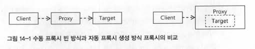
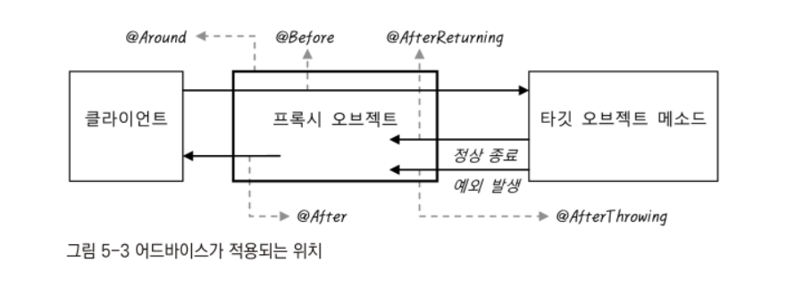

# Chapter 5. AOP와 LTW
- Vol. 1에서 AOP의 기본원리에 대해 알아보았으니 여기서는 @AspectJ AOP를 만드는 방법에 대해 알아본다.

## 5.1 애스팩트 AOP
### 5.1.1 프록시 기반 AOP
#### 프록시 기반 AOP 개발 스타일의 종류와 특징
- AOP는 모듈화된 부가기능과 적용 대상의 조합을 통해 여러 오브젝트에 산재해서 나타나는 공통적인 기능을 손쉽게 개발하고 관리할 수 있는 기술이다.

**AOP 인터페이스 구현과 bean 등록을 이용하는 방법**
- 가장 기초적인 프록시 AOP 개발방법은 AOP의 구성요소 모두 클래스로 개발하고 이를 빈으로 등록해서 적용하는 방법이다.
- 스프링이 제공한 인터페이스를 구현하여 어드바이스와 포인트컷을 개발한 후 이들을 빈으로 등록하고 어드바이저로 구성해 빈으로 등록 후 이를 자동 프록시 생성기에 등록해주면 된다.

**AOP 인터페이스 구현과 aop 네임스페이스의 \<aop:advisor> 태그를 이용하는 방법**
- aop 스키마를 통해 간결하게 위의 내용을 구현할 수 있다.
- aop:config에서 adivisor에 바로 빈의 내용들을 등록하면 된다.

**임의의 자바 클래스와 aop 네임스페이의 \<aop:aspect>를 이용하는 방법**
- 두 번째와 동일하게 aop 네임스페이스를 활용하지만 기존의 어드바이스, 어드바이저 대신 애스펙트라는 개념을 사용한다.
- 애스펙트는 독립적인 AOP 모듈을 뜻하는 개념으로 OOP에 클래스가 있는 것 처럼 AOP에는 애스펙트가 있다.
- 스프링이 Advice, Pointcut, Advisor 인터페이스를 구현하는 것으로 프록시 AOP를 지원했지만 AspectJ와 함께 AOP를 제공하기 위해 애스펙트를 정의해 AOP를 만드는 방법을 제공하고 있다.
- 애스펙트는 애노테이션, xml을 이용하면 평범한 자바 클래스를 애스펙트로 만들 수 있다.
- 인터페이스를 구현하는 제약조건이 없어 메서드는 유연하게 정의되며 하나의 클래스안에 여러개의 애스펙트를 포함시킬 수 있다.

**@AspectJ 애노테이션을 이용한 애스펙트 개발 방법**
- @AspectJ는 이름 그대로 AspectJ AOP 프레임워크에서 정의된 애노테이션을 이용해 애스펙트를 만들 수 있게 해준다.
- 애스펙트의 정의 방법을 차용했을 뿐 AspectJ AOP를 사용하는게 아닌 스프링의 프록시 기반 AOP를 만들 때 사용한다.
- xml에 설정이 필요없고 어드바이스와 포인트컷은 자바 클래스 내에서 정의한 애노테이션을 이용해 정의된다.

> - 첫 번째 방법은 가장 구식이고 번거로우므로 다른 것을 사용하자
> - 두 번째 방법은 Advice 인터페이스를 구현해야할때 적합할 것이다. 스프링의 트랜잭션 AOp가 이를 이용한다.
> - 조금 더 유연하게 정의하고 싶다면 xml을 선호할 경우 세 번째, 애노테이션을 선호할 경우 네 번째가 적합할 것이다.

#### 자동 프록시 생성기와 프록시 빈
- 스프링에서 Clinet가 Target의 인터페이스에 의존을 한 후 Target에 대한 프록시를 만들어 해당 프록시를 의존하게 하여야 AOP가 적용될 것이다.
- 하지만 Autowired로 주입을 받는다면 Target의 인터페이스는 Target 빈과 프록시 빈으로 총 두개가 있기 때문에 주입이 불가해질 것이다.
- 이러한 것을 해결하기 위해 스프링에서는 자동 프록시 생성기를 이용하여 포인트컷에 해당하는 Target들의 빈들을 프록시 빈으로 바꿔치기 해주는 빈 후처리기 덕분에 정상적으로 동작을 구현시킬 수 있다.
- 즉 프록시가 새로운 빈으로 만들고 Client는 프록시 빈을 바라보는게 아닌 현재 등록된 빈에서 프록시 빈으로 대체시키는 것이다.


- 오른쪽을 보면 Target 오브젝트의 빈은 외부로 노출되지 않고 오직 프록시 내부에서만 존재하게 된다.

**AOP 적용은 @Autowired의 타입에 의한 의존관계 설정 문제를 일으키지 않는다.**
**AOP 적용은 다른 빈들이 Target 오브젝트에 직접 의존하지 못하게 한다**
- 다른 클라이언트는 Target을 직접 참조해야하는데 빈이 대체되기 때문에 문제가 발생할 수 있다.
- 이는 클라이언트들이 인터페이스에 의존하고 있다면 문제가 발생하지 않을 것이다.

#### 프록시의 종류
- 보통 JDK의 다이내믹 프록시는 인터페이스를 구현한 프록시이다.
- 스프링에서는 다이내믹 프록시를 이용한 프록시말고도 Client -> Target과 같이 직접적인 의존관계를 만든 경우에도 프록시를 적용할 수 있다.
- 클라이언트가 타깃에 의존하는 것은 변하지 않고 서브 클래스를 만들어 프록시로 사용한다.
- 서브클래스도 타깃의 하위 타입이므로 다형성이 적용되기 때문에 문제가 없다.
- 이 방식은 fianl 클래스, final 메서드가 있다면 상속이 불가능하므로 적용이 되지 않는다.
- 스프링은 CGLib라는 외부 라이브러이에 의존하여 바이트코드 조작기법을 통해 이를 구현한다.
- **이는 스프링이 레거시 코드나 외부에서 개발한 라이브러리등에서도 AOP를 적용하기 위해 지원해주는 것이지 객체지향적인 합성기법과 이를 바탕을 둔 DI사용을 여전히 권장한다.**
- 클래스를 이용한 프록시를 적용하는 방법은 두 가지가 있다.
- 첫 번째 방법은 아예 아무런 인터페이스도 구현하지 않은 타깃 클래스에 AOP를 적용하는 것이다.
- 타깃 오브젝트에 인터페이스가 있다면 다이내믹 프록시를 사용하겠지만 그렇지 않다면 CGLib를 이용한 클래스 프록시를 만들어 줄 것이다.
- 두 번째는 강제로 클래스 프록시를 만들도록 proxy-targer-class를 true로 설정하는 것이다.

### 5.1.2 @AspectJ AOP
- 독립적인 빈의 조합으로 만들어지는 어드바이저와 달리 애스펙트는 다양한 조합을 갖는 포인트 컷과 어드바이스를 하나의 모듈로 정의할 수 있다.

#### @AspectJ를 이용하기 위한 준비사항
- @AspectJ라는 이름의 애노테이션은 존재하지 않고 @MVC라고 부르는 것과 같이 개발 방법의 명칭일 뿐이다.
- \<aop:aspectj-autoproxy/>를 xml 설정에 추가해준다면 해당 애노테이션들을 사용할 수 있게 된다.

#### @Aspect 클래스와 구성요소
- 애스펙트는 자바 클래스에 @Aspect를 붙여서 만들 수 있다.
- 인터페이스 구현, 클래스 상속등 강제하는 것이 없으므로 자유롭다.

**@Pointcut**
- @Pointcut을 메서드에 붙여서 사용할 수 있다. 메서드 내부의 코드는 필요없으며 @Pointcut에 적절한 표현식을 만들어 사용하게 된다.

```java
@Pointcut("execution(* hello(..))")
private void all(){ }
```

**어드바이스: @Before, @AfterReturning, @AfterThrowing, @After, @Around**
- 어드바이스도 포인트컷과 같이 애노테이션이 붙은 메서드를 이용해 정의한다.
- 메서드의 파라미터와 리턴 값은 어드바이스 종류와 포인트컷에서 선언한 파라미터에 따라 달라질 수 있다.
- @Around는 Vol.1에서 구현했던 MethodInterceptor 인터페이스와 기능이 동일하다.

```java
@Component
@Aspect
public class SimpleMonitoringAspect {

    @Pointcut("execution(* hello(..))")
    private void all(){ }

    @Around("all()")
    public Object printParametersAndReturnVal(ProceedingJoinPoint pjp) throws Throwable {
        Object ret = pjp.proceed();
        return ret;
    }
}
```
- Pointcut을 Around에 직접 정의하여도 된다.
- 이상적으로 하나의 애스펙트 안에는 최소 하나의 포인트컷과 이를 사용하는 하나의 애노테이션이 존재해야 하지만 그렇지 않아도 상관없다.
- @Aspect 클래스는 빈을 등록되므로 다른 빈들을 참조하여 이를 활용하는데 문제가 없이 평범한 POJO 클래스처럼 만들면 된다.

#### 포인트컷 메서드와 애노테이션
- 포인트컷은 항상 void 리턴 타입이어야 한다.
- 포인트컷은 적용할 조인 포인트를 선별하는 것이다. 조인 포인트는 어드바이스로 정의된 부가기능을 적용할 수 있는 위치로 스프링에서는 프록시 기반 AOP를 이용하므로 메서드 오직 하나만 존재한다.

**execution()**
- 가장 강력한 포인트컷 지시자로 AspectJ의 표현식을 이용한다.

**within()**
- 타입 패턴만을 이용해 조인 포인트 메서드를 선택한다.
- 지정된 타입의 모든 메서드가 AOP의 적용 대상이 되고 패턴을 이용하므로 패키지 단위 선택도 가능하다.
- 모듈이나 계층별로 패키지가 구분되어 있다면 아래와 같이 포인트컷을 활용할 수 있을 것이다.

```java
@Pointcut(within('com.me.sun.dao..*'))
private void daoLayer() {}

@Pointcut(within('com.me.sun.service..*'))
private void serviceLayer() {}

@Pointcut(within('com.me.sun.web..*'))
private void webLayer() {}
```
- 선택 대상이 타입 레벨에서 결정된다면 execution보다 within이 더 단순하게 사용할 수 있다.
- 단 구현한 인터페이스를 기준으로 선정할 시 execution을 사용해야 한다.

**this, target**
- this, target은 여러 개의 타입을 고를 수 있는 타입 패턴이 아니라 하나의 타입을 지정하는 방식이다.
- this는 빈 오브젝트 타입을 확인하고 target은 타깃 오브젝트 타입을 비교한다.
- 스프링은 빈 오브젝트를 프록시 빈 오브젝트로 변경하므로 this는 프록시 오브젝트 타입을 확인하고, target은 타깃 오브제트 타입을 확인한다.

```java
public class HelloImpl implements Hello {}
```
- 이러한 클래스가 있을 때 AOP가 적용된다면 프록시는 Hello를 구현한 구현체가 된다.
- 그러므로 this로 Hello를 지정하면 프록시 오브젝트 타입이므로 적용이 되지만 HelloImpl일 경우는 적용이 되지 않을 것이다.
- 반면 target은 타겟 오브젝트 타입을 지정하기 때문에 HelloImpl, Hello 모두 적용될 것이다.

**args**
- 메서드 파라미터 타입만을 이용해 포인트컷을 설정할 때 사용한다.
- execution 지시자의 ( )안에 들어가는 파라미터 타입과 동일하다고 생각하면 된다.
- 보통 args는 단독으로 사용하지 않고 within, target과 같이 타입 레벨 지시자와 함께 사용하여 파라미터 타입조건을 추가한다.

```java
args() // 파라미터 없는 메서드만

args(String) // 파라미터 개수가 하나인데 String인 메서드만

args(String, ..) // 첫 번째 파라미터가 String이며 파라미터 개수는 하나 이상인 메서드만

args(String, *) // 파라미터 개수는 두 개이며 첫번째는 String 타입인 메서드만
```

**@target, @within**
- @target은 타깃 오브젝트에 특정 애노테이션이 부여된 것을 선정한다.
- @within은 타깃 오브젝트의 클래스에 특정 애노테이션이 부여된 것을 찾는다.

```java
@target(org.springframework.stereotype.Controller)
// 타깃 오브젝트에 @Controller 애노테이션이 부여된 빈만 선정하는 표현식
```
- @within은 @target과 비슷하지만 선택될 조인 포인트인 메서드는 타깃 클래스에서 선언되어 있어야 한다.
- 즉 슈퍼클래스의 메서드는 해당 되지 않는다.

**@args**
- args와 유사하게 파라미터를 이용해 선정한다. 파라미터 오브젝트에 지정된 애노테이션이 부여되어 있는 경우 선정 대상이 된다.

**@annotation**
- 조인 포인트 메서드에 특정 애노테이션이 있는 것만 선정하는 지시자다.

```java
@annotation(org.springframework.transaction.annotation.Transactional)
```

**bean**
- 빈 이름 또는 빈 아이디를 이용해서 선정하는 지시자로, 와일드 카드를 사용할 수 있다.
- AspectJ에서 차용한게 아닌 스프링 AOP의 전용 지시자이다.

> - 조건이 복잡한 포인트컷을 만들 때는 하나의 표현식에 모든 내용을 담기보다는 의미 있는 작은 단위로 분리해서 정의한 후 이를 조합하자.
> - 포인트 컷 표현식은 논리연산 기호를 이용해 조합이 가능하다.

#### 어드바이스 메서드와 애노테이션
- 스프링은 어드바이스를 쉽게 작성할 수 있도록, 메서드 실행 과정의 일부분에만 적용하도록 만든 어드바이스가 있어 총 5가지의 어드바이스가 존재한다.


- 모든 어드바이스 애노테이션은 기본 값으로 포인트컷을 지정하도록 되어 있다.

**@Around**
- 프록시를 통해 타깃 오브젝트의 메서드가 호출되는 전 과정을 모두 담을 수 있는 어드바이스이다.
- 인터페이스 구현방식에서 사용했던 MethodInterceptor 인터페이스와 유사하다.
- ProceedingJoinPoint를 파라미터로 받으며 이를 통해 오브젝트 메서드를 실행하고 결과를 받을 수 있다.
- @Around는 어드바이스 내에서 타깃 오브젝트의 메서드를 여러번 호출하거나, 호출 파라미터를 바꿔치기하거나, 심지어 타깃 오브젝트 메서드를 호출하지 않도록 만들 수도 있다.
- 클라이언트에서는 타깃 오브젝트를 호출 한 것처럼 보이지만 실제로는 타깃 오브젝트 코드가 동작하기 않게 할 수도 있는 등 매우 강력한 기능을 가지고 있다.
- 만약 항상 타깃 오브젝트 메서드를 호출하고 결과를 그대로 리턴하는 것은 동일하고 단지 호출 시점에 파라미터 값만 조사해서 로깅을 하는 등의 값 확인만 한다면 Around말고 단순한 어드바이스를 사용하는게 적합할 수도 있다.
- @Around는 다른 단순한 어드바이스로 적용할 수 없을 때 선택하는 것이 가장 적합하다.

**@Before**
- 타깃 오브젝트 메서드가 실행되기 전에 사용되는 어드바이스이다.
- 어드바이스로는 타깃 오브젝트 메서드를 호출하는 방식을 제어할 수 없으므로 타깃 오브젝트 메서드 호출은 정상적으로 일어난다.
- @Before를 사용하는 것은 리턴 값에는 별 관심이 없고 단지 어떤 메서드가 호출되고 어떤 파라미터를 사용하는지를 참조해서 필요한 부가작업을 수행할 수 있다.
- JoinPoint 타입의 파라미터를 사용하여 확인이 가능ㅎ다ㅏ.
- JoinPoint는 ProceedingJoinPoint의 슈퍼클래스로 proceed() 메서드가 존재하지 않아 메서드를 실행할 수 없다.

```java
@Before("pointCut()")
public void logJointPoint(JoinPoint jp){
  System.out.println(jp.getSignature().getDeclaringTypeName());
  System.out.println(jp.getSignature().getName());
  for(Object arg : jp.getArgs()) { System.out.println(arg); }
}
```
- getSignature를 통해 메서드의 정보를 받아 사용할 수 있다.
- @Before은 @Arounㅇ에서 처럼 타깃 오브젝트 메서드로 전달되는 파라미터를 변경할 수 없다.
- 하지만 JoinPoint를 통해 파라미터를 참조할 수 있다. 즉 파라미터 자체를 변경할 수 없어도 파라미터가 참조하는 오브젝트의 내용을 변경할 수는 있다.

**@AfterRetruning**
- @AfterRetruning은 타깃 오브젝트의 메서드가 실행을 마친 뒤에 실행되는 어드바이스이다.
- 단 예외가 발생하지 않고 정상적으로 종료한 경우에만 해당한다.
- 타깃 오브젝트 메서드가 정상 종료된 후에 호출되므로 메서드의 리턴 값을 참조할 수 있다.
- 애노테이션에 returning 엘레먼트를 이용해 리턴 값을 담을 파라미터 이름을 지정하여야 한다.

```java
@AfterReturning(pointcut="myPointcut()", returning="ret")
public void logReturnValue(Object ret){
}
```
- @AfterRetruning은 리턴 값 자체를 바꿀 수 없다. 리턴 값을 변경하려면 @Around를 사용하여야 한다.
- 하지만 리턴 값이 참조 타입이면 참조에의해 해당 값을 변경시킬 수는 있다.
- 만약 파라미터 타입을 구체적으로 지정해주면 리턴 타입이 일치하는 경우에만 어드바이스가 실행된다.
- retruning은 필요 없다면 사용하지 않아도 되며 리턴 타입 파라미터 앞에 JoinPoint를 사용할 수도 있다.

**@AfterThrowing**
- 타깃 오브젝트의 메서드를 호출했을 때 예외가 발생하면 실행되는 어드바이스이다.
- 예외를 전달받을 메서드 파라미터 이름을 지정할 수 있다.

```java
@AfterThrowing(pointcut="daoLayer()", throwing="ex")
public void logDAException(DataAccessException ex){

}
```
- 만약 모든 예외를 다 받고 싶다면 Throwable로 파라미터 타입을 지정한다.

**@After**
- 메서드 실행이 정상 종료됐을 때와 예외가 발생했을 때 모두 실행되는 어드바이스이다.
- finally 블럭과 비슷한 용도라고 할 수 있다/
- 반드시 반환돼야 하는 리소스가 있거나 메서드 실행 결과를 항상 로그로 남겨야 하는 경우에 사용할 수 있다.
- 하지만 리턴 값이나 예외를 직접 전달받을 수는 없다.

#### 파라미터 선언과 바인딩
- 포인트컷 표현식의 타입 정보를 파라미터와 연결하는 방법이있다.
- 이 방식을 사용하면 포인트컷 표현식 내에 길게 선업했던 타입 정보를 파라미터 타입 정보로 대신하게 할 수 있어 표현식이 간결해지고 편리하다.

```java
@Before("@target(com.temp.annotation.BatchJob)")
public void beforeBatch() { }


// ==================================================================

import com.temp.annotation.BatchJob;

@Before("@target(bj)") // 메서드 파라미터 타입 정보를 참조해서 적용 가능
public void beforeBatch(BatchJob bj){ }

// ==================================================================

@Pointcut("@target(bj)")
private void batchJob(BatchJob bj) { }

@Before("batchJob(bj)")
public void beforeBatch(BatchJob bj){ }
// 포인트 컷을 따로 적용할 경우에도 사용가능하다.
```
- 포인트컷 표현식 내의 파라미터 이름은 포인트컷 메서드 또는 어드바이스 메서드의 파라미터 이름과 일치해야 한다.

#### @AspectJ를 이용한 AOP의 학습 방법과 적용 전략
- AsepctJ AOP는 단순한 메서드 인터셉터나 데코레이터 패턴 적용 수준을 넘어 하나의 정교한 언어 또는 새로운 프로그래밍 패러다임으로 여겨질 만큼 매우 방대하다.
- @AspectJ는 AspectJ AOP의 일부 용어와 개념을 차용한 수준이라 단순하지만, 그래도 포인트컷 표현식의 문법, 지시자, 사용방법, 파라미터 선언, 어드바이스 종류등 알아야 할 것들이 많다.
- 또한 AOP는 그 적용 대상이 쉽게 파악되지 않기 때문에 복잡한 포인트컷을 보고 타깃을 유추하기 쉽지 않을 수 있다.
- 스프링 AOP의 어떤 개발 스타일이든 AOP는 항상 단순하고 명로하게 접근해야 한다.
- 객체지향적인 방법으로 해결할 수 있는 것을 불필요하게 AOP를 이용하려고 하면 안된다.
- AOP는 기본적으로 핵심 로직이 아닌 부가적인 기능을 적용할 때 사용하는 것이다.
- 즉 AOP를 모두 제거해도 핵심 기능과 도메인 로직 자체는 이상없이 동작해야할 것이다.
- AOP를 테스트하기 가장 어려운 것은 포인트컷의 적용 대상 환인이다.
- 이때는 로그를 남기거나 예외를 던지는 검증용 어드바이스를 작성해 확인하면 된다.
