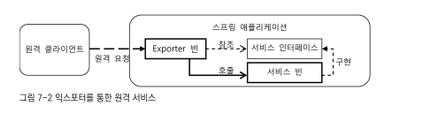
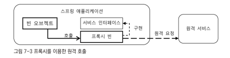

## 7.1 스프링 기술과 API를 효과적으로 학습하는 방법
- 스프링은 일관된 방식으로 개발된 프레임워크이므로 모든 코드와 API가 동일한 원리에 기반을 두고 만들어져 있다.
- 스프링의 모든 것은 DI라고 해도 과언이 아니다. 스프링 자신도 DI를 이용해 만들어 졌다.
- 스프링의 핵심 엔진이라고 할 수 있는 애플리케이션 컨텍스트/컨테이너와 웹 기술의 중심인 DispatcherServlet도 모두 DI 원리를 이용해서 확장할 수 있도록 만들어져 있다.

### 7.1.1 빈으로 등록되는 스프링 클래스와 DI
- 어떤 오브젝트가 빈으로 사용된다는 건 다른 빈에 의해 DI 돼서 사용되는 서비스라는 의미이다.
- 즉 클라이언트를 가지고 해당 클라이언트와 의존관계를 갖게 된다.
- 그리고 다른 빈이나 정보에 의존하고 있다는 의미를 가지고 있다.
- 대부분의 빈은 자신이 클라이언트가 돼어 다른 빈 오브젝트를 사용하도록 만들어져 있다.
- 그러므로 스프링의 기능을 파악하고 사용하기 위해선 이 두가지의 관점으로 스프링이 제공하는 빈 클래스를 살펴보는 것이 좋은 스프링 학습 방법이다.
- 스프링이 모든 기능을 DI를 이용해서 제공하기 때문이다.
- JdbcTemplate를 사용하고 트랜잭션 AOP를 사용하기 위해 DataSourceTransactionManager를 빈으로 등록해야한다.

#### 구현 인터페이스 분석
- IDE로 DataSourceTransactionManager을 찾아들어가 해당 구현체들을 하나씩 분석해보면 DataSourceTransactionManager이 무엇을 구현하고 어떤 용도로 쓰이는지 있는지 이해할 수 있다.
- 더해서 해당 인터페이스들의 구현체가 무엇이 있고 어떤 구조로 클래스가 구성되고 있는지 확인하면 좋을 것이다.

#### 프로퍼티 분석
- DataSourceTransactionManager의 프로퍼티 수정자 메서드를 확인해보면 어떤 대상에게 의존하고 있는지를 알 수 있다.
- 각 수정자 메서드들의 설명을 보면서 설정 방법 및 디폴트 구현체들을 확인할 수 있을 것이다.

#### DI/확장 포인트 분석
- 빈 클래스의 프로퍼티 중 인터페이스 타입의 프로퍼티를 보면 해당 구현 클래스의 확장 포인트라고 생각하면 된다.
- DataSourceTransactionManager에서 의존대상인 DataSource는 인터페이스로 구성되어 있어 다양한 구현체 뿐만아니라 직접 확장하여 기능을 구현할 수 있다.
- 대표적으로 DelegatingDataSource를 이용하여 다양한 기능들을 추가할 수 있다.

**LazyConnectionDataSourceProxy**
- 트랜잭션 매니저와 실제 DataSource사이에서 DB 커넥션 생성을 최대한 지연 시켜주는 기능을 제공한다.
- 공유해서 사용되는 리소스를 최대한 늦게 이용하게 하는 전형적인 프록시 패턴이다.
- 트랜잭션 시작시 getconnection()을 통해 커넥션을 가져오더라도 실제 트랜잭션을 열지 않는다.
- Statement를 통해 실제 SQL을 날릴 때 까지는 가짜 커넥션을 돌려주고 SQL을 날릴 때 트랜잭션을 실행하여 커넥션 리소스 효율을 극대화 시킨다.
- 이는 JPA와 같은 ORM에서 2차 캐시를 활용할 때 매우 효율적이다.
- 2차 캐시를 사용할 때 DAO 메서드가 실행되면 실제 DB를 조회하는 대신 메모리나, 파일에 저장된 캐시 결과를 가져올 경우가 있는데 이런 경우 DB 커넥션을 가져오고 트랜잭션을 시작하는 건 자원 낭비가 된다.
- 이럴때 LazyConnectionDataSourceProxy를 활용하면 때에따라 커넥션을 아예 사용하지 않고 캐싱만을 이용하여 리소스를 조회할 수 있을 것이다.

**AbstractRoutingDataSource**
- 추상 클래스로 상속을 통해 기능을 추가하고 사용해야 한다. 스프링은 AbstractRoutingDataSource의 서브 클래스로 IsolationLevelDataSourceRouter를 제공하고 있다.
- AbstractRoutingDataSource는 다중 DataSoruce에 대한 라우팅을 제공하는 프록시다.
- 여러개의 DataSoruce가 존재하지만 DAO나 트랜잭션 매니저에는 하나의 DataSource만 존재하는 것처럼 사용하도록 만들어야 할 때가 있다.
- 에를들어 DB를 두 개 만들어 하나는 데이터 조작과 조회가 모두 가능한 마스터 DB로 두고, 다른 DB는 마스터 DB를 실시간으로 복제해서 동일한 정보를 갖게 하지만, 수정 트랜잭션은 허용하지 않고 조회전용으로만 사용하는 구성을 만들 수 있다. 쿼리에 대한 부하를 분산시키기 위해 사용되는 기법이다.
- 조회의 경우에는 읽기 전용 DB를 사용하고 수정도 일어나는 경우는 마스터 이비를 사용하도록 할 때 AbstractRoutingDataSource를 확장해서 클라이언트와 타깃 사이의 접근을 제어하는 프록시를 두어 사용할 수 있다.
- AbstractRoutingDataSource는 룩업키와 DataSource 맵을 정의한 후 룩업키를 어떻게 결정할 지는 서브클래스에서 구현하도록 추상메서드로 정의되어 있다.

```Java
public class ReadOnlyRoutingDataSource extends AbstractRoutingDataSource {
    @Override
    protected Object determineCurrentLookupKey() {
        boolean readOnly = TransactionSynchronizationManager.isCurrentTransactionReadOnly();
        return readOnly ? "READONLY" : "READWRITE";
    }
}
```
- 현재 트랜잭션이 READONLY로 설정되어 있는지를 확인 후 룩업 키를 반환해준다.
- 이제 이를 빈으로 등록하고 DataSource 빈을 지정해주면 된다.

```xml
<bean id="dataSourceRouter" class="ch6.ReadOnlyRoutingDataSource">
    <property name="targetDataSources">
        <map>
            <entry key="READWRITE" value-ref="masterDataSource"/>
            <entry key="READONLY" value-ref="readOnlyDataSource"/>
        </map>
    </property>
    <property name="defaultTargetDataSource" ref="masterDataSource"/>
</bean>
```
- 기존 코드는 전혀 손댈 필요도 없이 단지 설정을 통해 구 개의 DB를 동시에 활용하면서 필요에 따라 사용할 DB로 바꿀 수 있게 되었다.
- 스프링이 직접제공하는 IsolationLevelDataSourceRouter는 트랜잭션 격리수준에 따라 다른 DataSource를 사용하게 한다.
- 이 외에도 사용자 레벨에 따라 다른 DB를 사용하도록 하거나, 시간대에 따라 DB를 변경하거나하는 등 DataSource 라우팅 기법을 손 쉽게 적용할 수 있다.

> DataSourceTransactionManager에 DataSource라는 인터페이스 타입의 프로퍼티가 있는 것을 보면 자연스럽게 스프링에는 DataSource를 구현하는 클래스들이 어떤게 있는지 찾아보는 습관을 들이는 일이 스프링 학습에 많은 도움이 될 것이다.

---

## 7.2 IoC컨테이너 DI
- Dispatcher Servlet과 마찬가지로 스프링 IoC/DI 컨테이너, 즉 애플리케이션 컨텍스트도 그 자체로는 빈은 아니지만 DI를 받는다.

### 7.2.1 BeanPostProcessor와 BeanFactoryPostProcessor
- 가장 많이 사용되는 IoC 컨테이너의 확장 포인트는 바로 빈 후처리기와 빈 팩토리 후처리기이다.
- BeanPostProcessor는 실제 빈 오브젝트를 생성하는 시점에서 사용되고, BeanFactoryPostProcessor는 빈 설정 메타데이터가 준비된 시점에서 사용된다.

#### BeanPostProcessor
```Java
public interface BeanPostProcessor {
	@Nullable
	default Object postProcessBeforeInitialization(Object bean, String beanName) throws BeansException {
		return bean;
	}

	@Nullable
	default Object postProcessAfterInitialization(Object bean, String beanName) throws BeansException {
		return bean;
	}
}
```
- BeanPostProcessor의 postProcessBeforeInitialization는 메빈 오브젝트가 처음 만들어지고 초기화 메서드가 호출되기 이전에 실행된다.
- 만들어진 빈 오브젝트와 이름을 제공해주는데, 원한다면 주어진 빈 오브젝트를 바꿔치기할 수 있다.
- @Autowried와 같이 빈 의존관계를 적용하는 것도 BeanPostProcessor를 구현한 빈이 해주는 작업이다.
- AOP의 동작원리인 자동 프록시 생성기도 역시 BeanPostProcessor를 구현한 빈이다.

### BeanFactoryPostProcessor
- 빈 오브젝트가 아니라 빈 팩토리에 대한 후처리를 가능하게 하는 확장 인터페이스이다.

```Java
@FunctionalInterface
public interface BeanFactoryPostProcessor {
	void postProcessBeanFactory(ConfigurableListableBeanFactory beanFactory) throws BeansException;
}
```
- 컨테이너는 빈 팩토리 후처리기가 있다면 getProcessBeanFacotyr에 빈의 모든 메타정보를 담고 있는 ConfigurableListableBeanFactory
타입의 오브젝트를 전달해주는데 바로 컨테이너 자신을 보내준다.
- 이를 이용해서 등록된 빈의 메타정보 자체를 조작할 수 있고 프로퍼티 값을 추가로 설정하는 수준이 아닌 아예 새로운 빈으로 등록할 수 있다.
- @Configuration 태그가 붙은 클래스는 @Bean 메서드 선언을 통해 새로운 빈이 등록가능하다.
- @Configuration의 동작도 BeanFactoryPostProcessor가 있기 때문에 가능한 것이다.
- ConfigurationClassPostProcessor가 바로 @Configuration과 @Bean이 붙은 클래스 정보를 이용해 새로운 빈을 만들어준다.


---

## 7.3 SpEL
- 스프링 3.0부터 스프링 전용 표현식을 제공한다. 이를 보통 스프링EL, SpEL이라고 표현한다.
- 가장 기본적으로 SpEL이 적용된 경우는 빈 설정 파일이나 애노테이션을 이용해 프로퍼티 값을 지정할 때이다.
- AOP에서 @AspectJ를 이용해 특정 애노에티션이 붙은 메서드나 클래스에 선별하는 포인트컷을 적용하는 경우에 유용하게 사용할 수 있다.
- @SecuredLogic이라는 애노테이션이 붙은 메서드에 보안 기능을 추가하는 AOP를 annotation() 지시자로 추가할 수 있을 것이다.
- 여기서 메서드별로 추가 조건을 지정한다면 더욱 효율적인 보안 기능을 수해앟ㄹ 수 이씅ㄹ 것이다.

```Java
@SecuredLogic("user.level == T(com..UserLevel).GOLD")
public void goldOnly(){ }

@SecuredLogic("user.point > 100 && user.retreyCount < 5")
public void transferPoint() { }
```

- SpEL이 장점이 많으나 자바코드로 충분한 작업이라면 대신 자바 코드를 사용하는 것이 좋을 것이고 자바 코드를 사용하기 힘든 XML과 같은 설정파일에서 유용하게 사용될 수 있다.

### 7.3.1 SpEL 사용법
- SpEL을 사용하려면 두 가지 인터페이스를 잘 활용하면 된다.
- 먼저 ExpressionParser 인터페이스로 표현식을 파싱하는 기능이 정의되어 있다.
- 대표적인 구현클래스 두 가지가 있는데 주로  SpelExpressionParser를 주로 사용한다.
- 빈으로 등록하여 DI가 가능하다.
- 두번째로는 Expression 인터페이스가 존재하는데 파서에 의해 해석된 표현식 정보를 가진 오브젝트 타입이다.
- 1+2와 같이 단순하고 매번 결과가 같은 표현식이라면 아래와 같이 파서로부터 파싱한 표현식을 Expression으로 가져올 수 있다.

```Java
public static void main(String[] args) {
    ExpressionParser parser = new SpelExpressionParser();

    Expression ex = parser.parseExpression("1+2");
    int result = (int) ex.getValue();
}
```
- 이렇게 파싱한 값을 바로 가져오지 않고 Expression을 통해 가져오는 이유는 Expression 오브젝트를 재사용할 수 있기 때문이다.
- 단순한 연산의 경우는 별 차이가 없겠지만 아래와 같이 Expression을 활용하면 재사용을 효율적으로 누릴 수 있다.

```Java
Expression nameEx = parser.parseExpression("name");
for(User user : userList){
    nameList.add(nameEx.getValue(user));
}
```

---

## 7.5 리모팅과 웹 서비스, EJB
- 스프링에서는 RMI, RESTful, JMS, 스프링 HTTP Invoker등 다양한 리모팅 기술을 지원한다.
- 리모팅은 원격 시스템과 애플리케이션이 연동해서 동작하게 해주는 기술이다.
- 스프링 애플리케이션이 클라이언트 시스템에게 원격 서비스를 제공하는 것과 다른 원격시스템의 서비스를 이용하는 것 두 가지로 구분할 수 있다.

### 7.5.1 익스포터와 프록시
- 스프링은 서비스를 제공할 때나 사용할 때 모두 인터페이스를 이용해야 한다.
- 원격 클라이언트에게 제공되는 기능을 담은 서비스 빈은 서비스 내용이 정의된 인터페이스를 구현하고 있어야 하며, 원격 서비스를 사용할 때에도 마찬가지로 원격 서비스의 내용이 담긴 인터페이스에 접근해야 한다.

#### 익스포터
- 서비스를 제공할 때는 원격 요청을받아 특정 인터페이스를 구현한 서비스 빈에게 요청을 전달해주는 빈을 이용해야 하는데 이를 익스포터라고 한다.
- 이 익스포터가 원격 클라이언트의 오브젝트인 것 처럼 서비스를 제공하는 빈을 인터페이스를 통해 호출해주도록 구성된다.


- 보통 익스포터는 원격 요청을 처리하는 서블릿 등을 통해 HTTP 요청을 전달받고 이를 해석한 후 미리 설정을 통해서 등록된 인터페이스를 이용해 서비스 빈을 호출한다.
- 익스포터 빈은 대부분 서비스 빈의 존재와 구현 인터페이스를 모르므로 서비스 인터페이스를 함께 제공해줘서 어떤식으로 메서들을 호출해야 하는지 파악할 수 있게 해주어야 한다.

#### 프록시
- 원격 시스템에 있는 오브젝트를 대신해서 클라이언트 오브젝트의 호출을 받고, 이를 원격 오브젝트에 전송해서 결과를 가져와 클라이언트에게 오브젝트를 돌려주는 역할을 맡은 빈 오브젝트를 프록시라고 부른다.
- 전형적인 원격 프록시 패턴이 적용된 예라고 볼 수 있다.



> - 모든 스프링 리모팅 지원 기능은 익스포터와 프록시 방식을 사용하므로 이 두가지 갠며을 잘 이해하고 있다면 쉽게 적용이 가능하다.

### 7.5.2 RESTful 서비스 템플릿
- RESTful 클라이언트 기능은 여타 리모팅 기술과 사용방법이 다르다.
- RESTful 서비스는 스프링 MVC를 통해 구현하므로, 리모팅에서는 원격 RESTful 서비스 사이트를 이용해 결과를 가져오는 클라이언트 기능만 제공한다.

---

## 7.6 태스크 실행과 스케줄링
### 7.6.1 TaskExecutor 서비스 추상화
- java.lang.Runnable은 run()이라는 단순한 메서드를 가진 인터페이스로서 독립적인 스레드에 의해 실행되도록 의도된 오브젝트를 만들 때 주로 사용한다.
- 이렇게 독립적인 스레드 안에서 동작하도록 만들어진 오브젝트를 독립적으로 실행 가능한 작업이라는 의미로 TASK라고 부른다.
- 스프링은 서비스 추상화를 통해 태스크실행기(TaskExecutor)라는 인터페이스를 추상화하여 제공한다.

```Java
@FunctionalInterface
public interface TaskExecutor extends Executor {
	@Override
	void execute(Runnable task);
}
```
- TaskExecutor는 Runnable을 파라미터로 받아 실행하는 execute라는 하나의 메서드만 존재한다.
- 사실 이 TaskExecutor는 java.lang.concurrent 패키지의 Executor와 똑같은 메서드를 가지고 있다.
- Executor와 똑같은 TaskExecutor를 정의한 이유는 JDK의 Executor를 구현하지 않은 CommonJWorkManager나 Quartz 같은 기술의 태스크 실행기에 대한 어댑터를 제공하는 좀 더 폭넓은 서비스 추상화를 위해서이다.
- 또한 스프링에 최적화된 방식으로 태스크 실행기를 확장하고 활용하는 독자적인 태스크 실행기능을 제공하기 위해서 이기도 하다.
- Executor와 마찬가지로 TaskExecutor도 그 자체로는 독립적인 스레드에서 태스크를 실행해야 할 의무는 없다.
- 그럼에도 불구하고 대부분의 TaskExecutor가 추상화한 기술은 비동기적으로 독립적인 스레드에서 실행되며, 주로 스레드 풀을 사용하는 방식을 사용한다.
- 동기화 방식을 사용하며 스레드 풀을 사용하지않는 구현방식도 존재하긴 하지만 실제로는 비동기 방식으로 스레드 풀을 이용해 실행되는 것이 유용하게 쓰일 수 있는 모델이다.
- TaskExecutor의 구현 기술과 클래스를 살펴보자.

**ThreadPoolExecutor**
- 스프링의 ThreadPoolExecutor는 이름이 같은 JDK의 ThreadPoolExecutor에 대한 어댑터 클래스이다.
- 지정된 크기의 스레드 풀을 이용하며, 작업 요청을 큐를 통해 관리된다.
- 가장 손쉽게 사용할 수 있는 대표적인 태스크 실행기다.

**SimpleThreadPoolTaskExecutor**
- Quartz의 SimpleThreadPool을 이용해 만들어진 태스크 실행기로 Quartz 스케줄러와 독립적으로 사용되면서 동시에 Quartz의 작업에도 활용될 수 있는 장점이 있다.

**WorkManagerTaskExecutor**
- CommonJ 작업 관리자의 태스크 실행기에 대한 어댑터이다.

### 7.6.2 TaskScheduler
- 자바 엔터프라이즈 환경에서 사용되는 태스크는 일정한 간격 또는 시간 기준에 따라 실행되는 스케줄링 방식으로 동작하는 경우가 대부분이다.
- 스프링에서는 TaskExecutor와 마찬가지로 스케줄링에 대한 추상화인 TaskScheduler도 제공한다.
- 특정 시간, 일정한 간격 등 주어진 조건에 따라 주기적인 실행이 가능하다.
- 혹은 Trigger 인터페이스를 구현해서 좀 더 유연한 실행조건을 만들 수 있다.
- 유닉스 계열의 서버 환경에서 가장 많이 사용하는 cron서버의 실행 시간 설정 포맷을 그대로 활용할 수 있은 CronTrigger가 대표적인 트리거 구현 클래스이다.
- TaskScheduler의 대표적인 구현체에 대해 알아보자.

**ThreadPoolTaskScheduler**
- JDK의 ScheduledThreadPoolExecutor 스케줄러에 대한 어댑터이다.
- ScheduledThreadPoolExecutor는 스레드 풀 방식의 태스크 실행기도 함께 가지고 있다.
- 별도의 스레드 관리 서비스를 두지 않는 경우에 간편하게 쓸 수 있다.

**TimerManagerTaskScehduler**
- CommonJ의 TimerManager를 TaskScheduler로 추상화한 클래스이다.

### 7.6.4 애노테이션을 이용한 스케줄링과 비동기 태스크 실행
#### @Scheduled
- XML 설정 대신 태스크 역할을 맡을 메서드에 직접 스케줄 정보를 애노테이션을 통해 부여해서 스케줄이 적용되게 해준다.
- @Scheduled는 세 가지 종류의 트리거 설정을 지원한다.

**fixedDelay**
- 이전 작업이 끝난 시점부터 일정 시간이 지난 후에 동작하도록 설정한다.
- 시간단위는 밀리초이다.

```Java
@Scheduled(fixedDelay=60000)
public void checkSystemStatus(){ }
```
- checkSystemStatus는 이전 메서드의 작업이 끝난 후로부터 1분 후에 실행하는 스케줄러 설정 코드이다.

**fixedRate**
- 밀리초로 설정된 일정 시간 간격으로 메서드가 실행되게 해준다.
- fixedDelay와 다르게 이전 메서드가 호출된 시점으로부터의 시간이다.

**cron**
- cron 포맷을 사용해 스케줄을 지정할 수있어 가장 유연하게 스케줄을 지정할 수 있는 방법이다.


#### @Async
- @Async가 부여된 메서드는 자동으로 비동기 방식으로 실행된다.
- TaskExecutor를 코드로 사용하지 않고도 비동기 실행이 가능하게 해주는 편리한 애노테이션이다.
- 리턴 타입은 void 혹은 Future타입이여야 하며 메서드는 다른 코드에 의해 직접 호출되므로 파라미터는 가질 수 있다.

---

## 7.7 캐시 추상화
- 스프링 3.1은 빈의 메서드에 캐시 서비스를 적용할 수 있는 기능을 제공한다.
- 캐시 서비스는 트랜잭션과 마찬가지로 AOP를 이용해 메서드 실행 과정에서 투명하게 적용된다.
- 애플리케이션 빈의 메서드에 캐시를 적용하는 목적은 무엇일까?
- 사용자가 많은 고객 지원 서비스 시스템을 만들었을 때 메인 페이지에 접속하면 항상 공지사항이 출력돼야 한다.
- 새로운 내용이 추가되기 전까지 모든 사용자에게 동일한 내용을 보여주면 된다.
- 이런 공지사항을 DB에 저장해두고 매번 조회한다면 비효율적일 것이다.
- 이럴 때 캐시를 적용하면 리소스를 효율적으로 사용할 수 잇을 것이다.
- 캐시는 이렇듯 반복적으로 동일한 결과가 돌아오는 작업에만 이용하는게 효율적이다.
- 그리고 캐시를 사용할 때는 해당 내용이 변경되는지 신선도 검사를 잘 해야 최신화된 내용을 사용할 수 있을 것이다.

### 7.7.1 애노테이션을 이용한 캐시 속성 부여
- 스프링의 캐시 서비스 추상화는 AOP를 이용한다.
- 캐시 기능을 담은 어드바이스는 스프링이 제공한다.
- 이를 적용할 대상 빈과 메서드를 선정하고 속성을 부여하는 작업은 기본 AOP 설정 방법을 이용할 수 있다.

#### @Cacheable
- 캐시 서비스는 클래스나 인터페이스 레벨에 지정할 수도 잇지만 보통 메서드 단위로 지정한다.
- 캐시에 저장할 내용과 캐시 속성 정보로 메서드의 리턴값과 메서드 파라미터를 사용하기 때문이다.

```Java
@Cacheable("product")
public Product bestProduct(String productNo){

}
```
- bestProduct는 인기제품 정보를 조회하는 기능을 제공하는 메서드이다.
- 제품번호는 넣으면 제품 정보를 DB에서 조회하여 Product 오브젝트에 담아 돌려준다.
- 인기 제품이기 때문에 빈번하게 조회될 가능성이 높으므로 캐시를 적용하기에 적당하다.
- 캐시의 이름은 @Cacheable에 있는 product이며 product라는 이름의 캐시에 Product 타입의 오브젝트를 저장하는ㄱ ㅓㅅ이다.
- 하나의 캐시에는 key가 다른 여러 개의 오브젝트를 넣을 수 있다.
- bestProduct()의 파라미터인 productNo가 product 캐시의 key가 된다.
- 캐시에 오브젝트가 저장될 때는 키 정보도 함께 저장되며 해당 캐시가 존재하지 않는다면 결과 값을 캐시에 추가하게 된다.

```Java
bestProduct("A-001") // (1)
bestProduct("A-001") // (2)
bestProduct("B-001") // (3)
bestProduct("A-001") // (4)
bestProduct("B-001") // (5)
```
- (1)이 호출될 때 AOP에 의해 캐시 기능을 담당하는 어드바이스가 먼저 실행된다.
- @Cacheable 설정에 의해 product 캐시에서 키 값이 A-001인 오브젝트를 찾아 확인한다.
- 캐시가 존재하지 않으므로 캐시를 추가하고 이후부터는 A-001에 대한 조회는 캐시에 저장된 값을 반환하며 bestProduct메서드가 실행되지 않을 것이다.
- 만약 bestProduct와는 다르게 메서드 파라미터가 없다면 캐시 서비스의 기본 키 값 생성 구현 방식에 의해 0이라는 키를 지정한다.
- 공지사항 조회같이 조건 없이 항상 동일한 결과를 리턴하는 메서드라면 파라미터가 없는 메서드로 만들면 된다.
- 만약 메서드 파라미터 값이 여러개라면 모든 파라미터의 hashCode() 값을 적절히 조합하여 키로 만들게 된다.
- 혹은 직접 원하는 파라미터를 지정해줄 수 있다.

```Java
@Cacheable(value="product", key="#productNo")
Product bestProduct(String productNo, User user, dateTime)
```
- bestProduct의 파라미터에서 User, Date는 단지 사용자와 해당 조회 시간을 분석하기 위함이라면 productNo로만 캐시를 만들도록 할 수 있다.
- ket값은 SpEL을 이용해 지정하므로 만약 하나의 클래스에 담겨있는 객체를 파라미터로 받는다면 아래와 같이 사용할 수 있다.

```Java
public class SearchCondition{
  String productNo;
  User user;
  Date datetime;
}

@Cacheable(value="product", key="#condition.productNo")
Product bestProduct(SearchCondition condition)
```
- 뿐만 아니라 특정 조건에 맞을 때만 캐시를 적용하고 그 외는 캐시 서비스를 적용하지 않도록  condition을 설정할 수 있다.

```Java
@Cacheable(value="user", condition="#user.type == 'ADMIN'")
public User findUser(User user)
```
- userType이 ADMIN인 경우에만 캐시를 적용할 것이다.

#### @CacheEvit, @CachePut
- 캐시는 적절한 시점에 제거돼야 한다. 캐시는 메서드를 실행했을 때 동일한 결과가 보장되는 동안에만 사용돼야 하고 메서드 실행 결과와 캐시 값이 달라지는 순간 제거돼야 한다.
- 캐시를 제거하는 방법은 일정한 주기로 캐시를 제거하는 것과 캐시에 저장된 값이 변경되는 상황을 알 수 있다면 특정 메서드가 실행될 땓 캐시를 제거하게할 수 있다.

```Java
@CacheEvict(value="bestProducts")
public void refreshBestProducts(){ };
```
- @CacheEvit을 이용하면 메서드가 실행될 때 지정한 캐시의 내용이 제거된다.
- @CacheEvit은 기본적으로 메서드의 키 값에 해당하는 캐시만 제거한다.

```Java
@CacheEvict(value="product", key="#product.productNo")
public void updateProduct(Product product)
```
- 이 경우 같은 productNo만 가진 키 값을 제거할 것이다.
- 캐시에 저장된값 모두를 제거할 필요가 있다면 allEntries=true로 설정하면 될 것이다.
- 드물지만 메서드를 캐시에 값을 저장하는 용도로만 사용하기 위한 @CachePut도 존재한다.
- 저장된 캐시의 내용을 사용하지는 않고 항상 메서드를 실행시켜 캐시를 저장하게하여 한 번에 많은 캐시를 저장하거나, 다른 사용자가 참고할 정보만 생성하는 용도로 사용하기 적합할 것이다.

#### 애노테이션을 이용한 캐시 기능 설정
- xml의 경우 \<cache:annotation-driven/> 전용 태그를 이용하면 된다.
- 하지만 @EnableCaching 애노테이션을 @Configuration 클래스에 붙여준다면 동일하게 사용할 수 있다.
- 물론 캐시도 AOP를 이용하기 때문에 프록시 타겟을 class로 사용하도록해 클래스에도 적용하게할 수 있다.

### 7.7.2 캐시 매니저
- 캐시는 스프링에서 추상화를 해주기 때문에 캐시 기능을 적용하는 AOP 어드바이스는 스프링이 제공해주는 것을 애노테이션을 통해 적용하면 되므로, 신경 쓸 부분은 적용할 캐시 기술을 선정하고 캐시 관련 설정을 넣어주는 것이다.
- 캐시 추상화 API인 캐시 매니저는 org.springframework.cache 패키지의 CacheManager 인터페이스를 구현해서 만든다.

**ConcurrentMapCacheManager**
- ConcurrentMapCache 클래스를 캐시로 사용하는 캐시 매니저다.
- 캐시를 Map으로 메모리에 저장해두기 때문에 속도가 매우빠르고 간단하지만 본격적인 캐시로 사용하기에는 기능이 빈약하다.
- 캐시별 용량제한, 다양한 저장방식 지원, 다중 서버 분산과 같이 고급 캐시 프레임워크가 제공하는 기능을 지원하지 않는다.

**SimpleCacheManager**
- 기본적으로 제공하는 캐시가 없어 프로퍼티를 이용해서 사용할 캐시를 직접 등록해주어야 한다.
- 스프링 Cache 인터페이스를 구현해서 캐시 클래스를 직접 만드는경우 테스트에서 사용하기 적당하다.

**EhCacheCacheManager**
- 자바에서 가장 인지도 높은 캐시 프레임워크중 하나인 EhCache를 지원하는 캐시 매니저이다.
- 본격적으로 캐시 기능 적용 시 사용하기 적합하다.
- EhCacheCacheManager는 EhCache의 캐시 매니저를 프로퍼티로 등록해주어야 한다.
- 스프링의 캐시매니저와 이름이 같으나 다른 API이므로 혼동하면 안된다.
- EhCacheManagerfactoryBean을 이용하여 EhCacheCacheManager의 프로퍼티에 EhCache를 간편하게 등록할 수 있다.

```xml
<bean id="cacheManager"
         class="org.springframework.cache.encache.EhCacheCacheManger">
   <property name="cacheManager" ref="ehcache"/>
</bean>

<bean id="ehcache"
      class="org.springframework.cache.encache.EhCacheManagerFactoryBean">
   <property name="configLocation" value="ehcahe.xml"/>
</bean>
```
- EhCacheManagerFactoryBean에 ehcache.xml을 등록해주면 간단하게 설정할 수 있다.

```Java
@Autowried
@Bean
public CacheManger cm(net.sf.ehcache.CacheManger cacheManager){
  EhCacheCacheManger eccm = new EhCacheCacheManger();
  eccm.setCacheManger(ehCacheManagerFactoryBean());
  return eccm;
}

@Bean
public EhCacheManagerFactoryBean ehCacheManagerFactoryBean(){
  EhCacheManagerFactoryBean ecmfb = new EhCacheManagerFactoryBean();
  ecmfb.setConfigLocation(new ClassPathResource("ehcache.xml", getClass()));
  return ecmfb;
}
```
- 자바 클래스를 통해서도 등록이 가능하다.

**CompositeCacheManager, NoOpCacheManager**
- CompositeCacheManager는 하나 이상의 캐시 매니저를 사용하도록 지원해주는 혼합 캐시매니저이다.
- addnoOpCache 프로퍼티를 true로 변경해주면 아무런 기능을 갖지 않는 NoOpCache를 추가해준다.
- 캐시가 지원되지 않는 환경에서 동작할 때 캐시 관련 설정을 제거하지 않아도 에러가 나지 않게 해주는 기능이다.

---

## 7.8 @Enable 애노테이션을 이용한 빈 설정정보 모듈화
- 모듈화의 가장 큰 이유는 효과적인 재사용이다.
- 빈 설정정보를 모듈화하는 이유는 반복적으로 사용되는 복잡함 빈 설정을 독립시켜서 편리하게 재사용할 필요가 있기 때문이다.
- 모듈화할 때 중요한 것은 모듈이 시스템의 다른 부분과 적절히 분리되어 있는것이다.
- 모듈을 추가한 후 모듈 외부에 변화가 생겼다고 모듈 내부 코드를 수정하거나, 모듈 내부의 코드에 변화가 생겼다고 모듈 외부의 코드를 수정해야 한다면 모듈화가 잘 된것은 아니다.
- 모듈은 자기 책임을 명확히 갖고, 간격한 인터페이스를 통해서만 외부와 연결돼야 한다.
- 외부와 결합을 최소화 한다고해서 모듈을 항상 동일한 방식으로 사용해야 하는건 아니다.
- 허용할 수 있는 범위에서 또는 외부와의 유연한 연결이 필요한 경우를 위해 적절한 옵션을 지정할 수 있어야 한다.
- 스프링의 xml 전용 태그는 이러한 모듈조건을 잘 충족한다.
- 개발자가 직접 빈 설정정보를 모듈화하여 xml 전용 태그를 만들 수 있다. 하지만 간단하게 구현하기가 쉽지 않다.
- 반면에 자바 코드를 이용한 빈 설정 방식은 재사용 가능한 설정정보 모듈로 만들기가 훨씬 간단하다.
- 스프링이 @Enable계열의 다양한 설정용 애노테이션을 제공하는거와 같이 개발자도 @Enable 설정 애노테이션을 자바를 이용하여 충분히 모듈화할 수 있다.

### 7.8.1 @Import와 @Configuration 상속
```Java
public class Hello {
    String name;

    public void setName(String name){
        this.name = name;
    }

    public void sayHello(){
        System.out.println("Hello " + name);
    }
}
```
- 이 Hello 크래스가 반복적으로 여러 프로젝트에 사용해야 할 복잡한 기능을 가진 인프라 빈이라고 가정해보자.
- 설정 방법도 복잡하고 빈으로 등록해서 쓰기도 쉽지 않아 Hello 빈과 관련된 설정을 매번 넣는 대신 미리 만들어둔 설정을 재사용할 수 잇게 해야 한다.

#### @Import를 이용한 단순 재사용
```Java
@Configuration
public class HelloConfig {
    @Bean
    public Hello hello(){
        Hello hello = new Hello();
        hello.setName("Spring");
        return hello;
    }
}
```
- Hello 클래스의 빈 설정정보를 자바코드를 이용하여 작성한다.
- HelloConfig는 재사용 가능하도록 만들어진 설정정보를 담고있는 모듈이라고 볼 수 있다.

```Java
@Configuration
@Import(HelloConfig.class)
public class AppConfig {
}
```
- @Import를 넣어서 HelloConfig 설정정보가 포함되게 설정할 수 잇다.
- 하지만 이 방식을 사용하면 설정정보에서 일부 옵션을 변경할 수 없게 된다.

#### @Configuration 클래스 상속과 오버라이딩을 이용한 확장 방법
- 상속을 이용하면 오버라이딩을 통해 필요한 옵션을 재정의할 수 있게 된다.
- 하지만 자바에서는 한 개의 클래스만 상속할 수 있기 때문에 한게가 존재한다.
- 그리고 오버라이딩으로 인한 실수가 발생할 여지가 크다.
- @Bean은 반드시 public이고 final은 불가하기 때문에 이를 활용할 수도 없다.

### 7.8.2 @Enable 전용 애노테이션과 ImportAware
- 스프링의 @EnableTransactionMangerment처럼 @Enable로 시작하는 애노테이션은 모듈화된 빈 설정정보를 추가하면서 엘리먼트 값을 이용해 옵션 정보를 제공할 수 있게 해준다.
- 스프링이 사용한 방법을 이용해 HelloConfig의 빈 설정정보를 재사용하면서 옵션을 제공해보자.

#### @Enable 애노테이션 적용
- Enable로 시작하는 애노테이션은 대부분 @Import를 메타애노테이션으로 가지고 있다.
- @Enable 애노테이션도 기본 기능은 @Import와 동일하게 다른 @Configuration 클래스의 설정정보를 가져오는 것이다.
- 다만 @Import를 직접 노출하는 대신 @Import를 메타애노테이션으로 작성한 애노테이션을 사용하게 해준다.

```Java
@Target(ElementType.TYPE)
@Retention(RetentionPolicy.RUNTIME)
@Import(HelloConfig.class)
public @interface EnableHello {
}


@Configuration
@EnableHello
public class AppConfig {
}
```
- HelloConfig에 대한 @EnableHello를 간단하게 만들 수 있다.
- 애노테이션 이름에 빈 설정정보와 내용이 들어나기 때문에 가독성도 향상된다.

#### ImportAware 인터페이스를 이용한 옵션지정
- 현재 @EnableHello @Import와 별다른 차이가 존재하지 않는다.
- 현재는 설정정보를 전혀 변경할 방법이 없기 때문이다.
- Hello 빈의 name 프로퍼티 값을 필요에 따라 재정의하기 위해선 애노테이션 엘리먼트를 이용하면 된다.
- 그리고 @Import하는 애노테이션의 엘리먼트 값을 참조하려면 애노테이션 정보를 제공받기 위해 ImportAware인터페이스를 구현해야 한다.

```Java
// name 엘레먼트 추가
@Target(ElementType.TYPE)
@Retention(RetentionPolicy.RUNTIME)
@Import(HelloConfig.class)
public @interface EnableHello {
    String name();
}


// Config에서 name 설정
@Configuration
@EnableHello(name = "JayDen")
public class AppConfig {
}

// 설정된 name을 사용하기 위해 ImportAware 구현
@Configuration
public class HelloConfig implements ImportAware {
    @Bean
    public Hello hello(){
        Hello hello = new Hello();
        hello.setName("Spring");
        return hello;
    }

    @Override
    public void setImportMetadata(AnnotationMetadata importMetadata) {
        Map<String, Object> elements =
                importMetadata.getAnnotationAttributes(EnableHello.class.getName());
        hello().setName((String) elements.get("name"));
    }
}
```

###
7.8.3 빈 설정자
- 재사용하려는 빈 설정정보의 양이 많거나 확장 방법이 다양하고 복잡할 경우 애노테이션의 엘리먼트만으로는 충분치 않을 수 있다.
- 이럴때 @Enable 애노테이션과 함께 자바 코드를 이용한 설정정보의 확장 포인트가 필요한데 이를 빈 설정자라고 한다.
- WebMvcConfigurer같은 것이 대표적인 빈 설정자라고 할 수 있다.
- - @EnableWebWvc와 함께 사용되는 WebMvcConfigurer는 다양한 메서드를 이용해서 복잡한 빈 설정 기능을 @EnableWebWvc가 제공하는 기본 빈 설정정보에 추가로 제공해준다.
- 빈 설정자는 인터페이스로 정의된다. 빈 설정자를 활용하면 빈 설정 코드를 확장할 수 있으며 인터페이스로 정의되기 때문에 원하는 기능만 노출시킬 수 있다.

```Java
// 설정을 위한 인터페이스 정의
public interface HelloConfigurer {
    void configName(Hello hello);
}

// AppConfig에서는 해당 설정을 구현하여 hello의 네임을 원하는대로 설정해준다.
// 그러므로 EnableHello의 name 엘레먼트는 제거한다.
@Configuration
@EnableHello
public class AppConfig implements HelloConfigurer{
    @Override
    public void configName(Hello hello) {
        hello.setName("JayDen");
    }
}

// AppConfig는 @Configuration에 의해 빈이된다.
// 해당 빈은 HelloConfigurer의 구현체이므로 HelloConfigurer로 타입을 받아올 수 있다.
@Configuration
public class HelloConfig{
    @Autowired(required = false)
    HelloConfigurer helloConfigurer;

    @Bean
    public Hello hello(){
        Hello hello = new Hello();
        hello.setName("Spring");
        if (helloConfigurer != null) helloConfigurer.configName(hello);
        // HelloConfigurer가 빈에 있다면 커스텀 설정을 적용한다.
        return hello;
    }
}
```

### 7.8.4 ImportSelector와 ImportBeanDefinitionRegistrar
- @Enable 애노테이션을 이용하여 빈 설정정보를 유연하게 별견할 수 있었다.
- 하지만 @Bean 메서드의 빈 타입을 바꾸거나 빈 구성을 통째로 변경하는 것은 불가능했다.
- 자바 코드를 이용해도 이미 존재하는 클래스에 메서드를 넣고 빼거나 리턴타입을 바꿀 수는 없기 때문이다.
- @EnableTransactionMangerment에서는 JDK의 다이나믹 프록시과 AssertJ를 통해 AOP를 구현한다.
- 이둘은 각각 ProxyTransactionManagementConfiguration과 AspectJTransactionManagementConfiguration으로 분리하여 설정정보를 가지고 있다.
- 하지만 @EnableTransactionMangerment하나로 이 둘을 선택적으로 적용할 수 있게 해준다.
- adviceMode 엘리먼트에 PROXY와 ASPECTJ중 하나를 지정해주기만 하면 된다.
- @Enable 애노테이션은 @Import를 기반으로 하고있고, @Import는 가져와 사용할 @Configuration 클래스를 직접 지정하는데 어떻게 이게 가능할까?
- 스프링은 ImportSelector를 제공하여 이를 지원해준다.
- ImportSelector는 @Enable 애노테이션의 메타정보를 이용해 @Import에 적용할 @Configuration 클래스를 결정해주는 오브젝트이다.

```Java
public class HelloSelector implements ImportSelector {
    @Override
    public String[] selectImports(AnnotationMetadata importingClassMetadata) {
        String mode = (String) importingClassMetadata
                .getAnnotationAttributes(EnableHello.class.getName()).get("mode");
        String name = mode.equals("mode1") ? HelloConfig1.class.getName() : HelloConfig2.class.getName();
        return new String[]{name};
    }
}
```
- EnableHello의 mode 엘리먼트에 따라 알맞는 HelloConfig를 선택해주는 HelloSelector이다.

```Java
@Target(ElementType.TYPE)
@Retention(RetentionPolicy.RUNTIME)
@Import(HelloSelector.class)
public @interface EnableHello {
    String mode();
}


@Configuration
@EnableHello(mode = "mode1")
public class AppConfig implements HelloConfigurer{
    @Override
    public void configName(Hello hello) {
        hello.setName("JayDen");
    }
}
```
- EnableHello는 HelloSelector를 Import하고 AppConfig에서는 적절한 mode를 지정하게 되면 해당 Config가 동적으로 설정될 것이다.
- ImportBeanDefinitionRegistrar를 이용하면 옵션에 따라 복잡한 빈 설정 조합을 만들어 낼 수 있지만 스프링 내부에 대한 깊은 지식이 필요하므로 권장하지 않는다.
